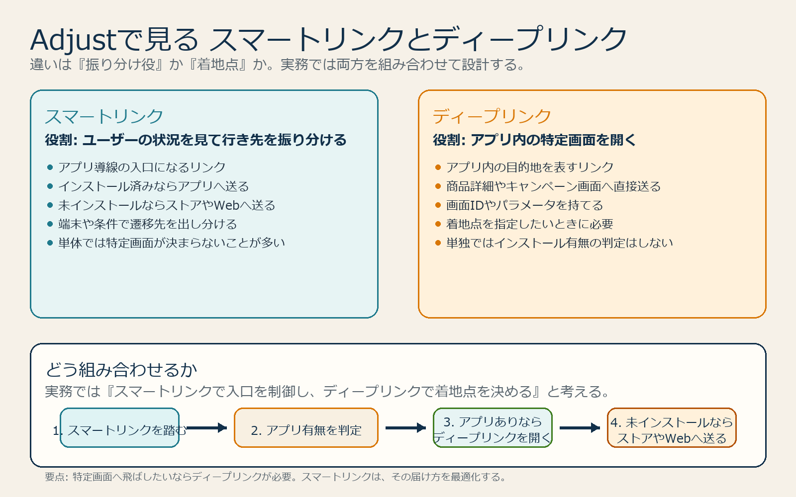

# Adjustの基本とアプリ起動元計測

## まず結論

Adjust は、アプリがどの広告や流入元から入ったかと、その後に何をしたかをつなぐためのモバイル計測基盤です。復習では、`計測リンク -> SDK -> OSごとの制約 -> レポート出力` の流れで押さえると整理しやすいです。

## これは何か

Adjust の役割、アプリ起動元計測の基本、Android と iPhone の違い、S2S や API による外部連携の考え方をまとめたトピックです。アプリ広告の成果を読む前提知識として使います。

## どこで使うか

- アプリ広告の成果が、どの流入元に紐づくかを整理したいとき
- Android と iPhone で数字の見え方が違う理由を理解したいとき
- `SDKでやること` と `S2Sで補うこと` を切り分けたいとき
- レポート自動取得や DWH 連携の前提を整理したいとき

## 全体像

- Adjust は `MMP` で、広告クリックやインプレッションとアプリ内イベントを結びつける
- 基本の流れは `計測リンクを踏む -> ストア経由でインストール -> SDKが初回起動を送る -> Adjustが紐づける`
- Android は `Google Play Install Referrer` が効きやすく、比較的高精度に見やすい
- iPhone は `ATT 許諾ありの詳細データ` と `SKAdNetwork の匿名集計データ` を分けて読む必要がある
- 出力は `ダッシュボード` `Report Service API` `callbacks` `cloud storage` `S2S API` などで行う

## 理解用イラスト

下の図は、`スマートリンク` と `ディープリンク` の役割分担を一枚で戻すための図です。スマートリンクは振り分け役、ディープリンクはアプリ内の着地点として見ると混同しにくくなります。

要点は、`スマートリンクだけでは特定画面は決まらず`、アプリ内の特定画面へ送りたいときは `ディープリンクを中に持たせる` ことです。

## よくある疑問

### Q. Adjust は何をしている道具？

A. 単にインストール数を数えるだけではなく、`どの流入元が起点だったか` と `その後のアプリ内行動` をつなぐ道具です。広告効果を媒体別に見る土台になります。

### Q. Android と iPhone は何が違う？

A. Android は Install Referrer が使いやすく、`どのクリックから来たか` を比較的追いやすいです。iPhone は ATT 許諾の有無と SKAdNetwork の制約が強く、同じ粒度では見えません。

### Q. ATT と SKAN は同じものとして見てよい？

A. よくありません。ATT 許諾ありデータは詳細に見やすく、SKAN は匿名集計ベースです。性質が違うので、同じ精度の数字として横並びに比較しない方が安全です。

### Q. S2S があれば SDK は不要？

A. 原則として不要にはなりません。S2S は補完用途として有効ですが、deferred deep linking や一部の計測、端末側シグナルの扱いでは SDK 前提の機能が残ります。

### Q. 実務で最初に見る設定は何？

A. `attribution window` `view-through attribution` `reattribution window` `partner mapping` `deep link / deferred deep link` です。この設定差で数字の解釈が変わります。

### Q. スマートリンクとディープリンクは何が違う？

A. `ディープリンク` はアプリ内の特定画面を開くための行き先です。`スマートリンク` は、端末やインストール有無を見て `アプリ` `ストア` `Web` のどこへ送るかを出し分ける入口です。実務では `スマートリンク + ディープリンク` を組み合わせて使うことが多いです。

### Q. スマートリンクだけだとアプリのどこに飛ぶ？

A. 固定ではありません。Adjust のスマートリンクに `ディープリンク先` を設定していればその画面へ飛び、設定していなければアプリのホームや標準起動画面へ行くことが多いです。未インストールならストアやWebへ送られます。

### Q. スマートリンク単体では特定の場所に飛ばせない？

A. 単体で自動的に特定画面が決まるわけではありませんが、スマートリンクの遷移設定の中にディープリンクを持たせれば特定画面へ飛ばせます。考え方としては、`スマートリンクが経路を決め、ディープリンクが着地点を決める` です。

## 実務での見方

- 新規獲得か再獲得かを先に分けて考える
- Android は `click -> store -> install -> first open` がつながっているかを見る
- iPhone は `ATT 許諾あり` と `SKAN` を別レイヤーとして読む
- `Report Service API` は集計の自動取得、`callbacks / cloud storage` はDWH連携、`S2S API` はサーバー起点イベント補完に使う
- まずは `SDKで基本計測`、次に `APIやcallbackで出力`、必要に応じて `S2Sで補完` と考える
- リンク設計では `誰をどこへ送るか` を二段で考える
- `スマートリンク` は `アプリ導線の出し分け`、`ディープリンク` は `アプリ内の着地点` と役割分担して整理する
- `未インストール時に元の画面まで戻したいか` を deferred deep link の要件として先に確認する
- 配信前は `インストール済み` `未インストール` `再インストール` の各パターンで期待どおりに遷移するかを検証する

## 次回の確認

- [ ] この計測で見たいものが `新規獲得` か `再獲得` かを分けているか
- [ ] Android の `Install Referrer` と SDK の初回送信確認ポイントを説明できるか
- [ ] iPhone の `ATT` と `SKAN` を別物として説明できるか
- [ ] `attribution window` `view-through` `reattribution` の違いを説明できるか
- [ ] `スマートリンク` と `ディープリンク` の役割の違いを 1 文で説明できるか
- [ ] `スマートリンクだけの遷移` と `スマートリンク + ディープリンクの遷移` を区別できるか
- [ ] 出力先を `ダッシュボード` `callback` `cloud storage` `API` のどれで持つか整理できているか

## 関連トピック

- [分析設計の基本プロセス](./分析設計の基本プロセス.md)
- [タグ未設置ページからGA4へ一時的にpage_viewを送る](./タグ未設置ページからGA4へ一時的にpage_viewを送る.md)
- [Microsoft Clarityの基本と安全な計測判断](./Microsoft Clarityの基本と安全な計測判断.md)

## 参考リンク

- [Adjust's attribution methods](https://help.adjust.com/en/article/attribution-methods)
  - attribution の主方式と OS ごとの考え方を確認する入口
- [ATT & SKAN solutions](https://help.adjust.com/en/article/ios-att-and-skadnetwork)
  - iPhone の ATT と SKAdNetwork の違いを確認する
- [Server-to-server (S2S) integration](https://help.adjust.com/en/article/server-to-server-s2s-integration)
  - S2S の用途と制約を確認する
- [Report service API](https://dev.adjust.com/en/api/rs-api)
  - 集計レポートを自動取得する方法の確認用
- [App Automation API](https://dev.adjust.com/en/api/app-automation-api/)
  - アプリ設定やイベント設定の自動化確認用

## 更新履歴

- 2026-06-02: QA型へ再構成
- 2026-06-03: スマートリンクとディープリンクの違い、図解、遷移設計の見方を追記
