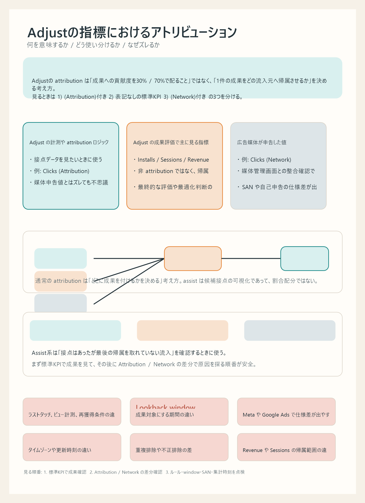

# Adjustの指標におけるアトリビューションの見方

## まず結論

Adjust で指標に出てくる `アトリビューション` は、成果への貢献度を割合配分する意味ではなく、`どの流入元に成果を帰属させるか` を決める考え方です。復習では、`(Attribution)付き` `表記なしの標準KPI` `(Network)付き` を分けて見ると整理しやすくなります。

## これは何か

Adjust の指標で `アトリビューション` と書かれているものと、そうでないものの違い、使い分け、数値がズレる主な理由をまとめたトピックです。アプリ広告のレポートを読むときや、媒体管理画面と Adjust の差分を説明するときの土台として使います。

## どこで使うか

- Adjust のダッシュボードや Datascape で指標名の意味を正しく読みたいとき
- `Clicks (Attribution)` と `Clicks (Network)` の違いを整理したいとき
- `Installs` `Sessions` `Revenue` が何を基準に集計されているか確認したいとき
- 媒体管理画面と Adjust の数字がズレる理由を切り分けたいとき

## 全体像

- Adjust の attribution は、`1件の成果をどこへ付与するかを決める仕組み`
- 30% / 70% のように貢献度を配分する仕組みではない
- `Attribution` 付きは、Adjust の attribution ロジックや接点計測に基づく値
- `Network` 付きは、広告媒体が申告した値
- 表記なしの `Installs` `Revenue` `Sessions` は、非 attribution 指標ではなく、Adjust の標準成果KPI

## 理解用イラスト

下の図は、意味の違いと使い分けを1枚で戻すための図です。`Adjust基準の接点` `媒体申告` `標準成果KPI` を分けて見ると、数字の役割が混ざりにくくなります。

要点は、`(Attribution)付き = 貢献度配分` ではないことです。Adjust は基本的に、ルールに従って `1件のインストールや収益を1つの流入元へ帰属` させます。

## よくある疑問

### Q. Adjust の `アトリビューション` は、貢献度を割り振る意味？

A. 基本は違います。Adjust の通常の attribution は `どの接点に成果を付けるかを1つ決める` 方式です。割合配分の multi-touch fractional attribution とは別物として考えます。

### Q. `(Attribution)` が付いていない指標は、アトリビューション無関係？

A. そうではありません。`Installs` `Revenue` `Sessions` などの標準KPIも、Adjust がどこへ帰属したかという前提の上で集計されます。`表記なし = 非 attribution` ではありません。

### Q. `(Attribution)`付きと `(Network)`付きは何が違う？

A. `(Attribution)`付きは Adjust の計測や attribution ロジックに基づく値、`(Network)`付きは広告媒体が申告した値です。同じ `Clicks` や `Installs` でも、データソースが違います。

### Q. `Installs` や `Revenue` はどちら側？

A. 基本は Adjust の標準成果KPIです。接点そのものを数えているのではなく、帰属結果の成果を集計したものとして見ます。

### Q. Assist 系指標は、貢献度配分に近いの？

A. 近くありません。Assist 系は `最終的には選ばれなかったが、候補には入っていた接点` を見るための指標です。割合配分ではなく、補助的な接点の可視化です。

### Q. どの指標を成果評価の基準にすればよい？

A. 原則として `Installs` `Revenue` `Sessions` などの標準成果KPIを見ます。接点量の把握や媒体差異の確認では `Clicks (Attribution)` や `Clicks (Network)` を使い分けます。

## 実務での見方

- `接点量の把握`
  - `Clicks (Attribution)` `Impressions (Attribution)` を使う
  - Adjust が把握した接点ベースで比較したいときに向く
- `媒体申告との整合確認`
  - `Clicks (Network)` `Installs (Network)` を使う
  - 媒体管理画面との差分確認に向く
- `成果評価`
  - `Installs` `Sessions` `Revenue` `ROAS` を使う
  - 最終的な評価や最適化判断の基準にしやすい
- `勝てなかった候補接点の確認`
  - Assist 系指標を使う
  - 接点はあったのに最後の帰属を取れていない流入を見つける

実務では、まず `成果評価は標準KPI`、次に `ズレの説明は Attribution / Network の比較` という順番で見ると混乱しにくいです。

## ズレる理由

- `アトリビューションルールの違い`
  - ラストタッチ、ビュー計測、再獲得条件などの差で帰属先が変わる
- `lookback window の違い`
  - クリックやインプレッションから何日まで成果対象にするかが違う
- `SAN / 自己申告ネットワークの仕様差`
  - Meta や Google Ads などは通常トラッキングと動きが違いやすい
- `タイムゾーンや集計タイミングの違い`
  - 日次比較で特にズレやすい
- `重複排除や不正排除の違い`
  - Adjust 側で除外された値が媒体側に残ることがある
- `ポストインストール成果の帰属範囲の違い`
  - `Revenue` `Sessions` は、どのユーザーをどこに帰属させたかで見え方が変わる

## 次回の確認

- [ ] `アトリビューション = 貢献度配分` ではないと説明できるか
- [ ] `(Attribution)`付きと `(Network)`付きの違いを 1 文で説明できるか
- [ ] `Installs` `Revenue` `Sessions` が標準成果KPIだと説明できるか
- [ ] `接点量` `成果評価` `媒体差異確認` で指標を使い分けられるか
- [ ] 数値がズレたときに、まず `ルール` `window` `SAN` `集計タイミング` を確認できるか

## 関連トピック

- [Adjustの基本とアプリ起動元計測](./Adjustの基本とアプリ起動元計測.md)
- [分析設計の基本プロセス](./分析設計の基本プロセス.md)
- [退会抑止に向けたKPI設計の考え方](./退会抑止に向けたKPI設計の考え方.md)

## 参考リンク

- [Adjust Datascape metrics glossary](https://help.adjust.com/en/article/datascape-metrics-glossary)
  - `Clicks (Attribution)` `Revenue` `Installs` などの公式定義を確認する
- [Adjust Datascape view setup](https://help.adjust.com/ja/article/set-up-your-view-in-datascape)
  - attribution type フィルタで何が変わるかを確認する
- [Adjust Overview KPIs](https://help.adjust.com/en/article/overview-kpis)
  - KPI ウィジェットで指標がどう扱われるかを確認する

## 更新履歴

- 2026-06-05: 新規作成。Adjust 指標の attribution の意味、使い分け、ズレる理由を整理
