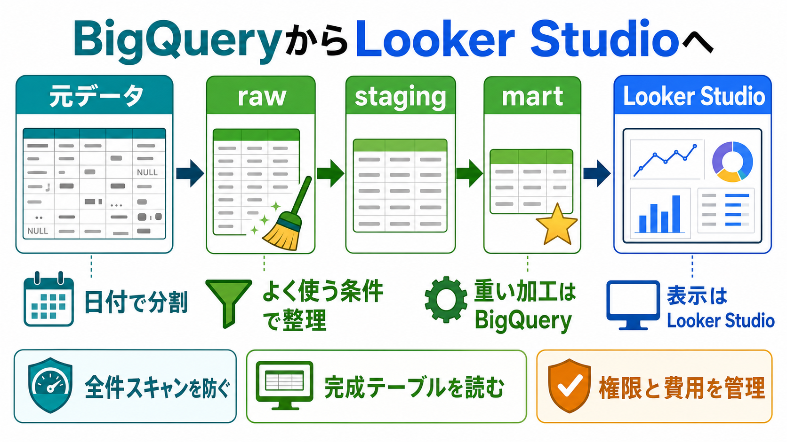

# BigQueryからLooker Studioへの運用設計

## まず結論

Looker Studioで可視化する前提なら、BigQueryは `見せるための表を作る場所` として設計します。
元データをそのままダッシュボードへつなぐのではなく、`raw -> staging -> mart -> Looker Studio` の流れに分けると、表示速度、費用、再現性、権限管理が安定します。

## これは何か

このトピックは、BigQueryでテーブルを作成し、そのデータをLooker Studioで可視化するまでの基本設計を整理するものです。
BigQueryの細かいSQL構文よりも、どの層に何を置き、どの設定を使い、Looker Studio側では何をしすぎないかを理解することを目的にします。

## どこで使うか

- Looker Studioで定例レポートやダッシュボードを作るとき
- BigQueryに元データを取り込み、分析用に整えたいとき
- ダッシュボードの表示が遅い、または費用が読みにくいとき
- 複数人が同じ定義で数字を見られる状態を作りたいとき

## 全体像

```text
元データ
  ↓
BigQuery raw
  ↓
BigQuery staging
  ↓
BigQuery mart
  ↓
Looker Studio
```

- `raw`: 取り込んだデータをなるべくそのまま残す層
- `staging`: 型、列名、重複、欠損、不要列を整える層
- `mart`: Looker Studioから読むための完成テーブルやビューを置く層
- `Looker Studio`: 完成データをグラフ、表、スコアカードとして見せる層

Looker Studioは表示の器です。
重い加工、複雑なJOIN、粒度変換、共通KPIの定義はBigQuery側に寄せると、ダッシュボードごとの差異が出にくくなります。

## 理解用イラスト

この図は、元データをBigQuery内で段階的に整え、Looker Studioには完成テーブルを渡す考え方を一枚で戻すための図です。
`日付で分割`、`よく使う条件で整理`、`重い加工はBigQuery` が設計の中心です。



## よくある疑問

### Q. Looker Studioからrawデータを直接読んではいけないのか

A. 小さい検証なら問題ありません。
ただし、定例ダッシュボードでは避けた方が安全です。rawは粒度が細かく、欠損や型の揺れも残りやすいため、表示が遅くなったり、グラフごとに計算定義がばらついたりします。

### Q. martはテーブルとビューのどちらがよいか

A. 使い分けます。
ロジックが軽く、すぐ変えたい場合はビューが便利です。
データ量が大きい、利用者が多い、表示速度を安定させたい場合は、スケジュール実行で集計済みテーブルを作る方が向いています。

### Q. パーティションは何のために使うのか

A. 主に、日付で不要な範囲を読まないために使います。
日次で増える売上、イベント、ログのようなデータでは、`sale_date` や `event_date` のような日付列でパーティションを切ると、期間フィルタが効いたときにスキャン量を抑えやすくなります。

### Q. クラスタリングは何のために使うのか

A. よく使う条件の列でデータを整理し、関係するブロックだけを読みやすくするために使います。
たとえば、店舗別、カテゴリ別、地域別に見るダッシュボードなら、`store_id`、`product_category`、`region` などが候補になります。

### Q. Looker Studio側で計算フィールドを作るのは悪いのか

A. 軽い表示用の計算なら問題ありません。
ただし、KPI定義、JOIN、重い集計、複雑な条件分岐はBigQuery側で作る方がよいです。複数レポートで同じ定義を再利用でき、数字の説明もしやすくなります。

## 実務での見方

### データセット構成

```text
project_id
├── raw
├── staging
├── mart
└── sandbox
```

- `raw`: 元データの保管。人が直接見る前提にしない
- `staging`: 型変換、列名統一、重複排除、NULL処理
- `mart`: Looker Studioで使う粒度にした完成データ
- `sandbox`: 試作用。期限を付けて残り続けないようにする

### テーブル作成の考え方

```sql
CREATE OR REPLACE TABLE `project_id.mart.sales_daily`
PARTITION BY sale_date
CLUSTER BY store_id, product_category
AS
SELECT
  DATE(order_timestamp) AS sale_date,
  store_id,
  product_category,
  SUM(amount) AS revenue,
  COUNT(*) AS orders
FROM `project_id.staging.orders`
GROUP BY
  sale_date,
  store_id,
  product_category;
```

この例では、1行を `日付 x 店舗 x 商品カテゴリ` の粒度にしています。
Looker Studioでは、この完成テーブルに接続し、期間フィルタやカテゴリ別グラフを作ります。

### Looker Studio側の役割

- BigQueryコネクタで `mart` のテーブルまたはビューに接続する
- 日付範囲ディメンションに、BigQuery側で用意した日付列を使う
- グラフ、フィルタ、スコアカード、表を配置する
- 重い加工を増やさず、共通定義はBigQuery側へ戻す
- 遅い場合は、ビューを集計済みテーブルに変える、またはBI Engineを検討する

## 再利用チェックリスト

- [ ] Looker Studioから読む対象は `raw` ではなく `mart` になっているか
- [ ] 1行の粒度を説明できるか
- [ ] 日付フィルタ用の `DATE` 列があるか
- [ ] 大きい日次テーブルにパーティションを設定しているか
- [ ] よく使うフィルタ列をクラスタリング候補にしているか
- [ ] KPI定義やJOINをLooker Studio側に分散させていないか
- [ ] sandboxや一時テーブルに有効期限を付けているか
- [ ] 閲覧者と編集者の権限を分けているか
- [ ] ダッシュボードの表示速度とクエリ費用を定期的に確認しているか

## 次回の確認

- BigQueryのビュー、マテリアライズドビュー、集計済みテーブルの使い分け
- Looker StudioのBigQuery接続で、データソースの認証情報をどう扱うか
- BI Engineを使うべきケースと、先にテーブル設計で直すべきケース

## 関連トピック

- [Looker StudioとBigQueryのクエリ発行と費用最適化](./Looker%20StudioとBigQueryのクエリ発行と費用最適化.md)
- [GA4のセッション数がBigQuery・探索・Looker Studio・Data APIでズレる理由](../../GA4/20_トピック/GA4のセッション数がBigQuery・探索・Looker%20Studio・Data%20APIでズレる理由.md)
- [ETLとは何か](../../データマネジメント/20_トピック/ETLとは何か.md)

## 参考リンク

- [Create and use tables - BigQuery](https://docs.cloud.google.com/bigquery/docs/tables)
  - BigQueryで標準テーブルを作成する方法、必要な権限、テーブル作成方法を確認するための公式ドキュメント。
- [Introduction to partitioned tables - BigQuery](https://docs.cloud.google.com/bigquery/docs/partitioned-tables)
  - パーティションでスキャン範囲を減らし、クエリ費用と性能を管理する考え方を確認するための公式ドキュメント。
- [Introduction to clustered tables - BigQuery](https://docs.cloud.google.com/bigquery/docs/clustered-tables)
  - よく使う条件列でデータを整理し、ブロックプルーニングを効かせる考え方を確認するための公式ドキュメント。
- [Connect to Google BigQuery - Looker Studio](https://cloud.google.com/looker/docs/studio/connect-to-google-bigquery)
  - Looker StudioからBigQueryのテーブル、ビュー、カスタムクエリへ接続する方法を確認するための公式ドキュメント。
- [BigQuery の統合 - Looker Studio](https://docs.cloud.google.com/looker/docs/studio/bigquery-integrations?hl=ja)
  - Looker StudioとBigQueryの統合、BigQueryデータ探索、BI Engineとの関係を確認するための公式ドキュメント。

## 更新履歴

- 2026-07-21: 初版作成。BigQueryでLooker Studio用テーブルを作る運用設計を整理。
