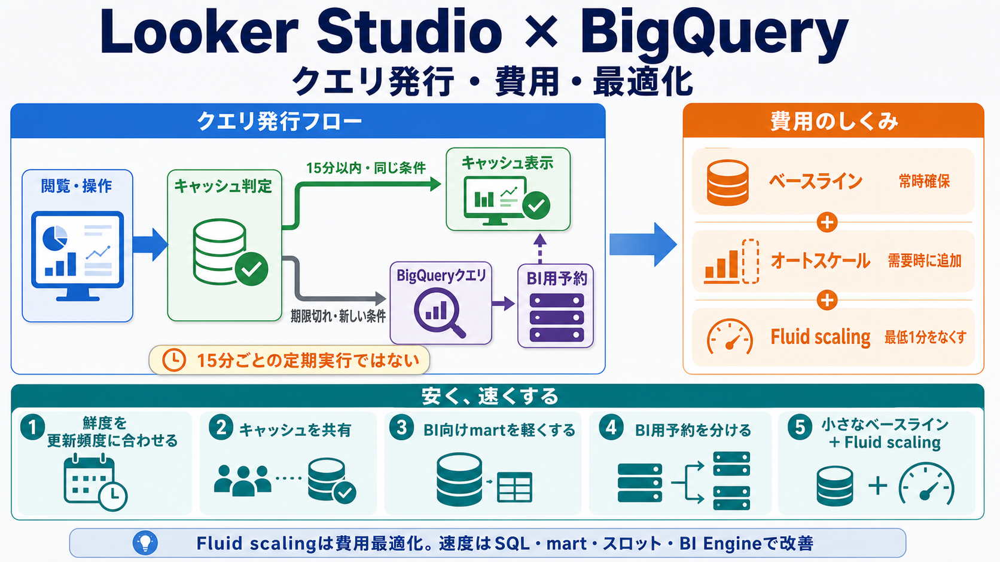

# Looker StudioとBigQueryのクエリ発行と費用最適化

## まず結論

Looker Studioのデータ鮮度を15分にしても、15分ごとに必ずBigQueryへクエリされるわけではありません。
データ鮮度はキャッシュを新鮮とみなす期間であり、期限後の閲覧、初めての条件、フィルタ操作、手動更新などでデータが必要になったときにクエリが発行されます。

BigQuery Editionsでは、クエリごとの処理量だけでなく、予約したベースラインとオートスケールしたスロット時間が費用を決めます。
安さと速さを両立する基本は、`キャッシュを共有する -> BI向けmartを軽くする -> BI用予約を分ける -> 小さなベースラインと十分な上限を持つ -> 短い負荷にはFluid scalingを使う` の順です。

## これは何か

このトピックは、Looker StudioからBigQueryを直接データソースとして使うときに、次の3点を一続きで理解するためのものです。

- いつBigQueryクエリが発行されるのか
- Enterpriseなどの容量ベース料金で何に費用がかかるのか
- 表示速度を維持しながら費用を抑えるには何を優先するのか

## どこで使うか

- Looker Studioのデータ鮮度を何分にするか決めるとき
- ダッシュボードの閲覧でBigQuery費用がどれだけ増えたか調べるとき
- BigQuery Editionsの予約、オートスケール、Fluid scalingを設計するとき
- ダッシュボードが遅く、クエリ数やスロット消費も多いとき

## 全体像

```text
閲覧・操作・自動更新
        ↓
Looker Studioが同じクエリのキャッシュを確認
        ↓
利用可能 ─────────────→ キャッシュから表示
        ↓ 利用不可・新しい条件
BigQueryへチャートに必要なクエリを発行
        ↓
BI用予約のベースライン／オートスケールを使用
        ↓
結果を表示し、Looker Studio側でも一時的に記憶
```

重要な区別は次のとおりです。

| 設定・指標 | 意味 |
|---|---|
| データ鮮度 | Looker Studioが取得済み結果を新鮮とみなす期間 |
| 自動更新 | 開かれているレポートを一定間隔で再読み込みする設定 |
| `total_slot_ms` | 個々のBigQueryジョブが消費したスロット処理量 |
| ベースラインスロット | クエリがなくても確保・課金される予約容量 |
| オートスケール | 需要に応じて一時的に追加される予約容量 |
| Fluid scaling | オートスケールの最低1分課金をなくし、秒単位課金にする機能 |
| BI Engine | BigQueryデータをメモリで高速処理する別の高速化機能 |

## 理解用イラスト

この図は、15分という設定が定期実行ではなくキャッシュ判定であることと、クエリが発行された後にBigQuery予約のどこで費用が生まれるかを一枚で確認するための図です。
Fluid scalingはオートスケール部分の課金を細かくする機能であり、クエリ自体を自動的に軽くする機能ではありません。



## よくある疑問

### Q. データ鮮度15分は、15分ごとの定期クエリなのか

A. 違います。
最後にデータを取得してから15分以内で、同じクエリの結果がLooker Studioのメモリに残っていれば、その結果を再利用できます。
15分を超えた後に誰かが閲覧するなど、データが再び必要になった時点で新しいクエリが発行されます。誰も利用しなければ、通常は鮮度の期限が来ただけではクエリされません。

### Q. 15分以内でもクエリが発行されることはあるか

A. あります。
日付範囲、フィルタ、パラメータ、並び順などが変わり、過去に記憶されていないクエリになれば、鮮度期間内でもBigQueryへ問い合わせます。
また、Looker Studioのメモリが鮮度期間いっぱいまで必ず保持される保証はありません。

### Q. ダッシュボードを1回開くとBigQueryクエリは1本だけか

A. 1本とは限りません。
チャートごとに指標、ディメンション、日付条件、フィルタが異なれば、複数のSQLが発行されます。
同じデータソースを使っていても、10個のチャートが複数のクエリパターンを作る可能性があります。

### Q. レポートの自動更新とデータ鮮度は同じか

A. 別の設定です。
自動更新は、レポートが開かれている間に再読み込みを試みます。自動更新が5分、データ鮮度が15分なら、5分ごとに画面は更新されても、利用可能なキャッシュがあればBigQueryへは問い合わせません。

### Q. オーナー認証と閲覧者認証で費用は変わるか

A. 変わり得ます。
オーナー認証では全閲覧者が1つのデータ鮮度とキャッシュを共有します。閲覧者認証では閲覧者ごとにデータ鮮度が管理されるため、同じ条件でも利用者ごとにクエリが発行されやすくなります。
費用と速度だけならオーナー認証が有利ですが、閲覧権限や行レベル制御の要件を先に確認します。

### Q. `total_slot_ms`に単価を掛ければ、そのクエリの費用になるか

A. 容量ベース料金では、単純には一致しません。
`total_slot_ms`はジョブの処理量を比較する指標です。実際には、固定・コミット済みのベースラインと、予約全体で追加されたオートスケール容量に対して課金されます。
同じ予約で複数の処理が同時に動く場合、各ジョブへ厳密に請求額を分けることは難しくなります。

### Q. Fluid scalingを有効にすれば速くなるか

A. Fluid scalingの主目的はオートスケール費用の削減です。
通常のオートスケールにある最低1分の課金をなくしますが、最大スロット、SQL、テーブル設計を自動的に改善するわけではありません。
速度は、十分な最大スロット、小さくても必要なベースライン、軽いmart、BI Engineなどで改善します。

## 実務での見方

### クエリが発行される主なタイミング

| 操作・状態 | BigQueryクエリの可能性 |
|---|---|
| 初めてレポートを開く | 高い |
| 鮮度期間内に同じ条件で再表示 | キャッシュがあれば低い |
| 鮮度期間を超えた後に表示 | 高い |
| 日付・フィルタ・パラメータを変更 | 新しい条件なら高い |
| 手動でデータを更新 | 高い。全データソースの鮮度をリセット |
| 自動更新 | キャッシュがなければ発行 |
| レポートを誰も開いていない | 通常は発行されない |

### Enterprise予約の費用構造

```text
予約の費用
  ├─ ベースライン／コミットメント
  │    常時確保する容量。使わない時間があっても費用が残る
  │
  └─ オートスケール
       需要時に追加する容量
       ├─ 通常: 秒単位計測、最低1分課金
       └─ Fluid scaling: 最低時間なしの秒単位課金
```

オートスケール費用の概算は、次の考え方です。

```text
オートスケール費用
  ≒ 課金対象オートスケール・スロット秒 ÷ 3,600
    × リージョンと契約に応じたスロット時間単価
```

正確な金額には契約割引やクレジットが関係するため、最終確認はCloud BillingまたはBilling Exportで行います。

### Looker Studioのクエリを特定する

Looker Studioから発行されたBigQueryジョブには、`requestor=looker_studio`、レポートID、データソースIDのラベルが付きます。
次のSQLでは、過去7日間の発行時刻、処理時間、スロット消費量を確認できます。

```sql
CREATE TEMP FUNCTION GetLabel(
  labels ARRAY<STRUCT<key STRING, value STRING>>,
  target_key STRING
)
AS (
  (SELECT value
   FROM UNNEST(labels)
   WHERE key = target_key
   LIMIT 1)
);

SELECT
  DATETIME(creation_time, "Asia/Tokyo") AS creation_time_jst,
  job_id,
  GetLabel(labels, "looker_studio_report_id") AS report_id,
  GetLabel(labels, "looker_studio_datasource_id") AS datasource_id,
  TIMESTAMP_DIFF(end_time, start_time, MILLISECOND) / 1000 AS duration_seconds,
  total_slot_ms / 1000 AS consumed_slot_seconds,
  ROUND(
    SAFE_DIVIDE(
      total_slot_ms,
      TIMESTAMP_DIFF(end_time, start_time, MILLISECOND)
    ),
    1
  ) AS average_slots,
  cache_hit,
  reservation_id
FROM
  `BILLING_PROJECT`.`region-REGION`.INFORMATION_SCHEMA.JOBS_BY_PROJECT
WHERE
  creation_time >= TIMESTAMP_SUB(CURRENT_TIMESTAMP(), INTERVAL 7 DAY)
  AND job_type = "QUERY"
  AND (statement_type != "SCRIPT" OR statement_type IS NULL)
  AND GetLabel(labels, "requestor") = "looker_studio"
ORDER BY
  creation_time DESC;
```

### 予約で課金されたオートスケール量を確認する

容量ベース料金では、予約管理プロジェクトの`RESERVATIONS_TIMELINE`を確認します。

```sql
SELECT
  DATE(period_start, "Asia/Tokyo") AS usage_date,
  reservation_name,
  SUM(period_autoscale_slot_seconds) AS billed_autoscale_slot_seconds,
  ROUND(
    SUM(period_autoscale_slot_seconds) / 3600,
    3
  ) AS billed_autoscale_slot_hours
FROM
  `ADMIN_PROJECT`.`region-REGION`.INFORMATION_SCHEMA.RESERVATIONS_TIMELINE
WHERE
  period_start >= TIMESTAMP_SUB(CURRENT_TIMESTAMP(), INTERVAL 30 DAY)
  AND reservation_name = "BI_RESERVATION"
GROUP BY
  usage_date,
  reservation_name
ORDER BY
  usage_date;
```

`period_autoscale_slot_seconds`が継続して0なら、Fluid scalingによる直接的な費用削減余地は小さいと判断できます。

### 安く、かつ速くする優先順位

1. 元データの更新頻度とデータ鮮度をそろえる。
2. セキュリティ上問題なければ、再利用可能なデータソースとオーナー認証でキャッシュを共有する。
3. Looker Studioからrawを読まず、必要な粒度へ集計したmartを読む。
4. 日付パーティション、適切なクラスタリング、短い初期日付範囲を使う。
5. 重複チャート、不要なブレンド、高カーディナリティの表を減らす。
6. BI用の実行プロジェクトと予約を分離し、費用と性能を測りやすくする。
7. 通常表示を支える小さなベースラインと、ピークを処理できる最大スロットを設定する。
8. 短時間・断続的なオートスケールがあるならFluid scalingを有効にする。
9. 繰り返し読むデータと高い同時実行性にはBI Engineを検討する。

### Fluid scalingの判断

```text
オートスケール課金があるか
  ├─ ない → Fluid scalingの直接効果は小さい
  └─ ある
       ↓
     負荷は短時間・断続的か
       ├─ はい → 有効化の効果が出やすい
       └─ いいえ → 最大値、ベースライン、契約量を先に見直す
```

Fluid scalingが向いている典型例は、ダッシュボードを開いた瞬間だけ複数のクエリが走り、数秒から数十秒で終わった後は長い空き時間がある予約です。
常に処理が流れている予約や、固定契約の範囲内だけで処理している予約では効果が小さくなります。

## 再利用チェックリスト

- [ ] データ鮮度と自動更新を区別して説明できる
- [ ] 元データの更新頻度より短すぎる鮮度設定になっていない
- [ ] オーナー認証と閲覧者認証のキャッシュ範囲を確認した
- [ ] Looker Studioのジョブラベルで実際のクエリを確認した
- [ ] `total_slot_ms`と実際の予約課金を区別した
- [ ] `period_autoscale_slot_seconds`を確認した
- [ ] BI処理を専用プロジェクト・予約へ分ける必要性を検討した
- [ ] BI向けmart、パーティション、クラスタリングを確認した
- [ ] Fluid scalingを速度機能ではなく課金最適化機能として判断した
- [ ] BI Engineを使う前に、利用可能な容量と対象テーブルを確認した

## 次回の確認

- 実環境でLooker Studioレポートを1回開いたときのクエリ本数
- 15分設定の前後で、同じ条件と新しい条件のクエリ発行がどう変わるか
- BI予約のベースライン、最大スロット、オートスケール量
- Fluid scaling有効化前後の`period_autoscale_slot_seconds`と表示時間
- BI Engineで高速化できるクエリと、対象外になるクエリ

## 関連トピック

- [BigQueryからLooker Studioへの運用設計](./BigQueryからLooker%20Studioへの運用設計.md)
- [GA4のセッション数がBigQuery・探索・Looker Studio・Data APIでズレる理由](../../GA4/20_トピック/GA4のセッション数がBigQuery・探索・Looker%20Studio・Data%20APIでズレる理由.md)

## 参考リンク

- [Manage data freshness - Looker Studio](https://docs.cloud.google.com/looker/docs/studio/manage-data-freshness)
  - データ鮮度、キャッシュ、フィルタ操作、認証情報ごとのキャッシュ範囲を確認するための公式ドキュメント。
- [Manage auto refresh for a report - Looker Studio](https://docs.cloud.google.com/data-studio/manage-auto-refresh-for-a-report)
  - レポートの自動更新とデータ鮮度が別設定であることを確認するための公式ドキュメント。
- [Analyze data with Looker Studio - BigQuery](https://cloud.google.com/bigquery/docs/bi-engine-looker-studio)
  - Looker Studioジョブのラベルと`INFORMATION_SCHEMA.JOBS`での追跡方法を確認するための公式ドキュメント。
- [JOBS view - BigQuery](https://docs.cloud.google.com/bigquery/docs/information-schema-jobs)
  - `total_slot_ms`、`cache_hit`、`reservation_id`など、ジョブ単位の確認項目を調べるための公式ドキュメント。
- [RESERVATIONS_TIMELINE view - BigQuery](https://docs.cloud.google.com/bigquery/docs/information-schema-reservation-timeline)
  - 予約単位の`period_autoscale_slot_seconds`と秒単位のオートスケール状況を確認するための公式ドキュメント。
- [Understand reservations - BigQuery](https://docs.cloud.google.com/bigquery/docs/reservations-workload-management)
  - ベースライン、オートスケール、Fluid scalingの課金単位を確認するための公式ドキュメント。
- [BigQuery pricing](https://cloud.google.com/bigquery/pricing)
  - Editions、リージョン、契約モデルごとの最新単価とBI Engine料金を確認するための公式ページ。

## 更新履歴

- 2026-08-09: 初版作成。Looker Studioのクエリ発行、BigQuery Editionsの費用、Fluid scalingの判断を整理。
