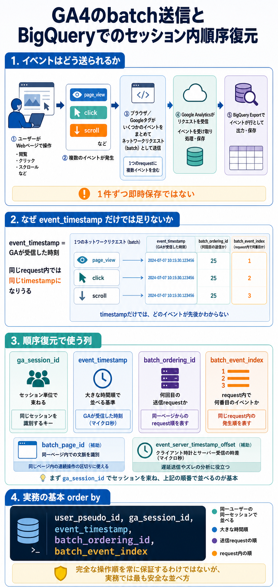

# GA4のbatch送信とBigQueryでのセッション内順序復元

## まず結論

GA4 のイベントは、Web で起きた順に BigQuery へ 1 件ずつ即時保存されるわけではなく、ブラウザ側や収集処理の都合である程度まとめて送られます。  
そのため `event_timestamp` だけで並べると順番がズレることがあり、実務上は `event_timestamp -> batch_ordering_id -> batch_event_index` の順で並べるのが基本です。

## これは何か

このトピックは、GA4 の Web イベントがどのように batch 的に送信されて BigQuery へ出てくるのかと、BigQuery 上でセッション内のイベント順をできるだけ正しく復元する方法を整理するものです。

## どこで使うか

- `session_start` `page_view` `click` の前後関係を BigQuery で調べるとき
- 同じ `event_timestamp` を持つイベントが複数あり、順序解釈に迷うとき
- セッション導線を SQL で再構成したいとき
- GA4 UI と BigQuery の並び方や見え方の差を説明したいとき

## 全体像

- GA4 の BigQuery export は `起きた瞬間の完全な逐次ログ` ではなく、収集後に書き出されたイベント行
- `event_timestamp` は `イベントが発生した瞬間` ではなく `GA が受信した時刻`
- 同じリクエストで送られたイベントは、同じ `event_timestamp` を持つことがある
- 並び順を見るための補助列として `batch_ordering_id` と `batch_event_index` がある
- セッション内順序は `ga_session_id` で束ねてから複合キーで並べる

## 理解用イラスト

この図は、イベント発生から BigQuery export までの流れと、順序復元で使う列の役割を一枚で戻すための図です。  
`なぜ timestamp だけでは足りないのか` と `どの順で order by するか` を思い出す入口として使います。



## よくある疑問

### Q. GA4 のイベントは BigQuery に 1 件ずつ即時で入るのか

A. そうではありません。イベントは送信時にある程度まとまり、BigQuery export 側でもその収集結果が行として出ます。日次テーブルだけでなく intraday テーブルでも、`起きた順そのままの逐次保存` と考えない方が安全です。

### Q. `event_timestamp` はイベント発生時刻なのか

A. BigQuery export schema 上では、`event_timestamp` は Google Analytics が受信した時刻です。同じ request に含まれた複数イベントは、同じ `event_timestamp` を共有することがあります。

### Q. `batch_event_index` は何を表すのか

A. 1つの batch 内で、端末上で発生した順を表す連番です。同じ送信 request の中で、どのイベントが先かを見るために使います。

### Q. `batch_ordering_id` は何を表すのか

A. 同一ページから何回目のネットワークリクエストかを表す、単調増加の番号です。複数 batch があるときに、どの request が先かを見る補助になります。

### Q. セッション内の順番は、何で並べるのが基本か

A. 実務上は `user_pseudo_id` と `ga_session_id` でセッションを束ねたうえで、`event_timestamp -> batch_ordering_id -> batch_event_index` の順に並べるのが基本です。

### Q. BigQuery だけで人間の操作順を完全に復元できるのか

A. 常に完全とは言えません。受信時刻ベースであること、同時送信があること、遅延送信や再送があることから、`かなり信頼できる並び` は作れても `100% 完全な操作順` には限界があります。

## 実務での見方

- まず `ga_session_id` を `event_params` から取り出してセッション単位に束ねる
- 次に `event_timestamp` 単独ではなく、`batch_ordering_id` と `batch_event_index` を併用する
- `同じ timestamp のイベントが複数ある` ことを異常扱いしない
- 遅延や送信ズレを見たいときは `event_server_timestamp_offset` も併せて見る
- ページ起点の整理では `batch_page_id`、bundle 単位の確認では `event_bundle_sequence_id` も補助に使う

基本の並べ方:

```sql
order by
  event_timestamp,
  batch_ordering_id,
  batch_event_index
```

セッション単位の並べ替え例:

```sql
with base as (
  select
    user_pseudo_id,
    event_name,
    event_timestamp,
    batch_ordering_id,
    batch_event_index,
    batch_page_id,
    event_bundle_sequence_id,
    event_previous_timestamp,
    event_server_timestamp_offset,
    (
      select value.int_value
      from unnest(event_params)
      where key = 'ga_session_id'
    ) as ga_session_id,
    (
      select value.string_value
      from unnest(event_params)
      where key = 'page_location'
    ) as page_location
  from `your_project.your_dataset.events_*`
)
select
  *,
  row_number() over (
    partition by user_pseudo_id, ga_session_id
    order by
      event_timestamp,
      batch_ordering_id,
      batch_event_index
  ) as session_event_order
from base
where ga_session_id is not null
```

確認するときに一緒に出したい列:

- `event_name`
- `event_timestamp`
- `batch_ordering_id`
- `batch_event_index`
- `page_location`
- `event_server_timestamp_offset`

## 次回の確認

- [ ] `event_timestamp` が受信時刻であり、発生時刻そのものではないと説明できる
- [ ] `batch_ordering_id` と `batch_event_index` の役割差を説明できる
- [ ] セッション内順序の基本 order by を自分で書ける

## 関連トピック

- [GA4のsession_startと他イベントパラメータの見え方](./GA4のsession_startと他イベントパラメータの見え方.md)
- [GA4のevent_paramsを生データへ直接クエリするときの考え方](./GA4のevent_paramsを生データへ直接クエリするときの考え方.md)
- [GA4のdirectセッションをBigQueryで調査する](./GA4のdirectセッションをBigQueryで調査する.md)

## 参考リンク

- [BigQuery Export schema](https://support.google.com/analytics/answer/7029846?hl=en)
  - `event_timestamp` `batch_event_index` `batch_ordering_id` など export 列の定義を確認するための公式説明

## 更新履歴

- 2026-07-07: 初版作成
