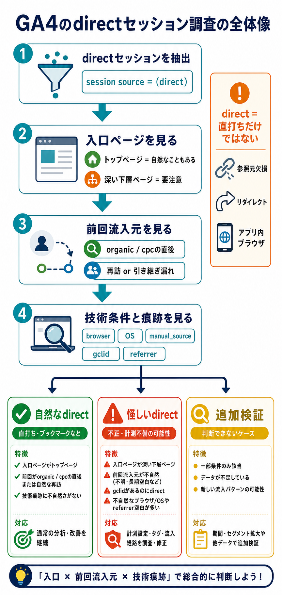

# GA4のdirectセッションをBigQueryで調査する

## まず結論

GA4 の `direct` セッションは、`本当に直接来た流入` だけではありません。実務では `landing page` `直前セッションの流入元` `device/browser` を起点に見て、`自然な direct` と `計測欠損っぽい direct` を分けて考えるのが最初の型になります。

## これは何か

GA4 を BigQuery にエクスポートしたデータを使って、探索レポートで `session source = direct` に見えているセッションの実態を分解するトピックです。`直打ちやブックマークの再訪` と `参照元が落ちて direct 扱いになった流入` を切り分けるための見方を整理します。

## どこで使うか

- `direct` の比率が高すぎて流入評価に不安があるとき
- メール、LINE、アプリ内ブラウザ、QR、PDF などで参照元欠損を疑うとき
- GA4 探索のセッション参照元を BigQuery で検証したいとき
- 不自然な landing page に `direct` が集中していないか確認したいとき

## 全体像

- まず `session_traffic_source_last_click.cross_channel_campaign.source = '(direct)'` を起点に対象セッションを切る
- 次に `landing page` を見て、自然な direct と不自然な direct を分ける
- その後で `前回セッションの流入元` を見て、再訪なのか引き継ぎ漏れなのかを探る
- さらに `device/browser` `manual_source` `gclid` `page_referrer` を見て、技術要因や痕跡を確認する
- 最後に `自然な direct` `怪しい direct` `追加検証が必要な direct` の3群に分ける

## 理解用イラスト

`direct` 調査は、`入口ページ` `前回流入元` `技術条件` の3方向から絞ると、どこを疑うべきかを素早く整理できます。

## よくある疑問

### Q. `direct` は URL 直打ちだけを意味するの？

A. そうではありません。GA4 では、参照元が取得できなかった、引き継げなかった、分類できなかった流入も `direct` に寄ります。

### Q. BigQuery ではどのカラムを起点に見る？

A. 探索レポートのセッション参照元に近いのは `session_traffic_source_last_click.cross_channel_campaign.source` と `medium` です。`traffic_source.*` はユーザー初回流入、`collected_traffic_source.*` はイベント時点の痕跡として役割が違います。

### Q. まず何から見ればよい？

A. 最初は `landing page` を見ます。トップページやログイン導線に多い `direct` は自然なことがありますが、深い下層ページや広告用 LP に多い `direct` は不自然です。

### Q. 不自然な `direct` とはどういう状態？

A. 例として、長い商品詳細 URL、キャンペーン LP、アプリ未ログインでは入りにくい深いページに `direct` が多い状態です。メール、LINE、アプリ内ブラウザ、QR、PDF、リダイレクト、クロスドメインで参照元が落ちている可能性があります。

### Q. `manual_source` や `gclid` が残っていたらどう考える？

A. `session source` では `direct` でも、イベント側に UTM や `gclid` の痕跡があるなら、実態としては campaign 起点だった可能性があります。`完全な direct` と断定しない方が安全です。

### Q. 技術要因はどう見つける？

A. `device.category` `device.operating_system` `device.web_info.browser` を見ます。特定ブラウザやスマホ OS に `direct` が偏るなら、アプリ内ブラウザや計測仕様の影響を疑います。

## 実務での見方

### 1. 入口ページで自然さを見る

- `landing page` が `/` や主要カテゴリなら自然な再訪の可能性があります
- 深い下層ページや広告 LP に `direct` が多ければ、計測欠損疑いが強まります
- URL 全体ではなく `path` 単位へ正規化して見るとノイズが減ります

### 2. 前回セッションで再訪か欠損かを見る

- 同じ `user_pseudo_id` の直前セッションが `organic` や `cpc` なら、再訪か引き継ぎ漏れの候補です
- 前回セッションから短時間で `direct` が多いなら、セッション切れやブラウザ制約も疑えます
- `first_session` なら、初回から参照元不明の流入かもしれません

### 3. 技術条件で偏りを見る

- `Safari` `iPhone` `in-app browser` に偏るなら技術要因を疑います
- 特定国や特定アプリ導線だけ `direct` が多いなら、配信面や遷移方法に原因があるかもしれません

### 4. 流入痕跡の残り方を見る

- `collected_traffic_source.manual_source`
- `collected_traffic_source.manual_medium`
- `collected_traffic_source.gclid`
- `page_referrer`

これらが残っていれば、セッション流入元への反映だけが崩れている可能性があります。

## 実務での使い方

最初の調査は、次の3本で十分です。

1. `direct` セッションの landing path ランキング
2. `direct` セッションの直前セッション流入元
3. `direct` セッションの device / browser 偏り

この3本で原因候補を絞ったあと、必要なら `page_referrer` `manual_source` `gclid` `host` `subdomain` を追加します。

## 再利用チェックリスト

- [ ] `session_traffic_source_last_click.cross_channel_campaign.source = '(direct)'` で対象を切っているか
- [ ] landing page を URL 全体ではなく path 単位でも確認したか
- [ ] 深い下層ページへの `direct` 集中を見たか
- [ ] 直前セッション流入元で再訪パターンを確認したか
- [ ] `device` `browser` `OS` の偏りを確認したか
- [ ] `manual_source` `manual_medium` `gclid` `page_referrer` の痕跡を見たか
- [ ] `自然な direct` と `怪しい direct` を分けて解釈したか

## 次回の確認

- [ ] `traffic_source.*` と `session_traffic_source_last_click.*` の違いを説明できるか
- [ ] `direct` を直打ち流入だけと誤解せずに見られるか
- [ ] landing page から不自然さを見つける観点を言えるか
- [ ] 前回セッションと技術条件を組み合わせて原因候補を絞れるか

## 関連トピック

- [GA4とBigQueryのグラフ分析でユーザー導線を読む](./GA4とBigQueryのグラフ分析でユーザー導線を読む.md)
- [タグ未設置ページからGA4へ一時的にpage_viewを送る](./タグ未設置ページからGA4へ一時的にpage_viewを送る.md)
- [Microsoft Clarityの基本と安全な計測判断](./Microsoft Clarityの基本と安全な計測判断.md)

## 参考リンク

- [GA4 BigQuery Export schema](https://support.google.com/analytics/answer/7029846?hl=en)
  - `session_traffic_source_last_click` と `collected_traffic_source` の定義確認用

## 更新履歴

- 2026-07-02: 初版作成
