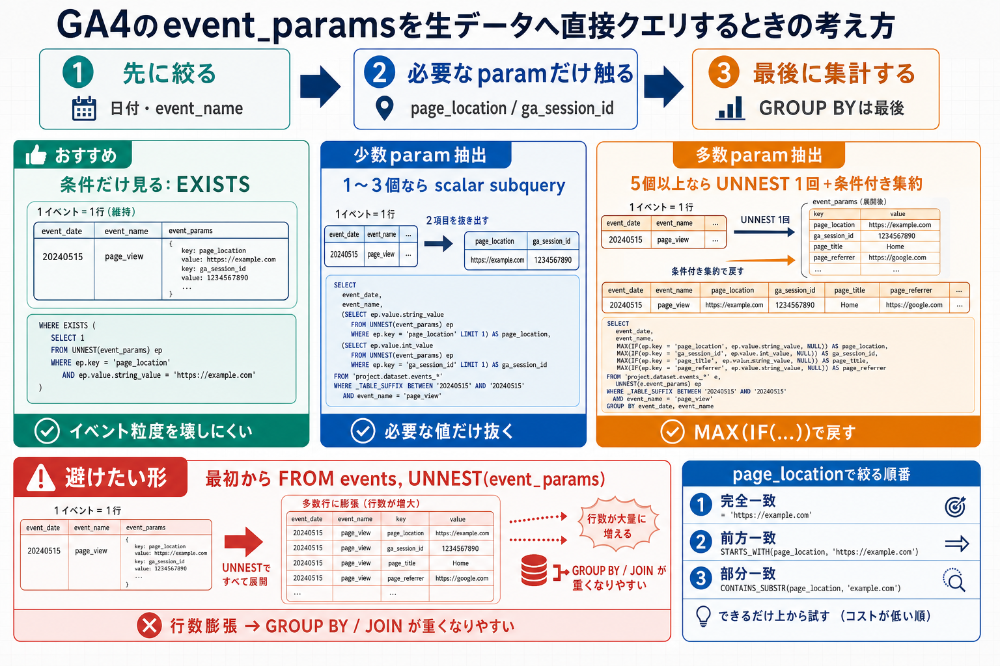
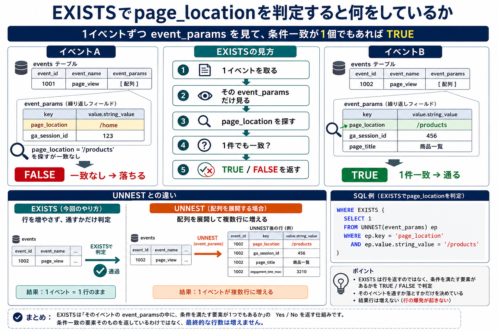

# GA4のevent_paramsを生データへ直接クエリするときの考え方

## まず結論

GA4 の生データへ直接クエリを書くなら、`event_params` は最初に全面 `UNNEST` せず、`必要なキーだけを狙って触る` のが基本です。特に `page_location` でページを絞るときは、`EXISTS` か `scalar subquery` を使って、イベント粒度をなるべく壊さない書き方が安定します。

## これは何か

GA4 の BigQuery エクスポートを前提に、`event_params` を持つ生データへ直接 SQL を書くときの考え方を整理するトピックです。論点は `スキャン量` よりも、`UNNEST による行数膨張` や、その後の `GROUP BY` `JOIN` `DISTINCT` がスロット消費時間を押し上げやすい点にあります。

## どこで使うか

- GA4 の raw export をそのまま探索するとき
- BigQuery のスロット消費時間を抑えながらページ別分析をしたいとき
- `page_location` `ga_session_id` `page_title` のような頻出パラメータを直接取りたいとき
- 事前整形テーブルを作らず、まず raw で当たりを付けたいとき

## 全体像

- 原則は `先に日付や event_name で絞る -> 次に必要な param だけを見る -> 最後に集計する`
- 少数パラメータなら `scalar subquery` で抜く
- 条件判定だけなら `EXISTS` で済ませる
- 多数パラメータを同時に使うなら `UNNEST 1回 + 条件付き集約` を検討する
- 最初から `FROM events, UNNEST(event_params)` にして全件を膨らませる形は避ける

## 理解用イラスト



`page_location` で絞るだけなら、`行を増やしてから絞る` より `そのイベントが条件を満たすかだけ判定する` 方が、raw 直クエリでは扱いやすいです。

## よくある疑問

### Q. raw 直クエリでは、何が一番重くなりやすい?

A. `event_params` を早い段階で全面 `UNNEST` して、1イベントを複数行へ膨らませることです。その後に `GROUP BY` や `JOIN` を重ねると、スロット消費時間が伸びやすくなります。

### Q. 少数のパラメータを見るときの第一候補は?

A. `scalar subquery` です。`ga_session_id` や `page_location` のように 1 から 3 個程度を抜くなら、イベント粒度を維持しやすく、クエリ意図も読みやすいです。

### Q. `WHERE` で `page_location` を絞るときは、どう書くのがよい?

A. 条件判定だけなら `EXISTS` が第一候補です。`event_params` 全体を結果行として展開せず、該当イベントかどうかだけを判定できます。

### Q. `EXISTS` は実際にどう処理している?

A. `そのイベントの event_params の中に、条件を満たす要素が1つでもあるか` を Yes / No で判定しています。行を増やした結果を返しているのではなく、イベントを通すか落とすかだけを決めています。

### Q. `SELECT` にも `page_location` を出したいときは?

A. `scalar subquery` で一度取り出してから外側で絞る形が分かりやすいです。式を二重に書きたくないときは `WITH base AS (...)` へ切り出します。

### Q. `UNNEST` は常に悪い?

A. そうではありません。複数パラメータを同時に列化したいときは、`UNNEST 1回 + MAX(IF(...))` の方が、同じ配列を何度も参照するより自然な場合があります。問題なのは `無条件に最初から全展開すること` です。

## 実務での見方

### 1. まずイベントを先に絞る

- `_TABLE_SUFFIX` で日付を切る
- `event_name = 'page_view'` のように対象イベントを先に狭める
- 先に母集団を減らしてから `event_params` に触る

### 2. ページ条件は `EXISTS` を基本にする

```sql
SELECT
  event_date,
  event_timestamp,
  user_pseudo_id
FROM `project.dataset.events_*` e
WHERE _TABLE_SUFFIX BETWEEN '20260701' AND '20260707'
  AND event_name = 'page_view'
  AND EXISTS (
    SELECT 1
    FROM UNNEST(e.event_params) ep
    WHERE ep.key = 'page_location'
      AND ep.value.string_value = 'https://example.com/products'
  )
```

- 条件判定だけなら、この形が最も素直です
- イベント粒度を壊さずに済みます

### 2.5 `EXISTS` の処理イメージを頭の中でどう見るか



`EXISTS` は、外側のイベントを1行ずつ取り、そのイベントにぶら下がる `event_params` 配列だけを内側で見ます。`page_location` が条件に一致する要素を1個でも見つけたら、そのイベントは通過します。

処理イメージは次の通りです。

1. 外側の `events` テーブルから 1 イベントを取る
2. そのイベントの `event_params` だけを `UNNEST` して中を見る
3. `ep.key = 'page_location'` かつ値一致の要素を探す
4. 1個でも見つかれば `EXISTS = TRUE`
5. 見つからなければ `EXISTS = FALSE`

たとえば、次のように考えると分かりやすいです。

```text
イベントA
  event_params:
  - page_location = /home
  - ga_session_id = 123
  -> 条件不一致なので落ちる

イベントB
  event_params:
  - page_location = /products
  - ga_session_id = 456
  -> 1件一致したので通る
```

ここで重要なのは、`EXISTS` は `page_location` 行そのものを返していないことです。`条件を満たす要素があるか` だけを見ており、`FROM events, UNNEST(event_params)` のように結果行を増やしてはいません。

### 3. 取り出しも必要なら `scalar subquery` を使う

```sql
WITH base AS (
  SELECT
    event_date,
    event_timestamp,
    user_pseudo_id,
    (
      SELECT ep.value.string_value
      FROM UNNEST(event_params) ep
      WHERE ep.key = 'page_location'
    ) AS page_location
  FROM `project.dataset.events_*`
  WHERE _TABLE_SUFFIX BETWEEN '20260701' AND '20260707'
    AND event_name = 'page_view'
)
SELECT *
FROM base
WHERE page_location = 'https://example.com/products'
```

- `SELECT` と `WHERE` で同じ式を繰り返しにくいです
- 後段で `page_location` を再利用しやすくなります

### 4. 多数キーなら `UNNEST 1回` に寄せる

```sql
WITH base AS (
  SELECT *
  FROM `project.dataset.events_*`
  WHERE _TABLE_SUFFIX BETWEEN '20260701' AND '20260707'
    AND event_name = 'page_view'
)
SELECT
  event_date,
  user_pseudo_id,
  MAX(IF(ep.key = 'ga_session_id', ep.value.int_value, NULL)) AS ga_session_id,
  MAX(IF(ep.key = 'page_location', ep.value.string_value, NULL)) AS page_location,
  MAX(IF(ep.key = 'page_title', ep.value.string_value, NULL)) AS page_title
FROM base
LEFT JOIN UNNEST(event_params) ep
GROUP BY event_date, user_pseudo_id
```

- 複数キーをまとめて取りたいときの候補です
- ただし `GROUP BY` が必要になるので、少数キー用途より常に軽いとは限りません

## 実務での使い方

使い分けは次の形で覚えると戻しやすいです。

1. `条件だけ見る`
   - `EXISTS`
2. `1から3個の値を抜く`
   - `scalar subquery`
3. `5個以上の param をまとめて列化する`
   - `UNNEST 1回 + 条件付き集約`

`page_location` の絞り方も、次の順で考えると迷いにくいです。

1. 完全一致
   - `ep.value.string_value = 'https://example.com/products'`
2. 前方一致
   - `STARTS_WITH(ep.value.string_value, 'https://example.com/products')`
3. 部分一致
   - `CONTAINS_SUBSTR(ep.value.string_value, '/products')`

完全一致の方が意図がぶれにくく、まずはここから始めるのが安全です。

## 再利用チェックリスト

- [ ] 先に日付と `event_name` で母集団を絞ったか
- [ ] 条件判定だけなのに全面 `UNNEST` していないか
- [ ] `page_location` の判定に `EXISTS` を使えるか確認したか
- [ ] 少数 param 抽出なのか、多数 param 抽出なのかを分けて考えたか
- [ ] `items` など別の repeated field と同時展開していないか確認したか
- [ ] URL の完全一致、前方一致、部分一致のどれが目的に合うか決めたか

## 次回の確認

- [ ] `EXISTS` と全面 `UNNEST` の違いを説明できるか
- [ ] `page_location` のフィルタを `EXISTS` で書けるか
- [ ] 少数 param と多数 param で書き方を変える理由を言えるか
- [ ] raw 直クエリで行数膨張を避ける意味を説明できるか

## 関連トピック

- [GA4のdirectセッションをBigQueryで調査する](./GA4のdirectセッションをBigQueryで調査する.md)
- [GA4とBigQueryのグラフ分析でユーザー導線を読む](./GA4とBigQueryのグラフ分析でユーザー導線を読む.md)
- [タグ未設置ページからGA4へ一時的にpage_viewを送る](./タグ未設置ページからGA4へ一時的にpage_viewを送る.md)

## 参考リンク

- [GA4 BigQuery Export schema](https://support.google.com/analytics/answer/7029846?hl=en)
  - `event_params` が repeated record であることの定義確認用
- [BigQuery best practices for nested and repeated data](https://cloud.google.com/bigquery/docs/best-practices-performance-nested)
  - nested / repeated をどう扱うと性能上有利かの確認用

## 更新履歴

- 2026-07-02: 初版作成
