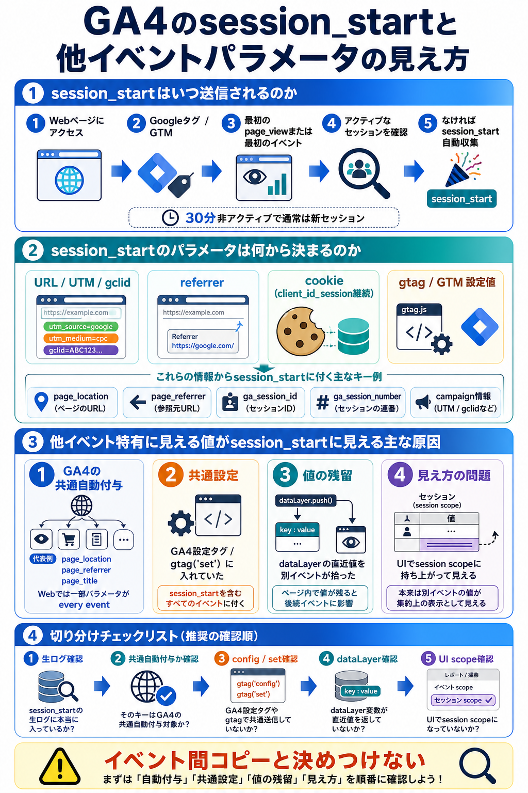

# GA4のsession_startと他イベントパラメータの見え方

## まず結論

GA4 Web の `session_start` は、`gtag.js` または GTM 経由の GA4 タグが動いたときに、`いま有効なセッションがない` と判定されると自動送信されます。  
送信値は主に `URL` `referrer` `cookie` `gtag / GTM の設定値` から決まり、`他イベント特有に見える値` が `session_start` に見えるときは、`GA4が全イベントへ自動付与している` `共通設定として送っている` `dataLayer の値が残っている` `UI で session 軸に持ち上がっている` のどれかであることが多いです。

## これは何か

このトピックは、GA4 の Web 計測で `session_start` がいつ始まり、どのようにパラメータが決まり、なぜ `click` 以外を含む他イベント特有の値が `session_start` に付いて見えるのかを整理するものです。

## どこで使うか

- GA4 DebugView や BigQuery で `session_start` の中身を確認するとき
- GTM 実装で、イベントごとのつもりの値が全イベントへ付いていないかを切り分けるとき
- `direct` や流入元 attribution の見え方を解釈するとき
- `session_start` と他イベントパラメータの関係を実装ミスと集計スコープの両面から確認したいとき

## 全体像

- `session_start` は手動送信イベントではなく、GA4 が `新しいセッション開始` と判断したときの自動収集イベント
- 判定の入口は、ページ表示や最初のイベント送信時に `アクティブセッションがないか`
- 値の元データは大きく `ブラウザ情報` `cookie` `URL / referrer` `タグ設定値`
- `他イベントっぽい値` が付いて見える原因は、大きく `GA4の共通自動付与` `共通送信` `値の残留` `レポート上のスコープ` の4系統

## 理解用イラスト

この図は、`session_start` が始まる判定、値の決まり方、他イベント特有に見える値が混ざって見える代表原因を1枚で戻すための図です。  
実装経路と見え方のズレを同時に確認したいときの復習用として使います。



## よくある疑問

### Q. `session_start` は毎ページ送られるのか

A. 毎ページではありません。ページ表示やイベント発生時に `現在アクティブなセッションがない` と判定されたときだけ送られます。既存セッション中の遷移では通常は増えません。

### Q. `session_start` の主な値は何から決まるのか

A. `client_id` やセッション継続判定は cookie、`page_location` は URL、`page_referrer` は referrer、流入元は `UTM` や `gclid`、それに `gtag('config')` や GTM 設定タグでの上書き値から決まります。

### Q. 他イベントでしか使わないはずのパラメータが `session_start` にもあった。イベント間でコピーされたのか

A. まずはそう決めつけない方が安全です。多くは `GA4 設定タグや Google tag の共通パラメータ` として送っているか、`dataLayer` に残った値を後続イベントが拾っています。UI や探索でセッション軸に持ち上がって見えているだけのこともあります。

### Q. `page_location` や `page_referrer` が `session_start` にある。別イベント由来なのか

A. いいえ。これはむしろ正常です。GA4 公式ヘルプでは、Web の `page_location` `page_referrer` `page_title` などは `every event` に付く代表例とされています。`session_start` 固有でも `page_view` 固有でもなく、共通自動付与として見る方が正確です。

### Q. `click` `file_download` `form_start` 専用に見えるパラメータが `session_start` にある場合は何を疑うべきか

A. まず `gtag('set')` や GTM の `GA4 設定タグ` で全イベント共通に送っていないかを見ます。次に `dataLayer` 変数が直近値を返していないかを見ます。それでも説明できなければ、BigQuery の `UNNEST` や UI スコープの見え方を確認します。

### Q. GTM や gtag で起きやすい実装原因は何か

A. 典型例は、イベント専用のつもりの値を `GA4 設定タグ` や `gtag('set')` に入れているケースです。これをすると `session_start` を含む複数イベントへ同じ値が乗ります。もう1つは、`dataLayer.push()` した値が残り、別イベントがその残留値を参照するケースです。

### Q. BigQuery と GA4 UI で見え方が違うのはなぜか

A. BigQuery はイベント単位の生ログを見やすく、GA4 UI はセッションやユーザー単位で集約して見せる場面があります。そのため UI では `click` 由来の値がセッション全体の属性のように見えることがあります。

### Q. BigQuery で `session_start` に本当にそのパラメータが入っているかはどう見るのか

A. `event_name = 'session_start'` に絞って `UNNEST(event_params)` でキーを展開します。ここで出るなら生ログにあります。ここで出ないのに UI では見えるなら、集計スコープやレポート側の見え方を疑います。

## 実務での見方

- まず `本当に session_start イベント自体に値が入っているのか` を DebugView または BigQuery の `event_params` で確認する
- 次に `GA4 設定タグ` `Google tag の config / set` `GTM のイベントタグ` のどこにパラメータを書いているかを見る
- `dataLayer` を使っている場合は、値が click 時点だけのものか、ページ内で残留するものかを切り分ける
- UI の探索やカスタムディメンションで見ているなら、`event scope` なのか `session scope` なのかを確認する
- `session_start` の調査は `direct` や流入元 attribution の調査と近いので、`landing page` `referrer` `utm` `gclid` も同時に確認すると原因が見えやすい

典型的な判断軸:
- `page_location` `page_referrer` `page_title`
  - まず正常な共通自動付与を疑う
- `link_url` `link_text` `form_id` `file_name` のようなイベント専用値
  - まず共通設定や残留値を疑う
- BigQuery では見えず UI だけで見える
  - まず session scope やレポート集約を疑う

切り分け順:
1. `session_start` の生イベントに本当にそのパラメータがあるか
2. そのキーが GA4 の共通自動付与対象ではないか
3. `GA4 設定タグ` `gtag('set')` `gtag('config')` で共通送信していないか
4. `dataLayer` 変数が直近値を返していないか
5. UI 上のスコープが `session` になっていないか

BigQuery の最小確認例:

```sql
SELECT
  event_timestamp,
  user_pseudo_id,
  ep.key,
  COALESCE(
    ep.value.string_value,
    CAST(ep.value.int_value AS STRING),
    CAST(ep.value.double_value AS STRING)
  ) AS value
FROM `your_project.your_dataset.events_*`,
UNNEST(event_params) ep
WHERE event_name = 'session_start'
  AND ep.key = '確認したいパラメータ名';
```

## 次回の確認

- [ ] `session_start` は手動送信ではなく、新規セッション判定時の自動収集イベントだと説明できる
- [ ] 他イベント特有に見える値が `session_start` に見える原因を `共通自動付与` `共通設定` `残留値` `スコープ` の4つで切り分けられる
- [ ] GTM で `GA4 設定タグ` と `GA4 イベントタグ` の役割差を説明できる

## 関連トピック

- [タグ未設置ページからGA4へ一時的にpage_viewを送る](./タグ未設置ページからGA4へ一時的にpage_viewを送る.md)
- [GA4のdirectセッションをBigQueryで調査する](./GA4のdirectセッションをBigQueryで調査する.md)
- [GA4のevent_paramsを生データへ直接クエリするときの考え方](./GA4のevent_paramsを生データへ直接クエリするときの考え方.md)

## 参考リンク

- [Automatically collected events](https://support.google.com/analytics/answer/9234069)
  - `session_start` が自動収集イベントであり、Web の一部パラメータが every event に付くことを確認するための公式説明
- [About Analytics sessions](https://support.google.com/analytics/answer/9191807)
  - セッション開始条件とタイムアウトの考え方を確認するための公式説明
- [Google tag API reference](https://developers.google.com/tag-platform/gtagjs/reference)
  - `gtag('set')` が後続イベント全体へ影響することを確認するための公式説明

## 更新履歴

- 2026-07-07: 初版作成
- 2026-07-07: `click` 以外の他イベント特有に見えるパラメータまで切り分け範囲を拡張
