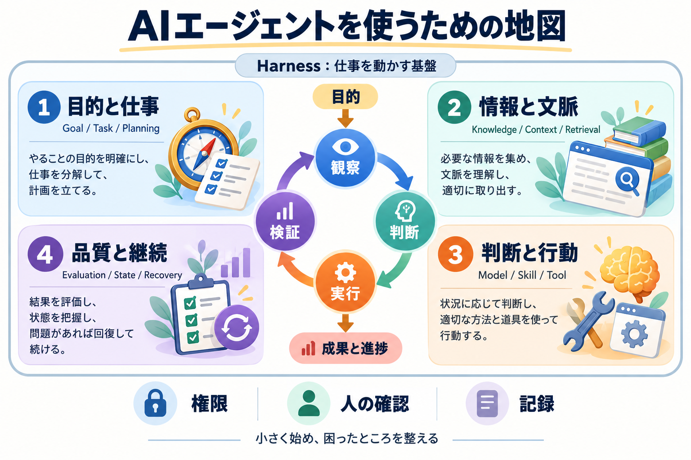

# AIエージェントの全体像とCodex実用設計

## まず結論

**AIエージェントを実用的に使うには、目的・情報・行動・検証を整える。** モデルを選ぶだけでなく、「何を達成するか」「何を根拠にするか」「どこまで任せるか」「何で完成と判断するか」を決めると、仕事として使いやすくなる。

エージェントは、目的に向かって情報を集め、判断し、道具を使い、結果を確かめるループを回す仕組み。Codexは、そのループを作業環境上で動かす製品・実行基盤の一例として捉える。

**最初は一つのエージェントと小さな仕事で始め、実際に困った部分だけを整える。** RAG、Subagent、Hookを最初から全部そろえる必要はない。

## これは何か

AIエージェントの概念を、Codexで作業環境を整える判断へ結びつける復習用の入口。製品名を暗記するための一覧ではなく、新しい技術を「何の問題を改善するものか」で位置づける地図である。

読み方は三つ。

- **3分で復習する**：全体像の四分類と図解を見る。
- **用語の違いを理解する**：比較表からテーマ別の詳細へ進む。
- **実際に使う準備をする**：資料整理の実践例と改善表を見る。

目次：[全体像](#全体像) → [用語の違い](#よくある疑問) → [実践と改善](#実務での見方) → [復習と用語索引](#次回の確認)

## どこで使うか

- Codexへ仕事を依頼するとき、目的・対象・完了条件を整理する。
- AGENTS.md、知識ファイル、Skill、設定へ何を書くかを決める。
- エージェントの失敗を、情報・行動・検証の問題に分けて改善する。
- AIの新機能を、自分の作業に必要か判断する。

## 全体像

### まず、仕事が進むループを押さえる

```text
目的・完了条件
    ↓
観察：依頼・資料・現在の状態を読む
    ↓
判断：不足情報と次の行動を決める
    ↓
実行：必要なToolを呼び出す
    ↓
検証：根拠・成果物・制約への適合を確かめる
    ↓
進捗を更新する
    ├─ 完了条件を満たす → 完了報告
    ├─ 未達・修正可能   → 観察へ戻る
    └─ 権限不足・未確定 → 停止して必要な確認
```

これは理解のための基本形で、すべての製品が固定順に実装するという意味ではない。計画や検索は途中でもやり直す。完了条件だけでなく、作業時間・費用・試行回数などの停止条件も必要に応じて決める。

ツールを使えるチャットもあるため、「チャット画面かどうか」だけで区別しない。目的に向けて、観察・行動・検証をどこまで継続できるかを見る。

### 概念は四つの役割に置く

| 分類・図の色 | 答える問い | 主な概念 | 資料整理の例 |
|---|---|---|---|
| 1 目的と仕事・青 | 何を、どの順で達成する？ | Goal、Task、Subtask、Planning | 複数資料から、根拠付きの比較メモを作る |
| 2 情報と文脈・緑 | 何を根拠に判断する？ | Knowledge、Context、Retrieval、RAG、Memory | 正式な用語定義と必要な資料箇所を読む |
| 3 判断と行動・橙 | どう判断し、何を使う？ | Model、Reasoning、Skill、Tool、Routing、Orchestration | 整理手順を使い、ファイルを読み、メモを書く |
| 4 品質と継続・紫 | 正しいか、続けられるか？ | Evaluation、State、Checkpoint、Recovery、Tracing | 出典と記述を照合し、未解決事項を残す |

Instructionsは四分類すべてにかかる行動方針。権限・Guardrail・人の確認も横断する。Subagentは作業を委任する構成であり、必要に応じて追加する。

### Model・Tool・Environment・Harnessは役割が違う

| 概念 | 一言の定義 | 他の要素との関係 |
|---|---|---|
| Model | 入力から判断や出力を生成するモデル | Contextを受け、次の行動やToolの引数を生成する |
| Tool | 読む・検索する・実行するための操作手段 | Modelが呼び出しを提案し、実行基盤が権限に従って実行する |
| Environment | ファイルやサービスなどの作業対象・実行場所 | ローカル、リポジトリ、サンドボックス、接続先など |
| Harness | モデルを仕事に使うための実行・制御基盤 | Tool呼び出し、文脈、履歴、権限、作業の継続などを扱う。機能は実装により異なる |
| Framework | エージェントを開発するための枠組み | Harnessを構築する材料になりうる。製品や実行環境そのものとは区別する |

Harness Engineeringは、モデルの学習そのものを変えるより、指示・情報・ツール・検証などの周辺を整えること。Context Engineeringは、そのうちモデルへ渡す情報の選択・配置・更新に焦点を当てる。

## 理解用イラスト

中央のループが仕事の進み方、周囲の四分類が整える対象、外枠がHarnessを表す。図は概念地図であり、Codex内部の厳密な実装図ではない。



## よくある疑問

### Q. 似た用語をどう使い分ける？

| 比較する概念 | 区別の軸 | 同じ資料整理の仕事に当てはめると |
|---|---|---|
| Goal／Task／Subtask | 到達したい状態／仕事／分解した仕事 | 比較判断できる状態／比較メモ作成／資料読解・照合 |
| Instructions／Knowledge／Skill | 守る方針／参照する事実／仕事の進め方 | 推測しない／用語の正式定義／読解→比較→出典確認 |
| Context／State／Memory | 今回使える情報／現在の進捗／過去から保持する情報 | 読んだ資料／照合待ち／前回の決定 |
| Knowledge／Memory | 内容の用途と管理責任 | 正式な定義／過去の判断。情報が両方の役割を持つこともある |
| Tool／MCP | 使う機能／外部機能・情報を接続する共通プロトコル | ファイル検索／検索サービスなどへの接続方式 |
| Planning／Routing／Orchestration | 仕事の分解／担当・手段の選択／順序や依存関係の制御 | 読解と照合に分ける／手順・道具・担当を選ぶ／読解後に照合する |
| Skill／Subagent | 手順／仕事を任せる別のエージェント | 整理の手順書／一つの資料の調査担当 |
| Evaluation／Guardrail | 結果・過程を評価する／望ましくない行動を防ぐ | 根拠と照合／対象外ファイルへの書き込みを制限 |

Skillは指示や資料、必要に応じたスクリプトをまとめる単位。実行機能そのものと同一ではない。MCPはツール以外の情報提供も扱うため、「MCPという一つの道具」と考えすぎない。[詳細：API・MCP・Skills・Tool](../20_トピック/APIとMCPとSkillsとToolの関係.md)

### Q. 知識ファイルを置けば、全部読んで覚えてくれる？

ファイルの存在、検索・読解、モデルへの学習は別。Taskに必要な内容を取得してContextへ入れる設計が必要になる。Project内の全ファイルや別チャットの全文が常に渡されるとは考えず、重要な決定と進捗は参照できる正本に残す。[詳細：情報設計](../20_トピック/Context・Knowledge・Retrievalの情報設計.md)

### Q. モデルは強いものを選べばよい？

Task–Model Fitを見る。曖昧さ、長さ、必要なTool、誤りの影響と、品質・費用・待ち時間を比較する。理解、指示追従、計画、Tool利用、検証などの能力は一つの順位では表せない。

Reasoningは情報から判断を導く能力、Reasoning Effortは対応するモデルで推論計算量を調整する設定。高くしても、必要な情報・権限・検証の不足は埋まらない。モデルの固定序列や名称別の担当を暗記せず、代表的な仕事で比較する。[詳細：モデル選択の既存ノート](../20_トピック/codex-credit-guide.md)は時点依存の情報として公式情報を再確認する。

### Q. Subagentや高度なRAGは最初から必要？

まず一つのエージェントで、指示・知識・Tool・検証を整える。Subagentは独立した仕事の委任、RAGは外部情報の検索と活用を改善するための選択肢。順番どおりに高度化する必要はない。[情報設計](../20_トピック/Context・Knowledge・Retrievalの情報設計.md)／[委任と運用設計](../20_トピック/検証・状態管理・委任の運用設計.md)

## 実務での見方

### 資料整理を例に、まず小さな仕事を成立させる

目標は「複数の一般公開資料から、比較判断に使える根拠付きメモを作る」。完成条件は、共通の比較軸、出典、事実と解釈の区別、未確認事項がそろうこと。

```text
資料整理プロジェクト/
├── README.md          目的・入口・完成条件
├── AGENTS.md          毎回守る短いルール
├── knowledge/
│   ├── terms.md       正式な用語・比較軸
│   └── sources.md     資料一覧・出典・更新日
└── work/
    ├── comparison.md  成果物
    └── STATUS.md      現在の進捗・次の作業・未解決事項
```

`knowledge/` や `work/` は設計例の名称で、Codexが必ず自動読込する特別なフォルダではない。READMEと依頼文から必要なファイルを案内する。

| 置く場所 | 内容の例 | なぜ分けるか |
|---|---|---|
| 今回の依頼文 | 今回の資料、比較対象、出力形式、期限 | 一回だけの条件を固定ルールに混ぜない |
| README.md | プロジェクトの目的と入口 | 次の作業でも迷わず正本に戻れる |
| AGENTS.md | 根拠を示す、原資料を上書きしない、不明点は明記する | 共通の行動方針を短く保つ |
| knowledge/ | 正式な用語、比較軸、資料の出典と更新日 | 詳しい知識は必要なときに読む |
| work/ | メモ、確認結果、進捗、未解決事項 | 成果物と作業中の状態を残す |

依頼文の例：

```text
目的：公開資料A・Bを比較し、選択に使えるメモを作る。
対象：指定した二つの資料だけ。
最初に読むもの：README.md、knowledge/terms.md、knowledge/sources.md。
進め方：比較軸を確認→資料を読む→比較表を作る→出典と照合する。
制約：原資料は上書きしない。書かれていない仕様は推測しない。
出力：work/comparison.mdに比較表・出典・未確認事項をまとめる。
完了条件：主要な事実に根拠があり、事実と解釈が分かれている。
停止条件：参照できない資料や定義の衝突があれば、未確認として報告する。
```

最初の数回は、何を読んだかと根拠の対応を人が確認する。毎回同じ手順が安定してきたらSkillにまとめる。

### 同じ仕事を繰り返すなら、手順と実行設定を追加する

```text
追加する構成例
.agents/skills/compare-documents/SKILL.md   再利用する整理・照合手順
.codex/config.toml                        必要な実行設定
```

Skillは `SKILL.md` に名前・説明・手順を記述し、必要なら参照資料やスクリプトを添える。概要から必要時に詳細を読む仕組みがある。[公式：Skills](https://learn.chatgpt.com/docs/build-skills)

`config.toml` はモデル、権限、MCPなどの実行設定を扱う。ユーザー設定とプロジェクト設定があり、プロジェクト側は信頼設定などの条件に従う。[公式：設定](https://learn.chatgpt.com/docs/config-file/config-basic)

`AGENTS.md` は行動指示。階層ごとの指示があり、置いた全ファイルが無条件にすべて読まれるという理解は避ける。[公式：AGENTS.md](https://learn.chatgpt.com/docs/agent-configuration/agents-md)

これらは学習用の構成例で、実際の設定変更を指示するものではない。詳しくは [Codexの動きと制御ファイル](../20_トピック/Codexの動きと制御ファイル.md)へ。

### 困ったことから、整える部分を選ぶ

| 起きた問題 | 最初に確かめること | 次の改善候補 |
|---|---|---|
| 事実が足りない・古い | 正式な資料が存在し、更新されているか | Knowledgeの更新、Grounding |
| 必要な情報を見つけない | 入口・見出し・検索語が適切か | Routing、キーワード検索、必要ならRAG |
| 大量に読んで要点を落とす | 対象範囲を絞れたか | Retrieval、要約、Contextの整理 |
| 毎回手順が違う | 共通手順と完成条件があるか | Skill、依頼テンプレート |
| 実行できたが内容が誤る | 合否を判断する根拠があるか | Evaluation、Evals、人の確認 |
| 許可外の操作が心配 | Toolの権限で制限できるか | Permissions、Sandbox、Guardrail、対応するHook |
| 長い作業の途中で迷う | 進捗と成果物が保存されているか | State、Checkpoint、Recovery |
| 独立した調査が多数ある | 分担・共有範囲・統合方法が明確か | Subagent、Orchestration |
| 遅い・費用が増える | 読む量、試行数、Tool呼び出し数が多すぎないか | Task–Model Fit、Reasoning Effort、Model Routing |

詳しい合否判定・停止・再開は [検証・状態管理・委任の運用設計](../20_トピック/検証・状態管理・委任の運用設計.md)へ。

### 新しい製品・機能を見るときは、地図に戻す

「どの役割か」「何が改善されるか」「自分の仕事で困っているか」「試すなら何で成功と判断するか」を見る。MCPは接続、RAGは情報取得、Subagentは委任、Evalsは評価に位置づけられる。

ADKなどのFrameworkは、どの製品・提供元のものかを確認してから比較する。「Jev」は指す製品が不明なため、このノートでは要確認とし、Routing製品と断定しない。

AIニュースは、自分の仕事の品質・費用・待ち時間・任せられる範囲に影響する変化を優先する。確率、表現、学習と推論、汎化の基礎は長く役立つが、最初の実用ではContext・Tool・検証の理解から始められる。

| 長く使える基礎 | エージェント活用につながる理解 |
|---|---|
| Probability・確率 | 出力には不確実性があるため、もっともらしさと正しさを分けて検証する |
| Representation・表現 | 文章・画像・数値の表し方が、モデルや検索で扱える情報に影響する |
| Training／Inference・学習／推論 | モデルのパラメータを変えることと、現在の入力から出力を生成することは別 |
| Generalization・汎化 | 過去の例で成功しても新しいTaskで成功するとは限らず、代表ケースで確かめる |

## 次回の確認

- [ ] 「資料を置く」と「Contextへ入れる」と「モデルを学習させる」の違いを説明できるか。
- [ ] 今回の条件、毎回のルール、知識、手順を置き分けられるか。
- [ ] 完了条件・停止条件・人が確認する地点を決められるか。
- [ ] 自分の失敗を四分類に置き、最初の改善を一つ選べるか。
- [ ] 新しい製品の名前を隠しても、何を改善するか説明できるか。

### 用語から詳細へ戻る索引

| 用語 | 一言で思い出す | 詳細 |
|---|---|---|
| Agent／Agent Loop／Goal／Task／Subtask | 目的へ仕事を進める反復と分解 | [ループ設計](../20_トピック/プロンプトを書くなではなくループを設計する.md) |
| Planning／Routing／Orchestration | 分解する／選ぶ／連携を制御する | [運用設計](../20_トピック/検証・状態管理・委任の運用設計.md) |
| Instructions／AGENTS.md | 行動方針を与える | [制御ファイル](../20_トピック/Codexの動きと制御ファイル.md) |
| Skill／SKILL.md／Tool／Tool Calling／API／MCP | 手順・実行機能・呼び出し・接続 | [API・MCP・Skills・Tool](../20_トピック/APIとMCPとSkillsとToolの関係.md)、[MCPの詳細](../20_トピック/MCPの仕組みと原文メッセージ.md) |
| Knowledge／Context／Context Window／Context Engineering | 参照知識と、今扱う情報の設計 | [情報設計](../20_トピック/Context・Knowledge・Retrievalの情報設計.md) |
| Retrieval／RAG／Agentic RAG／Grounding | 情報を取得して根拠にする | [情報設計](../20_トピック/Context・Knowledge・Retrievalの情報設計.md) |
| Chunking／Embedding／Hybrid Search／Reranking | 分割・意味表現・検索併用・再順位付け | [情報設計](../20_トピック/Context・Knowledge・Retrievalの情報設計.md) |
| Memory／Project／Session／Thread／Compaction | 情報の保持・作業単位・履歴の圧縮 | [情報設計](../20_トピック/Context・Knowledge・Retrievalの情報設計.md) |
| Model／Capability／Intelligence／Reasoning／Reasoning Effort | 判断能力と推論計算量 | [運用設計](../20_トピック/検証・状態管理・委任の運用設計.md) |
| Task–Model Fit／Model Routing | 仕事に合うモデルを選ぶ | [運用設計](../20_トピック/検証・状態管理・委任の運用設計.md) |
| State／Checkpoint／Recovery | 進捗を記録し、確認済み地点から再開する | [運用設計](../20_トピック/検証・状態管理・委任の運用設計.md) |
| Evaluation／Evals／Human-in-the-loop | 品質を判定し、人の判断を組み込む | [運用設計](../20_トピック/検証・状態管理・委任の運用設計.md) |
| Guardrail／Hook／Permissions／Sandbox | 行動の制約とイベント処理 | [運用設計](../20_トピック/検証・状態管理・委任の運用設計.md) |
| Observability／Tracing／Reliability／Cost／Latency | 挙動・信頼性・費用・待ち時間を見る | [運用設計](../20_トピック/検証・状態管理・委任の運用設計.md) |
| Subagent／Delegation | 別エージェントへ限定した仕事を任せる | [運用設計](../20_トピック/検証・状態管理・委任の運用設計.md) |
| Harness／Harness Engineering／Environment／Framework／config.toml | 実行基盤・周辺設計・作業場所・開発枠組み・設定 | [制御ファイル](../20_トピック/Codexの動きと制御ファイル.md)と本ノートの全体像 |
| Probability／Representation／Training／Inference／Generalization | 不確実性・表現・学習と推論・新しい仕事への適用 | 本ノートの実務での見方 |

## 関連トピック

- [Context・Knowledge・Retrievalの情報設計](../20_トピック/Context・Knowledge・Retrievalの情報設計.md)
- [検証・状態管理・委任の運用設計](../20_トピック/検証・状態管理・委任の運用設計.md)
- [Codexの動きと制御ファイル](../20_トピック/Codexの動きと制御ファイル.md)
- [OpenAI分野まとめ](../10_分野まとめ.md)

## 参考リンク

製品仕様の確認日：2026-10-08。構成例・四分類・改善順は学習用の整理で、公式の必須構成ではない。

- [AGENTS.mdの公式説明](https://learn.chatgpt.com/docs/agent-configuration/agents-md)：行動指示の探索と階層。
- [Skillsの公式説明](https://learn.chatgpt.com/docs/build-skills)：手順・資料のまとめ方と段階的読込。
- [Codex設定の公式説明](https://learn.chatgpt.com/docs/config-file/config-basic)：ユーザー・プロジェクト設定と信頼条件。

## 更新履歴

- 2026-10-08：概念を四分類と実践例へ再編し、詳細ノート・図解・用語索引を追加。
