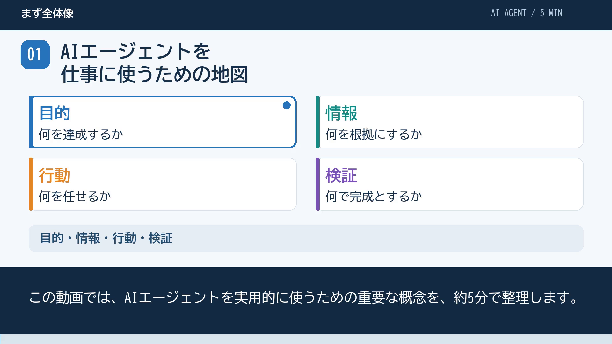

# AIエージェント重要概念を5分で復習する

## まず結論

目的・情報・行動・検証の四つを軸に、AIエージェントの重要概念を5分で復習する。定義の暗記だけでなく、Codexで仕事を任せるときの使い分けへつなげる。

[全体像の地図へ戻る](../15_話題まとめ/AIエージェントの全体像とCodex実用設計.md)

## 動画を見る

- [5分解説動画を開く・ダウンロードする](../40_図解/AIエージェント重要概念-5分解説.mp4)
- [字幕ファイル（SRT）](../40_図解/AIエージェント重要概念-5分解説.srt)
- 形式：MP4、1920×1080、24fps、5分00秒。日本語ナレーションは音声合成。
- 画面内に字幕を表示。字幕トラックとSRTも付属する。
- 12場面で図と要点を切り替え、重要な概念を強調する解説動画。

GitHubの通常のファイル画面で再生できない場合は、動画をダウンロードして再生する。

## どこで使うか

- 全体像を短時間で復習するとき。
- 説明を聞きながら、似た用語の違いを整理するとき。
- 実用する前に、目的・根拠・操作・検証の確認をするとき。

## 全体像とチャプター

| 開始 | 章 | 内容 |
|---|---|---|
| 0:00 | まず全体像 | AIエージェントを仕事に使うための地図 |
| 0:18 | 1 エージェントの仕組み | 答えて終わるより目的へ向けて仕事を進める |
| 0:46 | 1 エージェントの仕組み | ModelとHarnessを分ける |
| 1:12 | 2 目的とルール | Goal・Task・Instructions |
| 1:37 | 3 情報を渡す | KnowledgeとContextの違い |
| 2:05 | 3 情報を渡す | RAGは、必要な外部情報を使う方式 |
| 2:30 | 4 行動の手段 | Skill・Tool・MCPを区別する |
| 2:55 | 4 環境へ落とし込む | Codexの設定を四つに分ける |
| 3:21 | 5 品質を確かめる | 実行成功と、正しさは別 |
| 3:48 | 6 長い仕事を続ける | Memory・State・Checkpoint |
| 4:15 | 7 必要なときだけ拡張 | Subagentは、独立した仕事へ |
| 4:41 | 実践へつなげる | 小さく始めて、困った部分を整える |

## よくある疑問

### Q. 70項目の意味集と、何が違う？

意味集は各用語の定義を思い出すための一覧。動画は主要概念を仕事の流れに沿ってつなぎ、似た概念をどう使い分けるかを説明する。

### Q. Modelや料金の最新比較も扱う？

この動画は、変わりにくい概念と実用設計に絞る。個別モデルの順位、料金、未確認の製品仕様は扱わない。

## 実務での見方

見終えたら、小さな仕事を一つ選び、「目的」「必要な情報」「使う手順と道具」「完成条件」を書く。失敗したときは、情報不足・手順・検証のどこに問題があるかを分けて考える。

## 次回の確認

- [ ] KnowledgeとContextを区別できるか。
- [ ] Skill・Tool・MCPの違いを具体例で説明できるか。
- [ ] 実行成功と、成果の正しさを別々に確認できるか。
- [ ] 小さな仕事の完了条件を決められるか。

## ナレーション原稿

### 0:00 — AIエージェントを仕事に使うための地図

この動画では、AIエージェントを実用的に使うための重要な概念を、約5分で整理します。

覚える軸は、目的、情報、行動、検証の四つです。

製品名を覚えるより、仕事のどの部分を整える概念なのかをつかみましょう。

### 0:18 — 答えて終わるより目的へ向けて仕事を進める

AIエージェントは、目的に向かって、情報を集め、判断し、道具を使い、結果を確かめる仕組みです。

基本は、観察、判断、実行、検証というループです。

たとえば、二つの資料を比較する仕事なら、資料を読み、比較表を作り、記述を出典と照合します。

チャットでも道具を使えるものはあります。画面の名前より、どこまで行動と検証を続けられるかを見るのが大切です。

### 0:46 — ModelとHarnessを分ける

Modelは、入力から判断や出力を生成するモデルです。

Harnessは、そのモデルを実際の仕事に使うための実行、制御の基盤です。文脈、道具の実行、権限などを扱います。

Codexは、これらを作業環境と組み合わせて仕事を進める製品として考えられます。

良いモデルを選ぶことと、必要な情報や道具、検証を整えることは、別々に考えましょう。

### 1:12 — Goal・Task・Instructions

Goalは、達成したい状態です。Taskは、そのために行う具体的な仕事です。

たとえば、選択に使える判断材料を得ることがGoalで、資料の比較メモを作ることがTaskです。

Instructionsは、仕事で守るルールと方針です。たとえば、根拠を示す、推測で仕様を作らない、といった条件です。

今回だけの対象資料と、毎回守る方針を分けると、依頼も環境も整理しやすくなります。

### 1:37 — KnowledgeとContextの違い

Knowledgeは、参照して使う事実、定義、仕様です。Contextは、今回モデルが判断に使える情報です。

資料がフォルダに存在していても、今回読まれたとは限りません。

必要な資料を選び、該当部分を取得して、判断に使えるようにすることが重要です。

全部を渡すより、目的と関係のある情報を、出典や更新日とともに渡しましょう。ファイルを読むことと、モデルを学習させることも別です。

### 2:05 — RAGは、必要な外部情報を使う方式

RAGは、必要な外部情報を検索、取得して、回答や生成に使う方式です。

Vector DBや意味検索は実装手段の一つで、最初から必須ではありません。小規模な知識なら、フォルダとキーワード検索から始められます。

ただし、検索で見つけただけでは十分ではありません。

出力の事実が、信頼できる出典に支えられているかを確かめます。この根拠づけをGroundingと呼びます。

### 2:30 — Skill・Tool・MCPを区別する

Skillは、仕事の進め方や資料をまとめた再利用単位です。Toolは、その手順で使う操作手段です。

比較の進め方がSkillで、ファイル検索や読取がTool、と考えると分かりやすくなります。

MCPは、外部の機能や情報をつなぐ共通規約です。

使う機能がToolで、接続の共通ルールがMCPです。MCPをつないだからといって、必要な手順や知識まで自動で整うわけではありません。

### 2:55 — Codexの設定を四つに分ける

Codexの環境を整えるときは、役割ごとに置き分けます。

AGENTS.mdには、適用する行動ルール。知識ファイルには、正式な定義や仕様。SKILL.mdには、特定のSkillの用途と手順を置きます。

config.tomlは、モデル、権限、接続などの実行設定です。

知識フォルダの名前は設計例であり、自動で全部読み込む特別な場所ではありません。今回の依頼から、必要な情報へ案内しましょう。

### 3:21 — 実行成功と、正しさは別

ファイルが作れた、SQLが動いた。これは実行の成功です。内容が正しいとは限りません。

完成条件と根拠に照らして、結果や過程を確認するのがEvaluationです。

資料比較なら出典との一致。集計なら、期間、指標、粒度などを確かめます。

してはいけない操作は、指示だけでなく権限などでも制限します。影響の大きい判断には、人が確認できる成果物と根拠をそろえましょう。

### 3:48 — Memory・State・Checkpoint

Memoryは、過去から保持する情報です。Stateは、今回の仕事の現在の進捗や状態です。

前回決めた比較軸はMemory、比較表はできたが出典の照合がまだ、という状態はStateです。

長い仕事では、成果物、確認済みの箇所、未解決事項、次の作業を保存します。これがCheckpointの考え方です。

再開するときは、入力や実行結果を確認します。会話の要約だけで、すべての状態が正確に残るとは考えないようにしましょう。

### 4:15 — Subagentは、独立した仕事へ

Subagentは、限定した仕事を任される別のエージェントです。独立した資料の調査などに向いています。

仕事を分解するのがPlanning。担当や道具を選ぶのがRouting。順序と連携を制御するのがOrchestrationです。

委任するときは、対象、入力、制約、出力、完成条件を決めます。

短い仕事では、分担の調整が負担になることもあります。結果の統合と検証まで含めて、役立つかを判断しましょう。

### 4:41 — 小さく始めて、困った部分を整える

まずは一つのエージェントに、小さな仕事を任せましょう。

対象と完成条件を決め、必要な情報と道具を用意し、成果を根拠と照合します。

情報、手順、検証のどこで困ったかを見て、必要な仕組みだけを追加する。

これが、新しい製品や機能に振り回されず、AIエージェントを実用に結びつける基本です。

## 関連トピックと根拠

- [全体像とCodex実用設計](../15_話題まとめ/AIエージェントの全体像とCodex実用設計.md)：動画の内容の正本。公式仕様の参考リンクもここにまとめる。
- [Context・Knowledge・Retrievalの情報設計](./Context・Knowledge・Retrievalの情報設計.md)
- [検証・状態管理・委任の運用設計](./検証・状態管理・委任の運用設計.md)

## 更新履歴

- 2026-10-08：5分の日本語ナレーション・字幕付き解説動画を作成。

