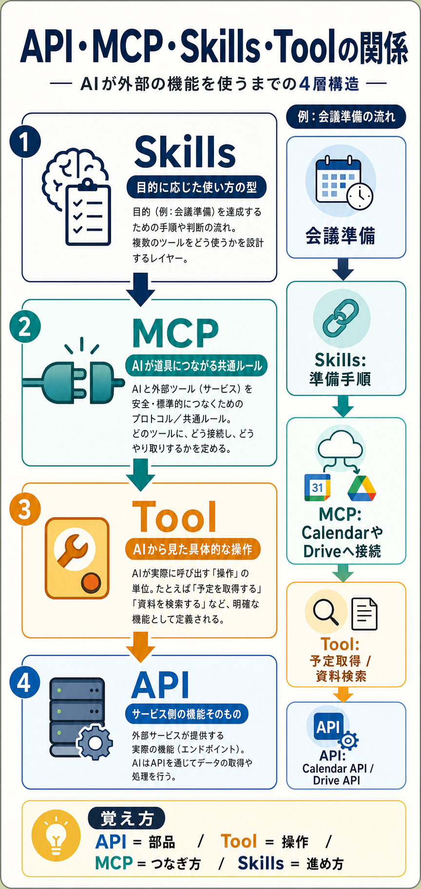

# APIとMCPとSkillsとToolの関係

## まず結論

`API` はサービス側の機能そのもの、`Tool` はAIから見た具体的な操作、`MCP` はAIがその道具へつながるための共通ルール、`Skills` は目的に応じた使い方の型です。  
混同しやすいですが、`API = 部品` `Tool = 操作` `MCP = つなぎ方` `Skills = 進め方` と置くと整理しやすくなります。

## これは何か

AIエージェントやCodexの周辺で頻出する `API` `MCP` `Skills` `Tool` の役割を、同じ階層の言葉としてではなく、4層の構造として理解するためのトピックです。

## どこで使うか

- OpenAIやCodexまわりの説明を読んで、用語の役割が混ざったとき
- 新しい外部サービスをAIにつなぐとき、どこを実装する話なのか切り分けたいとき
- `MCPはAPIと何が違うのか` を短く説明したいとき
- AIツールを `接続` と `運用手順` に分けて理解したいとき

## 全体像

- `API`
  - 外部サービスが提供する実機能です。たとえば `予定を取得する` `メールを送る` `ファイルを検索する` のような機能本体を指します。
- `Tool`
  - AIが実際に呼び出す操作単位です。`予定取得` `資料検索` のように、AIから見て明確な入力と出力を持つ形へ切り出されます。
- `MCP`
  - AIが外部の道具やデータへ共通の流儀でつながるための接続ルールです。どのツールがあるか、何を渡せばよいか、結果をどう受け取るかをそろえます。
- `Skills`
  - 目的に応じて、どの道具をどんな順番で使うかを定めた進め方です。`会議準備` `レビュー対応` `調査` のような仕事の型に近い層です。

4層の関係:

1. `Skills` が仕事の進め方を決める
2. `MCP` がAIと道具の接続方法をそろえる
3. `Tool` がAIから見た操作として実行される
4. `API` が裏側で実機能を提供する

## 理解用イラスト

この図では、`会議準備` の例を使って `Skills → MCP → Tool → API` の順で役割が下がっていくことを一目で戻せます。  
`MCPは機能ではなく、AIが道具につながるための共通ルール` だと見分けるための図です。

## よくある疑問

### Q. APIとToolは同じではないのか

A. 同じではありません。`API` はサービス側の機能で、`Tool` はAIが使いやすい操作単位です。1つのToolが1つのAPIを呼ぶこともあれば、複数APIをまとめることもあります。

### Q. MCPは何を標準化しているのか

A. AIが `どんな道具があるか` `その道具で何ができるか` `どんな入力が必要か` `結果をどう受け取るか` を共通の考え方で扱えるようにする部分です。

### Q. MCPがあればAIは自動で賢く仕事できるのか

A. そこまでは担いません。MCPは接続の土台です。仕事として安定して進めるには、どのツールをどの順で使うかを定める `Skills` や実務設計が別に必要です。

### Q. Skillsはプロンプトと同じなのか

A. 近い場面はありますが、同じではありません。単発の指示文より広く、`目的` `手順` `判断軸` `使用ツール` まで含む仕事の型として捉える方が実務では役立ちます。

### Q. MCPがないと何が困るのか

A. サービスごとに接続方法や操作定義がばらつき、AI側の実装や運用が個別対応だらけになります。新しい道具を足すたびに接続の考え方が散らばるのが大きな問題です。

## 実務での見方

- 新しいサービスを使いたいときは、まず `APIがあるか` を見る
- AIにそのサービスを安定して使わせたいときは、`MCPでどうつなぐか` を見る
- AIから何を呼べる状態にするかは、`Toolとして何を切り出すか` を考える
- 毎回の仕事品質をそろえたいときは、`Skillsとしてどの手順を標準化するか` を考える
- つまり、`機能の有無` `接続の標準化` `操作の定義` `運用の型` を分けて考えるのが実務のコツです

## 次回の確認

- [ ] `API` と `Tool` の違いを、自分の言葉で1文で言えるか
- [ ] `MCP` を `機能` ではなく `接続ルール` として説明できるか
- [ ] `Skills` が `プロンプト` より広い概念だと説明できるか

## 関連トピック

- [AIエージェントで複数アプローチを比較する使い方](./AIエージェントで複数アプローチを比較する使い方.md)
- [プロンプトを書くなではなくループを設計する](./プロンプトを書くなではなくループを設計する.md)

## 参考リンク

- 一般公開された参考リンクは未設定

## 更新履歴

- 2026-07-11: 初版作成
