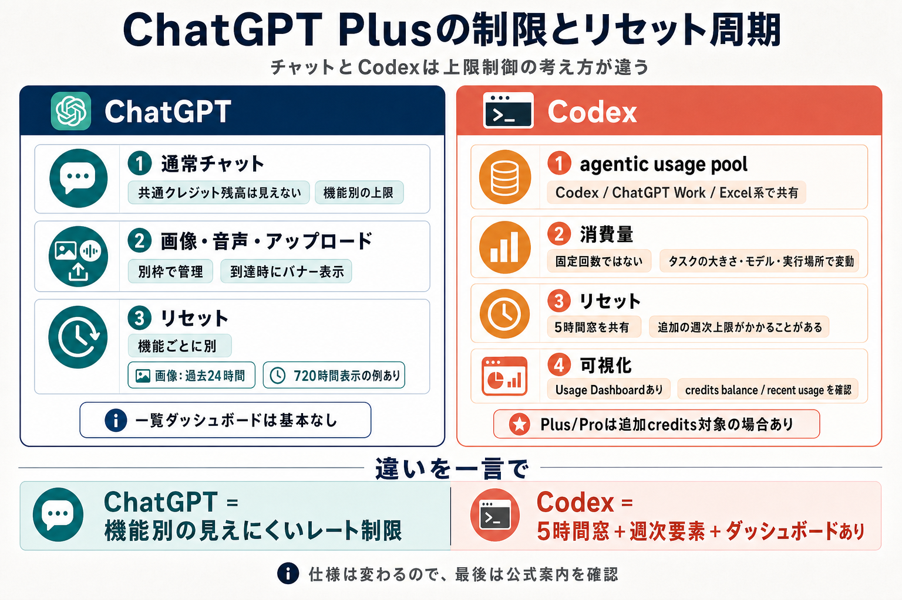

# ChatGPTとCodexの利用制限

## まず結論

ChatGPT Plusでは、`チャット` と `Codex` は同じ考え方で制限されていません。チャットは機能別の見えにくい利用上限、Codexは5時間窓と追加週次要素を持つ使用量管理として理解すると整理しやすいです。

## これは何か

ChatGPT Plusで `ChatGPTの通常チャット` と `Codex` を使うときに、何が制限され、いつ戻り、何が見えるかを分けて整理したメモです。2026-07-11時点の理解をもとにしており、時点依存の仕様を含みます。

## どこで使うか

- ChatGPT Plusで、チャットとCodexの違いを短時間で戻したいとき。
- なぜチャット側は消費状況が見えにくいのかを整理したいとき。
- Codexの残り利用量やリセット周期の見方を確認したいとき。

## 全体像

- ChatGPTの通常チャットは、`共通クレジット残高` を減らしていく見せ方ではなく、機能ごとの上限管理に近い。
- 画像生成、音声、ファイルアップロードなどは、通常チャットとは別枠で制限される。
- チャット側は、上限到達時にバナーや残り時間表示が出ることはあるが、Codexのような一覧ダッシュボードは基本ない。
- Codexは、`local messages` と `cloud tasks` が共有する `5時間窓` を中心に管理され、追加の週次上限がかかることがある。
- Codexは `Usage Dashboard` で `credits balance` や `recent usage` を確認できる。
- どちらも仕様変更がありうるので、最後は公式案内で確認する。

## 理解用イラスト

この図は、`チャットは機能別制限`、`Codexは5時間窓とダッシュボード` という違いを1枚で戻すためのものです。

## よくある疑問

### Q. ChatGPT Plusのチャットは、クレジット残高を見ながら使う仕組みなの？

A. 少なくとも通常チャットは、その見せ方が中心ではありません。共通の残高一覧より、機能ごとの上限と到達時バナーで管理される理解が近いです。

### Q. 画像生成や音声の上限は、通常チャットと同じ枠なの？

A. 同じではありません。公式も、画像・音声・アップロードには `separate usage limits` と `reset periods` がある前提で案内しています。

### Q. なぜチャット側は消費状況が見えなくて、Codexは見えるの？

A. 制限の設計が違うからです。チャットは機能別のレート制限に近く、Codexは usage pool と dashboard を持つ設計なので、見せ方にも差があります。

### Q. Codexの上限は、固定回数みたいに決まっている？

A. 単純な固定回数とは限りません。モデル、タスクの大きさ、ローカル実行かクラウド実行かで重さが変わります。

### Q. Codexのリセット周期はどう考えればいい？

A. 基本は `5時間窓` を中心に見るのが早いです。その上で、追加の週次上限がかかることがあります。

### Q. 昔見た上限緩和情報は、今も有効？

A. そのまま使えない可能性があります。利用条件や一時的な緩和は変わりうるので、最後は公式案内を再確認します。

### Q. 上限に達したら完全に終わり？

A. 一部プランでは、追加creditsで継続できる場合があります。ただし対象プランと現在の案内を確認する必要があります。

## 実務での見方

1. 現在のプランを確認する。
2. `チャットの話なのか` `Codexの話なのか` を最初に分ける。
3. チャット側は、使いたい機能ごとの上限表示やバナーを見る。
4. Codex側は、Usage Dashboardで現在の使用量を見る。
5. 長いCodexタスクは、小さく分けられるか検討する。
6. 上限到達後の継続手段が必要なら、creditsの案内を確認する。

## 次回の確認

- [ ] 公式案内を再確認したか。
- [ ] 現在のプランを確認したか。
- [ ] いま見ている話が `チャット` か `Codex` か切り分けたか。
- [ ] Codexなら Usage Dashboard を確認したか。
- [ ] 長いタスクを小さく分割できないか。
- [ ] creditsの対象プランか確認したか。

## 関連トピック

- [OpenAIの分野まとめ](../10_分野まとめ.md)
- [ChatGPTとCodexの利用制限の参照メモ](../30_参考リンク/ChatGPTとCodexの利用制限参考リンク.md)

## 参考リンク

- [ChatGPT pricing](https://chatgpt.com/pricing/)
  - Plusで何が使えるかと、`limits apply` の前提を確認する。
- [ChatGPT usage limits](https://help.openai.com/en/articles/6825453-chatgpt-usage-limits)
  - 機能別上限やリセット表示の扱いを確認する。
- [Using Codex with your ChatGPT plan](https://help.openai.com/en/articles/11369540-using-codex-with-your-chatgpt-plan)
  - Codexのusage poolやdashboardの考え方を確認する。
- [Codex pricing](https://learn.chatgpt.com/docs/pricing)
  - `5-hour window` と `weekly limits` の説明を確認する。
- [Using Credits for Flexible Usage in ChatGPT](https://help.openai.com/en/articles/12642688-using-credits-for-flexible-usage-in-chatgpt-freegopluspro-sora)
  - 追加creditsの対象や考え方を確認する。

## 更新履歴

- 2026-07-11: ChatGPTとCodexを分けた見方、リセット周期、可視性の違い、図解を追加。
- 2026-06-02: QA中心で復習しやすい構成へ再整理。
- 2026-06-01: 時点依存情報は公式案内を再確認する方針へ変更。
- 2026-05-31: 初版作成。
