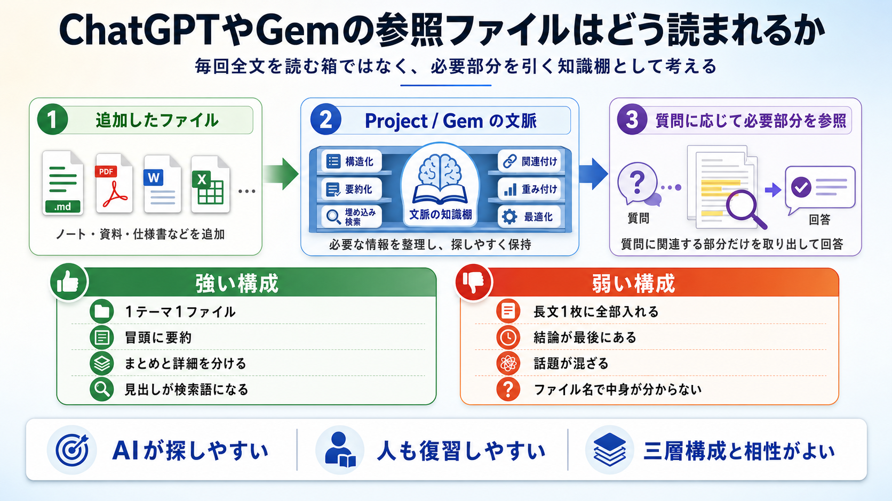

# ChatGPTやGemに追加した参照ファイルの読まれ方

## まず結論

ChatGPTのProjectsやGeminiのGemsに追加した参照ファイルは、`毎回全文を固定で読む資料` というより、`回答時に必要部分を参照する知識束` として使われると考えるのが実務的です。だから知識ファイルは、長大な1枚に詰め込むより、`1テーマ1ファイル` と `冒頭要約` を強くした方が使いやすくなります。

## これは何か

ChatGPT Projects や Gemini Gems に追加したファイルが、回答生成時にどのような文脈として扱われやすいかを整理したトピックです。厳密な内部アルゴリズムの公開範囲と、実務で前提にすべき設計原則を分けて理解するためのメモでもあります。

## どこで使うか

- AIに読ませる前提で、知識ファイルの粒度を決めたいとき。
- 学習ノートや業務ナレッジを、ProjectやGemへ入れる前提で整理したいとき。
- `大きな総合メモ` と `小さな個別メモ` のどちらに寄せるか判断したいとき。
- まとめノートと詳細ノートの役割分担を設計したいとき。

## 全体像

参照ファイルの扱いは、次の3層で考えると整理しやすいです。

1. `文脈として持たれる`
   - ChatGPT Projects では、同じ project 内の会話、files、instructions がまとまった文脈として扱われます。
   - Gemini Gems でも、追加ファイルは task-specific context に近い役割で使われます。
2. `必要部分が使われる`
   - 毎回すべてを均等に読む前提ではなく、質問に応じて関連部分が拾われる前提で考える方が実務に合います。
   - そのため、ファイル名、見出し、冒頭要約が重要になります。
3. `内部仕様は全部は公開されない`
   - どの段落をどう検索するか、どれだけ重みづけるかは公開されていません。
   - だからこそ、こちら側は `探しやすい構造` を作る設計で寄せるのが安全です。

知識ファイル設計へ落とすと、基本方針は次の形になります。

- `1ファイル1テーマ` に寄せる
- ファイル先頭に `これは何か / どこで使うか / 何が分かるか` を置く
- `まとめ` と `詳細` を分ける
- 見出しを検索語になりやすい表現で付ける
- ファイル名だけで中身が推測できるようにする

## 理解用イラスト

この図は、`参照ファイルは全文暗記される箱ではなく、必要部分を引き出す知識棚として扱う` という見方を戻すためのものです。構成設計では、`大きい1枚` より `小さい正本 + 短いまとめ` の組み合わせが向くことを一目で確認できます。

## よくある疑問

### Q. 追加したファイルは、毎回すべて読まれるのか

A. そう考えない方が安全です。実務上は、`与えた文脈の中から関連部分が使われる` 前提で設計する方がズレにくいです。

### Q. では、大きい総合ノート1枚でも問題ないのか

A. 不可能ではありませんが、扱いは不利になりやすいです。話題が混ざるほど、必要部分を拾いにくくなります。

### Q. AI向けなら、人が読むための構成は捨ててよいのか

A. 捨てない方がよいです。`人が復習しやすい構造` と `AIが拾いやすい構造` はかなり重なります。特に、冒頭要約、明確な見出し、トピック分割は両方に効きます。

### Q. ChatGPT Projects と Gemini Gems は同じ仕組みだと見てよいのか

A. 完全に同一とは言えません。ChatGPT Projects の方が公式説明が具体的で、Gemini Gems はやや抽象的です。ただし、`追加ファイルが継続的な文脈として使われる` という理解は共通の出発点にできます。

### Q. 何を先頭に書くと使われやすくなるのか

A. `これは何か` `どこで使うか` `何が分かるか` の3点です。冒頭だけでファイルの役割が分かると、関連づけが起きやすくなります。

## 実務での見方

### 1. 設計の基本単位

- ProjectやGemに入れる単位は `1つの仕事 / 1つの学習テーマ`
- ファイルの単位は `1つの論点`
- まとめファイルは `入口`
- 個別トピックは `正本`

### 2. 強い構成

- `短い分野まとめ`
- `近い論点を束ねる話題まとめ`
- `1テーマ1ファイルの個別トピック`

この形だと、AIは全体像と詳細の両方を拾いやすく、人も更新しやすくなります。

### 3. 避けたい構成

- 1ファイルに複数テーマが混ざる
- 結論が末尾にある
- ファイル名から内容が想像できない
- まとめファイルに詳細まで全部詰め込む

### 4. この学習ラボへの示唆

この学習ラボの `10_分野まとめ.md / 15_話題まとめ / 20_トピック` の三層は、AIに読ませる前提とも相性がよいです。特に、`20_トピック` を正本にして、`10_分野まとめ` は短く保つ設計が有効です。

## 次回の確認

- [ ] 既存ノートを見直すとき、`1ファイル1テーマ` から外れているものを洗い出す。
- [ ] 各トピック冒頭に `これは何か / どこで使うか / 何が分かるか` があるか確認する。
- [ ] まとめファイルが詳細を抱えすぎていないか確認する。

## 関連トピック

- [OpenAIの分野まとめ](../10_分野まとめ.md)
- [この分野の地図](../00_この分野の地図.md)
- [AIエージェントで複数アプローチを比較する使い方](./AIエージェントで複数アプローチを比較する使い方.md)
- [プロンプトを書くなではなくループを設計する](./プロンプトを書くなではなくループを設計する.md)

## 参考リンク

- [Projects in ChatGPT](https://help.openai.com/en/articles/10169521-using-projects-in-chatgpt)
  - ChatGPT Projects で、project 内の会話や files をどのような文脈として扱うかを確認するための公式ヘルプ。
- [Google adds Gemini to Docs, Gmail and more, plus Gems for experts](https://www.theverge.com/news/697352/google-gemini-gems-workspace-apps-docs-gmail)
  - Gems に uploaded files を task-specific context として与える説明を確認するための報道記事。

## 更新履歴

- 2026-06-30: 初版作成。
