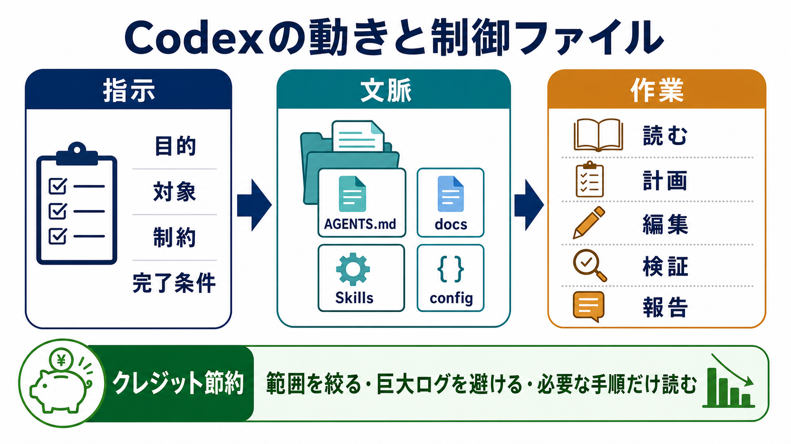

# Codexの動きと制御ファイル

## まず結論

Codexは、最初からプロジェクト内の全ファイルを読むのではなく、依頼文、会話文脈、`AGENTS.md`、指定ファイル、必要に応じて読んだ資料を組み合わせて動きます。

運用で大事なのは、`AGENTS.md` にすべてを書き込むことではありません。`AGENTS.md` は常に守る短いルールに絞り、詳細手順は `docs/`、再利用ワークフローは `Skills`、実行設定は `config`、強制したい安全制御は `hooks` に分けます。

クレジットを抑えるには、Codexに「全部読んで」と頼むのではなく、目的、対象、制約、完了条件、読まなくてよい範囲を先に渡すことが重要です。

## これは何か

このノートは、Codexへ依頼したときに何が起きるのか、どのファイルや設定で動きを制御するのかを復習するためのメモです。

特に、SQL自動生成プロジェクトのように「毎回同じ品質基準で作業してほしい」場面で、`AGENTS.md` と周辺ファイルをどう分けるかを整理します。

## どこで使うか

- Codexに実務作業を任せる前に、依頼文を設計するとき
- `AGENTS.md` に何を書くべきか迷ったとき
- 詳細な作業手順をどこへ置くべきか考えるとき
- クレジット消費を抑えながらCodexを使いたいとき
- SQL生成、レビュー、ドキュメント化などを安定運用したいとき

## 全体像

Codexの動きは、次の3段階で見ると理解しやすいです。

1. 指示を受け取る
   - ユーザーの依頼文
   - 目的
   - 対象
   - 制約
   - 完了条件

2. 文脈を集める
   - `AGENTS.md`
   - 指定されたファイル
   - `README.md` や設定ファイル
   - 詳細手順の `docs/`
   - 必要な `Skills`
   - `config` や権限設定

3. 作業する
   - 読む
   - 計画する
   - 編集する
   - 検証する
   - 報告する

重要なのは、Codexが常に固定順で全ファイルを読むわけではないことです。作業内容、現在のディレクトリ、明示されたファイル、適用されるルールをもとに、必要な情報を段階的に取りに行きます。

## 理解用イラスト

この図は、Codexが `指示 -> 文脈 -> 作業` の順に動き、クレジット節約では読む範囲を絞ることが重要だと思い出すためのものです。



## よくある疑問

### Q. `AGENTS.md` は、Codexにおけるスキル図のようなもの？

A. 近い部分はありますが、同じものではありません。`AGENTS.md` は、そのリポジトリで常に守る基本ルールを置く場所です。複雑な手順や専門ワークフローを全部入れる場所ではありません。

### Q. Codexに作業手順を指示するファイルは `AGENTS.md` だけ？

A. いいえ。役割ごとに分けます。

```text
AGENTS.md
  常に守る短いルール

docs/*.md
  プロジェクト内の詳細手順

Skills / SKILL.md
  複数プロジェクトで再利用する専門ワークフロー

config.toml
  モデル、推論レベル、権限、MCPなどの実行設定

hooks
  コマンド実行前後や編集前後の機械的な制御

プロンプト
  今回だけの条件
```

### Q. `AGENTS.md` には何を書くのがよい？

A. 毎回必ず守ってほしい短いルールを書きます。

例:

- どの言語で回答するか
- テストやlintの実行方法
- 触ってはいけない領域
- セキュリティ上の禁止事項
- 完了時に報告する内容
- 詳細手順ファイルへの案内

長い説明、詳細なチェックリスト、大量のスキーマ情報は、`AGENTS.md` ではなく別ファイルへ分けます。

### Q. SQL自動生成プロジェクトならどう分ける？

A. `AGENTS.md` は司令塔にして、SQL生成に必要な知識は別ファイルに分けます。

```text
AGENTS.md
  SQL生成で常に守るルール
  例: 推測でカラムを作らない、本番更新SQLを出さない

docs/sql-generation-workflow.md
  要件確認、粒度確認、JOIN設計、集計設計の手順

docs/metric-definitions.md
  売上、注文数、CVRなどの指標定義

docs/schema-reference.md
  テーブル、カラム、JOIN関係

docs/sql-style-guide.md
  CTE、命名、日付条件、SELECT句の書き方

docs/validation-checklist.md
  NULL、重複、COUNT DISTINCT、期間境界の確認

examples/
  よい依頼例、よいSQL例、悪いSQL例

prompts/
  人間がCodexへ依頼するときのテンプレート
```

### Q. なぜ全部 `AGENTS.md` に入れないの？

A. `AGENTS.md` は自動で読み込まれる基本ルールなので、長くしすぎると毎回の文脈を圧迫します。詳細手順を分けることで、Codexは必要なときだけ必要なファイルを読みやすくなります。

### Q. クレジット消費を抑えるには何を意識する？

A. 一番効くのは、読む範囲と出力範囲を絞ることです。

- 対象ファイルやフォルダを指定する
- 読まなくてよいものを明示する
- 巨大ログや生成物を避ける
- まず調査だけ、次に実装、のように分ける
- 長い説明が不要なら出力形式を短く指定する
- サブエージェントや高い推論レベルは必要なときだけ使う

## 実務での見方

Codex運用を設計するときは、次の順に考えると安定します。

1. まず、毎回守るルールを決める
   - これは `AGENTS.md` に書く。

2. 次に、作業ごとの詳細手順を分ける
   - これは `docs/` に置く。

3. 複数プロジェクトで再利用する手順を見つける
   - これは `Skills` 化を検討する。

4. 実行環境や権限を安定させる
   - これは `config.toml` や権限設定で扱う。

5. 絶対に守らせたい制約を機械的に確認する
   - これは `hooks` やテストで扱う。

6. 今回だけの条件を渡す
   - これはプロンプトで指定する。

### SQL自動生成での判断軸

SQL生成では、特に次をCodexへ明示します。

- 出力粒度
- 対象期間
- 指標定義
- 使用してよいテーブル
- JOIN時の一意性
- `COUNT` と `COUNT DISTINCT` の使い分け
- NULLと重複の扱い
- 本番更新SQLを出さないこと

このうち、毎回守る方針は `AGENTS.md`、詳細な定義は `docs/metric-definitions.md`、スキーマは `docs/schema-reference.md` に置くと見通しがよくなります。

### 依頼文の型

```text
目的:

対象:

まず読んでほしいもの:

読まなくてよいもの:

やってほしいこと:

触らないでほしいこと:

出力形式:

完了条件:
```

この型にすると、Codexが余計な探索をしにくくなり、結果として手戻りとクレジット消費を抑えやすくなります。

## 次回の確認

- [ ] `AGENTS.md` に書くべき内容と、`docs/` に分けるべき内容を自分で分類できるか
- [ ] SQL自動生成プロジェクトで、指標定義とスキーマ参照を別ファイルに分ける理由を説明できるか
- [ ] Codexのクレジット節約で、まず何を絞るべきか説明できるか
- [ ] `Skills`、`config`、`hooks` の役割を `AGENTS.md` と区別できるか

## 関連トピック

- [APIとMCPとSkillsとToolの関係](./APIとMCPとSkillsとToolの関係.md)
- [ChatGPTとCodexの利用制限](./ChatGPTとCodexの利用制限.md)
- [ChatGPTやGemに追加した参照ファイルの読まれ方](./ChatGPTやGemに追加した参照ファイルの読まれ方.md)

## 参考リンク

- [OpenAI Codex Manual](https://developers.openai.com/codex/codex-manual.md)
  - Codexの公式マニュアル。料金、Fast mode、サブエージェント、`AGENTS.md` などの仕様確認に使う。

## 更新履歴

- 2026-07-25: 初版作成
