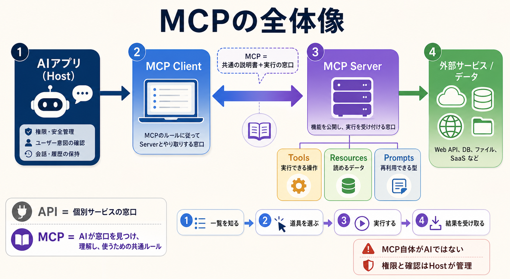

# MCPの仕組みと原文メッセージ

## まず結論

MCP（Model Context Protocol）は、AIアプリが外部のデータや機能を共通の形式で見つけ、理解し、呼び出すためのオープンな通信ルールです。
動画の「すごい説明書」という比喩は入口として分かりやすいですが、実際のMCPは `説明を受け取る` だけでなく、`接続する -> 一覧を取得する -> 実行する -> 結果を受け取る` までを含みます。

## これは何か

AIアプリと外部サービスの間にある接続方法を、サービスごとの個別実装から共通プロトコルへ寄せる仕組みです。
AIアプリはMCP Serverから、使える操作、読めるデータ、再利用できるプロンプトなどを構造化された形で受け取ります。

## どこで使うか

- ChatGPTやCodexなどから、ファイル、データベース、SaaS、社内システムを使いたいとき
- `APIとMCPは何が違うのか` を整理したいとき
- MCP Server、MCP Client、Hostの役割を見分けたいとき
- MCPのJSONを見て、AIと外部ツールの間で何が送受信されているか理解したいとき

## 全体像

MCPの登場人物は、次の4つに分けると理解しやすくなります。

1. `MCP Host`
   - ユーザーが操作するAIアプリです。
   - LLM、権限、ユーザー確認、会話、複数Serverの調整を管理します。
2. `MCP Client`
   - Hostの中で、特定のMCP Serverとの接続を担当します。
   - 原則として、1つのClientが1つのServerとの接続を維持します。
3. `MCP Server`
   - 外部のデータや機能を、MCPの形式で公開するプログラムです。
   - ローカルPC上でも、インターネット上でも動かせます。
4. `外部サービス / データ`
   - Web API、データベース、ファイル、SaaSなど、実際の情報や処理がある場所です。

基本の流れ:

1. ClientとServerが接続し、対応する仕様と能力を確認する
2. Clientが、使えるTools・Resources・Promptsの一覧を取得する
3. Hostがユーザーの依頼に必要な機能を判断する
4. ClientがServerへ実行要求またはデータ取得要求を送る
5. Serverが外部サービスを使い、結果をClientへ返す
6. Hostが結果をLLMやユーザーへ渡す

MCP Serverが公開する代表的な3要素:

| 要素 | 役割 | 例 |
| --- | --- | --- |
| `Tools` | 実行できる操作 | メール送信、検索、SQL実行 |
| `Resources` | 読み取れるデータ | ファイル、DBレコード、APIレスポンス |
| `Prompts` | 再利用できる対話テンプレート | コードレビュー、調査、要約の型 |

## 理解用イラスト

この図では、Host、Client、Server、外部サービスの位置関係と、`一覧を知る -> 道具を選ぶ -> 実行する -> 結果を受け取る` の流れを一度に確認できます。
MCPはAIそのものではなく、AIと道具の間の共通ルールだと見分けるための図です。



## 動画の「すごい説明書」を正確に言い直す

動画では、従来のAPIドキュメントをAIに大量に読ませる負担と比べて、MCPを「AI向けのすごい説明書」「予備校」のように表現しています。
この比喩は、MCP ServerがToolの名前、説明、入力形式を機械可読な形で返す点をつかむのに役立ちます。

ただし、次のように補うとより正確です。

- MCPは静的な説明書ファイルだけではない
- 説明の一覧取得、機能の呼び出し、結果の返却、能力の確認などを含む通信プロトコル
- MCP Server自体にAIが入っているとは限らない
- Serverの裏側では、既存API、DB、ファイル操作などを利用できる
- どのToolを選ぶか、実行前に確認するかは、主にHostとLLMの役割

つまり、短く言えば `MCP = AI向けに形式をそろえた、説明書付きの共通実行窓口` です。

## MCPの原文を見てみる

以下は、MCPの通信で実際に使われるJSONの形を理解するための簡略例です。
公式仕様の構造に沿っていますが、読みやすいように項目と値を絞っています。

### 1. 最初に接続条件を確認する: `initialize`

ClientからServerへ、対応するMCPバージョンとClientの情報を送ります。

```json
{
  "jsonrpc": "2.0",
  "id": 1,
  "method": "initialize",
  "params": {
    "protocolVersion": "2025-11-25",
    "capabilities": {},
    "clientInfo": {
      "name": "example-client",
      "version": "1.0.0"
    }
  }
}
```

Serverは、利用できる機能を返します。

```json
{
  "jsonrpc": "2.0",
  "id": 1,
  "result": {
    "protocolVersion": "2025-11-25",
    "capabilities": {
      "tools": {
        "listChanged": true
      },
      "resources": {}
    },
    "serverInfo": {
      "name": "example-server",
      "version": "1.0.0"
    }
  }
}
```

ここで見るポイント:

- `jsonrpc`: MCPがJSON-RPC 2.0形式を使うことを示す
- `id`: 要求と応答を対応付ける番号
- `method`: 何を依頼しているか
- `protocolVersion`: 使用するMCP仕様の版
- `capabilities`: ClientまたはServerが何に対応しているか

### 2. 何ができるか聞く: `tools/list`

Clientは、Serverが公開しているTool一覧を要求します。

```json
{
  "jsonrpc": "2.0",
  "id": 2,
  "method": "tools/list",
  "params": {}
}
```

Serverは、Toolの名前、説明、入力形式を返します。

```json
{
  "jsonrpc": "2.0",
  "id": 2,
  "result": {
    "tools": [
      {
        "name": "get_weather",
        "description": "Get current weather for a location",
        "inputSchema": {
          "type": "object",
          "properties": {
            "location": {
              "type": "string",
              "description": "City name"
            }
          },
          "required": ["location"]
        }
      }
    ]
  }
}
```

これが動画でいう「説明書」に近い部分です。
AIは `get_weather` というToolがあり、`location` という文字列が必須だと構造から理解できます。

### 3. Toolを実行する: `tools/call`

必要なToolが決まったら、Clientが名前と引数を送ります。

```json
{
  "jsonrpc": "2.0",
  "id": 3,
  "method": "tools/call",
  "params": {
    "name": "get_weather",
    "arguments": {
      "location": "Tokyo"
    }
  }
}
```

Serverは実行結果を返します。

```json
{
  "jsonrpc": "2.0",
  "id": 3,
  "result": {
    "content": [
      {
        "type": "text",
        "text": "Tokyo: 30°C, partly cloudy"
      }
    ],
    "isError": false
  }
}
```

原文を読む最短ルール:

- `method` を見れば、何をしている通信か分かる
- `params` は要求側から渡す入力
- `result` は成功時の返り値
- `error` は通信形式や未対応メソッドなどのプロトコルエラー
- `isError: true` はToolの実行自体が失敗したことを表す

## APIとMCPの違い

MCPはAPIの代替というより、AIがAPIやデータを共通の流儀で利用するための上位の接続ルールとして捉えると分かりやすくなります。

| 観点 | API | MCP |
| --- | --- | --- |
| 主な目的 | システム同士が機能やデータをやり取りする | AIアプリが外部の機能や文脈を共通形式で扱う |
| 仕様 | サービスごとに異なる | Host・Client・Server間の基本形式を共通化する |
| 説明の取得 | ドキュメントやOpenAPIなど方式が分かれる | `tools/list` などで機械可読な定義を取得する |
| 実行 | 個別APIの仕様で呼ぶ | `tools/call` などMCPの形式でServerへ依頼する |
| 裏側 | サービスの機能本体 | ServerがAPI、DB、ファイルなどを利用できる |

`API = 個別サービスの窓口`、`MCP = AIが窓口を発見し、理解し、使うための共通受付` と置くと整理しやすくなります。

## Tool SearchはMCPそのものか

動画では、Tool定義が増えてコンテキストを圧迫する問題への対策としてTool Searchが紹介されています。
この問題意識は重要ですが、2026-07-26時点の安定版MCP仕様 `2025-11-25` では、Tool SearchはMCPの中核メソッドとして定義されていません。

- MCP仕様が定める基本: `tools/list` でTool一覧を取得し、`tools/call` で呼び出す
- Tool Search: Hostやモデル提供側が、多数のToolから必要な定義だけを動的に読み込む仕組み
- 両者の関係: Tool SearchはMCP由来のTool群にも利用できるが、MCPプロトコルそのものとは分けて考える

仕様と製品機能は変化が速いため、MCP本体の仕様と、各AIサービスが追加する最適化機能を混同しないことが大切です。

## よくある疑問

### Q. MCP Serverは別のAIなのか

A. 必ずしもAIではありません。多くの場合は、決められたMCPメッセージを処理し、API、DB、ファイルなどへつなぐ通常のプログラムです。

### Q. MCPがあればAPIドキュメントは不要になるのか

A. いいえ。MCP Serverを作る側は、接続先APIの仕様を理解する必要があります。利用するAI側が、サービスごとのAPI仕様を毎回直接扱わずに済むのが利点です。

### Q. Tools、Resources、Promptsは何が違うのか

A. `Tools` は操作、`Resources` はデータ、`Prompts` は再利用する対話の型です。実行する、読む、呼び出して使う、という違いがあります。

### Q. MCPをつなぐとAIが自由に何でも実行するのか

A. そうとは限りません。実際の権限、ユーザー確認、認証、許可範囲はHostやServerの実装で管理します。MCP接続の有無と、実行許可の有無は別です。

### Q. ローカルMCPとリモートMCPは何が違うのか

A. Serverが動く場所と主な通信方法が違います。ローカルでは標準入出力を使う `stdio`、リモートでは `Streamable HTTP` が代表的です。公開範囲、認証、運用責任も変わります。

## 実務での見方

- 導入前に `どのServerを信頼するか` を確認する
- 公開されるToolsと入力内容を確認する
- 読み取りと更新・送信・削除を分けて権限設計する
- 秘密情報をTool引数やログへ不用意に含めない
- 重要な変更操作はユーザー確認を挟む
- Toolが多い場合は、定義の遅延読み込みや検索などHost側の最適化も検討する
- 仕様の説明では、安定版MCPと製品固有機能を分けて記録する

## 次回の確認

- [ ] Host、Client、Serverの違いを説明できるか
- [ ] `tools/list` と `tools/call` の役割を原文JSONから読み取れるか
- [ ] MCPはAPIを置き換えるのではなく、APIなどをAI向けに共通化する層だと説明できるか
- [ ] MCP本体の仕様とTool Searchのような製品側機能を分けられるか
- [ ] 接続できることと、実行を許可することを分けて考えられるか

## 関連トピック

- [APIとMCPとSkillsとToolの関係](./APIとMCPとSkillsとToolの関係.md)
- [Codexの動きと制御ファイル](./Codexの動きと制御ファイル.md)

## 参考リンク

- [動画「最新技術MCPの正体は、『すごい説明書』でした。」](https://www.youtube.com/watch?v=RTMH7X8BNvg)
  - MCPを「AI向けの説明書」や「予備校」と捉える直感をつかむための出発点。
- [MCP公式: MCPとは何か](https://modelcontextprotocol.io/docs/getting-started/intro)
  - MCPの目的と、外部システムへつなぐ共通規格という基本定義を確認する。
- [MCP公式: Architecture overview](https://modelcontextprotocol.io/docs/learn/architecture)
  - Host、Client、Server、データ層、通信層の役割を確認する。
- [MCP公式仕様: Lifecycle 2025-11-25](https://modelcontextprotocol.io/specification/2025-11-25/basic/lifecycle)
  - `initialize`、能力交渉、接続中のルールを確認する。
- [MCP公式仕様: Tools 2025-11-25](https://modelcontextprotocol.io/specification/2025-11-25/server/tools)
  - `tools/list`、Tool定義、`tools/call`、結果、エラー、安全上の要件を確認する。
- [Anthropic: Tool search tool](https://platform.claude.com/docs/en/agents-and-tools/tool-use/tool-search-tool)
  - 多数のTool定義を必要時だけ読み込む製品側の最適化と、MCP連携との関係を確認する。

## 更新履歴

- 2026-07-26: 動画の内容と安定版MCP公式仕様を照合し、原文JSON例と図解を含む初版を作成。
