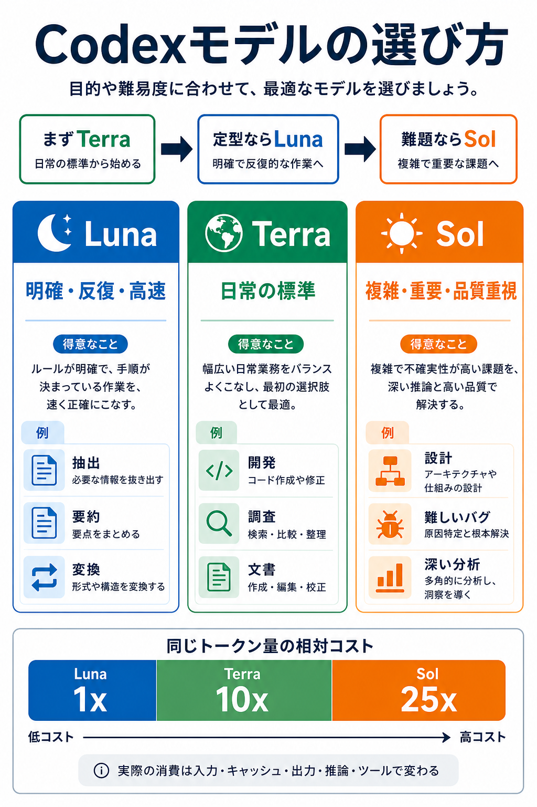
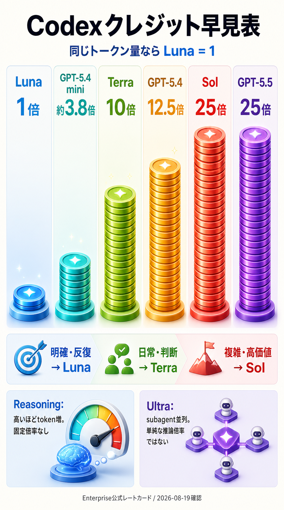
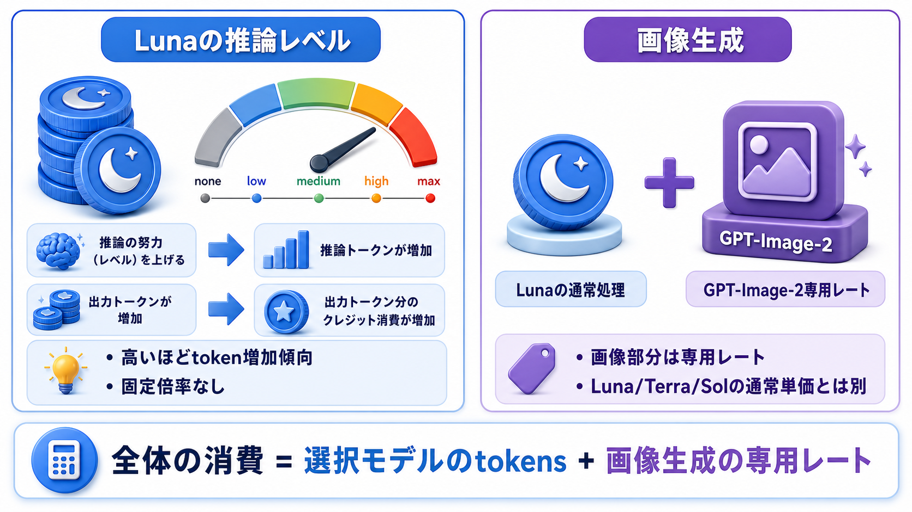

# Codexモデル選択とクレジット早見表

確認日: 2026-08-22（JST）
対象: ChatGPTサインインのCodexと、トークンベース・クレジットレートカード

> [!IMPORTANT]
> 一部のEnterprise契約は、移行が完了するまで旧レートカードが適用されます。実際の請求・残高はワークスペースのUsage Dashboardと契約条件を優先してください。

## まず結論・早見表

同じ量の非キャッシュInput、Cached Input、Outputを使うなら、日常の定型作業は **GPT-5.6 Lunaが最も低コスト**です。

**Lunaを1とした概算:**

`Luna 1 : GPT-5.4 mini 約3.8 : Terra 10 : GPT-5.4 12.5 : Sol 25 : GPT-5.5 25`

GPT-5.4 miniのOutput単価だけは公式表で端数が113 creditsに丸められているため、厳密な倍率はトークン構成でわずかに変わります。それ以外はInput、Cached Input、Outputの全区分で同じ倍率です。

| モデル名 | Input / 100万tokens | Cached Input / 100万tokens | Output / 100万tokens | Luna比 | Sol比 | 主な用途 |
|---|---:|---:|---:|---:|---:|---|
| GPT-5.6 Luna (`gpt-5.6-luna`) | 5 credits | 0.5 credits | 30 credits | **1.0倍** | 0.04倍 | 明確で反復可能な処理、抽出、分類、変換、定型要約、狭い範囲の実装 |
| GPT-5.4 mini (`gpt-5.4-mini`) | 18.75 | 1.875 | 113 | 約3.8倍 | 約0.15倍 | 軽量なコーディング、応答速度重視、subagent。2026-08-31にChatGPTサインインのCodexから退役予定 |
| GPT-5.6 Terra (`gpt-5.6-terra`) | 50 | 5 | 300 | **10倍** | 0.4倍 | 日常の実装、調査、文書分析、レポート、十分な判断力が必要な作業 |
| GPT-5.4 (`gpt-5.4`) | 62.5 | 6.25 | 375 | **12.5倍** | 0.5倍 | 従来の複雑な専門作業。2026-08-31にChatGPTサインインのCodexから退役予定 |
| GPT-5.6 Sol (`gpt-5.6-sol`) | 125 | 12.5 | 750 | **25倍** | **1.0倍** | 曖昧で難しい問題、複雑なコード変更、深い調査、高価値な判断、仕上げ品質重視 |
| GPT-5.5 (`gpt-5.5`) | 125 | 12.5 | 750 | **25倍** | **1.0倍** | 前世代の高性能モデル。複雑なコーディング、computer use、研究、知識労働 |

選び方の目安:

- 仕様と完了条件が明確なら、まずLuna。
- Lunaで品質が足りない日常作業はTerra。
- 曖昧さ、失敗コスト、仕上げ品質が重要ならSol。
- GPT-5.4 / 5.4 miniは退役が近いため、新規の標準設定にはしない。

## これは何か

Codexのモデル選択が、品質・速度・クレジット消費にどう効くかを整理するノートです。ChatGPTサインイン時の推奨モデルと、トークンベースのクレジットレートカードを分けて理解します。

ここでいう「クレジット」はAPIの米ドル料金ではありません。ChatGPT WorkとCodexで共有する、Enterpriseの利用量管理単位です。APIキーでCodexを使う場合は、この表ではなくOpenAI APIの料金が適用されます。

## どこで使うか

- CodexのモデルをLuna、Terra、Solから選ぶとき
- reasoning effortを上げる前に、追加コストの考え方を確認するとき
- subagent、Ultra、画像生成、Web Searchを使う前に消費要因を整理するとき
- EnterpriseのUsage Dashboardで消費が増えた理由を切り分けるとき

## 全体像

クレジット消費は、単純な「1メッセージ何credit」ではなく、主に次の合計で決まります。

1. モデルごとの非キャッシュInput
2. Cached Input
3. 可視Outputとreasoning tokensを含むOutput
4. 画像生成など、別レートが明示された機能
5. FastやUltra/subagentなどによって増える倍率・実行回数・トークン量

## モデルの性能差と選択フロー

公式の位置づけは、単純な「賢さの順位」ではなく、品質・速度・コストのバランスです。

| 判断 | 選ぶモデル | 理由 |
|---|---|---|
| 仕様が明確で、定型的・反復的 | GPT-5.6 Luna | 低コスト・高速。抽出、分類、変換、定型要約向け |
| 迷ったとき、日常の開発・調査 | GPT-5.6 Terra | 推論・ツール利用・費用のバランスがよい |
| 曖昧、複雑、失敗コストが高い | GPT-5.6 Sol | 深い分析、設計、難しいコード変更、仕上げ品質向け |

### 実務での基本手順

1. まずTerraで、課題の難しさと必要な品質を見積もる。
2. 完了条件が明確な反復作業はLunaへ寄せる。
3. 曖昧さ、複数のトレードオフ、失敗時の影響が大きい場合はSolへ上げる。
4. モデルを上げる前に、対象範囲・完了条件・検証方法を明確にする。
5. 実際のUsage表示で、品質向上が消費増に見合ったか確認する。

Reasoning effortを上げると、一般に考える時間とトークン量が増えますが、effortごとの固定クレジット倍率は公開されていません。Ultraは単一モデルの固定倍率ではなく、複数のsubagentへ分割するため、分割効果がある大きな作業に限定します。

## 理解用イラスト



図は、Luna・Terra・Solの使い分けを、作業の明確さ・品質要求・クレジット消費の3軸でまとめたものです。

従来の単価比較を詳しく確認したい場合は、次の補助図を参照します。





この補足図は、「Lunaの推論レベル」と「画像生成」を別の消費経路として整理したものです。

## モデルごとの公式レートと使いどころ

### 現在の主要モデル

2026-08-19時点で、ChatGPTサインインのCodexで公式ドキュメントが主要モデルとして案内しているのは、GPT-5.6 Sol / Terra / Luna、GPT-5.5、GPT-5.4、GPT-5.4 miniです。

- GPT-5.6 Sol: 能力優先。複雑でオープンエンドな作業。
- GPT-5.6 Terra: 能力とコストのバランス。日常業務の第一候補。
- GPT-5.6 Luna: 高速・低コスト。正解条件が明確な高頻度作業。
- GPT-5.5: 前世代の高性能モデル。レートはSolと同じ。
- GPT-5.4 / mini: 現在は選択可能だが、ChatGPTサインインのCodexでは2026-08-31退役予定。

GPT-5.3-Codex-SparkはChatGPT Pro向けresearch previewで、Enterpriseのクレジット比較対象には含めません。GPT-5.4 nanoなどAPIカタログに存在しても、Codexの公式主要選択肢に載っていないモデルも除外しています。

### 「Lunaの何倍か」はなぜ一定なのか

Luna、Terra、Sol、GPT-5.5、GPT-5.4は、Input / Cached Input / Outputの各単価が同じ比率でスケールしています。そのため、同じトークン構成ならタスクの大小にかかわらず倍率は一定です。

| 比較 | Input比 | Cached比 | Output比 | 結論 |
|---|---:|---:|---:|---|
| Luna → Terra | 10倍 | 10倍 | 10倍 | 常に10倍 |
| Luna → GPT-5.4 | 12.5倍 | 12.5倍 | 12.5倍 | 常に12.5倍 |
| Luna → Sol | 25倍 | 25倍 | 25倍 | 常に25倍 |
| Luna → GPT-5.5 | 25倍 | 25倍 | 25倍 | 常に25倍 |
| Luna → GPT-5.4 mini | 3.75倍 | 3.75倍 | 約3.77倍 | 約3.8倍 |

## Reasoning Effortは「固定倍率」ではない

Reasoning effortは、モデルにどれだけ深く考えさせるかの調整値です。高いほど一般にreasoning tokens、応答時間、クレジット消費が増えますが、**公式な固定倍率はありません**。モデルはタスク難度に応じて適応的に考えるため、同じeffortでも使用量は毎回同じではありません。

reasoning tokensは画面上では見えない場合がありますが、公式にはOutput tokensとして課金されます。

| レベル | 何が変わるか | reasoning tokens / クレジットへの影響 | 公式倍率 |
|---|---|---|---|
| `none` | 推論をほぼ使わず、最短時間を優先 | reasoning tokensを抑えやすい。情報取得、分類、単純処理向け | なし |
| `minimal` | 対応モデルで、ごく少量またはゼロに近い推論 | `none`と同様に低消費寄り。全モデル共通ではない | なし |
| `low` | 軽い計画、検索、tool use、複数ステップ判断 | `none`より増える傾向。速度とコスト重視 | なし |
| `medium` | 品質・信頼性・速度のバランス | 複雑な計画や判断に使う標準点。モデルにより既定値が異なる | なし |
| `high` | 難しい推論、デバッグ、深い計画 | より多くのreasoning tokensを使う傾向 | なし |
| `xhigh` | 深い調査、長時間のagentic task | 高遅延・高消費になりやすい。効果を評価できる場合だけ | なし |
| `max` | 1つのagentに最大級の推論時間を与える | 最も難しい単一タスク向け。消費上限の固定比は非公開 | なし |
| `ultra` | Codexのモデルスライダーでは、subagentでタスクを分割・並列化 | 単一agentのeffort倍率ではなく、複数agentの実行量が合算される | なし |

注意点:

- OpenAI APIの`reasoning.effort`公式値は、モデル依存で `none / minimal / low / medium / high / xhigh / max` を含みます。
- CodexのUIでいうUltraは、公式説明ではsubagentを使う複数agent実行です。`highの次の固定倍率`とは扱いません。
- Codexのsubagent設定には、対応モデル向けに`ultra`というeffort指定もあります。UIのUltraオーケストレーションと、個々のsubagentのeffortを混同しないことが重要です。
- GPT-5.6各モデルは `none / low / medium / high / xhigh / max` をサポートします。モデルごとに対応値を確認します。

### Lunaを選んだ場合の実務的な答え

Lunaのレート（Input 5 / Cached Input 0.5 / Output 30 credits per 1M tokens）は、推論レベルを変えても同じです。ただし、`reasoning effort`を上げると内部のreasoning tokensが増える傾向があり、reasoning tokensはOutput tokensとして課金されます。そのため、同じLunaでも `low → medium → high` と上げるほど、通常はクレジット消費が増えます。

OpenAIはeffortごとの固定倍率を公開していません。したがって「highはmediumの2倍」とは計算できません。実際の消費は、タスク難度、ツール利用、再試行、可視Outputの長さを含む実測値で確認します。

`ultra`は単一agentの固定倍率ではありません。Codex / ChatGPT Workでは、最大級の推論に加えてsubagentへ分割・委譲することがあり、親agentと各subagentのtokensが合算されます。

## クレジット計算式

このノートでは、Inputを「非キャッシュInput」として計算します。

```text
消費credits
= 非キャッシュInput tokens ÷ 1,000,000 × Input単価
+ Cached Input tokens ÷ 1,000,000 × Cached Input単価
+ Output tokens ÷ 1,000,000 × Output単価
```

Output tokensには、可視回答だけでなくreasoning tokensも含めて考えます。実際のUsage表示では、製品側の集計・丸めが入る場合があります。

### 指定例: Input 10,000 / Cached 50,000 / Output 5,000

Lunaの計算:

```text
10,000 ÷ 1,000,000 × 5
+ 50,000 ÷ 1,000,000 × 0.5
+ 5,000 ÷ 1,000,000 × 30
= 0.225 credits
```

| モデル | 消費credits | Luna比 | Sol比 |
|---|---:|---:|---:|
| GPT-5.6 Luna | **0.225** | 1.0倍 | 0.04倍 |
| GPT-5.4 mini | **0.84625** | 約3.76倍 | 約0.15倍 |
| GPT-5.6 Terra | **2.25** | 10倍 | 0.4倍 |
| GPT-5.4 | **2.8125** | 12.5倍 | 0.5倍 |
| GPT-5.6 Sol | **5.625** | 25倍 | 1.0倍 |
| GPT-5.5 | **5.625** | 25倍 | 1.0倍 |

## 小・中・大のシミュレーション

想定トークン:

| 規模 | 非キャッシュInput | Cached Input | Output | 例 |
|---|---:|---:|---:|---|
| 小規模 | 2,000 | 5,000 | 1,000 | 小さな修正、短い要約、限定的な調査 |
| 中規模 | 10,000 | 50,000 | 5,000 | 複数ファイルの実装・レビュー、資料調査 |
| 大規模 | 100,000 | 500,000 | 25,000 | 大きなリポジトリ、長い資料、長時間agent task |

| モデル | 小規模 | 中規模 | 大規模 |
|---|---:|---:|---:|
| GPT-5.6 Luna | **0.0425** | **0.225** | **1.5** |
| GPT-5.4 mini | 0.159875 | 0.84625 | 5.6375 |
| GPT-5.6 Terra | 0.425 | 2.25 | 15 |
| GPT-5.4 | 0.53125 | 2.8125 | 18.75 |
| GPT-5.6 Sol | 1.0625 | 5.625 | 37.5 |
| GPT-5.5 | 1.0625 | 5.625 | 37.5 |

この表はモデル差だけを見る理論値です。実タスクではモデルやeffortによってreasoning tokens、tool回数、再試行、出力量が変わるため、「同じタスク」でもトークン数自体は一致しません。

## その他の機能は直接課金か、間接増加か

| 機能 | EnterpriseのChatGPT creditsでの扱い | 主な増加要因 |
|---|---|---|
| 通常のAgent実行 | 独立した固定agent料金は公開されていない | モデルのInput / Cached / Output、tool結果、reasoning tokens |
| subagent | 独立した固定subagent料金は公開されていない | 各subagentのモデル実行量が追加され、合計tokensが増える |
| Ultra | 固定倍率なし。Codexではsubagent並列実行 | 親agentと複数subagentの実行量が合算されやすい |
| 画像生成 | **専用の直接レートあり** | GPT-Image-2のtext / image tokens。通常ターンよりincluded limitsを平均3〜5倍速く使うとの案内あり |
| Web Search | Codex用レートカードに独立したcredit/call単価は掲載されていない | 検索クエリ・取得結果がコンテキストへ入り、Input tokensや後続出力が増える。APIキー利用時はAPI側のtool料金を別途確認 |
| MCP / Connector | OpenAIの独立固定credit単価は掲載されていない | tool定義とtool結果がInput contextを増やす。外部サービス側の料金は別途あり得る |
| Tool利用全般 | toolごとの固定credit単価は公開表にないものが多い | tool call、結果、再計画、追加推論によるtoken増加 |
| Computer Use / Browser | Codex creditの独立単価は公開表にない | 画面状態、操作ループ、検証の反復でtokenとturnが増える。APIキー時はAPI料金体系を確認 |
| Hosted shell / Code Interpreter | Codex creditの独立単価は公開表にない | 実行結果がcontextへ入り、agentの追加推論が発生。APIキー時はcontainer料金があり得る |
| Fast mode | **公式倍率あり** | GPT-5.6 / 5.5はStandardの2.5倍、GPT-5.4は2倍のcredits。速度は約1.5倍 |
| ChatGPT Voice in Desktop | credit-based Enterpriseでは約6 credits/分 | 音声会話の別枠。Voiceから開始したCodexタスクはCodex usageも消費 |

### 画像生成の公式レート

| GPT-Image-2 | Input / 100万tokens | Cached Input / 100万tokens | Output / 100万tokens |
|---|---:|---:|---:|
| Image tokens | 200 credits | 50 credits | 750 credits |
| Text tokens | 125 credits | 31.25 credits | 250 credits |

画像1枚あたりの固定creditではなく、品質・サイズ・text/image token量で変わります。

画像生成を使うときは、選択中のLuna/Terra/Solの通常レートと、GPT-Image-2の専用レートを分けて考えます。

```text
全体の消費
= 選択モデル（Lunaなど）のInput / Cached Input / Output / reasoning tokens
+ GPT-Image-2の画像生成用text / image tokens
```

したがって、画像生成部分はLunaのOutput 30 credits / 1M tokensではなく、GPT-Image-2の専用レートです。一方、画像生成を指示・調整するCodexの通常処理は、選択したLunaのtokensとして計上されます。画像生成を使ったターン全体が「モデルに関係なく同じ固定credit」になるわけではありません。

OpenAI公式では、画像生成は通常のターンよりincluded usageを平均3〜5倍速く消費し、included limit到達後はcreditsを使うと説明しています。Enterpriseの一部ワークスペースは旧レートカードの場合があるため、最終確認はUsage dashboardまたはCodexの`/status`で行います。

## ChatGPT EnterpriseとCodexの違い

最重要点は、**ChatGPT WorkとCodexはusageを共有する**ことです。

| 利用場面 | 考え方 |
|---|---|
| ChatGPT Work上でLuna | Codexと同じChatGPT credits、同じレート、同じusage limitsを共有 |
| Codex上でLuna | 同じ共有枠から、LunaのInput / Cached / Outputレートで消費 |
| ChatGPT Work上で画像生成 | Work/Codex共有usageの対象。画像生成レートまたはincluded limitsを消費 |
| Codex上で画像生成 | 同じgeneral usage limitsの対象。上限後はcreditsを消費 |
| 通常のChatGPTチャット | Codex/Workのレートカードをそのまま適用できるとは限らない。機能別上限・契約条件を確認 |
| APIキーでCodex / 画像生成 | ChatGPT creditsではなく、OpenAI APIの米ドル建てtoken・tool・image料金 |

「ChatGPT内だから無料」「Codexだから別財布」ではありません。ChatGPT内でも**Workとして実行するagent task**はCodexと共有です。一方、通常チャットの全機能が同じレートカードだと一般化しないようにします。

## 実務での見方

### 日常利用の推奨ルール

1. 仕様が明確な定型処理はLuna + lowまたはmediumから始める。
2. 判断や複数toolの連携が必要ならTerraへ上げる。
3. 曖昧・高価値・失敗コストが高いときだけSolを選ぶ。
4. effortはモデル変更より先に上げ続けず、low / mediumで実測する。
5. MaxとUltraは常用せず、難題または分割効果があるタスクに限定する。
6. Usage Dashboardで実タスクのInput / Cached / Outputとcreditsを定期確認する。

### Lunaを日常利用するときの注意

- Lunaの単価はSolの1/25なので、反復処理の費用差は大きい。
- ただし、品質不足で再試行が25倍近く増えるならSolとの差は縮む。
- プロンプト、対象ファイル、完了条件を狭くすると、Lunaの強みが出やすい。
- 長いAGENTS.md、多数のMCP server、大きなtool結果はLunaでもInputを増やす。

## 公式確認値と推定・参考値の分離

### 公式に確認できた値

- 6モデルの100万tokensあたりのEnterprise credits
- reasoning tokensがOutput tokensとして課金されること
- effortが高いほど一般にtoken使用量が増えること
- effort間に公開された固定倍率がないこと
- UltraがCodexではsubagentを使うこと
- Fast modeの2.5倍 / 2倍credit倍率
- Codex画像生成がgeneral usage limitsを平均3〜5倍速く使う目安
- GPT-Image-2のtext / image tokenレート
- ChatGPT WorkとCodexがpricing、credits、usage limitsを共有すること

### 推定・参考値

- Luna比 / Sol比は公式レートカードからの算術計算
- 小・中・大のtoken量は比較用の仮定
- シミュレーション値は、仮定token数 × 公式単価の計算値
- 実タスクのtotal creditsはreasoning、tool、再試行、context、丸めで変動

## よくある疑問

### Q. どのモデルを標準にすればよい？

迷ったらTerraです。Lunaは明確な定型作業、Solは難しく重要な作業に使い分けます。

### Q. SolはTerraより常に良い？

複雑な課題では有利ですが、明確な変換や抽出ではSolの能力が余り、コストと待ち時間が増える場合があります。必要な品質を満たす最も低いモデルを選びます。

### Q. Lunaで失敗したら、すぐSolに変えるべき？

まず、対象範囲、入力資料、完了条件、検証方法を明確にします。それでも判断や設計が難しい場合にTerra、Solへ上げるのが効率的です。

### Q. highはmediumの2倍？

いいえ。OpenAIはeffortごとの固定倍率を公開していません。タスク難度に応じてreasoning tokensが適応的に変わります。

### Q. Output 5,000 tokensにreasoning tokensは含む？

このシミュレーションでは含む前提です。実際には可視Outputとreasoning tokensを合わせた課金対象Outputで比較してください。

### Q. Ultraはmaxよりさらに深く考えるだけ？

Codex UIのUltraは違います。公式説明ではsubagentを使って複雑な仕事を分割・並列化するモードです。単一agentの固定倍率ではありません。

### Q. Web Searchを1回使うと何credits？

EnterpriseのCodex向け公開レートカードには、独立したcredit/call単価がありません。検索結果がInput contextへ加わる間接増加として捉え、APIキー利用時はAPI tool料金を別に確認します。

### Q. Lunaなら常に最安？

同一トークン量なら最安です。ただし、品質不足による長文化、再試行、tool loop増加まで含めると、タスク全体で必ず最安とは限りません。

## 参考リンク

2026-08-22に確認。OpenAIの仕様は更新されるため、利用時はUsage画面と公式ページを優先します。

- [Codex rate card](https://help.openai.com/en/articles/20001106-codex-rate-card) — モデル別のInput、Cached Input、Outputクレジットを確認。
- [Codex Models](https://developers.openai.com/codex/models) — Sol、Terra、Lunaの推奨用途、Reasoning effort、Ultraを確認。
- [Using Codex with your ChatGPT plan](https://help.openai.com/en/articles/11369540) — プラン、Usage Dashboard、共有クレジットの考え方を確認。
- [GPT-5.3-Codex Model](https://developers.openai.com/api/docs/models/gpt-5.3-codex) — APIでの旧Codexモデルの仕様を確認。
- [Reasoning models](https://developers.openai.com/api/docs/guides/reasoning) — effortの意味、対応レベル、reasoning tokensの課金方法を確認。
- [Codex Speed](https://learn.chatgpt.com/docs/agent-configuration/speed) — Fast modeの速度とcredit倍率を確認。
- [Codex Subagents](https://learn.chatgpt.com/docs/agent-configuration/subagents) — subagentのreasoning effortと高effort時のtoken増加を確認。
- [OpenAI API Pricing](https://platform.openai.com/pricing) — APIキー利用時のtoken、tool、image料金との差を確認。

## 更新履歴

- 2026-08-19: Enterpriseの新token-based credit rate cardを基に初版作成。
