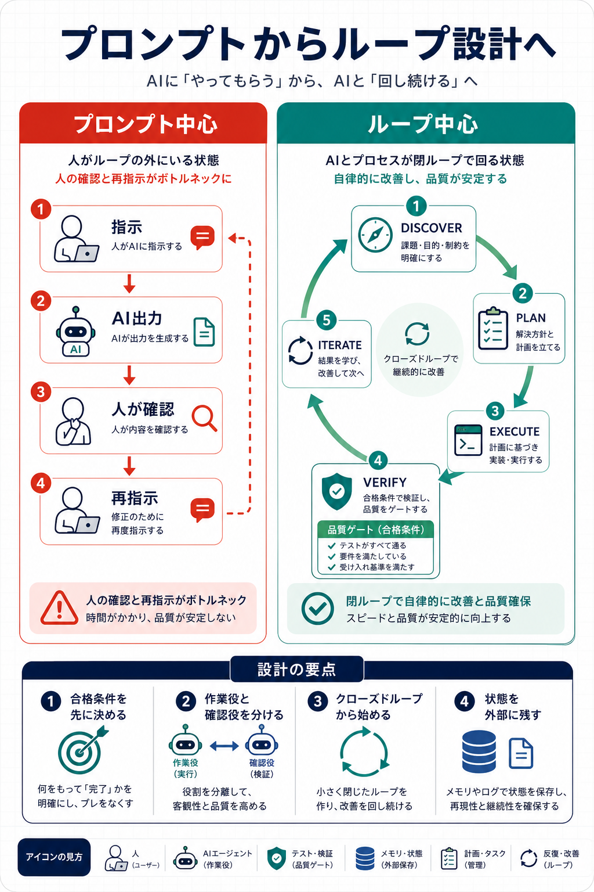

# まず結論

AI 活用の設計は、`うまいプロンプトを書くこと` から `AI が自走して改善し続けるループを設計すること` に重心が移っている。

特にコーディングエージェントでは、単発の指示よりも `発見 -> 計画 -> 実行 -> 検証 -> 修正` を回す仕組みの方が、品質と再現性を作りやすい。

## これは何か

これは、AI エージェントを 1 回呼び出して終わる道具ではなく、ゴールに向かって自分で試行錯誤させる運用設計の考え方。

記事の芯はシンプルで、強い成果を出す人は `プロンプトそのもの` より `どの条件で回し、どこで止め、何で合格判定するか` を設計している、ということにある。

## どこで使うか

- コード修正をテスト通過まで自動で回したいとき
- 調査結果をソース照合つきでまとめたいとき
- 下書きとレビューを分けて品質を上げたいとき
- 営業文面や運用文面を、基準に沿って繰り返し改善したいとき

## 全体像

ループエンジニアリングは、AI に自由に考えさせることより、`良い試行錯誤の枠` を与えることに近い。

基本骨格は次の 5 段階で理解すると分かりやすい。

1. `DISCOVER`
   問題、制約、周辺情報を集める。
2. `PLAN`
   何をどう進めるかを分解する。
3. `EXECUTE`
   実際に変更、調査、生成を行う。
4. `VERIFY`
   テスト、レビュー、根拠照合、品質基準で確認する。
5. `ITERATE`
   検証で落ちた理由をもとに修正して回し直す。

重要なのは、`実行` ではなく `検証` が中に入っていること。
これがないと、AI はただ速く出力するだけの装置になりやすい。

## 理解用イラスト

図では、プロンプト中心の使い方と、ループ中心の使い方の違いを並べて理解すると覚えやすい。

## よくある疑問

### Q. 何が「プロンプト時代」と違うのか

A. 違いは、AI に何を言うかではなく、`AI の出力をどう扱う仕組みにするか` にある。  
以前は `人間が毎回確認して次の指示を書く` ことが中心だったが、ループ設計ではその確認工程の一部を仕組みに埋め込む。

### Q. なぜループの方が強いのか

A. 単発出力は当たり外れが大きい。  
一方でループは、`失敗しても検証で落とし、修正して再実行できる` ので、品質を偶然ではなく工程で作りやすい。

### Q. まずオープンループで自由に回した方がよいのか

A. 最初はクローズドループの方がよい。  
ゴール、手順、評価基準、終了条件を人間が先に置いた方が、品質とコストを管理しやすい。

### Q. AI が賢ければ、自動で全部うまくやるのでは

A. そこが誤解されやすい点。  
実際には `誰が何を見るか` `どこで止めるか` `何を合格とするか` を設計しないと、速いだけで雑なアウトプットが増えやすい。

### Q. ループを書く人の役割は何か

A. 人間の役割は減るのではなく上に上がる。  
細かい入力を毎回書く代わりに、`目標設計` `検証設計` `役割分担` `失敗時の戻し方` を決める役割が強くなる。

## 実務での見方

### 1. 良いループは「出力」ではなく「合格条件」から作る

最初に決めるべきは、何を書かせるかよりも `何を満たしたら完了か`。

例:

- コーディングなら `テスト通過` `lint 通過` `差分サマリー生成`
- リサーチなら `複数ソース一致` `矛盾点の整理` `信頼度しきい値`
- コンテンツなら `レビュー合格` `スコア閾値超え`

### 2. 1体で回すか、役割分担するかを分けて考える

小さい仕事は 1 体でも回せるが、品質を上げたいなら `作る役` と `確認する役` を分けた方がよい。

- シングルエージェントループ:
  小さく速い。個人作業向き。
- フリートループ:
  調査、開発、QA を分担できる。大きな仕事向き。

### 3. VERIFY が弱いループは危ない

ループの中で最も重要なのは VERIFY。

- テストがない
- 根拠確認がない
- レビュー担当がいない
- 終了条件が曖昧

この状態だと、AI は何周しても精度より勢いが勝ちやすい。

### 4. オープンにするほど、コスト管理が重要になる

探索範囲が広いループは強力だが、トークン消費が急増しやすい。

そのため実務では、まず次を明示したクローズドループから始めるのが安全。

- 何を探すか
- 何手まで試すか
- どのテストで止めるか
- 失敗時にどこへ戻るか

### 5. ループを支える部品を先に揃えると安定する

記事で重要とされていた部品は次の 6 つ。

1. `Automation`
   ループを起動する仕組み。
2. `Worktrees`
   並列作業の衝突防止。
3. `Skills`
   VISION、ARCHITECTURE、RULES などの前提知識。
4. `Plugins / Connectors`
   外部ツール接続。
5. `Subagents`
   作業役と検証役の分離。
6. `Memory`
   試行結果と状態の保存。

## 再利用チェックリスト

- [ ] ゴールが 1 文で言える
- [ ] 完了条件がテストや基準で言える
- [ ] 失敗時の戻り先が決まっている
- [ ] 作業役と確認役を分ける必要があるか判断した
- [ ] コスト上限か試行回数上限を決めた
- [ ] 状態を残す場所を決めた

## 次回の確認

- `良いプロンプト` と `良いループ` の違いを 1 文で説明できるか
- 自分の AI 作業で、いま人間が手で回しているループはどこか見つけられるか
- 次に試すなら、どの作業を `DISCOVER -> PLAN -> EXECUTE -> VERIFY -> ITERATE` に置き換えるか

## 関連トピック

- [OpenAIの分野まとめ](../10_分野まとめ.md)
- [この分野の地図](../00_この分野の地図.md)
- [AIエージェントで複数アプローチを比較する使い方](./AIエージェントで複数アプローチを比較する使い方.md)

