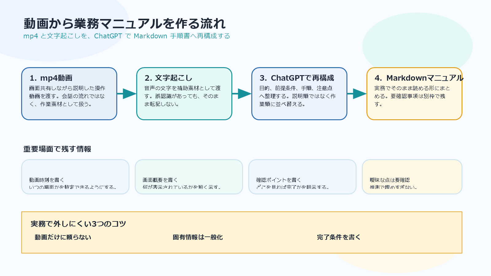

# 動画から業務マニュアルを起こすプロンプト設計

## まず結論

業務説明の mp4 動画は、そのまま読む素材ではなく、`作業の目的` `実際の操作順` `確認ポイント` に分解してからマニュアルへ再構成させると使いやすくなります。静止画がなくても、重要場面を `動画時刻` `画面概要` `確認ポイント` で置き換えれば、実務向けの Markdown 手順書を十分作れます。

## これは何か

ChatGPT に `操作説明動画 + 必要なら文字起こし` を渡して、業務マニュアルの Markdown を作らせるときの指示設計を整理したメモです。説明の順番をそのまま写すのではなく、実際に作業する人が迷わない順番へ並べ替えることを主眼にします。

## どこで使うか

- 画面共有しながら説明した業務手順を、あとから手順書へ変えたいとき。
- 社内引き継ぎや定型作業の説明を、動画から文書へ落としたいとき。
- 文字起こしはあるが、そのままだと読みにくい説明を再構成したいとき。

## 全体像

1. 入力素材を分ける。
   - `mp4動画`
   - `文字起こし`
   - `補足メモ`
2. ChatGPT には、説明の書き起こしではなく `業務マニュアルへの再構成` を依頼する。
3. 画像の代わりに、重要場面を `動画時刻` `画面概要` `確認ポイント` で残す。
4. 不明点は埋めすぎず、`要確認事項` として分離する。

## 理解用イラスト

この流れは次の図で見返すと早いです。



## よくある疑問

### Q. 動画だけ渡せば、自動できれいな手順書になる？

A. 素材だけでもある程度は作れますが、安定させるには `話し言葉を業務文書へ整える` `説明順ではなく作業順へ並べ替える` `曖昧な点は要確認と書く` を明示した方がよいです。

### Q. 静止画を切り出せない場合は弱い？

A. 必ずしも弱くありません。むしろ `いつの画面か` と `何を確認すべきか` が明確なら、静止画がなくても実務では使いやすいことがあります。

### Q. 文字起こしの精度が低いと使えない？

A. 補助素材としては使えます。ただし、誤認識をそのまま転記せず、動画の流れと突き合わせて補正する前提で扱います。

### Q. どんな出力形式が扱いやすい？

A. 最初は Markdown が扱いやすいです。あとで Word や社内Wikiへ転記しやすく、見出し構造の修正も簡単です。

## 実務での見方

### 1. 入力で渡すべきもの

- mp4 動画
- 文字起こしテキスト
- 手順の対象者
- この作業の完了条件
- 固有情報を一般化してよいかどうか

### 2. プロンプトで固定したいルール

- 会話調ではなく、業務マニュアル向けに書く。
- 説明順ではなく、実際の作業順に並べ替える。
- 画像を使わない代わりに `動画時刻` `画面概要` `確認ポイント` を書く。
- 曖昧な点は推測で埋めすぎず、`要確認事項` に分ける。
- 個人名や社内固有情報は一般化する。

### 3. 出力に入れておくと強い項目

- まず結論
- これは何か
- 前提条件
- 手順
- よくある問題
- 注意点
- 要確認事項
- 元データ

## 再利用チェックリスト

- [ ] この手順の目的を最初に短く書かせているか。
- [ ] 対象者と完了条件を入れているか。
- [ ] 重要場面に `動画時刻` が入っているか。
- [ ] 画面の説明が `何が見えているか` まで書かれているか。
- [ ] 説明順ではなく作業順になっているか。
- [ ] 推測で埋めた箇所を `要確認事項` へ逃がしているか。
- [ ] 固有情報の一般化を指示しているか。

## そのまま使いやすいプロンプト

```text
あなたは業務マニュアル作成のアシスタントです。
これから、業務操作を説明した動画ファイル（mp4）と、必要に応じて文字起こしテキストを渡します。
目的は、動画の内容をもとに、実務でそのまま使える Markdown の業務マニュアルを作ることです。

## 前提
- 動画は、ある業務手順を画面操作しながら説明したものです。
- 動画から静止画を切り出して埋め込む必要はありません。
- 画像の代わりに、必要な箇所では以下を記載してください。
  - 動画内の時刻
  - その時点の画面概要
  - 何を確認すべきか
- 文字起こしテキストがある場合は、動画理解の補助として使ってください。
- 文字起こしに誤認識があっても、そのまま鵜呑みにせず、動画の流れに合わせて自然に補正してください。
- 説明の口調は会話調ではなく、業務マニュアル向けに簡潔・客観的に書いてください。
- 固有名詞、個人情報、社内情報が含まれていた場合は、必要に応じて一般化してください。

## あなたにやってほしいこと
1. 動画全体から、この作業の目的を短く整理する
2. 操作手順を、実務で再利用しやすい順序で分解する
3. 前提条件、入力情報、注意点、よくある詰まりどころも補う
4. 動画内で重要な画面変化がある箇所は、画像の代わりに
   - 時刻
   - 画面概要
   - 操作/確認ポイント
   を記載する
5. 文字起こしがある場合は、補助情報として統合する
6. 不明点や曖昧な点は、断定しすぎず「要確認」と明記する

## 出力ルール
- Markdown で出力してください
- 最初に「まず結論」を短く書いてください
- 次に「この手順は何をするものか」を書いてください
- その後に「前提条件」「手順」「注意点」「よくある問題」を整理してください
- 手順は、1. 2. 3. の番号付きで、1ステップずつ短く明確に書いてください
- 各ステップで必要なら、補足として動画時刻と画面概要を入れてください
- 動画内で読み取れない箇所を勝手に補完しすぎないでください
- 話し言葉を、業務文書として自然な表現に整えてください
- 冗長な言い換えは避け、実行時に迷わない表現を優先してください
- 特に、説明順ではなく「実際に作業する人が迷わない順」に並べ替えてください

## 出力フォーマット
以下の形で出してください

# タイトル

## まず結論
- この手順で何をするかを2〜4行で要約

## これは何か
- 対象業務
- 使う場面
- 完了条件

## 前提条件
- 必要な権限
- 事前に準備するもの
- 開いておく画面やファイル

## 手順
1. ステップ名
   - 何をするか
   - 操作内容
   - 完了の目印
   - 動画箇所: `mm:ss`
   - 画面概要: その時点で表示されている画面の要約
   - 補足: 必要なら記載

2. ステップ名
   - 何をするか
   - 操作内容
   - 完了の目印
   - 動画箇所: `mm:ss`
   - 画面概要: ...
   - 補足: ...

## よくある問題
- つまずきやすい点
- 見落としやすい確認項目
- エラー時の見方

## 注意点
- 誤操作しやすい箇所
- 事前確認が必要なこと
- 動画だけでは断定できない点

## 要確認事項
- 動画からは判断しきれないこと
- 実運用では担当者確認が必要な点

## 元データ
- 動画ファイルあり / なし
- 文字起こしあり / なし
- 文字起こしは補助利用

## 入力データ
以下に動画と文字起こしを渡します。
内容を確認したうえで、業務マニュアルを作成してください。

[ここに動画ファイルを添付]
[ここに文字起こしテキストを貼り付け]
```

## 短い版

```text
添付した業務操作動画をもとに、Markdown の業務マニュアルを作ってください。
静止画の切り出しは不要です。代わりに重要場面ごとに「動画時刻」「画面概要」「確認ポイント」を書いてください。
文字起こしテキストがあれば補助的に使い、誤認識は文脈で自然に補正してください。
出力は「まず結論 → これは何か → 前提条件 → 手順 → よくある問題 → 注意点 → 要確認事項」の順で、実務でそのまま使える簡潔な文書にしてください。
曖昧な箇所は推測で埋めすぎず、要確認と明記してください。
特に、説明順ではなく「実際に作業する人が迷わない順」に並べ替えてください。
```

## 次回の確認

- 実際の動画で 1 本試して、時刻や画面概要の粒度が適切か確認する。
- 文字起こしの誤認識が多い動画で、どこまで補正できるかを見る。
- 必要なら、社内Wiki向けの出力形式や Word 向けの出力形式も追加する。

## 関連トピック

- [OpenAIの分野まとめ](../10_分野まとめ.md)
- [この分野の地図](../00_この分野の地図.md)

## 更新履歴

- 2026-06-03: 初版作成。
