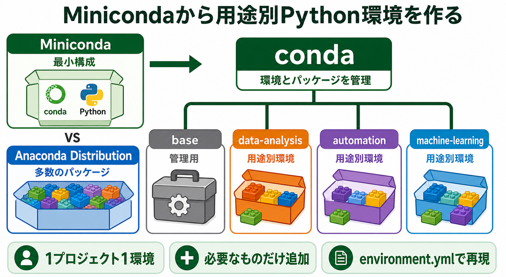

# MinicondaとAnacondaの違いと環境運用

## まず結論

Minicondaは「Pythonのライブラリが一式入った完成品」ではなく、Python環境を用途別に作成・分離・管理するための最小構成です。
インストール後は、`base`へ何でも追加するのではなく、プロジェクトごとに環境を作り、必要なライブラリだけを追加します。

## これは何か

Miniconda、Anaconda Distribution、conda、Python、ライブラリの役割を分け、インストール後の拡張方法と安全な運用を整理するノートです。

## どこで使うか

- Pythonを使う業務や個人プロジェクトを始めるとき
- pandas、Jupyter、機械学習ライブラリを追加するとき
- 複数プロジェクトのPythonバージョンや依存関係を分離するとき
- 別のPCで同じ環境を再現するとき
- condaとpipの使い分けを判断するとき

## 全体像

### 役割を6つに分ける

| 用語 | 役割 |
| --- | --- |
| Python | Pythonコードを実行する言語処理系 |
| ライブラリ／パッケージ | pandasやNumPyなど、機能を追加する部品 |
| 環境 | Python本体とパッケージをまとめて入れる独立した箱 |
| conda | 環境とパッケージを管理するコマンドラインツール |
| Miniconda | conda、Python、最低限の依存関係を含む軽量な配布物 |
| Anaconda Distribution | conda、多数のデータ分析パッケージ、Navigatorなどを含む包括的な配布物 |

### Minicondaを入れた後の構造

```text
Miniconda
├─ conda
├─ base                 conda自身の管理用
└─ envs
   ├─ data-analysis     Python + pandas + JupyterLab
   ├─ automation        Python + openpyxl
   └─ machine-learning  Python + scikit-learn
```

環境ごとにPythonのバージョンとパッケージを持てるため、一方の更新が別のプロジェクトを壊す危険を減らせます。

### MinicondaとAnaconda Distributionの比較

| 比較軸 | Miniconda | Anaconda Distribution |
| --- | --- | --- |
| 初期構成 | 必要最小限 | 数百のパッケージを同梱 |
| 容量 | 比較的小さい | 大きい |
| 導入後 | 必要なものを選んで追加 | 主要ツールをすぐ使いやすい |
| GUI | Navigatorは標準で含まれない | Navigatorを含む |
| 向く場面 | 構成を把握し、用途別に管理したい | 最初からデータ分析ツール一式を試したい |

すでにMinicondaを使っている場合、通常はAnaconda Distributionを重ねて導入する必要はありません。

## 理解用イラスト

この図は、Minicondaを土台として、`base`を管理用に保ち、用途別環境へ必要なライブラリを追加する流れを表します。



## よくある疑問

### Q. Minicondaはライブラリですか

A. ライブラリではなく、condaとPythonを導入する軽量な配布物です。導入後、condaを使って環境とパッケージを管理します。

### Q. なぜ環境を分ける必要がありますか

A. プロジェクトごとに必要なPythonやライブラリのバージョンが異なるためです。環境を分けると、更新や追加の影響をその環境内へ閉じ込められます。

### Q. `base`とは何ですか

A. Minicondaを導入したときに作られる基本環境です。conda自身を安定して動かすため、作業用ライブラリを大量に追加せず、管理用として保つのが安全です。

### Q. condaとpipはどう違いますか

A. condaはPython本体、Pythonパッケージ、ネイティブ依存関係、環境をまとめて管理できます。pipは主にPyPI上のPythonパッケージをインストールするツールです。

### Q. condaとpipを混ぜてもよいですか

A. 必要な場合は使えます。ただし、独立したconda環境内で、先にcondaを使い、condaにないパッケージだけを最後にpipで追加します。`pip install --user`は避けます。

### Q. チャンネルとは何ですか

A. condaがパッケージを検索・取得する配布元です。代表例にAnacondaの`defaults`とコミュニティ管理の`conda-forge`があります。業務環境では組織が許可したチャンネルと設定を優先します。

## 実務での見方

### 1. インストール状態を確認する

```powershell
conda --version
conda info
conda info --envs
conda config --show channels
```

`conda info --envs`の`*`は、現在有効な環境を表します。

### 2. プロジェクト用環境を作る

```powershell
conda create --name data-analysis python=3.12 pandas jupyterlab
```

Pythonのバージョンは、プロジェクトや組織の指定があればその指定を優先します。

### 3. 環境を有効化して確認する

```powershell
conda activate data-analysis
python --version
where.exe python
conda list
```

`where.exe python`を使うと、意図した環境のPythonが選ばれているか確認できます。

### 4. 必要なパッケージを追加する

```powershell
conda install openpyxl matplotlib
```

condaにないパッケージをpipで入れる場合は、対象環境を有効化してから実行します。

```powershell
conda install pip
python -m pip install <package-name>
```

### 5. 環境を終了する

```powershell
conda deactivate
```

### 6. 環境を再現可能にする

明示的に追加した主要パッケージを`environment.yml`へ書き出します。

```powershell
conda env export --from-history > environment.yml
```

別のPCでは、ファイルから環境を作成できます。

```powershell
conda env create --file environment.yml
```

### 7. 不要な環境を削除する

```powershell
conda remove --name data-analysis --all
```

環境定義を残しておけば、複雑に修復するより削除して再作成する方が安全な場合があります。

### 推奨する運用原則

1. `base`はcondaの管理用として保つ。
2. 原則として1プロジェクト1環境にする。
3. Pythonのバージョンを明示する。
4. 使用するチャンネルをむやみに混ぜない。
5. condaで導入できるものを先に入れ、pipは最後に使う。
6. `environment.yml`をプロジェクトで管理する。
7. 追加・更新後は、実行するPythonと主要パッケージを確認する。

### 業務環境で確認する項目

- 組織が指定するPythonバージョン
- 許可されているチャンネルや社内リポジトリ
- プロキシや証明書の設定
- パッケージ追加時の承認手順
- Anacondaの配布物・リポジトリに関する契約方針

conda自体と、Anaconda社が提供するインストーラーやリポジトリは分けて考えます。営利組織での利用条件は変更される可能性があるため、業務利用では最新の利用規約と組織の方針を確認します。

## 次回の確認

- [ ] `conda info --envs`で環境一覧を確認できる
- [ ] `base`とプロジェクト用環境の役割を説明できる
- [ ] `where.exe python`で実行対象のPythonを確認できる
- [ ] conda、pip、チャンネルの違いを説明できる
- [ ] `environment.yml`から環境を再作成できる

## 関連トピック

- 今後追加候補: pipとvenvによるPython標準の環境管理
- 今後追加候補: JupyterLabとカーネルの関係

## 参考リンク

- [Anaconda公式: Anaconda DistributionとMinicondaの選び方](https://www.anaconda.com/docs/getting-started/concepts/anaconda-or-miniconda)
  - 両者に含まれるものと、想定する利用者の違いを確認する。
- [conda公式: 環境の管理](https://docs.conda.io/projects/conda/en/stable/user-guide/tasks/manage-environments.html)
  - 環境の作成、有効化、共有、削除、pipとの併用方法を確認する。
- [Anaconda公式: チャンネルの管理](https://www.anaconda.com/docs/getting-started/working-with-conda/channels)
  - パッケージの配布元、優先順位、設定確認方法を調べる。
- [Anaconda公式: 利用規約](https://www.anaconda.com/legal/terms/terms-of-service)
  - 組織でAnacondaのサービスや配布元を利用するときの最新条件を確認する。

## 更新履歴

- 2026-07-27: 初版作成。
