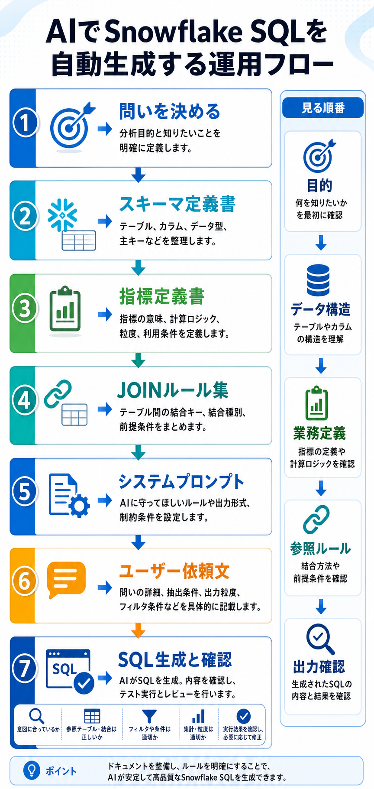

# AIでSnowflake SQLを自動生成するときの情報設計

## まず結論

AIにSnowflake SQLを想定通り書かせたいときは、`問い` だけでなく `データ構造` `業務定義` `JOINルール` `出力形式` まで渡します。AI活用の本質は、うまくお願いすることではなく、`AIが誤解しにくい仕様を先に作ること` です。

## これは何か

Snowflake SQL の自動生成で、AIに何を渡すと精度が上がるか、その理由は何か、Gems やシステムプロンプトでどう固定すると安定するかを整理するトピックです。

## どこで使うか

- AIに分析SQLを書かせたいとき。
- 毎回長い説明をせずに、共通ルールでSQL生成したいとき。
- `SQLは動くが意味が違う` という失敗を減らしたいとき。
- Gems やナレッジ資料を使って、参照ルールごと標準化したいとき。

## 全体像

- `目的`
  - 何を知りたいかを固定する。
- `データ構造`
  - どのテーブルとカラムを使うかを固定する。
- `業務定義`
  - 売上、購入者数、会員数などの意味を固定する。
- `JOINルール`
  - どうつなぐかを固定する。
- `出力形式`
  - どの列をどの粒度でどう返すかを固定する。

短く言うと、良いSQL生成は次の式で整理できます。

`良いSQL生成 = 目的 + データ構造 + 業務定義 + 出力指定`

## 理解用イラスト

このテーマは、`問い -> 定義資料 -> 参照ルール -> 依頼文 -> SQL生成と確認` の流れで見ると整理しやすいです。



図を見ると、SQL生成そのものより前段の `定義をそろえる工程` が重要だと分かります。

## よくある疑問

### Q. なぜ `5月の売上を見たい` だけでは弱い？

A. 年、期間基準、対象テーブル、キャンセル除外の有無、売上定義、都道府県の持ち方などが未確定だからです。AIは不足部分をもっともらしく補完しますが、ここが一番ずれやすいです。

### Q. SQL生成で一番危ないズレは何？

A. 文法ミスより `意味のズレ` です。特に `存在しないカラムを作る` `JOINを誤る` `COUNT と COUNT DISTINCT を混同する` `売上定義を勝手に決める` が起きやすいです。

### Q. Gems に資料を置けば十分？

A. それだけでは不十分です。資料を置くことと、その資料を優先して使わせることは別です。システムプロンプト側で `何を優先するか` `資料にないことをどこまで推測してよいか` を決めます。

### Q. システムプロンプトで一番大事なのは何？

A. `参照優先順位` と `不足時の挙動` です。資料を優先すること、資料にないテーブル名やJOIN条件を作らないこと、不足が大きいときは確認事項を返すことを固定します。

### Q. 良い依頼文と悪い依頼文の違いは何？

A. 悪い依頼文は `依頼` で止まり、良い依頼文は `仕様` になっています。人間の頭の中にある前提を外に出して、AIが使える形にしたものが良い依頼文です。

## 実務での見方

1. まず `何を知りたいか` を1文で固定する。
2. 次に使うテーブル、主要カラム、その意味を渡す。
3. JOIN条件と指標定義を渡す。
4. 期間、除外条件、粒度、並び順を渡す。
5. システムプロンプトで `資料優先` `勝手に作らない` `不足時は確認` を固定する。
6. 長期運用するなら、共通知識を Gems に分けて置く。

### 実務で渡す情報の型

- `目的`
- `使用テーブル`
- `カラムの意味`
- `結合条件`
- `条件`
- `集計粒度`
- `指標定義`
- `出力`

### Gems に置く資料の型

- `スキーマ定義書`
  - テーブル名、カラム名、型、意味
- `指標定義書`
  - 売上、購入者数、注文数などの定義
- `JOINルール集`
  - 標準の結合条件と結合種類
- `作法資料`
  - CTE、命名、NULL処理、日付関数の方針
- `禁止事項`
  - 勝手に作らないもの、断定しないもの

### すぐ使えるテンプレート

- [Snowflake SQL生成用スキーマ定義書テンプレート](./Snowflake%20SQL生成用スキーマ定義書テンプレート.md)
- [Snowflake SQL生成用指標定義書テンプレート](./Snowflake%20SQL生成用指標定義書テンプレート.md)
- [Snowflake SQL生成用JOINルール集テンプレート](./Snowflake%20SQL生成用JOINルール集テンプレート.md)
- [Snowflake SQL生成用システムプロンプトテンプレート](./Snowflake%20SQL生成用システムプロンプトテンプレート.md)
- [Snowflake SQL生成用ユーザー依頼文テンプレート](./Snowflake%20SQL生成用ユーザー依頼文テンプレート.md)

### 依頼文の最小テンプレート

```text
目的:
- 何を知りたいか

使用テーブル:
- テーブル名と主要カラム

カラムの意味:
- 指標や日付の意味

結合条件:
- どのキーで結ぶか

条件:
- 期間、対象、除外条件

集計粒度:
- 日別 / 月別 / 顧客別 / 商品別

出力:
- 欲しい列
- 並び順
```

### システムプロンプトの最小テンプレート

```text
あなたは Snowflake SQL 生成アシスタントです。
SQL 生成時は、提供されたスキーマ定義書、指標定義書、JOINルール集を最優先で参照してください。
資料にないテーブル名、カラム名、JOIN条件、指標定義は勝手に作らないでください。
不明点が軽微なら仮定を明記してSQLを出し、重要なら確認事項を先に返してください。
出力は、まずSQL、その後に使用テーブル・主要条件・仮定を短く説明してください。
```

## 次回の確認

- [ ] 問いだけでなく、データ構造と業務定義まで渡しているか。
- [ ] JOIN条件と指標定義を明示しているか。
- [ ] Gems に `スキーマ定義書` `指標定義書` `JOINルール集` を分けているか。
- [ ] システムプロンプトで `資料優先` と `不足時の挙動` を固定しているか。
- [ ] `依頼` ではなく `仕様` を渡せているか。

## 関連トピック

- [SnowflakeのCTE再評価](./SnowflakeのCTE再評価.md)
- [Snowflake Notebookの頻出スクリプト](./Snowflake%20Notebookの頻出スクリプト.md)
- [Snowflake SQL生成用スキーマ定義書テンプレート](./Snowflake%20SQL生成用スキーマ定義書テンプレート.md)
- [Snowflake SQL生成用指標定義書テンプレート](./Snowflake%20SQL生成用指標定義書テンプレート.md)
- [Snowflake SQL生成用JOINルール集テンプレート](./Snowflake%20SQL生成用JOINルール集テンプレート.md)
- [Snowflake SQL生成用システムプロンプトテンプレート](./Snowflake%20SQL生成用システムプロンプトテンプレート.md)
- [Snowflake SQL生成用ユーザー依頼文テンプレート](./Snowflake%20SQL生成用ユーザー依頼文テンプレート.md)

## 更新履歴

- 2026-06-09: システムプロンプト用とユーザー依頼文用のテンプレートを追加。
- 2026-06-09: Gems 用テンプレート3種へのリンクを追加。
- 2026-06-09: 初版作成。
