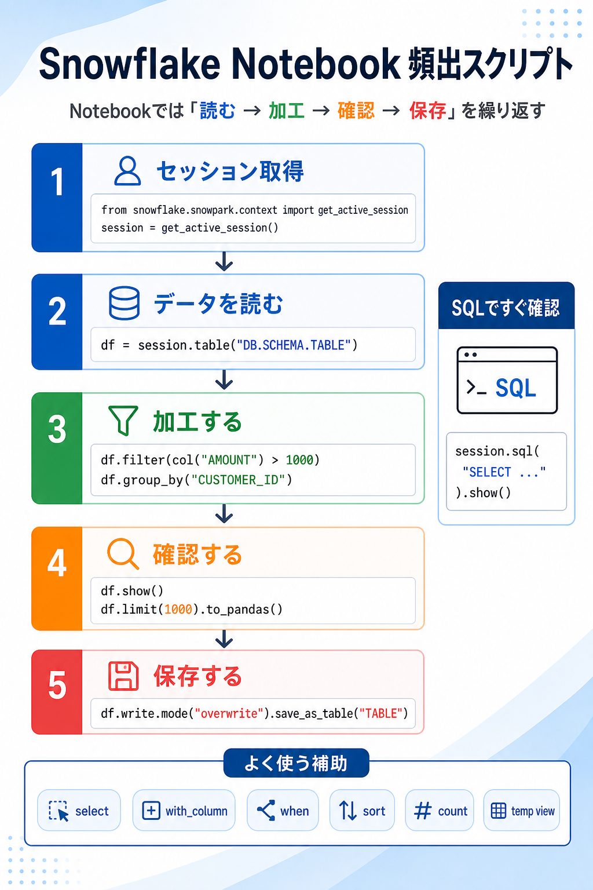

# まず結論

Snowflake Notebook で頻出なのは、`セッション取得 -> データを読む -> 加工する -> 確認する -> 保存する` の流れです。細かい文法を先に覚えるより、この 5 段階に沿って `SQL` と `Snowpark DataFrame` を行き来できるようになると、日常作業がかなり安定します。

Notebook では、`session.sql()` ですぐ SQL を試し、必要なら `session.table()` から DataFrame に持ち替えて加工し、最後に `save_as_table()` で残す形が基本です。

## これは何か

Snowflake Notebook を使うときに、最初に覚えると実務で何度も使う Python / Snowpark の定型を整理したトピックです。単発のコード集ではなく、`どの場面で何を書くか` が戻るように並べています。

## どこで使うか

- Notebook でテーブルの中身を確認しながら分析を始めるとき
- SQL だけでは扱いにくい変換や列追加を Snowpark で書くとき
- 集計結果を一時確認してからテーブルへ保存するとき
- Notebook を触り始めた直後に、最低限の定型だけ早く思い出したいとき

## 全体像

Notebook の基本は、次の 5 段階です。

1. `get_active_session()` で今の Notebook セッションを受け取る
2. `session.table()` または `session.sql()` でデータを読む
3. `select` `filter` `with_column` `group_by` で加工する
4. `show()` や `to_pandas()` で途中結果を確認する
5. `save_as_table()` で成果物を残す

## 理解用イラスト

この図は、その流れと代表コードを一枚に圧縮したものです。



覚え方の芯:

- `SQL は素早い確認`
- `DataFrame は連続加工`
- `show は途中確認`
- `save_as_table は成果物化`

## よくある疑問

### Q. 最初に何だけ覚えればよい？

A. まずは `get_active_session()`、`session.table()`、`filter()`、`group_by()`、`show()`、`save_as_table()` の 6 個で十分です。Notebook でよくある作業の大半はこの並びで回せます。

### Q. SQL と Snowpark はどちらを使うべき？

A. `まずは SQL で確認し、途中から加工が増えたら Snowpark に寄せる` と考えると整理しやすいです。短い確認クエリは `session.sql()` が速く、列追加や条件分岐が増えるなら DataFrame の方が扱いやすくなります。

### Q. `show()` と `to_pandas()` はどう使い分ける？

A. `show()` は Snowflake 上の結果を軽く見る用途、`to_pandas()` は手元で表として詳しく見たい用途です。大きいデータをそのまま `to_pandas()` に流すと重くなりやすいので、`limit()` を挟む前提で使います。

### Q. 一時ビューはいつ使う？

A. DataFrame で作った途中結果を、後続の SQL からもう一度読みたいときです。`create_or_replace_temp_view()` を使うと、Notebook 内で SQL と Python の行き来がしやすくなります。

## 実務での見方

### 1. セッションを取る

```python
from snowflake.snowpark.context import get_active_session

session = get_active_session()
```

Notebook では、まず今動いている Snowflake セッションを受け取ります。ここが入口です。

### 2. テーブルか SQL で読む

```python
df = session.table("MY_DB.MY_SCHEMA.MY_TABLE")
df.show()
```

```python
session.sql("""
SELECT customer_id, SUM(amount) AS total_amount
FROM MY_DB.MY_SCHEMA.SALES
GROUP BY customer_id
ORDER BY total_amount DESC
""").show()
```

`表をそのまま触り始めるなら table`、`まず1本の確認クエリを書くなら sql` と分けると迷いにくいです。

### 3. よくある加工

```python
from snowflake.snowpark.functions import col, when
from snowflake.snowpark.functions import sum as sf_sum, avg, count

filtered = df.filter(col("AMOUNT") > 1000)

selected = df.select("CUSTOMER_ID", "AMOUNT", "ORDER_DATE")

scored = df.with_column(
    "AMOUNT_CLASS",
    when(col("AMOUNT") >= 1000, "HIGH").otherwise("LOW")
)

agg_df = df.group_by("CUSTOMER_ID").agg(
    sf_sum("AMOUNT").alias("TOTAL_AMOUNT"),
    avg("AMOUNT").alias("AVG_AMOUNT"),
    count("*").alias("CNT")
)
```

頻出なのは `filter` `select` `with_column` `group_by + agg` です。Notebook での加工は、まずこの 4 つを中心に覚えると十分実用になります。

### 4. 途中結果を確認する

```python
agg_df.show()
```

```python
pdf = agg_df.limit(1000).to_pandas()
pdf.head()
```

確認はこまめに入れます。Notebook は `一気に書く` より `少し加工してすぐ見る` 方が事故が少ないです。

### 5. 一時ビューと保存

```python
agg_df.create_or_replace_temp_view("TMP_SALES")
session.sql("SELECT * FROM TMP_SALES LIMIT 10").show()
```

```python
agg_df.write.mode("overwrite").save_as_table(
    "MY_DB.MY_SCHEMA.SALES_SUMMARY"
)
```

途中結果を SQL に戻したいときは temp view、成果物として残すときは `save_as_table()` を使います。

### 6. 補助としてよく使う確認

```python
print(df.count())
```

```python
df.sort(col("AMOUNT").desc()).show(20)
```

```python
df.group_by("CUSTOMER_ID").count().filter(col("COUNT") > 1).show()
```

行数確認、上位確認、重複確認は頻度が高いので、最初からセットで持っておくと便利です。

## 次回の確認

- [ ] `session.sql()` と `session.table()` を場面で使い分けられるか
- [ ] `filter / select / with_column / group_by` を見て何をするコードかすぐ言えるか
- [ ] `show()` と `to_pandas()` の使い分けを説明できるか
- [ ] temp view と save_as_table の役割差を思い出せるか

## 関連トピック

- [SnowflakeのCTE再評価](./SnowflakeのCTE再評価.md)
- [Snowflakeのmicro-partitionとpruning](./Snowflakeのmicro-partitionとpruning.md)

## 参考リンク

- [About Snowflake Notebooks](https://docs.snowflake.com/en/en/user-guide/ui-snowsight/notebooks)
  - Notebook が Python、SQL、Markdown のセルベース環境であることを確認するための入口
- [Getting started with Snowflake Notebooks](https://docs.snowflake.com/en/en/user-guide/ui-snowsight/notebooks-get-started)
  - Notebook での開発フローや関連ガイドの入口を確認するためのページ
- [snowflake.snowpark.context.get_active_session](https://docs.snowflake.com/en/developer-guide/snowpark/reference/python/latest/snowpark/api/snowflake.snowpark.context.get_active_session)
  - Notebook で使うアクティブセッション取得の確認
- [snowflake.snowpark.Session.table](https://docs.snowflake.com/en/developer-guide/snowpark/reference/python/latest/snowpark/api/snowflake.snowpark.Session.table)
  - テーブルから DataFrame を作る入口の確認
- [snowflake.snowpark.DataFrame.filter](https://docs.snowflake.com/en/developer-guide/snowpark/reference/python/latest/api/snowflake.snowpark.DataFrame.filter)
  - 条件絞り込みの基本確認
- [snowflake.snowpark.DataFrame.create_or_replace_temp_view](https://docs.snowflake.com/en/developer-guide/snowpark/reference/python/latest/snowpark/api/snowflake.snowpark.DataFrame.create_or_replace_temp_view)
  - DataFrame を一時ビュー化して SQL から再利用する方法の確認
- [snowflake.snowpark.DataFrameWriter.save_as_table](https://docs.snowflake.com/en/developer-guide/snowpark/reference/python/latest/snowpark/api/snowflake.snowpark.DataFrameWriter.save_as_table)
  - Notebook の処理結果をテーブル保存する方法の確認

## 更新履歴

- 2026-06-03: 初版作成
