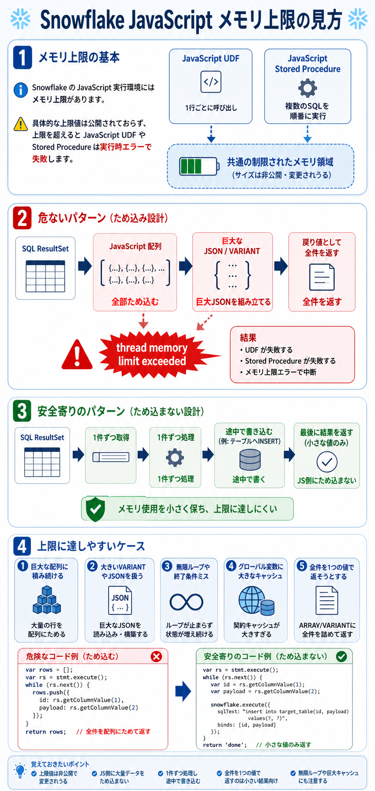
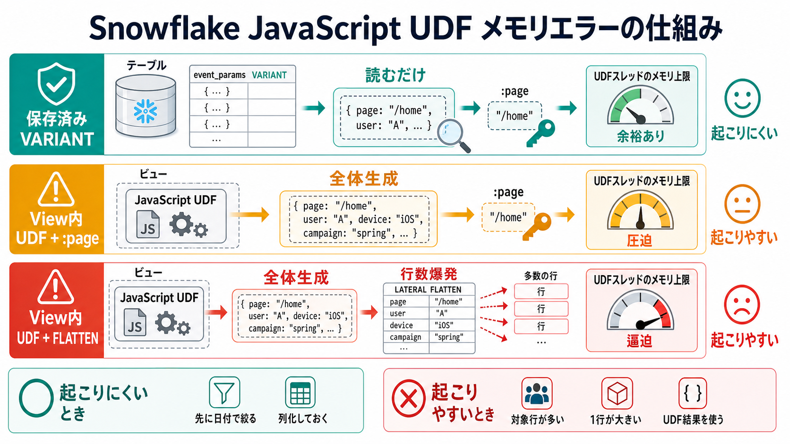

# SnowflakeのJavaScriptメモリ上限

## まず結論

Snowflake の JavaScript 実行環境にはメモリ上限があり、使いすぎると実行時エラーで失敗します。ただし `何 MB` という固定値は公開されておらず、Snowflake 公式も `具体的な上限は変更されうる` としています。実務では `上限値を覚える` より、`JavaScript 側に大量データをため込まない` と考えるほうが重要です。

## これは何か

Snowflake の JavaScript UDF や JavaScript Stored Procedure が動くときに、その実行コンテキストで使えるメモリには制限があります。上限を超えると、`out of memory` 系のエラーで失敗します。特に Stored Procedure では、SQL の結果を JavaScript の配列や JSON に集めすぎると達しやすくなります。

## どこで使うか

- JavaScript UDF が `out of memory` で落ちた理由を整理したいとき。
- JavaScript Stored Procedure で大量行を扱う設計が安全か見たいとき。
- `結果を全部配列に積む` 実装が危ない理由を確認したいとき。
- `Snowflake で処理すべき部分` と `JavaScript 側で持つべき部分` を切り分けたいとき。

## 全体像

1. Snowflake の JavaScript 実行環境にはメモリ上限がある。
2. ただし公開された固定値はなく、超えると実行時に失敗する。
3. 上限に達しやすいのは、`大量行` `巨大な JSON` `無限ループ` `ため込み設計` のとき。
4. 安全に寄せるには、`1件ずつ処理する` `途中で SQL に書く` `全部返そうとしない` が基本になる。

UDF と Stored Procedure の見分け方:

- `JavaScript UDF`
  - 1 行ごと、または呼び出し単位で JavaScript が動く。
  - 公式は `メモリを使いすぎると失敗する` と明記している。
- `JavaScript Stored Procedure`
  - JavaScript API は同期的で、1 つずつ処理する。
  - 結果セット全体を JavaScript の配列や VARIANT に積む設計が危ない。

## 理解用イラスト

この図では、`安全寄りの流れ` と `危ない流れ` を 1 枚で見分けられるようにしています。`全部ため込むと上限へ近づく`、`1件ずつ処理すると安全寄り` という見方を戻す用途です。



次の図では、View 内で JavaScript UDF が `event_params` を生成している場合に、`:page` や `LATERAL FLATTEN` がその UDF 評価を引き起こす流れを整理しています。`保存済み VARIANT を読む` のか、`UDF で毎回 VARIANT 全体を作る` のかを先に分けると、メモリエラーの原因を切り分けやすくなります。



## View内UDFでevent_paramsを作るときの見方

通常の View はデータを保存せず、利用時に View 定義が展開されます。そのため、View 定義の中で JavaScript UDF を使って `event_params` を作っている場合、利用側でその列を参照したタイミングで UDF が評価されます。

たとえば View が次のような形だとします。

```sql
CREATE VIEW v_events AS
SELECT
  event_date,
  event_name,
  js_parse_event_params(raw_event_params) AS event_params
FROM raw_events;
```

この View に対して次のように書くと、見た目は `page` だけを取っているように見えます。

```sql
SELECT event_params:page::string AS page
FROM v_events;
```

しかし実際には、先に `js_parse_event_params(raw_event_params)` で `event_params` 全体を作り、その結果から `page` を取り出す処理になりやすいです。UDF の中で全キーを走査して大きな JavaScript オブジェクトを作っているなら、`:page` だけ指定しても UDF 内部の処理は軽くなりません。

### 起こりやすいとき

- View 内の UDF 生成列を `SELECT` している。
- `event_params:page` のように、UDF 生成結果の中のキーを参照している。
- `LATERAL FLATTEN(input => event_params)` で UDF 生成結果を展開している。
- `WHERE event_params:page = ...` のように、UDF 結果を条件判定に使っている。
- 対象行数が多い、または 1 行あたりの `raw_event_params` が大きい。
- UDF 内で `JSON.parse`、全キー走査、新しい `Object` / `Array` の組み立てをしている。

特に危ないのは、次のように UDF で全体を作ってから `FLATTEN` する形です。

```sql
SELECT
  f.value
FROM v_events,
LATERAL FLATTEN(input => event_params) f
WHERE f.value:key::string = 'page_location';
```

この場合は、`page_location` だけ欲しくても、処理の流れは `UDFで全体生成 -> FLATTENで全要素を行展開 -> page_locationだけ残す` になりやすいです。JavaScript UDF のメモリエラー自体は主に `UDFで全体生成` の段階で起こり、`FLATTEN` はその後の中間行数とクエリ全体の重さをさらに増やします。

### 起こりにくいとき

- UDF 生成列を SELECT / WHERE / JOIN / FLATTEN で使っていない。
- `event_date` や `event_name` など普通の列で先に強く絞れている。
- `event_params` が UDF 生成ではなく、テーブルに保存済みの `VARIANT` カラムである。
- よく使う GA パラメータを `page_location` `ga_session_id` などの普通の列として事前抽出している。

同じ `event_params:page` でも、保存済み VARIANT から読む場合は `保存済みデータを読む -> pageキーを取る` です。一方、View 内 UDF 生成列から読む場合は `rawを読む -> JavaScript UDFで全体を作る -> pageキーを取る` です。メモリエラーを見るときは、まずこの違いを確認します。

## よくある疑問

### Q. Snowflake の JavaScript メモリ上限は何 MB？

A. 公開された固定値はありません。Snowflake 公式は、JavaScript UDF は `メモリを使いすぎると失敗する`、その `具体的な上限は変更されうる` としています。したがって、固定値を前提に設計するより、そもそも JavaScript 側へ大きなデータをため込まないことが重要です。

### Q. `thread memory limit exceeded` は何を意味する？

A. その JavaScript 実行コンテキストで使ったメモリが大きすぎて、Snowflake 側の制限を超えたと見るのが基本です。エラーメッセージに `UDF thread memory limit exceeded` が出ることがあります。

### Q. どういうときに上限へ達しやすい？

A. 代表的には次のようなときです。

1. SQL の結果を全部 JavaScript 配列に積む。
2. 大きい `VARIANT` や JSON を JavaScript 側で組み立てる。
3. 全件を 1 つの `ARRAY` や `VARIANT` として返そうとする。
4. 無限ループや終了条件ミスで、処理が止まらず内部状態が増え続ける。
5. グローバル変数に大きなキャッシュを持つ。

### Q. いちばん危ない実装パターンは？

A. `全部集めてから返す` パターンです。たとえば次のような書き方です。

```javascript
var rows = [];
while (rs.next()) {
  rows.push({
    c1: rs.getColumnValue(1),
    c2: rs.getColumnValue(2),
    c3: rs.getColumnValue(3)
  });
}
return rows;
```

これは結果セット全体を JavaScript メモリへ載せるので、行数や 1 行のサイズが大きいと危険です。

### Q. 逆に安全寄りの考え方は？

A. `ため込まない` ことです。具体的には次の考え方です。

- 1 件ずつ処理する。
- 中間結果は JavaScript 配列ではなくテーブルへ書く。
- 全件を 1 つの `VARIANT` として返さない。
- 大きい JSON を JavaScript で再構成しない。

### Q. 無限ループでもメモリ上限エラーになる？

A. なります。Snowflake の公式トラブルシュートでは、`JavaScript out of memory error: UDF thread memory limit exceeded` の原因として、無限ループの可能性を挙げています。特に `resultSet.next()` が `false` になったあとも止まらない実装は要注意です。

### Q. Stored Procedure は UDF より安全？

A. 自動的に安全というわけではありません。Stored Procedure は SQL を順番に実行しやすい反面、JavaScript 側に大きい配列や JSON を持つと同じように危険です。違いは `何ができるか` であり、`ため込む実装が危ない` 点は共通です。

## 実務での見方

1. `上限は何 MB か` より、`今のコードは何をメモリへため込むか` を先に見る。
2. `while (rs.next()) { array.push(...) }` の形を見たら、まず危険候補として疑う。
3. `返り値 1 個に全件を詰める` 実装は、小さい結果セット専用と考える。
4. 巨大な JSON 整形は JavaScript でやるより、SQL 側で分割・集約の設計を見直す。
5. `out of memory` と `時間切れ` と `スタック深さ` は別の失敗なので切り分ける。
6. 再利用用のキャッシュは小さな初期化情報に留め、大きなデータ保持には使わない。

## 危ない実装と安全寄りの実装

危ない実装:

```javascript
var all_rows = [];
var rs = stmt.execute();
while (rs.next()) {
  all_rows.push({
    id: rs.getColumnValue(1),
    payload: rs.getColumnValue(2)
  });
}
return all_rows;
```

安全寄りの実装:

```javascript
var rs = stmt.execute();
while (rs.next()) {
  var id = rs.getColumnValue(1);
  var payload = rs.getColumnValue(2);

  snowflake.execute({
    sqlText: `insert into target_table(id, payload) values(?, ?)`,
    binds: [id, payload]
  });
}
return 'done';
```

後者でも実行回数や書き込み方式は別途最適化が必要ですが、少なくとも `全件を JavaScript 配列へ保持する` 設計は避けられます。

## 次回の確認

- [ ] JavaScript メモリ上限は固定値公開ではないと言えるか
- [ ] `全部ため込む実装` が危ないと説明できるか
- [ ] View 内 UDF 生成列は、参照されたときに UDF 評価を引き起こすと言えるか
- [ ] `event_params:page` だけでも、UDF 内部が全体生成なら軽くならないと説明できるか
- [ ] `UDFで全体生成 -> FLATTENで行数爆発` の順に重くなると説明できるか
- [ ] `UDF` と `Stored Procedure` の違いを、メモリ観点でざっくり言えるか
- [ ] `ARRAY` `VARIANT` に全件を返す実装が小さい結果向けだと言えるか
- [ ] 無限ループでもメモリ上限エラーの原因になりうると言えるか

## 関連トピック

- [SnowflakeのLATERAL FLATTEN](./SnowflakeのLATERAL%20FLATTEN.md)
- [Snowflakeのスピル](./Snowflakeのスピル.md)
- [Snowpark UDFのデータスキューとDySkew](./Snowpark%20UDFのデータスキューとDySkew.md)

## 参考リンク

- [JavaScript UDF limitations | Snowflake Documentation](https://docs.snowflake.com/en/developer-guide/udf/javascript/udf-javascript-limitations)
  - JavaScript UDF はメモリを使いすぎると失敗し、具体的な上限は変更されうることを確認する。
- [Writing stored procedures in JavaScript | Snowflake Documentation](https://docs.snowflake.com/en/developer-guide/stored-procedure/stored-procedures-javascript)
  - Stored Procedure の JavaScript API が同期的であることと、`UDF thread memory limit exceeded` のトラブルシュートを確認する。

## 更新履歴

- 2026-07-14: View 内 JavaScript UDF で `event_params` を生成し、`:page` や `LATERAL FLATTEN` で参照する場合のメモリエラー発生条件と図解を追加。
- 2026-07-03: 新規作成。JavaScript メモリ上限の考え方、上限へ達しやすい条件、危ない実装と安全寄りの実装、理解用イラストを追加。
