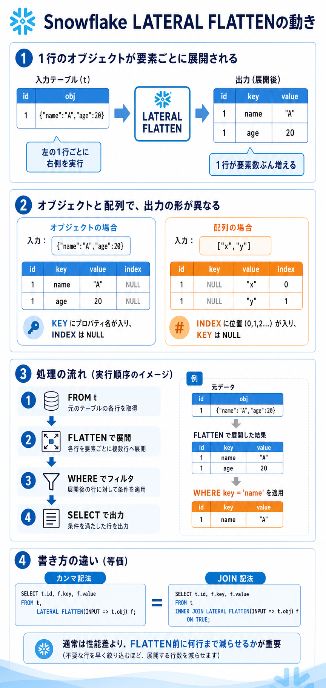

# SnowflakeのLATERAL FLATTEN

## まず結論

`FROM t, LATERAL FLATTEN(...)` は、`t` の各行ごとに `FLATTEN` を実行して、半構造データを明細行へばらす書き方です。見た目はカンマ区切りでも、意味は単純な直積ではなく、`左の行を右側へ渡して展開する相関付きの結合` です。`FROM t INNER JOIN LATERAL FLATTEN(...)` も、理解の中心は同じく `左の1行ごとに右側を実行する` です。

## これは何か

Snowflake で `VARIANT` `ARRAY` `OBJECT` に入っている JSON 的な構造を、SQL で扱いやすい複数行へ展開するための基本パターンです。`LATERAL` は右側の `FLATTEN` が左側のテーブル列を参照できるようにする役割を持ちます。

## どこで使うか

- API レスポンスやイベントログを `1要素1行` にばらしたいとき。
- 配列の中身を join や group by できる形へ直したいとき。
- `VARIANT` 列の中のネストした配列やオブジェクトを明細化したいとき。
- `INNER JOIN` 的に空配列の行を落とすか、`OUTER => TRUE` で元行を残すかを整理したいとき。

## 全体像

1. まず左側テーブル `t` から 1 行読む。
2. その行の `t.json_col` を `FLATTEN` に渡す。
3. 配列やオブジェクトの中身が複数行に展開される。
4. 展開された各行に、元の `t` の列が繰り返し付く。

最小例:

```sql
SELECT
  t.id,
  f.index,
  f.value
FROM t,
LATERAL FLATTEN(input => t.json_col) f;
```

`t.json_col` が `[10, 20, 30]` なら、結果は次のイメージです。

```text
id | index | value
---+-------+------
1  | 0     | 10
1  | 1     | 20
1  | 2     | 30
```

## 理解用イラスト

この図では、`1行のVARIANT -> FLATTEN -> 複数行` へ変わる流れと、`,` / `INNER JOIN LATERAL` / `OUTER => TRUE` の違いを 1 枚で戻せるようにしています。



## よくある疑問

### Q. `FROM t, LATERAL FLATTEN(...)` は cross join なの？

A. 見た目は近いですが、理解の中心は `直積` ではなく `左の1行ごとに右側のテーブル関数を実行する` です。Snowflake の lateral join は、左の行を右側へ渡して処理させます。

### Q. `INNER JOIN LATERAL` で書ける？

A. 書けます。意図を `join している` という見た目でそろえたいときに使えます。

```sql
SELECT
  t.id,
  f.value
FROM t
INNER JOIN LATERAL FLATTEN(input => t.json_col) f;
```

通常の `, LATERAL FLATTEN(...)` と同じく、展開結果がない行は落ちます。実務では `join` より `左の1行ごとに展開する` と読んだほうが迷いにくいです。

### Q. 配列が空や `NULL` のとき元行はどうなる？

A. デフォルトでは落ちます。`FLATTEN` は展開できない行を返さないからです。元行も残したいなら `OUTER => TRUE` を使います。

```sql
SELECT
  t.id,
  f.value
FROM t,
LATERAL FLATTEN(input => t.json_col, OUTER => TRUE) f;
```

このとき、空配列などで展開結果が 0 行でも 1 行だけ残り、`KEY` `INDEX` `VALUE` は `NULL` になります。

### Q. `FLATTEN` は何を返す？

A. よく使うのは次の列です。

- `VALUE`: 展開された値
- `INDEX`: 配列の位置
- `KEY`: オブジェクトのキー
- `PATH`: 元データ内の場所
- `THIS`: 今見ている要素

### Q. オブジェクトを展開したとき、`KEY` と `VALUE` はどう見ればよい？

A. オブジェクトでは `KEY` にプロパティ名、`VALUE` にその値が入ります。`INDEX` は通常 `NULL` です。

```sql
SELECT
  t.id,
  f.key,
  f.value
FROM t,
LATERAL FLATTEN(input => t.obj) f;
```

`{"name":"A","age":20}` を展開すると、結果イメージはこうです。

```text
id | key  | value
---+------+------
1  | name | "A"
1  | age  | 20
```

配列では逆に `INDEX` が入り、`KEY` は `NULL` になります。

### Q. `WHERE f.key = 'name'` はいつ効く？

A. 先に `FLATTEN` が行を増やし、その後に `WHERE` が展開後の行を絞ります。つまり `WHERE` が JSON の中身を展開前に直接減らすのではなく、`明細化された結果行を残すかどうか` を判定します。

処理順のイメージ:

1. `FROM t` で元の行を読む。
2. `LATERAL FLATTEN` で各行を複数行へ展開する。
3. `WHERE f.key = 'name'` で展開後の行を絞る。
4. `SELECT` で残った行を返す。

```sql
SELECT
  t.id,
  f.key,
  f.value
FROM t,
LATERAL FLATTEN(input => t.obj) f
WHERE f.key = 'name';
```

元が `{"name":"A","age":20}` なら、いったん `name` 行と `age` 行に増え、その後 `name` 行だけが残ります。

### Q. 元のテーブル列はどうなる？

A. `FLATTEN` の結果行ごとに複製されます。つまり、1 行の元データから 3 要素が出れば、左側の列も 3 行ぶん繰り返されます。

### Q. `INNER JOIN LATERAL FLATTEN(...)` のデータの動きは？

A. `t` の 1 行を取り、その行の値で右側の `FLATTEN` を実行し、そこで出た複数行を元の左行へ貼り付ける流れです。普通の `2表をキーで結ぶ join` より、`左行ごとに小さい結果表をその場で作る` というイメージのほうが近いです。

たとえば次の 2 行があるとします。

```text
id | obj
---+------------------------
1  | {"name":"A","age":20}
2  | {"name":"B","age":30}
```

`id = 1` の行では、右側で次のような一時結果ができます。

```text
key  | value
-----+------
name | "A"
age  | 20
```

これが左行へ結びついて、

```text
id | key  | value
---+------+------
1  | name | "A"
1  | age  | 20
```

になります。`id = 2` でも同じことが起き、最後に両方がつながります。つまり `1行が要素数ぶん増える` という見方が基本です。

### Q. `LEFT JOIN LATERAL` と考えたほうがいい？

A. Snowflake では `FLATTEN` に対しては、まず `OUTER => TRUE` を使う理解のほうが実務で迷いにくいです。`元行を残すか` を `JOIN種別` ではなく `FLATTENの出力方針` として見ると整理しやすくなります。

### Q. `, LATERAL FLATTEN(...)` と `INNER JOIN LATERAL FLATTEN(...)` はどちらが速い？

A. 通常は、書き方の違いだけで有意な性能差は期待しません。Snowflake では両方とも同じ発想の lateral 展開として最適化されることが多く、速さを左右しやすいのは `何行を FLATTEN するか` です。

性能を見るときの優先順:

1. `FLATTEN` 前に元テーブルを減らせているか。
2. 不要な `VARIANT` まで展開していないか。
3. `WHERE` のうち、元テーブル側で先に効かせられる条件がないか。
4. 深いネストや `RECURSIVE => TRUE` を使っていないか。

## 実務での見方

1. `LATERAL` は `左の行を右側に渡せる` という役割で読む。
2. `FLATTEN` は `半構造データを行にばらす関数` として読む。
3. `WHERE` は `展開前のJSONに効く` のではなく `展開後の明細行に効く` と考える。
4. `, LATERAL` と `INNER JOIN LATERAL` は、見た目より `意図の表し方` の違いとして見る。
5. `元行が消えた` と感じたら、まず空配列や `NULL` と `OUTER => TRUE` の有無を確認する。
6. 配列かオブジェクトかで `INDEX` と `KEY` の出方が変わるので、`VALUE` だけでなく補助列も一緒に見る。
7. 性能改善では書き方の差より `FLATTEN 前に何行まで減らせるか` を先に疑う。

## 次回の確認

- [ ] `LATERAL` を `左の1行ごとに右側を実行する` と説明できるか
- [ ] `, LATERAL FLATTEN(...)` と `INNER JOIN LATERAL FLATTEN(...)` の関係を言えるか
- [ ] 空配列や `NULL` で元行が落ちる理由を言えるか
- [ ] `OUTER => TRUE` の役割を言えるか
- [ ] `VALUE` `INDEX` `KEY` の使い分けを言えるか
- [ ] `WHERE f.key = ...` が展開後の行へ効くと説明できるか
- [ ] 性能差より `FLATTEN前に減らす` ほうが重要だと言えるか

## 関連トピック

- [Snowflakeのスピル](./Snowflakeのスピル.md)
- [SnowflakeのCTE再評価](./SnowflakeのCTE再評価.md)
- [Snowflake SQL生成用JOINルール集テンプレート](./Snowflake%20SQL生成用JOINルール集テンプレート.md)

## 参考リンク

- [FLATTEN | Snowflake Documentation](https://docs.snowflake.com/en/sql-reference/functions/flatten)
  - `OUTER` `RECURSIVE` `MODE` と出力列の正確な仕様確認に使う。
- [Using lateral joins | Snowflake Documentation](https://docs.snowflake.com/en/user-guide/lateral-join-using)
  - `LATERAL` が通常の join とどう違うかを確認するのに使う。

## 更新履歴

- 2026-07-03: `KEY` `VALUE` の見方、`WHERE` の処理順、具体的なデータの流れ、性能の見方、理解用イラストを追加。
- 2026-07-02: `FROM t, LATERAL FLATTEN(...)` と `INNER JOIN LATERAL` の挙動整理を追加。
