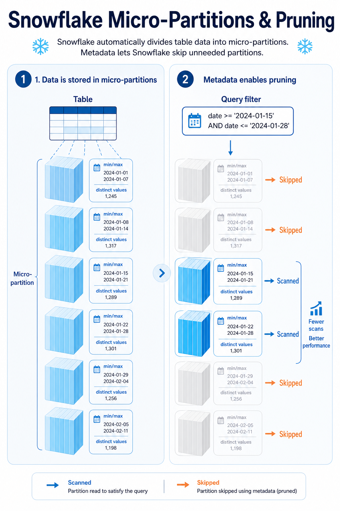

# Snowflakeのmicro-partitionとpruning

## まず結論

Snowflake では、テーブルデータは自動で `micro-partition` という小さな単位に分かれて保存されます。`pruning` は、その micro-partition ごとのメタデータを使って、読まなくてよい範囲を実行時に飛ばす仕組みです。

## これは何か

`micro-partition` は、Snowflake がテーブルを内部的に分割して持つ物理的な保存単位です。利用者が事前にパーティション定義を作るのではなく、データの投入順に応じて自動で作られます。

各 micro-partition には、列ごとの `min/max` や `distinct values` などのメタデータが保持されます。Snowflake はクエリのフィルタ条件とこのメタデータを照らし合わせて、関係のない micro-partition を読まずに済ませます。これが `pruning` です。

## どこで使うか

- 日付条件を入れているのに、なぜ速いクエリと遅いクエリがあるのか整理したいとき。
- Query Profile で scan が重い理由を考えたいとき。
- clustering key を切るべきか、まず SQL の書き方を見直すべきか判断したいとき。

## 全体像

1. データは自動で micro-partition に分かれて保存される。
2. 各 micro-partition には列ごとの範囲情報などのメタデータが付く。
3. クエリで `WHERE` 条件が来ると、Snowflake はその条件に合わない micro-partition を候補から外す。
4. 読む micro-partition が少ないほど、scan 量が減って速くなりやすい。
5. ただし、値の分布が散っていて範囲が重なりすぎると pruning は効きにくくなる。

## 理解用イラスト

この図では、左で `テーブル -> micro-partition -> メタデータ` の流れ、右で `フィルタ条件に合う partition だけ読む` という pruning の考え方を示しています。

## よくある疑問

### Q. micro-partition は自分で定義するの？

A. しません。Snowflake が自動で作ります。ここが一般的な静的パーティションとの大きな違いです。

### Q. pruning は何を飛ばしているの？

A. 行を 1 行ずつ見て飛ばすのではなく、まず `この micro-partition は条件に合いそうか` をメタデータで判定して、不要な micro-partition 自体を読まないようにしています。

### Q. `WHERE date = ...` を書けば必ず pruning は効く？

A. 必ずではありません。対象列の値が多くの micro-partition に広く散っていたり、条件式が pruning しにくい形だったりすると、広く scan されます。

### Q. clustering key は pruning とどう関係する？

A. clustering key は、よく絞り込みに使う列で近い値が近い micro-partition に寄るように整えるための手段です。これにより micro-partition ごとの値範囲の重なりが減ると、pruning が効きやすくなります。

### Q. pruning と columnar storage は同じ話？

A. 少し違います。pruning は `どの micro-partition を読むか` の話で、columnar storage は `読んだ micro-partition の中でどの列を読むか` の話です。Snowflake は両方で scan 量を減らします。

## 実務での見方

1. まず、遅いクエリがどの列で絞り込みをしているかを見る。
2. その列が、投入順やデータ分布の都合で広く散っていないか考える。
3. Query Profile で scan が支配的なら、`もっと pruning できる形か` を疑う。
4. 不要な関数適用や複雑な条件式で、列の素直な比較を壊していないか確認する。
5. それでも広く読むなら、clustering key やデータ配置の改善を検討する。

## 次回の確認

- [ ] このクエリはどの列で絞り込んでいるか。
- [ ] その列の値は micro-partition ごとにまとまっていそうか。
- [ ] 不要な partition を飛ばせる単純な条件式になっているか。
- [ ] scan 量の問題なのか、join や集約の問題なのかを分けて見たか。
- [ ] clustering key を考える前に、まず SQL とフィルタ列を見直したか。

## 関連トピック

- [Snowflakeのスピル](./Snowflakeのスピル.md)
- [SnowflakeのCTE再評価](./SnowflakeのCTE再評価.md)
- [Snowflakeウェアハウスの世代](./Snowflakeウェアハウスの世代.md)

## 参考リンク

- [Micro-partitions & Data Clustering](https://docs.snowflake.com/en/user-guide/tables-clustering-micropartitions)
  - micro-partition の定義、保持されるメタデータ、pruning の基本を確認する。
- [Understanding Snowflake Table Structures](https://docs.snowflake.com/en/user-guide/tables-micro-partitions)
  - Snowflake の物理テーブル構造を全体像から確認する。
- [Clustering Keys & Clustered Tables](https://docs.snowflake.com/en/user-guide/tables-clustering-keys)
  - pruning を効かせやすくするための clustering key の考え方を確認する。

## 更新履歴

- 2026-06-03: micro-partition と pruning の基礎、および説明用イラストを追加。
