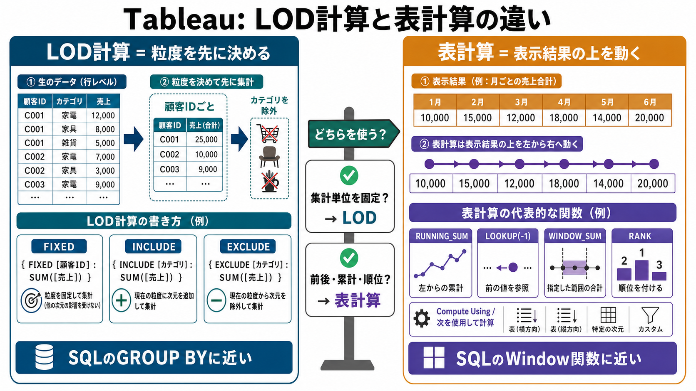

# TableauのLOD計算と表計算の違い

## まず結論

Tableauでは、LOD計算もWindow関数的な表計算も使えます。LOD計算は `どの粒度で先に集計するか` を決める道具で、表計算は `表示された結果の上をどの方向に動いて計算するか` を決める道具です。

## これは何か

`FIXED` `INCLUDE` `EXCLUDE` などのLOD計算と、`WINDOW_SUM` `RUNNING_SUM` `LOOKUP` `RANK` などの表計算を、実務で使い分けるための整理です。SQLで考えるなら、LODは `GROUP BY` に近く、表計算は `OVER(PARTITION BY ... ORDER BY ...)` に近い考え方です。

## どこで使うか

- 顧客単位、商品単位、月単位など、集計粒度を明示して計算したいとき。
- 月別累計、前月差、移動平均、ランキングを作りたいとき。
- ビューのディメンションを変えたら計算結果が変わり、理由を切り分けたいとき。
- SQLでやっていた集計やWindow関数をTableau側で再現したいとき。

## 全体像

```text
LOD計算
  = 元データに近い段階で、どの単位にまとめるかを決める
  = FIXED / INCLUDE / EXCLUDE

表計算
  = ビューに表示された集計結果の上で、方向や範囲を決めて計算する
  = WINDOW_SUM / RUNNING_SUM / LOOKUP / RANK など
```

一番大事な違いは、計算対象です。LOD計算はデータソースやビューの粒度を意識して集計値を作ります。表計算は、ビューに出ているマークや仮想テーブルを対象に計算します。

## 理解用イラスト

この図では、LOD計算を `先に集計粒度を固める処理`、表計算を `表示された結果の上を動く処理` として対比します。迷ったら、左は集計単位、右は計算方向を見ると戻りやすいです。



## LOD計算は粒度を固定する

LODは、Level of Detailの略です。Tableauでは、`FIXED` `INCLUDE` `EXCLUDE` を使って、計算する粒度を制御します。

### FIXED

```tableau
{ FIXED [顧客ID] : SUM([売上]) }
```

これは、ビューに何を置いていても、`顧客IDごとの売上合計` を作るイメージです。SQLなら、顧客IDで `GROUP BY` する考え方に近いです。

使う場面:
- 顧客ごとの累計購入額を出す。
- 初回購入日を顧客単位で固定する。
- ビューに月やカテゴリを置いても、顧客単位の基準値を保ちたい。

### INCLUDE

```tableau
{ INCLUDE [注文ID] : SUM([売上]) }
```

これは、今のビューに加えて、計算上だけ `注文ID` の粒度も含めるイメージです。ビューより細かい粒度で一度計算し、その後ビューの粒度に戻して使いたいときに向きます。

### EXCLUDE

```tableau
{ EXCLUDE [カテゴリ] : SUM([売上]) }
```

これは、ビューに `カテゴリ` があっても、計算ではカテゴリを外すイメージです。カテゴリ別の棒グラフを見ながら、カテゴリを無視した全体基準と比較したいときに使います。

## 表計算は表示結果の上を動く

TableauのWindow関数的な処理は、表計算として使います。SQLの `OVER` 句を直接書くのではなく、計算式と `次を使用して計算`、英語UIでは `Compute Using` で方向や区切りを決めます。

代表的な関数:

| やりたいこと | Tableau関数 | SQLのイメージ |
|---|---|---|
| 累計 | `RUNNING_SUM(SUM([売上]))` | `SUM() OVER (ORDER BY 日付)` |
| 移動平均 | `WINDOW_AVG(SUM([売上]), -2, 0)` | `AVG() OVER (...)` |
| 表示範囲の合計 | `WINDOW_SUM(SUM([売上]))` | `SUM() OVER (...)` |
| 前月や前行を見る | `LOOKUP(SUM([売上]), -1)` | `LAG()` |
| 次月や次行を見る | `LOOKUP(SUM([売上]), 1)` | `LEAD()` |
| 順位 | `RANK(SUM([売上]))` | `RANK() OVER (...)` |
| 表示順の番号 | `INDEX()` | `ROW_NUMBER()` に近い |

## 例で見る使い分け

### 顧客ごとの総売上を固定したい

```tableau
{ FIXED [顧客ID] : SUM([売上]) }
```

これはLOD計算です。顧客単位で先に売上を固めたいので、表示順や前後の行を見る必要はありません。

### 月別売上の累計を出したい

```tableau
RUNNING_SUM(SUM([売上]))
```

これは表計算です。ビューに表示された月の順番に沿って、1月、1月から2月、1月から3月、というように足していきます。

### 前月差を出したい

```tableau
SUM([売上]) - LOOKUP(SUM([売上]), -1)
```

これも表計算です。今のマークから見て1つ前のマークを参照します。

### 全体売上に対するカテゴリ比率を出したい

方法は2つあります。

```tableau
SUM([売上]) / WINDOW_SUM(SUM([売上]))
```

これは表計算で、表示されている範囲の合計を分母にします。

```tableau
SUM([売上]) / ATTR({ EXCLUDE [カテゴリ] : SUM([売上]) })
```

これはLOD計算で、カテゴリを外した売上を分母にします。ビューの表示範囲に強く連動させたいなら表計算、集計粒度を明示したいならLODを検討します。

## よくある疑問

### Q. TableauでSQLのWindow関数はそのまま書けますか

A. Tableauの計算フィールドでは、基本的にSQLの `OVER(PARTITION BY ... ORDER BY ...)` をそのまま書くのではなく、表計算関数と `次を使用して計算` で制御します。カスタムSQL側に書くことはできますが、その場合はデータソース側のSQLとして実行されます。

### Q. 表計算の結果がビュー変更で変わるのはなぜですか

A. 表計算は、現在のビューに表示された仮想テーブルを対象に計算するからです。行、列、色、詳細などに置くディメンションが変わると、区切りや計算方向も変わることがあります。

### Q. FIXEDはビューのフィルターを無視しますか

A. 通常のディメンションフィルターより先に評価されるため、見た目のフィルターと期待がずれることがあります。必要に応じてコンテキストフィルター、データソースフィルター、抽出フィルターを確認します。

### Q. 迷ったらどちらを使えばよいですか

A. `この単位で集計した値がほしい` ならLOD計算、`前の月、累計、ランキング、表示範囲の合計がほしい` なら表計算から考えます。

## 実務での見方

- 粒度を固定したいならLOD計算を使う。
- 表示順、前後の値、累計、ランキングを使いたいなら表計算を使う。
- 表計算では、計算式だけでなく `次を使用して計算` を必ず確認する。
- LOD計算では、フィルター順序とビューの粒度を確認する。
- SQLで先に作るかTableauで作るかは、再利用性、処理量、ビュー依存の有無で決める。

## 再利用チェックリスト

- [ ] 欲しい値は `集計粒度` の問題か、`表示順や前後関係` の問題か。
- [ ] LODなら、`FIXED` `INCLUDE` `EXCLUDE` のどれが近いか。
- [ ] 表計算なら、`Compute Using` の方向と区切りを確認したか。
- [ ] ビューのディメンションを変えたとき、結果が変わる前提か。
- [ ] SQL側で作るべき再利用指標ではないか。

## 次回の確認

- [ ] 月別売上の累計を `RUNNING_SUM` で作れるか。
- [ ] 顧客ごとの総売上を `FIXED` で作れるか。
- [ ] `次を使用して計算` の指定で結果が変わることを確認する。

## 関連トピック

- [Tableau抽出でSnowflakeとローカルマスターを組み合わせる運用](./Tableau抽出でSnowflakeとローカルマスターを組み合わせる運用.md)
- [データ可視化の分野まとめ](../10_分野まとめ.md)

## 参考リンク

- [Tableau Help: Create Level of Detail Expressions in Tableau](https://help.tableau.com/current/pro/desktop/en-us/calculations_calculatedfields_lod.htm)
  - `FIXED` `INCLUDE` `EXCLUDE` の考え方と構文を確認するための公式ドキュメント。
- [Tableau Help: Table Calculation Functions](https://help.tableau.com/current/pro/desktop/en-us/functions_functions_tablecalculation.htm)
  - `LOOKUP` `RANK` `RUNNING_SUM` などの表計算関数を確認するための公式ドキュメント。
- [Tableau Help: Transform Values with Table Calculations](https://help.tableau.com/current/pro/desktop/en-us/calculations_tablecalculations.htm)
  - 表計算がビュー内の値に対する変換であること、Compute Usingやpartitioning/addressingを確認するための公式ドキュメント。

## 更新履歴

- 2026-07-16: 初版作成。
