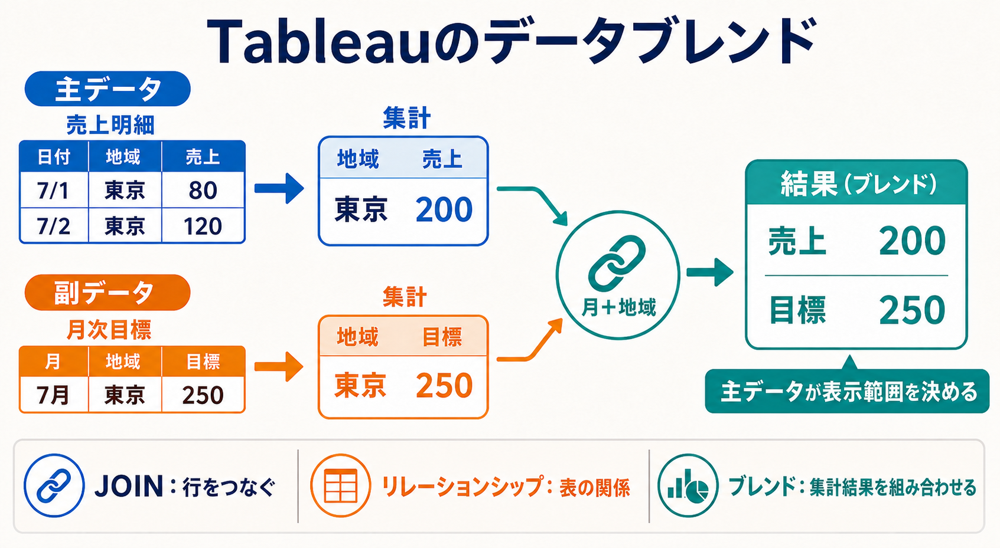

# Tableauのデータブレンド

## まず結論

Tableauのデータブレンドは、異なるデータソースを1つの表へ物理的に結合せず、シート上でそれぞれの集計結果を組み合わせる方法です。
`行を結合するJOIN` ではなく、`主データソースの集計結果へ副データソースの集計結果を補足する` と捉えると理解しやすくなります。通常はリレーションシップを優先し、別々のデータソースを保ったままシート単位で関連付けたい場合にデータブレンドを検討します。

## これは何か

データブレンドは、1枚のワークシートで複数の独立したデータソースを使うためのTableauの機能です。

- 最初にビューで使ったデータソースが `プライマリデータソース`
- 後から使うデータソースが `セカンダリデータソース`
- 両者を対応させる共通ディメンションが `リンクフィールド`

プライマリは青、セカンダリはオレンジのチェックマークで示されます。セカンダリ側では、リンクフィールドに鎖のアイコンが表示されます。

## どこで使うか

- 売上明細と月次目標など、粒度が異なる別データソースを比較するとき。
- データソースを1つに統合できず、別々の接続として保つ必要があるとき。
- シートごとに有効にするリンクフィールドを変えたいとき。
- 大きな副データソースから、必要な集計結果だけを補足したいとき。

## 全体像

例えば、日単位の売上と月単位の目標を `月 + 地域` で対応させます。

```text
プライマリ: 売上明細
日付        地域   売上
2026-07-01  東京    80
2026-07-02  東京   120
2026-07-01  大阪    70
        ↓ 月・地域で集計
東京 200 / 大阪 70

セカンダリ: 月次目標
月       地域   目標
2026-07  東京   250
2026-07  大阪   100
        ↓ 月・地域で集計
東京 250 / 大阪 100

リンクフィールド: 月 + 地域
        ↓
東京: 売上 200 / 目標 250
大阪: 売上  70 / 目標 100
```

処理の考え方は次の順番です。

1. プライマリデータソースからビューの構造と表示対象を作る。
2. ビューで使われる粒度とリンクフィールドに合わせて、セカンダリ側を集計する。
3. 一致したセカンダリの集計値をプライマリの結果へ補足する。

このため、動きはLEFT JOINに似ていますが、行レベルで結合するLEFT JOINそのものではありません。

## 理解用イラスト

この図では、売上と目標が別々に集計され、`月 + 地域` で対応付けられる流れを確認します。JOIN・リレーションシップとの違いと、主データが表示範囲を決める点も一枚で思い出せます。



## よくある疑問

### Q. JOINと何が違う？

A. JOINはデータソース内で行同士を結合し、1つの表にします。データブレンドは、別々のデータソースに問い合わせた集計結果をビュー上で組み合わせます。

### Q. リレーションシップと何が違う？

A. リレーションシップは1つのデータソース内で論理テーブルの関係を定義し、分析内容に応じて必要なデータを組み合わせます。元の粒度を保ちやすく、現在のTableauでは多くの場合に推奨される方法です。データブレンドは、独立した複数データソースにプライマリとセカンダリの役割を持たせます。

### Q. プライマリとセカンダリはどう決まる？

A. シートで最初にフィールドを使ったデータソースがプライマリになります。後から別データソースのフィールドを追加すると、そのデータソースがセカンダリになります。逆にしたい場合は、シートを作り直して先に使うデータソースを変えます。

### Q. セカンダリにある値が表示されないのはなぜ？

A. プライマリ側に対応する値がない、リンクが有効でない、データ型や値の表記が一致していない可能性があります。プライマリが表示対象の基準になるため、セカンダリだけに存在する地域や月は原則として表示されません。

### Q. `*` が表示されるのはなぜ？

A. 1つのマークにセカンダリ側の複数のディメンション値が対応し、Tableauが1つの値へ決められないためです。ビュー、リンクフィールド、セカンダリ側の粒度を確認します。

### Q. リンクフィールドが同名なら自動で使われる？

A. 同名の共通フィールドはリンク候補として認識されます。ただし、鎖アイコンが有効か、データ型が同じか、値が完全に対応するかを確認する必要があります。日付では `年` `月` `日` など、対応させる日付レベルにも注意します。

## 実務での見方

### 組み合わせ方法を選ぶ

| やりたいこと | 第一候補 | 見方 |
| --- | --- | --- |
| 元の粒度を保ちながら複数テーブルを使う | リレーションシップ | 現在の基本選択 |
| 行レベルで固定的に列を追加する | JOIN | キー重複による行数増加に注意 |
| 同じ構造のデータを縦に追加する | UNION | 列名とデータ型を確認 |
| 独立したデータソースの集計結果を補足する | データブレンド | 主副、リンク、表示粒度を確認 |

### 設定手順

1. プライマリにしたいデータソースのフィールドを先にビューへ置く。
2. セカンダリデータソースを選ぶ。
3. セカンダリ側で、対応に使うリンクフィールドの鎖アイコンを有効にする。
4. セカンダリのメジャーをビューへ追加する。
5. NULLや `*` が出たら、主副、リンク、データ型、値の表記、粒度を確認する。

### 再利用チェックリスト

- [ ] まずリレーションシップで実現できないか確認したか。
- [ ] どのデータソースを表示範囲の基準にするか決めたか。
- [ ] リンクフィールドは分析に必要な粒度になっているか。
- [ ] 複数キーが必要ではないか。例: `月 + 地域`。
- [ ] リンクフィールドのデータ型と値の表記が一致しているか。
- [ ] プライマリにない値が落ちても問題ないか。
- [ ] NULLや `*` が発生していないか。

## 次回の確認

- [ ] 実際のワークブックで青とオレンジのチェックマークを確認する。
- [ ] 鎖アイコンを有効・無効にし、結果の変化を確認する。
- [ ] プライマリを逆にしたシートを作り、表示対象の違いを確認する。
- [ ] JOIN、リレーションシップ、データブレンドで同じ例を作り、行数と集計値を比較する。

## 関連トピック

- [Tableau抽出でSnowflakeとローカルマスターを組み合わせる運用](./Tableau抽出でSnowflakeとローカルマスターを組み合わせる運用.md)
- [TableauのLOD計算と表計算の違い](./TableauのLOD計算と表計算の違い.md)
- [データ可視化の分野まとめ](../10_分野まとめ.md)

## 参考リンク

- [Tableau Help: Blend Your Data](https://help.tableau.com/current/pro/desktop/en-us/multiple_connections.htm)
  - データブレンドの定義、主副データソース、リンクフィールド、設定手順を確認する公式ドキュメント。
- [Tableau Help: Troubleshoot Data Blending](https://help.tableau.com/current/pro/desktop/en-us/multipleconnections_troubleshooting.htm)
  - NULL、リンク不成立、集計エラーなどを切り分けるための公式ドキュメント。
- [Tableau Help: Join Your Data](https://help.tableau.com/current/pro/desktop/en-us/joining_tables.htm)
  - リレーションシップとJOINの使い分けを確認する公式ドキュメント。

## 更新履歴

- 2026-07-25: 初版作成。
