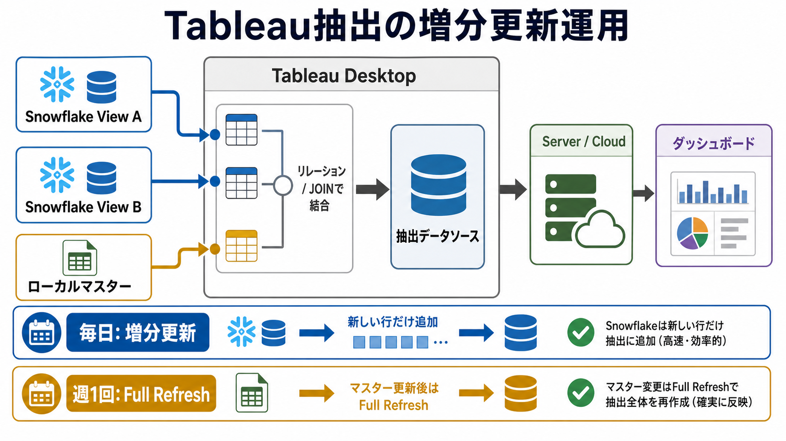

# Tableau抽出でSnowflakeとローカルマスターを組み合わせる運用

## まず結論

SnowflakeのViewとローカルのマスターファイルを組み合わせたデータソースは、Tableau Desktopで作成し、抽出としてServerまたはCloudへ公開できます。毎日増える本体データは抽出の増分更新で扱い、週次で変わるマスターは更新後にFull Refreshまたは再パブリッシュで反映するのが安全です。

## これは何か

Snowflake上の2つのViewと、手元で管理するマスターファイルをTableau上で結合し、ダッシュボード用の抽出データソースとして運用するための考え方です。特に、毎日全件を読み直さずに増分更新したい場合の手順と注意点を整理します。

## どこで使うか

- Tableau側だけ変更でき、Snowflake側のテーブルやViewを変更できないとき。
- Snowflakeの大きなデータを毎日全件スキャンしたくないとき。
- ローカルExcelやCSVのマスターを週次で手動更新しながら使うとき。
- Tableau ServerまたはTableau Cloudで定期更新するデータソースを作るとき。

## 全体像

基本の流れは、`SnowflakeのViewを読む部分` と `ローカルマスターを反映する部分` を分けて考えます。

```text
Snowflake View A
Snowflake View B
        ↓
Tableau Desktopで接続・関係設定
        ↓
ローカルマスターファイルを追加
        ↓
抽出データソースを作成
        ↓
毎日: Snowflake分を増分更新
週次: マスター更新後にFull Refreshまたは再パブリッシュ
```

日次増分更新に必要なのは、Tableauが新しい行を判断できる列です。候補は `loaded_at` `created_at` `business_date` `単調増加ID` です。可能なら、データがTableauに追加された基準として使いやすい `loaded_at` を優先します。

## 理解用イラスト

この図は、Tableau側だけで作れる複合データソースの更新運用を思い出すためのものです。日次増分はSnowflake側の新規行、週次更新はローカルマスター変更の反映、と分けて見るのが要点です。



## 具体的な操作手順

1. Tableau DesktopでSnowflakeに接続する。
   - `データに接続` から `Snowflake` を選ぶ。
   - サーバー、ウェアハウス、データベース、スキーマを指定する。
   - 対象のViewを2つ選ぶ。

2. Snowflakeの2つのViewを関係付ける。
   - 粒度が違う、または集計粒度をTableauに任せたい場合はリレーションシップを使う。
   - 1行単位で確定した結合結果を作りたい場合はJOINを使う。

3. ローカルのマスターファイルを追加する。
   - `接続の追加` からExcelまたはCSVを選ぶ。
   - Snowflake側のキーとマスター側のキーを対応させる。
   - マスター側のキーが一意かを確認する。重複があると行が増える原因になる。

4. 必要ならカスタムSQLで列を絞る。
   - 増分更新に使う列は必ずSELECTに含める。
   - 重い集計や複雑なWindow関数を入れすぎると、Snowflake側の処理が重くなりやすい。

5. 接続方式を抽出にする。
   - データソース画面右上の `接続: ライブ / 抽出` で `抽出` を選ぶ。
   - 抽出の編集で、増分更新に使う列を指定する。

6. ダッシュボードを作る。
   - 抽出データソースを使ってワークシートを作る。
   - KPI、明細、推移、フィルタをダッシュボードに配置する。

7. ServerまたはCloudへ公開する。
   - 可能ならワークブックだけでなく、データソースも公開して管理する。
   - 公開時に、Snowflake認証とローカルファイルの扱いを確認する。

8. 毎日の更新スケジュールを設定する。
   - Tableau ServerまたはTableau Cloud側で抽出更新スケジュールを作る。
   - 日次処理は増分更新にする。

9. マスター更新後の運用を決める。
   - マスターを週次で更新したら、Full Refreshまたは再パブリッシュで反映する。
   - マスター変更が過去行の分類や名称に影響する場合、増分更新だけでは不十分です。

## よくある疑問

### Q. カスタムSQLだけで増分更新できますか

A. カスタムSQL自体が差分管理するのではなく、カスタムSQLの結果に対してTableauの抽出増分更新を設定します。カスタムSQLには、増分判定用の列を必ず含めます。

### Q. ライブ接続ではだめですか

A. ライブ接続でも表示はできますが、閲覧やフィルタ操作のたびにSnowflakeへ問い合わせます。毎日増える大きなデータで全件スキャンを避けたいなら、基本は抽出と増分更新を使います。

### Q. マスター更新も増分更新で反映できますか

A. 新しい行に対するマスター付与は反映できます。ただし、既に抽出済みの過去行に付いた名称やカテゴリを変えたい場合は、Full Refreshが安全です。

### Q. ローカルファイルはServerやCloudで自動更新できますか

A. 自分のPC上のファイルをそのまま参照している場合、ServerやCloudから読めず更新に失敗する可能性があります。Serverから見える共有フォルダに置く、CloudならTableau Bridgeを使う、またはファイルを同梱して再パブリッシュする運用を検討します。

## 実務での見方

- 日次の本体データは、`新規行をどう判定するか` を最初に確認する。
- マスターは、`週次更新後に過去行へ反映が必要か` を確認する。
- ローカルファイルは、`公開後にServer / Cloudが読める場所にあるか` を確認する。
- Snowflake側を変更できない場合でも、Tableau側で列選択、抽出、増分更新、スケジュール運用までは設計できる。
- ただし、過去データ修正、削除、重複排除、マスターの履歴管理が必要なら、Tableauだけで完結させるよりDB側やETL側の整備が本筋です。

## 再利用チェックリスト

- [ ] Snowflakeの2つのViewの結合キーと粒度を確認したか。
- [ ] ローカルマスターのキーが一意か確認したか。
- [ ] 増分更新に使う列を抽出結果に含めたか。
- [ ] 接続方式をライブではなく抽出にしたか。
- [ ] 日次更新は増分更新、マスター更新後はFull Refreshという運用を決めたか。
- [ ] ServerまたはCloudからマスターファイルを読める構成か確認したか。

## 次回の確認

- [ ] Tableau Cloudの場合、Tableau Bridgeが必要か確認する。
- [ ] マスター変更が過去行に影響するか確認する。
- [ ] 増分更新列に `loaded_at` を使えるか確認する。

## 関連トピック

- [Tableau CloudとServerとCloud階層の違い](./Tableau%20CloudとServerとCloud階層の違い.md)
- [データ可視化の分野まとめ](../10_分野まとめ.md)

## 参考リンク

- [Tableau Help: Refresh Extracts](https://help.tableau.com/current/pro/desktop/en-us/extracting_refresh.htm)
  - 抽出のFull RefreshとIncremental Refreshを確認するための公式ドキュメント。
- [Tableau Help: Tableau Bridge](https://help.tableau.com/current/online/en-us/to_bridge.htm)
  - Tableau Cloudからプライベートネットワークやローカル側データへ接続する考え方を確認するための公式ドキュメント。

## 更新履歴

- 2026-07-16: 初版作成。
