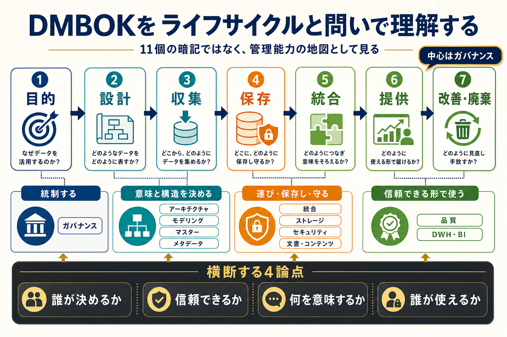

# DMBOKホイールの全体像

## まず結論

DMBOKホイールは、`11個を順番に覚える表` ではなく、`データの一生を組織として管理するための地図` です。理解の芯は、`中央はガバナンス` `周囲は専門領域` `見る順番はライフサイクルと問い` の3点です。

## これは何か

データが生まれて、設計され、保存され、活用され、廃棄されるまでを、どの管理能力で支えるか整理するフレームワークです。実務では、11領域の名称暗記よりも、`この問題はどの領域が中心か` を考えるために使います。

## どこで使うか

- DMBOKの11領域を、実務の流れに重ねて理解したいとき
- 品質問題や定義不一致を、どの管理領域で見るか整理したいとき
- 分析、DWH、計測、権限、メタデータのつながりを説明したいとき
- 自分の業務データフローに、論点の抜け漏れがないか確認したいとき

## 全体像

- 中央: `Data Governance`
  - 誰が決めるか、誰が責任を持つかを統制する
- 意味と構造を決める領域
  - `Data Architecture`
  - `Data Modeling & Design`
  - `Reference & Master Data`
  - `Metadata`
- 運び、保存し、守る領域
  - `Data Integration & Interoperability`
  - `Data Storage & Operations`
  - `Data Security`
  - `Documents & Content Management`
- 信頼できる形で使う領域
  - `Data Quality`
  - `Data Warehousing & Business Intelligence`

## 理解用イラスト

この図では、`7段階のデータライフサイクル` を横軸に置き、その上に `11領域` と `横断する4論点` を重ねています。ホイールを静止画として覚えるより、`各段階でどんな問いを持つか` で見る方が実務に戻しやすくなります。

## よくある疑問

### Q. DMBOKホイールは、工程の順番を表す図なの？

A. いいえ。開発工程の一本道ではありません。データは `目的設定 -> 設計 -> 収集 -> 保存 -> 統合 -> 提供 -> 改善・廃棄` を循環し、その全体を複数の管理領域が支えます。

### Q. なぜ中心が Data Governance なの？

A. どの領域でも、最後に必要なのは `誰が決めるか` `どの基準で決めるか` `例外時にどう統制するか` だからです。品質や設計だけ整っても、責任が曖昧だと運用は崩れます。

### Q. 11領域は、どう覚えるのがよい？

A. 領域名だけで覚えるより、各領域を `問い` で思い出す方が実務で使えます。たとえば、ガバナンスは `誰がルールを決めるか`、アーキテクチャは `データはどこにありどうつながるか`、品質は `このデータを信頼してよいか` です。

### Q. Data Architecture と Data Modeling & Design は何が違う？

A. `Architecture` は全体配置と流れの設計です。`Modeling & Design` は、顧客、注文、イベントなどを、どの粒度と関係で表すかという中身の設計です。

### Q. Master Data と Metadata は何が違う？

A. `Master Data` は共通の基準データです。`Metadata` は、そのデータが何を意味し、どこから来て、どう使うかを説明する情報です。

### Q. 品質だけ見れば十分？

A. 不十分です。品質問題の背景には、定義不一致、責任不在、権限不足、メタデータ不足、統合設計の崩れがあることが多いので、周辺領域まで見ます。

## 実務での見方

### まず7段階で置く

1. 目的を決める
2. 設計する
3. 発生・収集する
4. 保存・運用する
5. 統合・加工する
6. 提供・活用する
7. 改善・廃棄する

### 次に各段階へ問いを置く

- 目的: `何のために持つのか。誰が責任を持つのか`
- 設計: `何を、どの単位で、どの構造で表すのか`
- 収集: `正しいデータを取りこぼさず取れているか`
- 保存: `失わず、安全に、安定して使えるか`
- 統合: `意味を壊さず一貫した形にできるか`
- 提供: `利用者が誤解せず安全に使えるか`
- 改善・廃棄: `持ち続ける価値とリスクを管理できているか`

### 横断する4領域を重ねる

- `Governance`: 誰が決めるか
- `Quality`: 信頼できるか
- `Metadata`: 何を意味するか
- `Security`: 誰が使えるか

### 具体例で見る

- EC注文データなら、`モデリング` で注文粒度を決め、`マスター` で商品コードをそろえ、`統合` でDWHへ連携し、`BI` で売上を可視化します。
- GA4分析なら、計測だけでなく、`イベント定義` `ID連携` `欠損検証` `権限管理` `指標定義` までがDMBOKの管理対象です。

## 次回の確認

- [ ] DMBOKを `11領域の暗記` ではなく `管理能力の地図` として説明できるか
- [ ] 7段階のライフサイクルに、どの領域が主に関わるか言えるか
- [ ] `中心となる領域` と `連携が必要な領域` を分けて説明できるか
- [ ] `Architecture` と `Modeling`、`Master Data` と `Metadata` の違いを言えるか
- [ ] 自分の業務データフローへ11領域を重ねられるか

## 関連トピック

- [データ管理の分野まとめ](../10_分野まとめ.md)
- [DMBOKホイールを生成AIクエリ生成システムへ当てる見方](./DMBOKホイールを生成AIクエリ生成システムへ当てる見方.md)

## 参考リンク

- [DAMA-DMBOK公式紹介](https://dama.org/learning-resources/dama-data-management-body-of-knowledge-dmbok/)
  - DMBOKの位置づけと学習入口の確認用
- [DMBOK2Rインフォグラフィック](https://dama.org/dmbok2r-infographics/)
  - 公式図版と利用条件の確認用

## 更新履歴

- 2026-06-27: ライフサイクルと問いで理解する構成へ全面更新し、図解を追加
- 2026-06-02: QA型へ再構成
- 2026-06-01: 新しい見出し構成へ更新
- 2026-05-31: 初版作成
