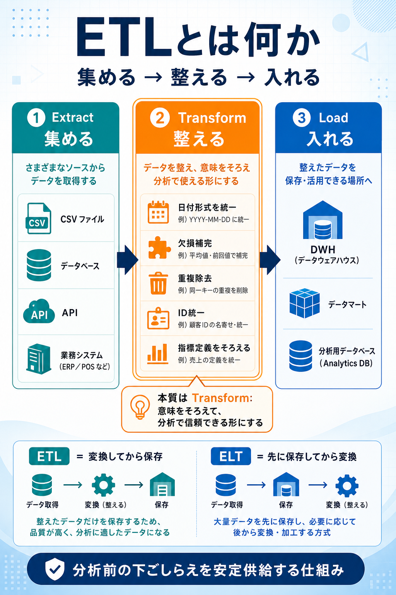

# ETLとは何か

## まず結論

ETLは、`元データを集めて、意味をそろえて、使う場所へ入れる` 仕組みです。ポイントは、単なるデータ移動ではなく、`分析で信頼して使える形へ整える` ところにあります。

## これは何か

ETLは `Extract / Transform / Load` の略です。分析や業務でそのまま使えない生データを、共通ルールで扱えるデータへ変換して、DWHや分析用データベースへ届ける流れを指します。

## どこで使うか

- 複数の業務システムやCSVからデータを集めるとき
- ダッシュボードや集計の前に、定義や形式をそろえるとき
- 手作業の前処理を減らし、同じ処理を繰り返し実行したいとき
- `数字が毎回ずれる` 原因を、データ準備の観点から切り分けるとき

## 全体像

- `Extract`
  - 元システム、CSV、API、DBからデータを取り出す
- `Transform`
  - 型、定義、粒度、表記ゆれ、重複、欠損を整える
- `Load`
  - DWH、データマート、分析用DBへ保存する

ETLを一言で見るなら、`分析前の下ごしらえを自動で安定供給するライン` です。3段階のうち、本質は `Transform` にあります。ここで日付形式、商品コード、指標定義、返品の扱いなどをそろえるため、分析結果の再現性が決まります。

## 理解用イラスト

左から右へ、`元データ -> 変換 -> 分析基盤` の流れで見ると理解しやすいです。中央の `Transform` が、単なる配管ではなく `意味をそろえる工程` であることを示しています。

## よくある疑問

### Q. ETLは単なるデータ移動と何が違う？

A. 違いは `T` にあります。データを移すだけなら移送ですが、ETLは `同じ意味で比べられる形へ整える` ところまで含みます。

### Q. なぜ Transform が一番重要なの？

A. 日付形式、ID体系、欠損、重複、指標定義がバラバラだと、同じ売上でも部署ごとに別の数字になります。Transform は `見た目` ではなく `定義` をそろえる工程です。

### Q. ETLは一回作れば終わり？

A. 終わりではありません。実務では、日次や時間単位で繰り返し回る `運用の仕組み` として設計します。再実行性、監視、エラー検知も重要です。

### Q. ETLとELTはどう違う？

A. ETLは `変換してから保存する`、ELTは `先に保存してから変換する` という違いです。クラウドDWHではELTが増えましたが、`分析に使える形へ整える` という目的は同じです。

### Q. 前処理やデータパイプラインと同じ？

A. 完全には同じではありません。前処理は Transform の一部、データパイプラインは ETL を含むより広い仕組みです。

## 実務での見方

- 良いETLは `正しいデータを、同じルールで、繰り返し供給する`
- 重要なのは `自動化` `再現性` `エラー検知` `追跡可能性`
- 数字ずれが起きたら、集計SQLだけでなく `Transformで何をそろえたか` を疑う
- 設計レビューでは `何をどう整え、どこへ入れるか` を3段階で分けて確認する

具体例:
- Extract: 店舗システム、EC、CSVから売上を取得する
- Transform: 日付形式を統一する、商品IDをそろえる、返品をマイナス計上する、重複を除く
- Load: 日次売上テーブルとしてDWHへ保存する

## 再利用チェックリスト

- [ ] ETLを `集める -> 整える -> 入れる` の3段階で説明できるか
- [ ] `Transformが本質` と言える理由を説明できるか
- [ ] `データ移動` と `意味をそろえる` の違いを言えるか
- [ ] ETLとELTの違いを一文で言えるか
- [ ] 良いETLの条件として `再現性` と `エラー検知` を挙げられるか

## 関連トピック

- [データ管理の分野まとめ](../10_分野まとめ.md)
- [DMBOKホイールの全体像](./DMBOKホイールの全体像.md)

## 更新履歴

- 2026-06-11: 初版作成
