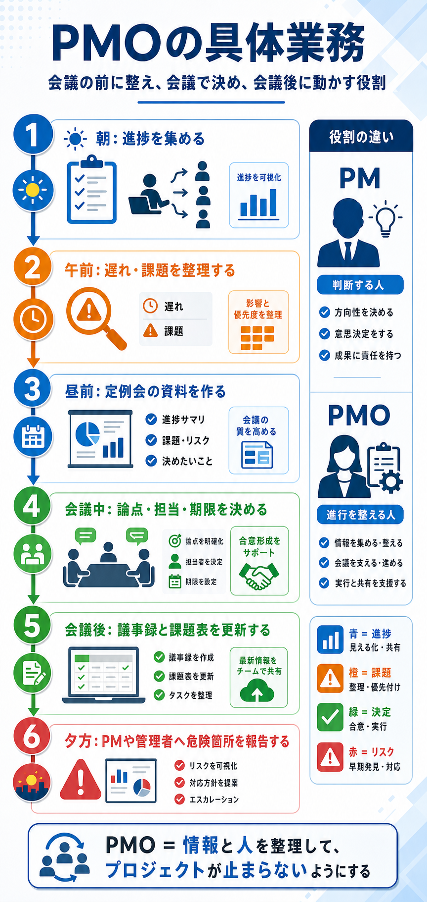

# PMOの具体業務

## まず結論

PMO は、プロジェクトの進捗、課題、会議、関係者の動きを整理して、全体が止まらないようにする役割です。
自分で成果物を作るというより、情報を集め、問題を見える化し、誰が何をいつまでにやるかを整える実務を担います。

## これは何か

このトピックは、PMO の仕事を「肩書きの説明」ではなく、日々どんな作業をしているかで理解するためのノートです。
特に、IT プロジェクトで PMO が会議の前後と進行中に何をしているかを、実務の流れで整理します。

## どこで使うか

- IT コンサルや SIer の人が PMO として入る意味を理解したいとき
- プロジェクト推進、進捗管理、課題管理の仕事像をつかみたいとき
- PM と PMO の役割の違いを整理したいとき
- 会議、課題表、進捗報告がどうつながるかを見たいとき

## 全体像

- PMO の中心業務は、情報を集めること、整理すること、決めたことを動かすことです
- 仕事は「会議前に整える -> 会議で決める -> 会議後に追いかける」の流れで回ります
- 日中の実務では、進捗確認、課題整理、資料作成、議事録更新、関係者調整が連続しています
- PM が判断する人なら、PMO は判断に必要な材料と進行を整える人です
- 遅延、未決事項、依存関係を早く見つけて、止まる前に対処するのが重要です

## 理解用イラスト

この図は、PMO の 1 日の流れと、PM との役割の違いを一枚で戻すためのものです。
上から順に追うと、進捗収集から報告までの実務がどうつながるかを思い出せます。

## よくある疑問

### Q. PMO は会議の議事録係なのか

A. それだけではありません。議事録は一部で、本質は課題、進捗、担当、期限を整理して、会議で決まったことを実際に進む状態へ変えることです。

### Q. PM と PMO は何が違うのか

A. PM は方針や優先順位を判断し、成果責任を持つ役割です。PMO はその判断ができるように情報を整え、関係者が動ける状態を作ります。

### Q. IT コンサルが PMO に入るのはなぜか

A. プロジェクトでは、提案力だけでなく、論点整理、資料作成、経営層報告、関係者調整が必要だからです。IT コンサルはその実務支援役として PMO に入ることが多いです。

## 実務での見方

- 朝は各チームの進捗を集め、遅れや確認待ちを見つける
- 午前は課題表や進捗表を更新し、影響範囲や優先順位を整理する
- 定例会の前には、進捗、課題、相談事項を短く伝わる資料へまとめる
- 会議中は、論点、担当、期限、未決事項を曖昧にせず、その場で形にする
- 会議後は、議事録、課題表、ToDo を更新し、決まったことが流れないように共有する
- 夕方は PM や管理者に対して、どこが危ないか、何の判断が必要かを報告する

## 次回の確認

- [ ] PMO の仕事を「会議前」「会議中」「会議後」で言い分けられるか
- [ ] PM と PMO の違いを「判断」と「進行整理」で説明できるか
- [ ] PMO の成果物として、進捗表、課題表、議事録、報告資料を挙げられるか

## 関連トピック

- [事業会社の意思決定と上申の流れ](./事業会社の意思決定と上申の流れ.md)

## 参考リンク

- 一般公開された参考リンクは未設定

## 更新履歴

- 2026-06-26: 初版作成
