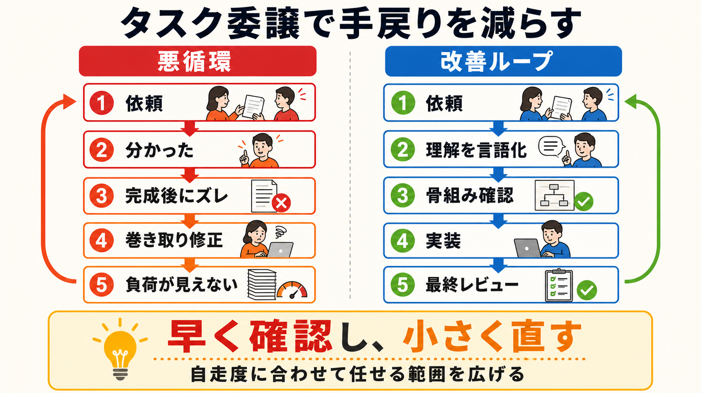

# タスク委譲で手戻りを減らす協働設計

## まず結論

タスク委譲が機能しないとき、問題は単純な作業量ではなく、依頼者に設計・説明・レビュー・修正が集中する構造にあります。
完成後にズレを直すのではなく、`理解の言語化` と `骨組み段階の確認` を工程に入れ、相手の自走度に合う範囲で任せることが重要です。

## これは何か

経験や技術力に差があるメンバー同士で仕事を進めるときに、見えない巻き取りと手戻りを減らすための協働設計です。
個人の能力評価ではなく、役割、成果物、確認地点、相談条件を明確にしてプロジェクトを安定させます。

## どこで使うか

- タスクを渡しても、完成後に大きな修正が必要になるとき
- 「分かりました」と返答されたのに、意図と違う成果物が出てくるとき
- サブ担当者の工数はあるが、メイン担当者の負担が減らないとき
- 納期を守りながら、相手の自走範囲も少しずつ広げたいとき

## 全体像

うまくいかない委譲では、次の悪循環が起きます。

1. 依頼者がタスクを説明する
2. 相手が「分かった」と答えて完成まで進める
3. 完成後に認識のズレが見つかる
4. 依頼者がレビューと修正を巻き取る
5. 納期は守れても、負荷と問題が周囲から見えなくなる

改善の中心は、確認を増やすことではなく、確認を早い段階へ移すことです。

`依頼 → 相手が理解を説明 → 骨組みを確認 → 実装 → 最終レビュー`

これにより、大きな手戻りになる前に認識差を発見できます。

## 理解用イラスト

左は、完成後のズレを依頼者が黙って巻き取る悪循環です。右は、着手前の理解確認と骨組み段階のレビューによって、手戻りを小さくする改善ループです。

## よくある疑問

### Q. 「分からなければ質問して」と伝えるだけでは不十分なのか

A. 不十分な場合があります。本人が分かったつもりなら、質問は出ません。着手前に「何を、どのような形で作るか」を本人の言葉で説明してもらうほうが、認識差を見つけやすくなります。

### Q. 細かく確認すると、マイクロマネジメントにならないか

A. 永続的に細かく管理するのではなく、自走可能な範囲が分かるまで確認地点を置く考え方です。成果が安定したタスクから、中間確認を減らしていきます。

### Q. 工数が多いメンバーには、より多くのタスクを渡すべきではないか

A. 工数だけで判断すると、レビューと修正を含めた総工数が増えることがあります。`任せた量` ではなく、`そのまま利用できる成果物が増えたか` で委譲の効果を見ます。

### Q. 納期と育成は同時に進められるか

A. 進められますが、同じタスクですべてを満たそうとしないことが重要です。納期に直結する設計や難所は経験者が持ち、完成条件が明確な小さなタスクで自走経験を積んでもらいます。

## 実務での見方

### 1. タスクには6つの情報を付ける

- 目的: 何のために行うか
- 成果物: 何を出せば完了か
- 完了条件: 何が正しい状態か
- 対象外: 今回はどこまで考えなくてよいか
- 中間確認: いつ、何を見せるか
- 相談条件: 何分迷ったら、どの状態で相談するか

### 2. 自走度に合わせて任せる範囲を変える

- 高い曖昧さを含む仕事: 全体設計、優先順位、難しい判断
- 中程度の仕事: 方針を共有したうえでの実装、調査、整理
- 低い曖昧さの仕事: 既存パターンの横展開、検算、表示確認、テスト

最初は低い曖昧さの仕事から任せ、成果が安定したら判断を含む範囲を広げます。

### 3. フィードバックは人格ではなく工程に向ける

次のように、事実、影響、今後の進め方を順に伝えます。

> 依頼時の意図と完成した成果物にズレがあり、完成後の修正に時間がかかるケースがありました。今後は、着手前に認識を説明してもらい、骨組みの段階でも一度確認したいです。

### 4. 管理者には委譲コストを共有する

「もっとタスクを渡す」ことが、そのまま処理能力の増加になるとは限りません。
依頼、途中確認、レビュー、修正にかかった時間を簡単に記録し、プロジェクト上の制約として共有します。

### 5. 改善を見る指標

- 完成後の大幅な修正回数
- 中間確認で発見できた認識差
- 依頼者が修正に使った時間
- そのまま利用できた成果物の割合
- 同じ種類のタスクを次回は単独で完了できたか

## 再利用チェックリスト

- [ ] 目的と成果物を分けて伝えた
- [ ] 完了条件と対象外を明確にした
- [ ] 相手の言葉で理解を説明してもらった
- [ ] 完成前に骨組みを確認した
- [ ] 相談する時間・状態の目安を決めた
- [ ] 相手の自走度に合うタスクを選んだ
- [ ] 巻き取った修正を見えないままにしていない
- [ ] 成果が安定したら確認工程を減らした

## 次回の確認

- [ ] 直近の1タスクで、着手前の理解確認と骨組みレビューを試す
- [ ] 依頼・レビュー・修正に使った時間を記録する
- [ ] 1〜2タスク後に、任せられる範囲が広がったかを振り返る

## 関連トピック

- [PMOの具体業務](./PMOの具体業務.md)
- [事業会社の意思決定と上申の流れ](./事業会社の意思決定と上申の流れ.md)

## 参考リンク

- 一般公開された参考リンクは未設定

## 更新履歴

- 2026-08-13: 初版作成
