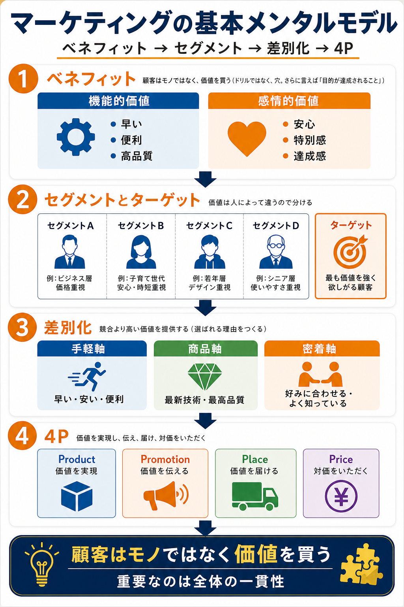

# ドリルを売るには穴を売れで学ぶマーケティングの基本モデル

## まず結論
この本の中核は、マーケティングを「商品を売ること」ではなく、「特定の顧客にとっての価値を設計し、伝え、届け、対価をいただくこと」と捉えることにある。
頭に入れる順番は `ベネフィット -> セグメント -> 差別化 -> 4P` で考えると崩れにくい。

## これは何か
『ドリルを売るには穴を売れ』のまとめページから、マーケティングの骨格だけを抜き出して、後で使えるメンタルモデルに圧縮したノート。
顧客が買うのはモノではなく価値であり、その価値は人によって違うため、誰に何をどう届けるかを一貫して設計する必要がある。

## どこで使うか

- 施策を考える前に「誰に何を届けるのか」を整理するとき
- KPI や分析軸が弱く、そもそもの価値設計を見直したいとき
- 競合比較で「なぜ選ばれるのか」を言語化したいとき
- Product / Promotion / Place / Price が噛み合っているか確認したいとき

## 全体像

1. 顧客はモノではなく価値を買う
   - ドリルそのものではなく、穴を開けたいという目的の達成を買う
2. 価値はベネフィットで表す
   - 機能的価値と感情的価値に分けて考える
3. 価値は人によって違う
   - だから顧客を分ける。これがセグメンテーション
4. 分けた中で最も狙う相手を決める
   - これがターゲット
5. 競合より高い価値を出す
   - これが差別化
6. 価値を具体化し、伝え、届け、対価をいただく
   - これが 4P
7. 全体が一貫しているほど強い
   - ターゲット、差別化、4P がばらばらだと弱い

## 理解用イラスト
この図は、写真10枚の内容を `価値 -> 顧客 -> 選ばれる理由 -> 実行` の順に戻せるよう1枚に圧縮したもの。

## よくある疑問

### Q. 「ドリルではなく穴を売れ」は何を意味しているのか

A. 顧客は商品そのものを欲しているのではなく、その商品によって達成される結果を欲している、という意味。さらに言えば、穴そのものではなく「目的が達成されること」を買っている。

### Q. ベネフィットはどう分ければよいのか

A. まずは `機能的価値` と `感情的価値` の 2 つに分ける。機能的価値は「早い・便利・高品質」などで、感情的価値は「安心・特別感・達成感」など。

### Q. セグメントとターゲットはどう違うのか

A. セグメントは顧客を分けた単位で、ターゲットはその中で実際に売るべき顧客セグメント。分けることと、狙うことは別の判断になる。

### Q. 差別化は何を選べばよいのか

A. この本では大きく `手軽軸` `商品軸` `密着軸` の 3 つで考える。早さや安さで勝つのか、品質で勝つのか、顧客理解で勝つのかを先に決めると整理しやすい。

### Q. 4P は何のために使うのか

A. 差別化した価値を、実際の売り方まで落とすために使う。Product が価値の実体、Promotion が伝達、Place が届け方、Price が対価の設計になる。

## 実務での見方

### 1. 施策前にベネフィットを先に言語化する
- 何を売るかではなく、顧客のどの欲求を満たすかを書く
- 機能的価値だけでなく、感情的価値も 1 行で置く

### 2. 顧客を分けずに全員へ売ろうとしない
- 価値が人によって違う以上、同じ訴求で全員に刺さることは少ない
- セグメントごとに欲しい価値が違う前提で見る

### 3. 差別化の軸を 1 つ決める
- 早い・安い・便利で勝つのか
- 最新技術・最高品質で勝つのか
- 好みに合わせる・よく知っているで勝つのか

### 4. 4P を別々に最適化しすぎない
- 高級路線なのに価格だけ安い
- 密着型なのにチャネルが無機質
- 手軽さを売るのに説明や購入手順が重い

こうしたズレは、一貫性の欠如として顧客に伝わる。

### 5. 分析の問いにもそのまま使う
- どのセグメントがどの価値を強く求めているか
- どの差別化軸が実際に選ばれる理由になっているか
- 4P のどこで離脱や摩擦が起きているか

## 再利用チェックリスト

- [ ] 顧客が本当に買っている価値を 1 行で言える
- [ ] 機能的価値と感情的価値を分けて書ける
- [ ] セグメントとターゲットを混同していない
- [ ] 差別化の軸を 1 つ主軸として置けている
- [ ] 4P がその差別化と整合している
- [ ] 全体の一貫性を崩すズレがない

## 次回の確認

- 具体的なサービスを 1 つ選び、`ベネフィット -> セグメント -> 差別化 -> 4P` で分解してみる
- 自分が最近使ったサービスを 1 つ選び、「なぜそこを選んだか」を機能的価値と感情的価値に分けてみる
- 分析テーマを考えるとき、最初に「誰のどの価値を見る分析か」を書いてみる

## 参考

- ユーザー提供の書籍写真
  - 『ドリルを売るには穴を売れ』の各章まとめページと重要チャートをもとに整理

## 関連トピック

- [専門知識をコンテンツ化して収益化する設計](./専門知識をコンテンツ化して収益化する設計.md)
- [SMPとMPと予算策定におけるDAの役割](./SMPとMPと予算策定におけるDAの役割.md)
