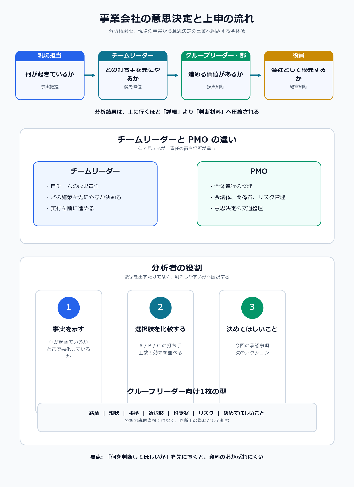

# 事業会社の意思決定と上申の流れ

## まず結論

事業会社の意思決定は、`現場が事実をつかむ -> 管理者が論点を絞る -> 関係者で調整する -> 決裁者が判断する -> 実行して振り返る` という流れで進みやすいです。

分析者にとって大事なのは、分析結果をそのまま出すことではなく、相手が判断できる形へ翻訳することです。

## これは何か

事業会社の中で、現場担当、チームリーダー、グループリーダー、部長、役員、PMO がそれぞれ何を見てどう判断するかを整理したノートです。

## どこで使うか

- 分析結果を上司へ報告するとき
- 上申資料や会議資料を1枚で組むとき
- PMO や他部署と調整しながら施策を進めるとき
- 分析が意思決定にどうつながるかを理解したいとき

## 全体像

- 現場担当は、何が起きているかをつかむ
- チームリーダーは、どの打ち手を先にやるかを決める
- グループリーダーや部長は、部門として進める価値があるかを見る
- 役員は、会社として優先する意味があるかを判断する
- PMO は、関係者、会議体、進捗、リスクを整理して全体が進む形に整える
- 分析者は、数字を見せるだけでなく、選択肢と推奨案を言葉にする

## 理解用イラスト

この図は、分析結果が現場の事実から上申資料へ変わる流れと、チームリーダーと PMO の役割の違いを1枚で見るためのものです。

## よくある疑問

### Q. チームリーダーと PMO は何が違うか

A. チームリーダーは自チームの成果責任を持ち、PMO は複数関係者が動けるように全体進行と意思決定整理を担います。

### Q. 上に行くほど何が変わるのか

A. 現場では事実把握が重く、上位役職になるほど優先順位、投資価値、他部署影響、リスクの比重が上がります。

### Q. 分析者は分析手法まで詳しく説明すべきか

A. 必要な場面はありますが、上申や報告では手法の詳細より、何が起きていて、何を推奨し、何を判断してほしいかの方が優先されます。

### Q. グループリーダー向け資料で迷ったらどうするか

A. `今回この資料で何を判断してほしいか` を1行で先に書き、その判断に必要な事実、選択肢、推奨案だけに絞ります。

## 実務での見方

### 1. 役職ごとに資料の主語を変える

- 現場担当向け: 何が起きているか
- チームリーダー向け: どの施策を先にやるか
- PMO 向け: どう進めれば全体が回るか
- グループリーダーや部長向け: 進める価値と判断ポイントは何か

### 2. 上申資料は判断用の1枚として組む

最低限の型は次です。

- 結論
- 今起きていること
- そう判断する根拠
- 取りうる選択肢
- 推奨案
- リスクと前提
- 今回決めてほしいこと

### 3. グループリーダー向け資料では判断事項を先に置く

たとえば次のように書くと芯がぶれにくくなります。

- 結論: A施策を先行実施したい
- 現状: 重要KPIが悪化している
- 根拠: 悪化セグメントと主要因が見えている
- 選択肢: A / B / C
- 推奨案: 工数と効果のバランスからAを推す
- 決めてほしいこと: 2週間の先行実施の承認

### 4. 分析者は数字を意思決定の言葉へ翻訳する

- 分析の言葉: 初期解約率が特定セグメントで上昇
- 現場の言葉: 導入初期でつまずいている顧客が多い
- リーダーの言葉: オンボーディング改善を最優先で試すべき
- 管理職の言葉: 小さい投資で収益改善余地があるため先行判断したい

### 5. 資料が弱くなる典型を避ける

- グラフが多いのに結論がない
- 原因候補はあるが優先順位がない
- 効果を語るが必要コストがない
- 誰に何を決めてほしいかが書かれていない

## 次回の確認

- [ ] いま扱っている分析テーマを1つ選び、グループリーダーに何を判断してほしいかを1行で書く
- [ ] その判断に必要な数字を3つ以内に絞る
- [ ] 選択肢、推奨案、リスクを1行ずつ書く

## 関連トピック

- [分析依頼を受けてからアウトプットを出すまでの進め方](../../分析全般/20_トピック/分析依頼を受けてからアウトプットを出すまでの進め方.md)
- [イシュー思考の基本](../../分析全般/20_トピック/イシュー思考の基本.md)
- [3年トレンド分析依頼を優先度付き示唆へ変える返し方](../../分析全般/20_トピック/3年トレンド分析依頼を優先度付き示唆へ変える返し方.md)

## 更新履歴

- 2026-06-20: 初版作成
