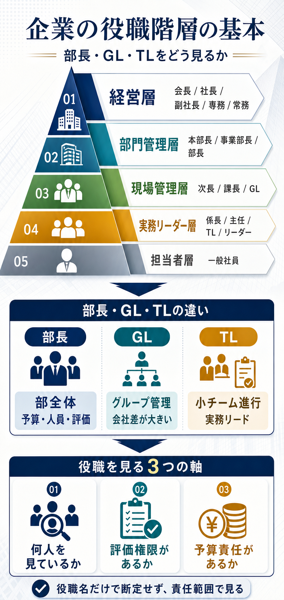

# 企業における役職階層の基本

## まず結論

企業の役職階層は、`会社全体を見る層` `部門を動かす層` `現場をまとめる層` `担当者層` に大きく分かれます。

`部長` は部門責任、`GL` はグループ管理、`TL` は実務チームの進行役として置かれることが多いですが、`GL` と `TL` は会社ごとの定義差が大きいため、名前よりも `誰を管理するか` `評価権限があるか` `予算責任があるか` で見るのが実務的です。

## これは何か

日本企業や事業会社でよく出る役職名を、上から下までの階層と役割の違いで整理したノートです。

`部長` `課長` `係長` `主任` のような日本語役職と、`GL` `TL` `Manager` のような英語系の呼び方を、同じ軸で見比べられるようにまとめています。

## どこで使うか

- 組織図や会議参加者を見て、誰がどの判断を持つかを理解したいとき
- 上司、部長、GL、TL 向けに報告内容の粒度を変えたいとき
- 会社の中で `誰に何を決めてもらうか` を整理したいとき
- 転職活動や他社の求人票で役職の重さを読みたいとき

## 全体像

- 役職は、`経営層 -> 部門管理層 -> 現場管理層 -> 実務リーダー層 -> 担当者層` と下りていく
- 上に行くほど、日々の作業管理より `予算` `人事評価` `優先順位` `他部署調整` の比重が増える
- `部長` は部単位、`課長` は課単位、`TL` は小チーム単位を見ることが多い
- `GL` は `Group Leader` として `TL` より広い範囲を担当しやすいが、課長相当か係長相当かは会社ごとに違う
- `主任` や `リーダー` は管理職ではなく、実務の中心人物として置かれることも多い
- 同じ名前でも会社ごとに違うため、役職名だけで序列を断定しない

## 理解用イラスト

この図は、企業の役職を `経営` `部門管理` `現場管理` `実務推進` の4層で見分けるためのものです。

`部長` `GL` `TL` の位置関係と、役職を見るときの3つの判断軸を1枚で思い出せます。

## よくある疑問

### Q. 部長と課長は何が違うのか

A. `部長` は部全体の方針、人員、予算、評価を持つことが多く、`課長` はその下の課単位で日々の運営とメンバー管理を担うことが多いです。

### Q. GL は課長より上なのか

A. 一概には言えません。会社によって `GL = 課長相当` のこともあれば、`GL = 係長や主任クラスの実務管理` のこともあります。必ず管理人数、評価権限、予算責任で見ます。

### Q. TL は管理職なのか

A. 会社によりますが、`TL` は正式な管理職ではなく `実務上のリード役` のことも多いです。進捗管理や相談対応はしても、人事評価や予算決定は持たない場合があります。

### Q. 主任や係長はどの位置なのか

A. 多くの会社では、`課長` の下で小さな単位をまとめるか、実務の中心となる層です。ただし `主任` は肩書より職能等級に近い扱いの会社もあります。

### Q. マネージャーは課長と同じなのか

A. 近い場合はありますが固定ではありません。外資系やIT企業では `Manager` が `課長相当` のことも、より広い責任を持つこともあります。

## 実務での見方

### 1. 役職名より責任範囲で見る

- 何人を見るか
- 人事評価を持つか
- 予算や採用の判断権があるか
- 他部署調整を主導するか

この4点で見ると、会社ごとに名前が違っても位置づけを読みやすくなります。

### 2. 一般的な役職の並びをまず持つ

かなり一般化すると、次の順で理解すると分かりやすいです。

- 会長
- 社長
- 副社長
- 専務 / 常務
- 本部長 / 事業部長
- 部長
- 次長
- 課長
- 係長
- 主任
- TL / リーダー
- 一般社員

### 3. GL と TL は社内用語として確認する

特に `GL` と `TL` は、正式役職ではなく役割名のことがあります。

- `部長 > GL > TL > メンバー`
- `部長 > 課長 > GL > TL > メンバー`
- `部長 > 課長 > TL > メンバー`

のどれでも成立しうるため、組織図や評価権限の有無を確認するのが安全です。

### 4. 報告相手によって話す内容を変える

- `TL` には日々の進捗、課題、優先順位
- `GL` や `課長` にはチーム横断の調整、優先度、工数
- `部長` には投資価値、部門影響、判断してほしいこと

役職が上がるほど、作業の説明より `何を判断してほしいか` を先に出す方が通りやすくなります。

### 5. 組織図を見るときの最短チェック

- その人の下に何人いるか
- 会議で何を最終判断しているか
- 評価や承認フローに名前が出るか

この3つを見ると、肩書の重さをかなり推測できます。

## 次回の確認

- [ ] 自分が知っている会社や求人票を1つ見て、`部長` `GL` `TL` がそれぞれ何人単位を見ていそうか書く
- [ ] `評価権限` `予算責任` `日々の進捗管理` の3軸で役職の違いを言えるか確認する
- [ ] 報告先が `TL` `GL` `部長` でどう変わるかを1行ずつ考える

## 関連トピック

- [事業会社の意思決定と上申の流れ](./事業会社の意思決定と上申の流れ.md)
- [PMOの具体業務](./PMOの具体業務.md)
- [分析依頼を受けてからアウトプットを出すまでの進め方](../../分析全般/20_トピック/分析依頼を受けてからアウトプットを出すまでの進め方.md)

## 参考リンク

- 一般公開された参考リンクは未設定

## 更新履歴

- 2026-07-08: 初版作成
