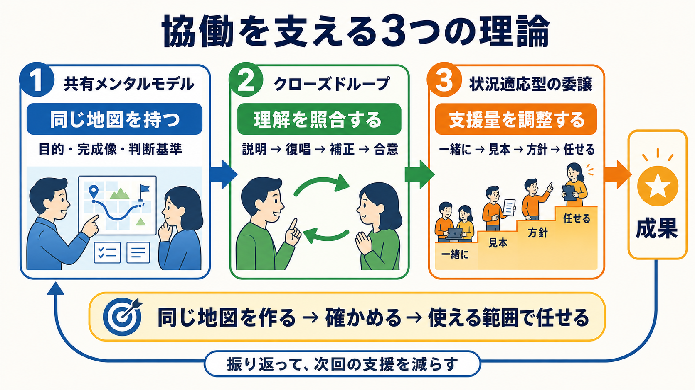

# 協働を支える3つの理論

## まず結論

協働で認識のズレや手戻りを減らすには、次の3つを一続きで使います。

1. `共有メンタルモデル`で、目的と完成像について同じ地図を持つ
2. `クローズドループ・コミュニケーション`で、地図が本当に同じか確かめる
3. `状況適応型の委譲と足場かけ`で、相手が地図を使える範囲だけ任せる

## これは何か

経験や専門性が異なる人と協働するときに、説明したのに成果物がズレる理由と、その改善方法を理解するための理論です。
3つの概念は、それぞれ `認識` `確認` `任せ方` という別の問題を扱います。

## どこで使うか

- 「分かりました」と言われたのに、意図と違う成果物が返ってくるとき
- タスクを渡しても、レビューと修正で依頼者の負担が増えるとき
- 相手を一律に「できる・できない」と評価せず、任せ方を調整したいとき
- 納期を守りながら、相手の自走範囲を広げたいとき

## 全体像

| 概念 | 扱う問題 | 実務で行うこと |
|---|---|---|
| 共有メンタルモデル | 頭の中の目的・完成像が違う | 目的、成果物、判断基準、制約を共有する |
| クローズドループ・コミュニケーション | 認識の違いに気づけない | 相手が理解を説明し、依頼者が補正する |
| 状況適応型の委譲と足場かけ | 任せる範囲と自走度が合わない | 見本、手順、中間確認などの支援量を調整する |

3つは次の順でつながります。

`同じ地図を作る → 地図を照合する → 地図を使える範囲で任せる`

どれか1つだけでは不十分です。詳しく説明しても理解を照合しなければズレを発見できず、認識が合っていても技術や判断の難度が高すぎれば成果にはつながりません。

## 理解用イラスト

この図は、3つの理論を協働の順番として表しています。認識、確認、任せ方を順に整え、成果を振り返って次回の支援量を調整します。

## 共有メンタルモデル

### 同じ言葉ではなく、同じ地図を持つ

共有メンタルモデルとは、チームメンバーが仕事の目的、状況、役割、進め方、完成像について共通した理解を持つことです。

たとえば「比較できるグラフを作る」という言葉を双方が理解していても、依頼者は「意思決定に必要な変化が分かるもの」、担当者は「複数の数値を並べたもの」と考えているかもしれません。言葉が一致していても、成功の定義が違えば成果物はズレます。

### 共有する4つの階層

1. 目的: なぜ作るのか
2. 成果物: 何を作るのか
3. 判断基準: 何ができていればよいのか
4. 制約: 対象外、期限、守るべき前提は何か

### 理解のポイント

共有メンタルモデルは、相手にすべての情報を渡すことではありません。判断に必要な地図を共有し、優先順位や完成条件を同じ方向へそろえることです。

## クローズドループ・コミュニケーション

### 伝達ではなく、理解の一致までを会話に含める

一方向の依頼は、相手が言葉を受け取った時点で終わります。

`依頼 → 分かりました → 着手`

クローズドループでは、相手から理解を返してもらい、必要な補正をしてから着手します。

`依頼 → 理解を説明 → 補正 → 合意 → 着手`

### 「分かりましたか」と聞かない

「分かりましたか」は受領確認にはなりますが、理解の中身は確認できません。代わりに、次のように質問します。

- この成果物を何に使うと理解しましたか
- どんな状態になれば完成だと思いますか
- まず何を確認し、どの順番で進めますか

### 途中でもループを閉じる

着手前の認識が合っていても、実装中に新しい解釈や問題が生まれます。重要なタスクでは、骨組みや一部実装の段階でも短い確認ループを設けます。

`着手前の理解確認 → 骨組み確認 → 実装 → 最終レビュー`

## 状況適応型の委譲と足場かけ

### 人ではなく、タスクごとの自走度を見る

同じ人でも、既存パターンの修正は単独でできる一方、新規設計には支援が必要なことがあります。そのため「この人はできるか」ではなく、「このタスクを、どの支援レベルなら完了できるか」と考えます。

### 4段階の任せ方

| 段階 | 任せ方 | 適する状態 |
|---|---|---|
| 1. 一緒に行う | 考え方を説明しながら共同作業する | 前提知識や判断方法がまだない |
| 2. 見本を渡す | 完成例、手順、完了条件を示す | 既存パターンなら応用できる |
| 3. 方針を渡す | 相手が案を出し、骨組みだけ確認する | 基本はできるが重要判断に確認が必要 |
| 4. 成果を任せる | 目的、期限、完成条件だけ合意する | 同種タスクで安定した実績がある |

### 足場は一時的な支援

足場には、見本、チェックリスト、テンプレート、判断基準、中間レビュー、相談条件などがあります。

`支援する → 成功する → 支援を一部外す → 任せる範囲を広げる`

支援を固定すると依存が生まれます。一方、成果が安定する前に支援を外すと、委譲ではなく放任になります。

## よくある疑問

### Q. 詳細な指示書を作れば、共有メンタルモデルはできるのか

A. 情報量を増やすだけでは不十分です。目的や判断基準が埋もれることもあります。重要な前提を絞って共有し、相手の説明によって理解を照合します。

### Q. 理解を説明してもらうのは、相手を試す行為にならないか

A. 試験ではなく、双方の説明と解釈を確認する工程として扱います。「私の説明にも不足があり得るので、認識を合わせたい」と目的を示すと伝わりやすくなります。

### Q. 中間確認を増やすと、依頼者の負担が増えないか

A. 短期的には確認時間が増えますが、完成後の大幅修正を減らすための投資です。成果が安定したタスクから確認を減らし、支援を固定化しないことが重要です。

### Q. 相手の自走度は何で判断するのか

A. 知識だけでなく、同種タスクの実績、判断の正確さ、途中共有、自己検算、フィードバックの再現性を見ます。作業時間の長さだけでは判断しません。

## 実務での見方

### 3つを使った依頼例

> 目的は、報告時に期間ごとの変化を説明できるようにすることです。成果物は、各期間の値と増減率が分かる表です。原因分析は今回の対象外です。

ここで、目的、成果物、判断基準、制約を共有します。

> 認識合わせのため、この成果物の目的、完成形、進め方をあなたの言葉で説明してもらえますか。

ここで、理解を照合してループを閉じます。

> まず構成案を作り、実装前に一度共有してください。方針が合えば、その後の実装は任せます。

ここで、自走度に合わせた足場を置きます。

### ズレた段階から原因を見分ける

- 理解の説明でズレる: 背景理解、目的、前提知識の問題
- 骨組みでズレる: 設計力、タスク分解、判断基準の問題
- 実装でズレる: 技術力、検算、品質確認の問題
- 問題を共有しない: 相談条件、心理的安全性、責任認識の問題
- 同じ指摘が再発する: 学習方法、記録、役割配置の問題

## 再利用チェックリスト

- [ ] 目的、成果物、判断基準、制約を共有した
- [ ] 相手の言葉で理解を説明してもらった
- [ ] 必要な補正をしてから着手した
- [ ] タスクの難度と相手の自走度を分けて考えた
- [ ] 必要な見本、手順、中間確認を置いた
- [ ] 成果が安定した支援は少しずつ外した
- [ ] どの段階でズレたかを振り返った

## 次回の確認

- [ ] 直近の依頼を、3つの理論で書き換える
- [ ] 相手の理解説明と自分の想定の差を記録する
- [ ] 1〜2回後に、中間確認を減らせるか判断する

## 関連トピック

- [タスク委譲で手戻りを減らす協働設計](./タスク委譲で手戻りを減らす協働設計.md)
- [PMOの具体業務](./PMOの具体業務.md)

## 参考リンク

- 一般公開された参考リンクは未設定

## 更新履歴

- 2026-08-13: 初版作成
