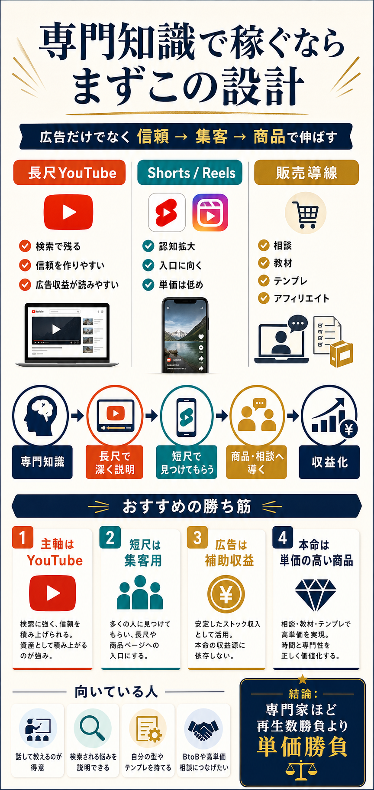

# 専門知識をコンテンツ化して収益化する設計

## まず結論

専門知識で稼ぐなら、`Instagram単体で再生数を追う` より `YouTube長尺を主軸にして、短尺で見つけてもらい、商品や相談へ導く` 方が再現性があります。

専門家ほど、広告収益だけで勝負するより `信頼 -> 集客 -> 商品` の流れで設計した方が伸びやすいです。

## これは何か

自分の専門知識を、動画やSNSでどう収益へ変えるかを整理するノートです。
特に、`どの媒体を主軸にするか` `広告と商品をどう役割分担するか` `なぜ長尺YouTubeが強いのか` を一枚で戻せる形にします。

## どこで使うか

- 自分の専門知識で副収入を作りたいとき
- YouTube と Instagram のどちらを主軸にするか迷うとき
- 再生数はあるのに収益へつながらない理由を整理したいとき
- 相談、教材、テンプレ、アフィリエイトのどれを組み合わせるか考えるとき

## 全体像

- 長尺YouTubeは、検索で残りやすく、信頼を作りやすく、広告収益も比較的読みやすい
- Shorts や Reels は、認知拡大には向くが、単価は低く、深い理解や高単価販売にはつながりにくい
- 専門知識は `深く説明できること` 自体が価値なので、短尺だけより長尺と相性がいい
- 収益は `広告` `相談` `教材` `テンプレ` `アフィリエイト` に分けて考えると整理しやすい
- 実務的には、`長尺で信頼を作る -> 短尺で入口を増やす -> 商品や相談へ導く` の順に組むとぶれにくい

## 理解用イラスト

この図は、専門知識をどうコンテンツ化し、どこで集客し、どこで収益化するかを一枚で戻すためのものです。
長尺、短尺、販売導線の役割の違いを、上から下へ追うだけで思い出せるようにしています。

## よくある疑問

### Q. Instagram だけで始めてもよいか

A. 始めること自体はできますが、専門知識で安定収益を作るなら Instagram 単体より `YouTube長尺 + 短尺` の方が伸ばしやすいです。Instagram は認知やブランド作りには強い一方で、再生数から収益を読みづらいからです。

### Q. 広告収益だけを狙えばよいか

A. 専門家には非効率になりやすいです。広告は補助収益として持ちつつ、相談、教材、テンプレのような高単価商品を本命にした方が、少ない再生でも収益化しやすくなります。

### Q. Shorts や Reels はやらなくてよいか

A. 不要ではありません。役割を `認知拡大` に限定すると強いです。短尺で見つけてもらい、詳しい話は長尺や商品ページへ送ると設計が崩れにくくなります。

### Q. どんな専門知識が向いているか

A. `検索される悩みがある` `説明すると理解差が出る` `自分の型や手順を持てる` 領域が向いています。データ分析、SQL、BI、業務改善、Snowflake のように、悩みが具体的で成果物に変えやすいテーマは相性がよいです。

## 実務での見方

### 1. 媒体ごとの役割を先に分ける

- 長尺YouTube: 信頼構築と検索流入
- Shorts / Reels: 認知拡大と入口づくり
- 商品導線: 収益化の本命

役割を混ぜると、`短尺で深く教えようとして伝わらない` `長尺で売り込みすぎて離脱される` という崩れ方をしやすくなります。

### 2. 収益源を広告以外でも持つ

相性がよいのは次です。

- 相談やコンサル
- note や PDF 教材
- オンライン講座
- テンプレートやチェックリスト
- ツール紹介のアフィリエイト

専門家は、再生数の大きさより `一人あたりの価値` を上げる設計の方が合いやすいです。

### 3. コンテンツテーマは検索される悩みから作る

最初に強いのは、次のような型です。

- よくある失敗
- 比較
- 手順
- 判断軸
- ケース別の選び方

専門知識をそのまま語るより、`相手の悩みの入り口` から見せた方が見つけられやすくなります。

### 4. 短尺は本編の入口として使う

- 要点だけ先に見せる
- よくある誤解を短く崩す
- 詳細は長尺や商品ページへ送る

短尺単体で完結させようとすると、再生は伸びても信頼と購入に結びつきにくくなります。

### 5. 伸びやすい設計は広告より資産化

長尺YouTubeは、検索で残る説明資産になりやすいです。
そのため `一本ごとの瞬間再生` より `あとから検索され続けるテーマ` を優先すると、時間がたつほど効きやすくなります。

## 次回の確認

- [ ] 自分の専門知識で、検索される悩みを 5 個書けるか
- [ ] そのうち 1 つを、長尺動画のタイトル案にできるか
- [ ] その長尺の要点を、短尺 3 本に分解できるか
- [ ] 最後に売る商品を `相談 / 教材 / テンプレ / アフィリエイト` のどれにするか決められるか

## 関連トピック

- [事業会社の意思決定と上申の流れ](./事業会社の意思決定と上申の流れ.md)
- [イシュー思考の基本](../../分析全般/20_トピック/イシュー思考の基本.md)
- [分析依頼を受けてからアウトプットを出すまでの進め方](../../分析全般/20_トピック/分析依頼を受けてからアウトプットを出すまでの進め方.md)

## 参考リンク

- [YouTube Partner Program overview & eligibility](https://support.google.com/youtube/answer/72851?hl=en)
  - 公式ヘルプ。YouTube の収益化参加条件を確認するための入口
- [YouTube Shorts monetization policies](https://support.google.com/youtube/answer/12504220?hl=en)
  - 公式ヘルプ。Shorts の収益分配の考え方を確認するための資料
- [Instagram ended profile ads program on January 7, 2025](https://www.businessinsider.com/instagram-shutting-down-program-that-pays-creators-influencers-ads-profiles-2025-1)
  - 制度変更の流れをつかむための記事。Instagram では広告分配制度が変わりやすいことの確認に使う

## 更新履歴

- 2026-06-28: 初版作成
