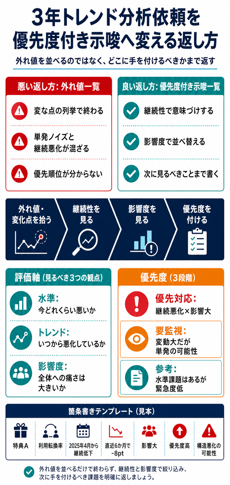

# 3年トレンド分析依頼を優先度付き示唆へ変える返し方

## まず結論

`3年間の外れ値を箇条書きでまとめて` という依頼には、外れ値をそのまま並べて返すのではなく、`どこに手を付けるべきか` が分かる `優先度付き示唆一覧` に変えて返すのが実務的です。主役は `外れ値` ではなく `優先判断` で、各行は `何が起きたか` だけでなく `だから何を優先確認すべきか` まで書きます。

## これは何か

サブスクや継続サービスで、利用転換率や利用停止率の3年トレンド分析を依頼されたときに、スピードを落とさず、列挙型の依頼を意思決定に使える返し方へ変換するためのトピックです。`外れ値一覧` と `注力判断` がつながらないときに見返します。

## どこで使うか

- `3年推移を見て、気になる点を箇条書きでほしい` と言われたとき
- 利用転換や利用停止の悪化箇所を早く特定したいとき
- グラフを大量に並べる時間はないが、判断材料は必要なとき
- `分析報告` ではなく `どこに手を付けるか` まで返したいとき

## 全体像

基本の流れは `外れ値を探す -> 意味づけする -> 優先度に変える` です。

1. `外れ値・変化点を拾う`
   - 急落、急騰、変曲点、継続悪化を機械的に拾う
2. `意味づけする`
   - 単発か継続か
   - 影響が大きいか
   - 直近も続いているか
3. `優先度付き示唆へ変える`
   - `優先対応 / 要監視 / 参考` に分ける
4. `依頼者が読める順で返す`
   - 最優先の論点から先に並べる

重要なのは、`外れ値があった` ことではなく、`外れ値の中で今追う価値があるのはどれか` を切ることです。

## 理解用イラスト

この図は、`外れ値一覧` をそのまま返す状態から、`優先度付き示唆一覧` に変える考え方を1枚で戻すためのインフォグラフィックです。



中央の `外れ値 -> 意味づけ -> 優先度` の流れを先に見て、そのあと左右の比較と下部のテンプレートへ戻ると使いやすいです。

## よくある疑問

### Q. 外れ値を羅列するだけではなぜ足りないのか

A. 外れ値は `変な点があった` ことしか示しません。単月ノイズかもしれず、母数も小さいかもしれず、翌月には戻っているかもしれません。依頼者が知りたいのは `珍しい点` ではなく `今どこに手を打つべきか` なので、継続性と影響度で意味づけする必要があります。

### Q. 何を見れば `手を付けるべき箇所` と言えるのか

A. 最低限 `水準` `トレンド` `影響度` の3つです。

- `水準`
  - 今どれくらい悪いか
- `トレンド`
  - いつから悪化しているか、継続しているか
- `影響度`
  - 母数や全体寄与がどれくらい大きいか

この3つがそろうと、`低いが緊急ではない` と `まだ普通だが悪化が始まっていて危ない` を分けられます。

### Q. 依頼が箇条書きベースでも、表のような整理をしてよいのか

A. よいです。むしろ、裏側で表として整理し、返却時は1行箇条書きに圧縮する方が速くて崩れません。分析者の作業用フォーマットと、依頼者への返却フォーマットは分けて考えます。

### Q. スピード優先なら統計的な外れ値検知は必要か

A. 必須ではありません。実務ではまず `前月比` `前年同月比` `直近3か月・6か月平均` `連続悪化` のような簡易ルールで十分です。精緻さより、判断に使える形で早く返すことを優先します。

### Q. 外れ値が多すぎるときはどう絞るか

A. `影響大 × 継続悪化 × 直近でも未改善` を優先して上に置きます。単月だけの跳ねや、母数の小さい特典は `参考` や `要監視` に落とします。

## 実務での見方

### 1. 依頼をそのまま受けず、返却の主語を変える

- 依頼の主語
  - `外れ値を箇条書きでまとめてほしい`
- 返却の主語
  - `優先的に確認すべき悪化箇所を、外れ値と変化点から整理しました`

この言い換えだけで、列挙型の依頼を判断材料へ変えやすくなります。

### 2. 先に拾う項目を固定する

最小構成は次の6項目です。

- `対象`
  - どの特典、どのKPIか
- `事象`
  - 急低下、急上昇、継続悪化、横ばい低迷など
- `発生時期`
  - いつからか
- `変化量`
  - どれくらい動いたか
- `影響度`
  - 母数、寄与、売上や継続への影響
- `示唆`
  - 優先確認、監視、参考

### 3. 優先度を3段階で切る

- `優先対応`
  - 継続悪化していて影響が大きい
- `要監視`
  - 大きく動いたが単発の可能性がある
- `参考`
  - 水準課題はあるが直近悪化は弱い

### 4. 1行を `事実 + 解釈 + 次アクション` にする

悪い例:

```text
特典Aの利用停止率が2025年6月に上がった
```

良い例:

```text
特典A / 利用停止率 / 2025年6月から3か月連続で上昇 / 直近3か月で+4pt / 母数大 / 優先対応: 停止増加の主因切り分けを優先
```

### 5. 冒頭の一文で読み方を指定する

依頼者向けには、最初に次のように伝えると意図が通ります。

```text
3年間の推移から外れ値と変化点を抽出し、その中でも継続性と影響度を踏まえて、優先的に確認すべき箇所が分かる形で整理しました。単発事象は参考情報、継続悪化かつ影響の大きいものを優先度高として記載しています。
```

## そのまま使える返却テンプレート

### 依頼者向けの冒頭文

```text
3年間の推移から外れ値と変化点を抽出し、継続性と影響度を踏まえて、優先的に確認すべき箇所が分かるよう整理しました。特に、直近も悪化が続き、全体影響の大きい項目を上位に記載しています。
```

### 優先度付き示唆一覧の列

| 対象特典 | KPI | 起きていること | いつから | 変化量 | 影響度 | 優先度 | 示唆 | 次に見るべきこと |
|---|---|---|---|---|---|---|---|---|
| 特典A | 利用転換率 | 継続低下 | 2025年4月から | 直近6か月で-8pt | 大 | 高 | 構造悪化の可能性 | 流入経路別、会員属性別 |
| 特典B | 利用停止率 | 単月急上昇 | 2025年6月 | 前月比+5pt | 中 | 中 | 一時要因の可能性 | 翌月推移、施策有無 |
| 特典C | 利用転換率 | 低水準横ばい | 2024年以降 | 横ばい | 小 | 低 | 緊急度は低い | 他特典比較 |

### 箇条書きに圧縮した型

- `特典A / 利用転換率 / 2025年4月から継続低下 / 直近6か月で-8pt / 影響大 / 優先度高 / 構造悪化の可能性があり優先確認`
- `特典B / 利用停止率 / 2025年6月に単月急上昇 / 前月比+5pt / 影響中 / 優先度中 / 単月要因の可能性があり継続確認`
- `特典C / 利用転換率 / 3年間を通じて低水準横ばい / 大きな変化なし / 影響小 / 優先度低 / 中長期改善テーマ`

## 再利用チェックリスト

- [ ] 外れ値をそのまま並べず、`優先判断` を主語にしているか
- [ ] 各行に `対象` `事象` `時期` `変化量` `影響度` `示唆` があるか
- [ ] `単発` と `継続` を分けているか
- [ ] `水準` `トレンド` `影響度` の3つで優先度を見ているか
- [ ] `優先対応 / 要監視 / 参考` に切れているか
- [ ] 冒頭で `どう読めばよい資料か` を説明しているか
- [ ] 依頼者が次に何を確認すべきかまで書いているか

## 次回の確認

- 外れ値と優先度の違いを説明できるか
- 箇条書きでも `事実 -> 解釈 -> 示唆` を入れられるか
- `低いもの順` ではなく `放置コストが高いもの順` に並べられるか
- スピード重視でも、単発ノイズと継続悪化を分けて返せるか

## 関連トピック

- [イシュー思考の基本](./イシュー思考の基本.md)
- [分析設計の基本プロセス](./分析設計の基本プロセス.md)
- [分析依頼を受けてからアウトプットを出すまでの進め方](./分析依頼を受けてからアウトプットを出すまでの進め方.md)
- [退会抑止に向けたKPI設計の考え方](./退会抑止に向けたKPI設計の考え方.md)

## 参考リンク

- 今回のノートは、ユーザーとの対話内容をもとに、3年トレンド分析依頼への返し方として再構成したもの

## 更新履歴

- 2026-06-11: 初版作成
