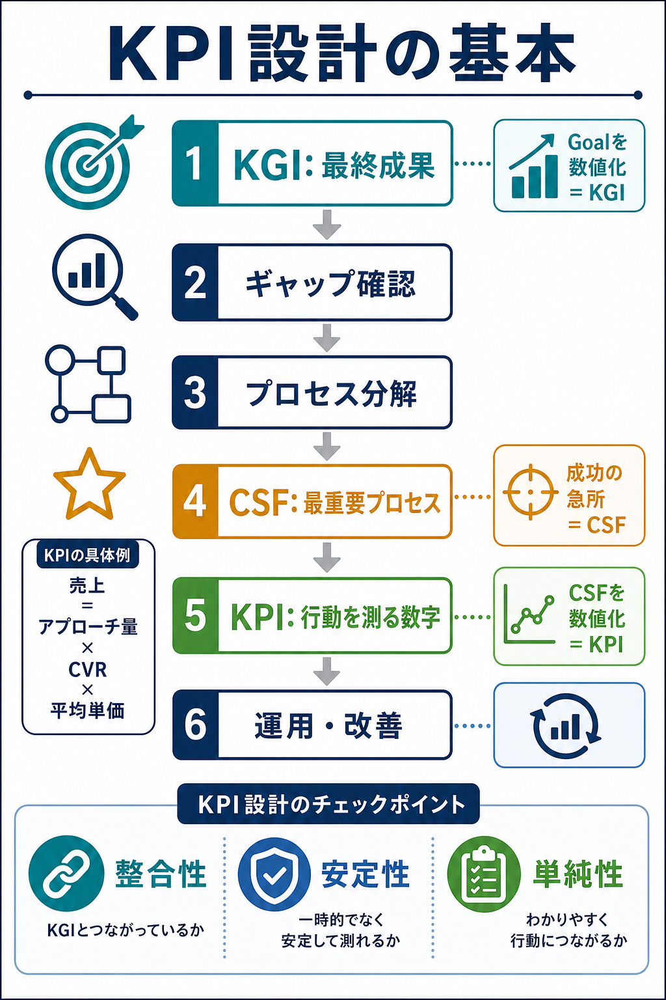

# KPI設計の基本と用語

## まず結論

KPIは、単に集計しやすい数字ではなく、`事業成功の鍵になるプロセスを数値目標にしたもの` です。

KPI設計では、いきなり指標を選ばず、`KGI -> ギャップ -> プロセス分解 -> CSF -> KPI -> 運用` の順で考えます。  
この順番を守ると、数字を見るだけでなく、現場の行動を変えるための指標になります。

## これは何か

KPI、KGI、CSFの意味と関係を整理し、KPIをどう設計すればよいかをまとめた基礎ノートです。

KPIはダッシュボードに置く数字の名前ではありません。最終成果に向かう途中で、どのプロセスを変えればよいかを現場が判断するための数字です。

## どこで使うか

- 新しい施策や事業のKPIを設計するとき
- ダッシュボードの指標が多すぎて、何を見るべきか分からないとき
- KGI、KPI、中間指標、補助指標が混ざっているとき
- 分析依頼を、実際の改善行動につながる指標へ落としたいとき

## 全体像

KPI設計の基本は、次の流れで考えます。

1. `KGIを確認する`
   - 最終的に達成したい成果を数値で決める。
2. `現状とのギャップを確認する`
   - 現在と目標の差を見て、何を埋める必要があるかを確認する。
3. `プロセスをモデル化する`
   - 成果が生まれる構造を式や流れで分解する。
4. `CSFを絞り込む`
   - 分解したプロセスの中から、今もっとも成果に効くものを選ぶ。
5. `KPI目標を設定する`
   - CSFを、現場が追える数値目標へ落とす。
6. `運用性を確認する`
   - 整合性、安定性、単純性を確認する。
7. `対策を事前に考える`
   - KPIが悪化したときに、何をするかを先に決める。
8. `関係者と合意する`
   - なぜそのKPIなのか、どう測るのか、どう使うのかを揃える。
9. `運用する`
   - 定期的に見て、改善アクションへつなげる。
10. `継続的に改善する`
   - KPIが本当にKGIにつながっているかを見直す。

## 理解用イラスト

この図は、`KGI -> CSF -> KPI` の関係と、KPI設計の手順を一枚で思い出すための図です。  
KPIを「取れる数字」から選ばず、「最終成果につながる行動」へ落とす流れを確認できます。

## よくある疑問

### Q. KPIとは何ですか

A. KPIは `Key Performance Indicator` の略で、事業成功の鍵になるプロセスを数値目標にしたものです。  
単なる観測指標ではなく、目標達成に向けて現場が動くための指標です。

### Q. KGIとは何ですか

A. KGIは `Key Goal Indicator` の略で、最終的に達成したいゴールを数値で表したものです。  
例として、売上、利益、契約数、継続率などがあります。

### Q. CSFとは何ですか

A. CSFは `Critical Success Factor` の略で、KGIを達成するための最重要プロセスです。  
複数ある改善候補の中から、今もっとも成果に効くものを選んだものです。

### Q. KPI、KGI、CSFはどう違いますか

A. 役割で分けると分かりやすいです。

- `KGI`
  - 最終成果
  - 例: 売上1000万円
- `CSF`
  - 成果を出すための急所
  - 例: 成約率を上げる
- `KPI`
  - 急所を動かすために追う数字
  - 例: 複数案を提案した顧客数

### Q. KPIは売上や利益ではないのですか

A. 売上や利益は多くの場合、KGIとして扱います。  
KPIは、その売上や利益を達成するために、途中で変えるべきプロセスや行動を測る数字です。

### Q. なぜプロセス分解が必要ですか

A. 成果だけ見ても、何を変えればよいか分からないからです。  
たとえば売上なら、次のように分解できます。

`売上 = アプローチ量 × CVR × 平均単価`

この式にすると、売上を上げる方法を `量を増やす` `成約率を上げる` `単価を上げる` に分けて考えられます。

### Q. CSFはどう選べばよいですか

A. まず、分解した要素を `変えられるもの` と `すぐには変えにくいもの` に分けます。  
そのうえで、変えたときにKGIへの影響が大きく、現場がコントロールできるものを選びます。

## 実務での見方

### 1. KPI設計は取れるデータから始めない

よくある失敗は、先に取れそうなデータを集めて、その中からKPIを選ぶことです。

- 訪問数
- 資料作成数
- 会議数
- 架電数

これらは管理上は便利でも、KGIとのつながりが弱いと、行動を増やすだけで成果につながりません。  
KPIは、必ず `KGIに効くプロセスか` から確認します。

### 2. 良いKPIの条件

良いKPIは、次の3つを満たします。

- `整合性`
  - KPIが改善すると、KGIも改善する理屈がある。
- `安定性`
  - 数値を継続して、同じ定義で取得できる。
- `単純性`
  - 現場の人が理解でき、次の行動に移せる。

### 3. 例: 売上を上げる場合

まずKGIを置きます。

`KGI = 売上1000万円`

次に、売上を分解します。

`売上 = アプローチ量 × CVR × 平均単価`

改善候補は次の3つです。

- アプローチ量を増やす
- CVRを上げる
- 平均単価を上げる

もし平均単価は短期で動かしにくく、CVRは提案方法で改善できそうなら、CSFは `CVRを上げること` になります。

さらに、CVRを上げる具体行動が `複数案を提案すること` なら、KPIは次のように置けます。

`KPI = 複数案を提案した顧客数`

### 4. KPIが悪化したときの対策まで決める

KPIは見るだけでは機能しません。  
悪化したときに何をするかを先に決めておくと、運用指標として使えます。

例:

- 複数案提案数が少ない
  - 提案テンプレートを作る
  - 商談前チェックリストに入れる
  - 提案事例を共有する
- CVRが落ちている
  - 流入元や顧客属性で分解する
  - 商談内容を見直す
  - 価格や訴求のミスマッチを確認する

### 5. KPI設計のチェックリスト

- [ ] KGIは数値で定義されているか
- [ ] 現状とKGIのギャップを確認しているか
- [ ] 成果が生まれるプロセスを式や流れで分解しているか
- [ ] CSFは1つに絞れているか
- [ ] KPIはCSFを表す数値になっているか
- [ ] KPIは現場がコントロールできるか
- [ ] KPIの取得方法と定義は安定しているか
- [ ] KPIが悪化したときの対策が決まっているか
- [ ] 関係者が意味と使い方に合意しているか

## 次回の確認

- [ ] 自分が見ている数字は、KGI、CSF、KPI、補助指標のどれか
- [ ] KPIが現場の行動に変換できるか
- [ ] KPIが増えすぎて、最重要プロセスがぼやけていないか

## 関連トピック

- [分析設計の基本プロセス](./分析設計の基本プロセス.md)
- [分析依頼を受けてからアウトプットを出すまでの進め方](./分析依頼を受けてからアウトプットを出すまでの進め方.md)
- [退会抑止に向けたKPI設計の考え方](./退会抑止に向けたKPI設計の考え方.md)
- [LPグロースの進め方とKPI設計](./LPグロースの進め方とKPI設計.md)

## 参考リンク

- 一般公開された参考リンクは未設定。

## 更新履歴

- 2026-07-12: 初版作成。
