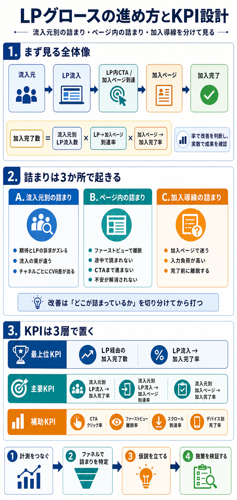
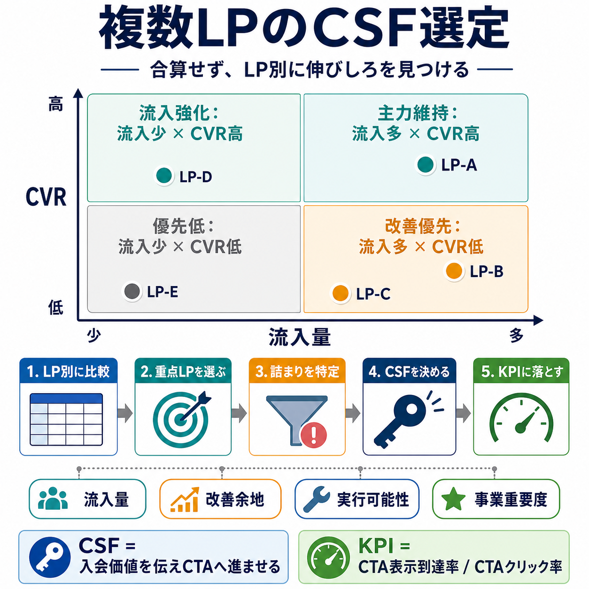
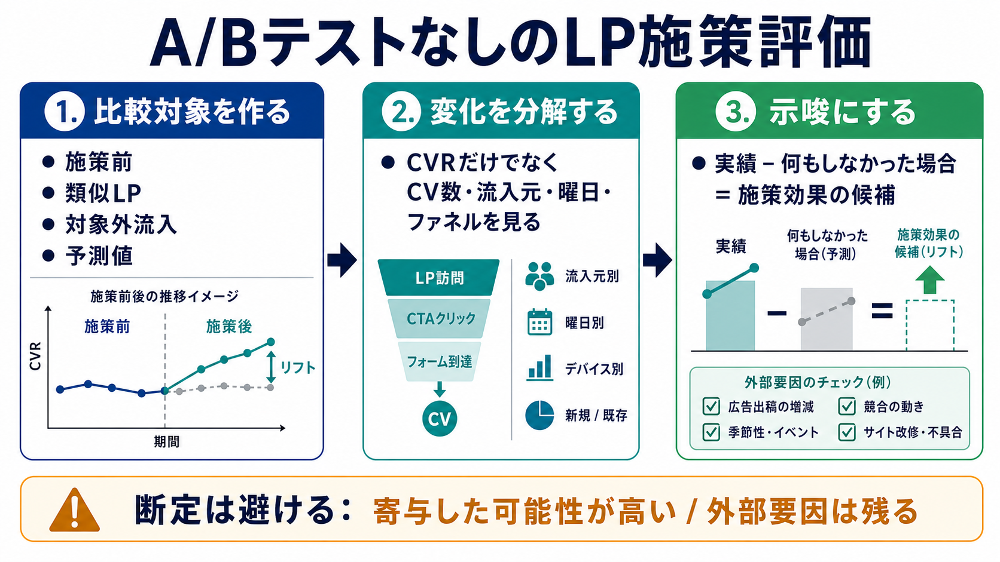
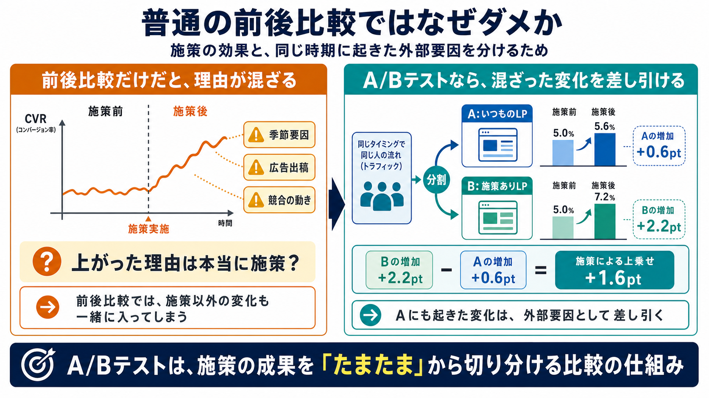
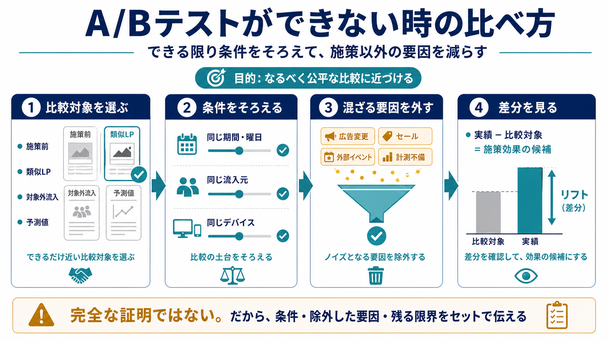
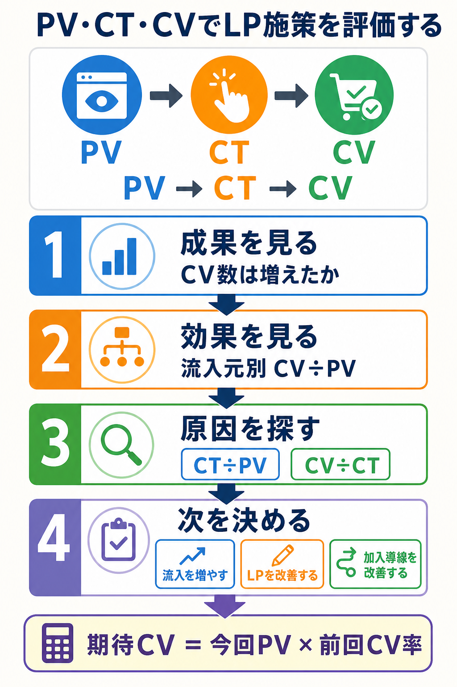

# LPグロースの進め方とKPI設計

## まず結論

LPグロースは、LPを部分最適する仕事ではなく、`どの流入元のどの詰まりを改善すると加入完了が増えるか` を特定して、優先順に潰していく仕事である。  
KPIは、`率で改善を判断し、実数で成果を確認する` のが基本で、さらに `流入元別の詰まり` `ページ内の詰まり` `加入導線の詰まり` を分けて見ると改善しやすい。

## これは何か

加入促進LPの分析と改善を進めるときの考え方を、`進め方` と `KPI設計` の2本で整理したトピック。  
全体CVRだけを見るのではなく、`流入元ごとの差` と `LP内のどこで止まるか` を分解して見るための土台になる。

## どこで使うか

- 加入を増やすLPの分析担当になったとき
- LP改善施策の優先順位を決めたいとき
- 上流流入、LP、加入ページを切り分けてKPI設計したいとき
- LPの数字が悪い原因を `流入` と `ページ内` と `導線` に分けて考えたいとき
- A/Bテストができない状態で、LP施策の効果をどう評価するか整理したいとき

## 全体像

まず式で構造を置く。

`加入完了数 = 流入元別LP流入数 × LP→加入ページ到達率 × 加入ページ→加入完了率`

この式にすると、加入が増えない理由を次の3つに分けられる。

1. `流入量の問題`
2. `LP内で次に送れていない問題`
3. `加入ページ以降で完了していない問題`

さらに、詰まりは次の3か所で起きる。

- `流入元別の詰まり`
  - 期待とLP訴求がズレる
  - 流入の質が違う
  - チャネルごとにCVR差が出る
- `ページ内の詰まり`
  - ファーストビューで離脱する
  - 途中で読まれない
  - CTAまで進まない
  - 不安が解消されない
- `加入導線の詰まり`
  - 加入ページで迷う
  - 入力負荷が高い
  - 完了前に離脱する

## 理解用イラスト

この図は、`全体ファネル` `詰まりの3分類` `KPIの3層` を一枚で戻すための図。



## 理解用イラスト: 複数LPのCSF選定

この図は、LPが複数あるときに、`LP別に横並び比較する -> 重点LPを選ぶ -> そのLPの詰まりからCSFを決める` 流れを一枚で戻すための図。



## 理解用イラスト: A/Bテストなしの施策評価

この図は、A/Bテストができないときに `比較対象を作る -> 変化を分解する -> 示唆にする` 流れを一枚で戻すための図。



## 理解用イラスト: A/Bテストの必要性

この図は、非技術者へ `なぜ前後比較だけでは弱いのか` と `なぜ同じ時期にA/Bで比べる必要があるのか` を説明するための図。



## 理解用イラスト: A/Bテストができない時の比べ方

この図は、A/Bテストができない場合に `比較対象を選ぶ -> 条件をそろえる -> 混ざる要因を外す -> 差分を見る` ことで、できるだけ公平な比較に近づける流れを説明するための図。



## 理解用イラスト: PV・CT・CVで施策評価する順番

この図は、スプリントごとに `成果を確認する -> 流入元別に効果を見る -> ファネルで原因を特定する -> 次の施策を決める` 順番を一枚で戻すための図。



## よくある疑問

### Q. KPIは実数より率を中心に置くべきか

A. 改善判断の主KPIは率で置く。  
理由は、LP自体の実力を流入量の変動から切り離して見やすいから。  
ただし、事業成果は実数で確認しないと `CVRは上がったが加入完了数は増えていない` を見落とすので、`率を主KPI、実数を監視KPI` にする。

### Q. 流入が複数あるとき、全体CVRだけ見ればよいか

A. よくない。  
全体CVRは、`各流入元のCVR` だけでなく `流入構成比` にも左右される。  
そのため、`全体KPI` と `流入元別KPI` を分けて持つ必要がある。

### Q. LP内の詰まりは本当に改善ポイントになるか

A. なる。  
流入元だけ見ていると `誰が来たか` までは分かるが、`LPのどこで止まったか` は分からない。  
LPグロースでは、`流入元の詰まり` と同時に `ページ内の詰まり` を見ないと、改善施策が浅くなりやすい。

### Q. CTAクリック率が上がれば成功か

A. それだけでは不十分。  
CTAクリック率は先行指標であって、最終的には `加入完了率` と `加入完了数` まで見て判断する。  
`CTAは押されたが加入完了しない` なら、問題はLPより先の導線にある。

### Q. LPが複数あるときは、KPIやCSFも分けるべきか

A. 分析は必ずLP別に分ける。
全体KGIは `全LP合計の入会完了数` でよいが、CSFは最初から全LP共通にしない。まず `どのLPを重点対象にするか` を選び、そのLPのファネルで一番効く詰まりをCSFにする。

### Q. A/Bテストができないとき、施策効果はどう評価するか

A. `施策後に良くなったか` ではなく、`施策をしなかった場合より良くなった可能性が高いか` で見る。
そのために、施策前、類似LP、対象外流入、過去トレンドから作った予測値を比較対象にし、流入元、曜日、ファネル指標、外部要因を確認する。

## 実務での見方

### 1. 進め方の基本

1. `計測をつなぐ`
   `流入元` `LP流入` `CTAクリックまたは加入ページ到達` `加入完了` をつなげて見えるようにする。
2. `ファネルで詰まりを特定する`
   流入元別に `LP流入数 → 加入ページ到達数 → 加入完了数` を見えるようにする。
3. `仮説を立てる`
   例: 広告流入は期待とLP冒頭がズレている、比較検討層は不安解消が足りない、モバイルで加入導線の摩擦が高い。
4. `施策を検証する`
   ファーストビュー、CTA、不安解消、流入元ごとの訴求出し分け、加入導線の摩擦改善を検証する。

### 2. KPIは3層で置く

- `最上位KPI`
  - LP経由の加入完了数
  - LP流入→加入完了率
- `主要KPI`
  - 流入元別 LP流入→加入完了率
  - 流入元別 LP流入→加入ページ到達率
  - 流入元別 加入ページ→加入完了率
- `補助KPI`
  - CTAクリック率
  - ファーストビュー離脱率
  - スクロール到達率
  - デバイス別完了率

### 3. LP内CVRはCSFではなく、分解して見る

LP改善で最終的な加入完了を増やしたいとき、`LP内CVR` は急所に見える。

ただし、LP内CVRは複数の要素が混ざった指標なので、そのままCSFにすると「悪化したときに何を直すべきか」が曖昧になりやすい。

そのため、実務では次のように置く。

```text
加入完了数
= LP訪問UU
× 非即離脱率
× 有効閲覧者CTAクリック率
× フォーム到達率
× 加入完了率
```

このとき、`LP内CVR` は上位の主KPIとして見る。

CSFは、LP内CVRを構成する要素のうち、KGIへの影響が大きく、改善余地があり、LP改善で動かせるプロセスにする。

たとえば次のように考える。

| 状況 | CSF候補 | KPI |
|---|---|---|
| すぐ離脱する人が多い | ファーストビューで関心を持たせ、読み進めてもらうこと | 非即離脱率、FV通過率、10秒以上滞在率 |
| 読んではいるがCTAを押さない | 有効閲覧者に加入価値を納得させ、CTAへ進ませること | 有効閲覧者CTAクリック率 |
| CTAは押すがフォームに到達しない | CTA後に迷わず申込開始まで進ませること | フォーム到達率、CTAクリック後フォーム到達率 |
| フォーム到達後に完了しない | 入会手続き中の不安や負荷を減らし、完了まで進ませること | 加入完了率、フォーム完了率 |

### 4. 即離脱と有効閲覧者CTA率は同時に改善してよいか

両方を数値で見られるなら、同時に改善してもよい。

ただし、管理上は `CSFを2つ同格にする` より、`主KPIを1つ置き、その内訳KPIとして両方を管理する` 方が分かりやすい。

例:

```text
KGI: 加入完了数
主KPI: LP内CVR
内訳KPI:
- 非即離脱率
- 有効閲覧者CTAクリック率
- フォーム到達率
- 加入完了率
```

この形なら、ファーストビュー改善とCTA改善を同時に進めても、どちらがどの数値に効いたかを追いやすい。

注意点は、施策と評価指標を混ぜないこと。

たとえば、ファーストビューの訴求変更とCTA文言変更を同時に行う場合でも、`非即離脱率に効く施策` と `有効閲覧者CTAクリック率に効く施策` を分けて仮説化しておく。

同時改善してよい条件は次の通り。

- それぞれの指標を分けて計測できる
- 施策がどの指標に効く想定か説明できる
- どちらもKGIへの寄与が大きそう
- 改善リソースが足りる

逆に、施策が多すぎて原因分析ができなくなる場合は、まず検証対象を絞る。

### 5. 見る順番

1. `全体の加入完了数` は増えたか
2. `全体のLP流入→加入完了率` は改善したか
3. どの `流入元別` で変化したか
4. その流入元で `LP→加入ページ到達率` と `加入ページ→加入完了率` のどちらが詰まっているか
5. 必要なら `ページ内指標` で、ファーストビュー、読み進み、CTAまでの詰まりを切る

### 6. ページ内の詰まりを見る指標例

- ファーストビュー離脱率
- 非即離脱率
- 有効閲覧者CTAクリック率
- スクロール到達率
- 主要セクション到達率
- CTA表示到達率
- CTAクリック率
- FAQ閲覧率
- 料金表閲覧率
- 比較表閲覧率

### 7. よくある失敗

- 全体平均CVRだけを見る
- 流入元を混ぜて評価する
- LP内CVRだけ見て加入完了まで追わない
- LP内CVRを分解せず、即離脱と有効閲覧後のCTA行動を混ぜて見る
- 率だけ見て流入減を見落とす
- 仮説なしでA/Bテストを増やす

### 8. LPが複数あるときの進め方

LPが5つ前後ある場合は、まず全LPを合算せず、LP別の健康診断表を作る。

```text
LP別入会完了数
= LP別流入数
× LP別 LP→入会ページ到達率
× LP別 入会ページ→入会完了率
```

最初に見る表は次の形にする。

```text
LP名   流入数   CTAクリック率   入会ページ到達率   入会完了率   入会完了数   仮説
LP-A   多い     低い            低い              普通        中          LP内訴求が弱い
LP-B   少ない   高い            高い              高い        小          流入を増やせる
LP-C   多い     高い            高い              低い        中          入会ページ以降が弱い
LP-D   中       低い            低い              低い        小          優先度は要検討
LP-E   多い     普通            普通              高い        大          主力として維持
```

この表で、まず `どのLPを重点対象にするか` を決める。
判断軸は `流入量` `改善余地` `実行可能性` `事業重要度` の4つ。

### 9. 複数LPで重点対象を選ぶ4象限

LP別に `流入量` と `CVR` を並べると、優先順位が見えやすい。

- `流入多 × CVR低`
  - 改善優先LP。改善したときの入会完了数へのインパクトが大きい。
- `流入多 × CVR高`
  - 主力LP。大きく崩さず、勝ちパターンを他LPへ展開する。
- `流入少 × CVR高`
  - 伸ばすLP。流入配分や導線追加で成果を増やせる可能性がある。
- `流入少 × CVR低`
  - 優先低。事業上の重要性や役割がない限り、後回しにする。

### 10. 複数LPでのCSFの決め方

複数LPの場合、CSFは次の2段階で決める。

1. `重点LPを決める`
   - どのLPを改善すると、全体KGIへのインパクトが大きいかを見る。
2. `重点LPの詰まりを決める`
   - そのLPの中で、流入、LP内、加入ページ以降のどこが一番効くかを見る。

CSFは指標名ではなく、改善すべきプロセス名で置く。

```text
悪い例: CSF = CTAクリック率
良い例: CSF = LP訪問者に入会価値を伝え、入会ページへ進ませること
```

そのCSFを数値化したものがKPIになる。

```text
CSF: LP訪問者に入会価値を伝え、入会ページへ進ませること
KPI: CTA表示到達率、CTAクリック率、LP→入会ページ到達率
```

別のLPで、CTAクリック後に大きく落ちているなら、CSFは変わる。

```text
CSF: 入会ページ以降の不安や入力負荷を減らし、完了まで進ませること
KPI: フォーム開始率、フォーム完了率、入会ページ→入会完了率
```

### 11. スプリントごとにPV・CT・CVで施策評価する

CTをLP上の主要CTAクリックとすると、まず次の式でファネルを置く。

```text
加入完了数（CV）
= PV
× CTAクリック率（CT ÷ PV）
× クリック後CV率（CV ÷ CT）
```

評価では、次の3階層を混ぜずに見る。

| 階層 | 指標 | 判断すること |
|---|---|---|
| 事業成果 | CV数 | 入会完了が実際に増えたか |
| 施策効果 | CV ÷ PV | 流入量を除いて、LP経由の完了率が改善したか |
| 原因診断 | CT ÷ PV、CV ÷ CT | LPとクリック後導線のどちらが動いたか |

確認順は次の通り。

1. `CV数` が増えたかを見る。
2. `CV ÷ PV` が改善したかを見る。
3. `CT ÷ PV` と `CV ÷ CT` のどちらが変わったかを見る。
4. 同じ比較を `流入元別` に行う。
5. 施策で狙った指標と、実際に動いた指標が対応しているかを見る。

全体CVRは流入元構成に左右されるため、流入元ごとに前スプリントのCVRを固定して期待CVを作る。

```text
流入元別の期待CV = 今回PV × 前回の流入元別CVR
施策による増分候補 = 実際のCV - 期待CV
```

これにより、`CVしやすい流入元のPVが増えただけ` という構成比の影響と、同じ流入元の中でCVRが改善した影響を分けやすくなる。ただし、A/Bテストではない場合は厳密な因果効果ではなく、施策による増分候補として扱う。

次の施策は、どの指標が詰まっているかで決める。

| 状況 | 主な課題 | 次のアクション |
|---|---|---|
| PVが少なく各率は高い | 流入量 | 広告、SEO、送客導線を強化する |
| CT ÷ PVが低い | LPの訴求やCTA | 見出し、ベネフィット、料金、CTAを改善する |
| CT ÷ PVは高くCV ÷ CTが低い | クリック後導線 | フォーム、不安材料、入力負荷、エラーを改善する |
| 特定流入元だけCVRが低い | 流入期待とLPの不一致 | 広告文とLP訴求を合わせる、流入元別LPを検討する |
| 率は改善したがCV数が少ない | 対象規模 | 高PV流入元へ施策を展開する |
| CV数だけ増えて率は不変 | PV増加の影響 | LP施策の成果と流入増の成果を分けて記録する |

施策候補の優先順位は、期待インパクトで比較する。

```text
CTA改善による期待CV増加
= PV
× CTAクリック率の改善幅
× クリック後CV率
```

各スプリントでは、`仮説` `変更内容` `主指標` `対象流入元` `期待値` `実績` `採用・継続検証・停止` を一組で記録する。CV件数が少ない流入元は率が大きく振れやすいため、件数と率をセットで確認する。

### 12. A/Bテストができないときの施策評価

A/Bテストができない場合、評価の中心は `施策がなかった場合の推定値` を作ることになる。

基本式は次の通り。

```text
施策効果の候補
= 施策後の実績
- 施策がなかった場合に起きていたであろう結果
```

ただし、A/Bテストではないため、厳密な因果効果として断定しない。
実務では `改善が確認された` `施策が寄与した可能性が高い` という表現に留め、外部要因が残ることも添える。

比較対象は、信頼度が高い順に次のように置く。

| 比較対象 | 使いどころ | 注意点 |
|---|---|---|
| 施策前の同じLP | まず使う基本比較 | 曜日、季節性、広告変更に弱い |
| 類似LP | 近い役割のLPがある場合 | 本当に似ているか確認が必要 |
| 対象外流入 | 一部チャネルだけ施策した場合 | 流入ユーザーの質差に注意する |
| 前年同時期 | 季節性が強い商材 | 市場や広告環境の変化に弱い |
| 予測値 | 過去データが多い場合 | モデルや前提に依存する |

評価では、単純な前後比較だけでなく、次を必ず確認する。

- `流入元構成` が変わっていないか
- `広告出稿量` やキャンペーンが変わっていないか
- `曜日構成` や季節性の影響がないか
- `CVR` だけでなく `CV数` も増えているか
- 施策で狙った `CTAクリック率` `フォーム到達率` などの中間指標も動いているか
- フォーム送信率や申込完了率など、後続導線が悪化していないか

#### 集計結果の例

ファーストビューの訴求文とCTA導線を改善した施策を想定する。

| 指標 | 施策前 | 施策後 | 差分 |
|---|---:|---:|---:|
| セッション数 | 20,000 | 20,800 | +4.0% |
| CV数 | 400 | 541 | +35.3% |
| CVR | 2.00% | 2.60% | +0.60pt |
| CTAクリック率 | 8.5% | 11.9% | +3.4pt |
| フォーム到達率 | 5.1% | 6.8% | +1.7pt |
| フォーム送信率 | 39.2% | 38.2% | -1.0pt |

この結果では、CVRだけでなく、CTAクリック率とフォーム到達率が改善している。
施策の狙いが `LP上部の訴求改善` と `CTA導線改善` であれば、狙ったファネル指標と実際に動いた指標が対応している。

流入元別にも確認する。

| 流入元 | 施策前CVR | 施策後CVR | 差分 |
|---|---:|---:|---:|
| Paid Search | 2.3% | 2.9% | +0.6pt |
| Organic | 1.8% | 2.3% | +0.5pt |
| Direct | 2.5% | 3.0% | +0.5pt |
| Social | 1.2% | 1.4% | +0.2pt |

主要流入元で同じ方向に改善していれば、`CVしやすい流入が増えただけ` という説明は弱くなる。

#### 示唆文章の型

```text
施策後2週間のCVRは2.60%となり、施策前2週間の2.00%から+0.60pt改善した。
CV数も400件から541件へ+35.3%増加しており、セッション数の増加率+4.0%を大きく上回っている。

ファネル指標を見ると、CTAクリック率は8.5%から11.9%へ+3.4pt、フォーム到達率は5.1%から6.8%へ+1.7pt改善した。
一方でフォーム送信率は39.2%から38.2%へ微減しており、CVR改善の主因はフォーム側ではなく、LP上部の訴求変更とCTA導線改善によってフォーム到達前の行動が増えたことにあると考えられる。

また、流入元別に見てもPaid Search、Organic、DirectでCVRがそれぞれ+0.5から+0.6pt改善しており、特定チャネルの構成変化だけで全体改善が起きた可能性は低い。

以上より、ABテストによる厳密な因果検証ではないものの、施策内容と改善したファネル指標の対応関係が明確であり、今回のファーストビュー改善施策はCVR向上に寄与した可能性が高い。
```

最後に、次の注意書きを添える。

```text
ただし、ABテストではないため、同期間の外部要因や広告運用変更の影響を完全には排除できない。
今後は可能であればA/Bテスト、難しい場合でもチャネル別・曜日別の継続モニタリングにより再現性を確認する。
```

## GA4での4分類計測設計

LP離脱を `即離脱層` `読了前離脱層` `読了離脱層` `導線離脱層` に分けたいときは、`滞在` `スクロール` `CTA接触` `CTAクリック` の4軸で判定する。

### まず使うイベント

- `page_view`
  - LP訪問の起点
- `user_engagement` または `engagement_time_msec`
  - 10秒超のエンゲージ判定や滞在把握に使う
- `scroll`
  - GA4標準では 90% 到達時に1回だけ発火
- `lp_scroll_depth`
  - 25 / 50 / 75% 到達を追加で取りたいときのカスタムイベント
- `lp_cta_view`
  - CTAが画面に表示されたことを取る
- `lp_cta_click`
  - CTAクリックを取る
- `sign_up_page_view`
  - 加入ページ到達を明示的に見たいときに使う
- `sign_up_complete`
  - 加入完了

### 実装の考え方

GA4標準の `scroll` は 90% 到達だけなので、4分類に使うには粗い。  
そのため、GTMなどで `lp_scroll_depth` を追加して `25 / 50 / 75` を取ると、`少し読んだ` と `かなり読んだ` を分けやすい。

推奨する parameter 例:

- `lp_scroll_depth`
  - `percent_scrolled`: `25` `50` `75`
- `lp_cta_view`
  - `cta_id`
  - `cta_position`
- `lp_cta_click`
  - `cta_id`
  - `cta_position`

`cta_position` は `hero` `middle` `bottom` のように持たせると、上部CTAで止まったのか、最後まで読んだのかを見分けやすい。

## 理解用イラスト: GA4での4分類

この図は、`4分類の判定` と `必要イベント` を一枚で戻すための図。


### 4分類の判定ルール例

1. `即離脱層`
   - LP訪問あり
   - `engagement_time_msec` が短い
   - `lp_scroll_depth` なし
   - `lp_cta_view` なし
   - `lp_cta_click` なし

2. `読了前離脱層`
   - `lp_scroll_depth` 25 または 50 はある
   - 75 または 90% 到達なし
   - `lp_cta_click` なし
   - 加入ページ到達なし

3. `読了離脱層`
   - 75% 以上スクロール、または `lp_cta_view` あり
   - `lp_cta_click` なし
   - 加入ページ到達なし

4. `導線離脱層`
   - `lp_cta_click` あり
   - `sign_up_complete` なし

### 分類ごとの見方

- `即離脱層`
  - 冒頭訴求、流入元との整合、ファーストビューが主論点
- `読了前離脱層`
  - 中盤構成、読み進める動機、情報過多や分かりにくさが主論点
- `読了離脱層`
  - CTA文言、不安解消、比較材料、信頼材料が主論点
- `導線離脱層`
  - フォーム負荷、加入ページの分かりにくさ、遷移先とのズレが主論点

### GTMで置くなら何を作るか

- `lp_scroll_depth`
  - Scroll Depth trigger
  - 25 / 50 / 75%
  - 対象LPだけに限定
- `lp_cta_view`
  - Element Visibility trigger
  - CTA要素が表示されたら発火
- `lp_cta_click`
  - Click trigger
  - CTAボタンやリンクを対象
- `sign_up_page_view`
  - 加入ページURLで判定
- `sign_up_complete`
  - 完了ページ到達または完了イベントで判定

### Exploreで見るときの軸

- Dimension
  - `Page path + query string`
  - `Session source / medium`
  - `Device category`
- Metrics
  - `Sessions`
  - `Bounce rate`
  - `Event count`
  - `Key events`
- Filter
  - 対象LPに限定

この上で、`lp_scroll_depth なし` `lp_cta_view あり` `lp_cta_click あり` などの条件でセグメントを切ると、4分類が見やすい。

## 次回の確認

- [ ] `流入元別` と `全体` を分けて見ているか
- [ ] `LP→加入ページ到達率` と `加入ページ→加入完了率` を分けているか
- [ ] `ページ内の詰まり` を見る指標が入っているか
- [ ] `LP内CVR` を上位指標として見つつ、`非即離脱率` と `有効閲覧者CTAクリック率` に分解できているか
- [ ] 主KPIは `率`、成果確認は `実数` と切り分けているか
- [ ] 改善施策が `どの詰まり` に効く想定か言語化できているか
- [ ] 4分類に必要なイベントが実装されているか
- [ ] 複数LPを合算だけで見ず、LP別に重点対象を選んでいるか
- [ ] CSFを指標名ではなく、改善すべきプロセス名で表現できているか
- [ ] A/Bテストができない施策評価では、施策前後だけでなく、流入元、曜日、類似LP、予測値などの比較対象を確認しているか
- [ ] 施策効果を断定せず、`寄与した可能性が高い` と限界つきで表現できているか
- [ ] `CV数 -> CV÷PV -> CT÷PV・CV÷CT` の順に、成果・効果・原因を分けて確認しているか
- [ ] 流入元別の期待CVを使い、流入構成の変化と同一流入元内の改善を分けているか
- [ ] 次の施策を、詰まりと期待CV増加の大きさから選んでいるか

## 関連トピック

- [分析設計の基本プロセス](./分析設計の基本プロセス.md)
- [退会抑止に向けたKPI設計の考え方](./退会抑止に向けたKPI設計の考え方.md)
- [Microsoft Clarityの基本と簡単な分析設計](./Microsoft%20Clarityの基本と簡単な分析設計.md)

## 参考リンク

- 一般公開情報や特定資料への参照は今回未追加

## 更新履歴

- 2026-07-30: スプリントごとのPV・CT・CV評価、流入元別の期待CV、次アクションの判断表を追記
- 2026-07-13: LP内CVRを分解し、即離脱と有効閲覧者CTA率を内訳KPIとして管理する考え方を追記
- 2026-07-13: 複数LPがある場合の重点LP選定とCSFの決め方を追記
- 2026-07-14: A/Bテストができない場合のLP施策評価、集計例、示唆文章の型を追記
- 2026-07-07: 新規作成
