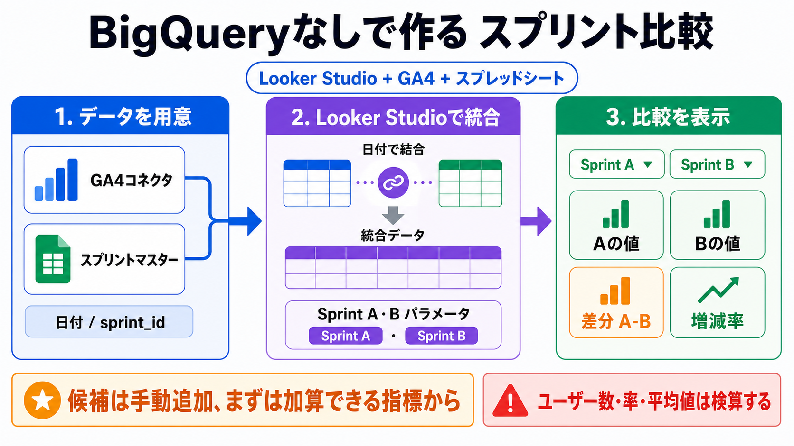
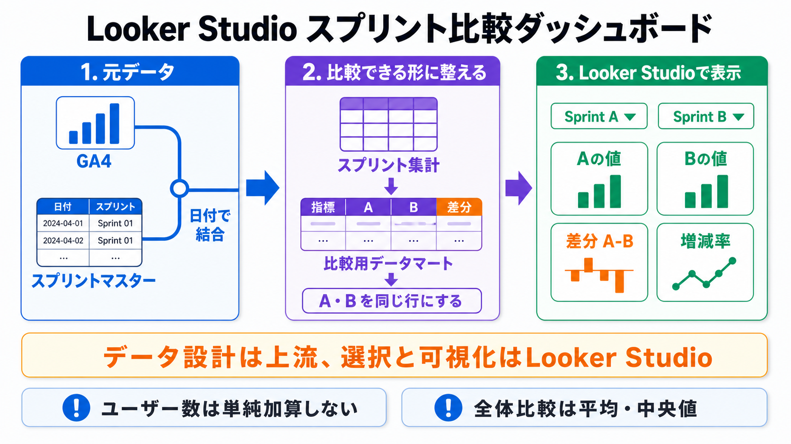
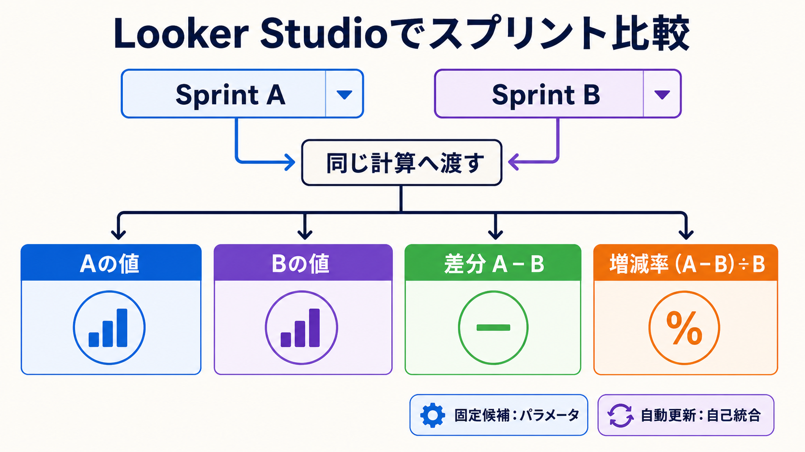
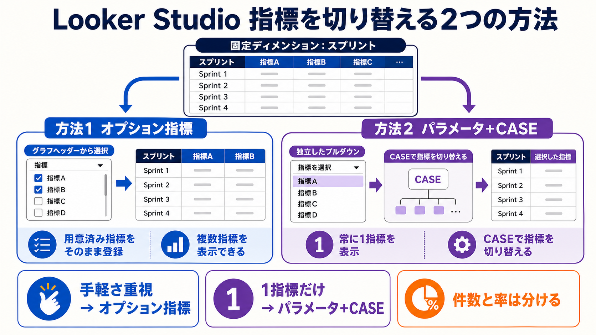
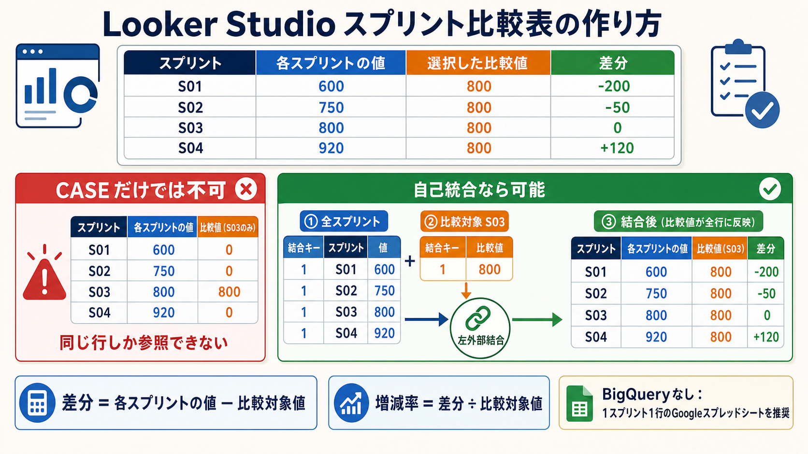

# Looker Studioでスプリント間の指標を比較する

## まず結論

GA4の数値を任意の2スプリントで比べるダッシュボードは、BigQueryを使わなくても実現できます。ただし、Looker Studioの期間コントロールだけでは、`Sprint 01` と `Sprint 05` のような任意の文字列区分をA・Bとして選び、その差分まで計算するのは難しいです。

推奨構成は次のとおりです。

1. 日付とスプリントを対応させるマスターをGoogleスプレッドシートに用意する。
2. GA4コネクタとスプリントマスターを、Looker Studio内で日付により統合する。
3. Sprint A・Bを選ぶテキスト型パラメータを2つ作る。
4. 条件集計でA・B・差分・増減率を表示する。

この構成では、パラメータのスプリント候補を追加する作業が必要です。週次で1候補ずつ増える程度なら十分に運用可能です。まず表示回数、イベント数、セッション数などからMVPを作り、ユーザー数や率系指標は集計方法を検証してから追加します。

表の完成形には2種類あります。選択したA・Bだけを1行で比較するなら、パラメータとCASEによる条件集計で作れます。全スプリントの各行へ、選択した比較スプリントの値を繰り返して表示するなら、CASEだけでは足りず、1スプリント1行の集計表を自己統合します。

## これは何か

Looker Studioの基本構造を理解したうえで、GA4とスプリントマスターを使い、次の比較を実現するための設計ノートです。

- スプリントAの指標
- スプリントBの指標
- 差分: `A - B`
- 増減率: `(A - B) / B`
- 今スプリントと前スプリントの比較
- 今スプリントと全スプリント平均・中央値の比較

重要なのは、画面上のフィルター設定より先に、比較できる粒度のデータを整えることです。

## どこで使うか

- GA4のセッション、表示回数、イベント数、コンバージョンなどをスプリント単位で見るとき
- 今スプリントと前スプリント、または任意の2スプリントを比較するとき
- 施策期間ごとの実績をスコアカードや表で並べるとき
- 日付ではなく、独自の期間区分をダッシュボードの選択肢にしたいとき

## 全体像

### Looker Studioの構造

Looker Studioは、次の階層で考えると整理しやすくなります。

```text
コネクタ
  └─ GA4、BigQuery、Google スプレッドシートなどへ接続する仕組み
      └─ データソース
          └─ フィールド、型、集計方法、計算フィールドを定義
              └─ レポート
                  ├─ ページ
                  │   ├─ グラフ（表、スコアカード、時系列など）
                  │   └─ コントロール（プルダウン、期間、パラメータなど）
                  └─ テーマ、共有設定
```

- `レポート`: ダッシュボード全体
- `ページ`: 用途ごとに分けた画面
- `コンポーネント`: ページ上のグラフ、コントロール、文字、画像など
- `グラフ`: データを表示する部品
- `コントロール`: 閲覧者が絞り込みや入力を行う部品

### ディメンションと指標

- `ディメンション`: 数値を分ける軸。例: 日付、スプリント、流入元、ページ
- `指標`: 集計する数値。例: セッション、表示回数、イベント数、売上

今回の設計では、`Sprint 01` は期間であると同時に、Looker Studio上では文字列のディメンションとして扱います。

### BigQueryを使わないデータの流れ

```text
GA4コネクタ ─────────────┐
                          ├─ Looker Studio内で日付を結合
スプリントマスター ──────┘              │
（Googleスプレッドシート）               v
                                  統合データ
                                      │
                           Sprint A・Bパラメータ
                                      │
                           A / B / 差分 / 増減率
```

比較用データマートは、候補の完全自動更新や大規模運用が必要になった場合の拡張案です。最初から必須ではありません。

## 理解用イラスト

次の図は、BigQueryを使わず、GA4コネクタとGoogleスプレッドシートのスプリントマスターをLooker Studio内で統合する流れです。



データ量や運用要件が大きくなった場合の拡張構成は、次の図で確認できます。Looker Studioは表示と操作を担当し、比較しやすいデータ形状を上流で作る構成です。



2つの選択値から4つのスコアカードを作る計算の流れは、次の図で確認できます。



ディメンションを固定したまま指標を切り替える方法は、次の図で確認できます。手軽さを優先するならオプション指標、独立したプルダウンで常に1指標を選ばせるならパラメータとCASEを使います。



### 選択した比較値を表の全行へ並べる

目的の表が次の形なら、比較対象の値を全行へ持たせる設計が必要です。

次の図は、CASEだけでは選択行にしか値が出ない理由と、自己統合によって比較値を全行へ展開する流れをまとめたものです。



| スプリント | 各スプリントの値 | 選択した比較値 | 差分 | 増減率 |
| --- | ---: | ---: | ---: | ---: |
| S01 | 600 | 800 | -200 | -25.0% |
| S02 | 750 | 800 | -50 | -6.3% |
| S03 | 800 | 800 | 0 | 0.0% |
| S04 | 920 | 800 | 120 | 15.0% |

単純なCASEは、条件に合う行でしか値を返しません。

```text
CASE
  WHEN スプリント = 比較スプリント
    THEN 表示回数
  ELSE 0
END
```

この式ではS03を選ぶと、S03行だけが800になり、ほかの行は0になります。別行にある800をS01・S02・S04へコピーする機能ではありません。

全行比較では、1スプリント1行の集計表を同じ統合データへ2回追加します。

```text
左側: 全スプリント
  結合キー / スプリント / 各スプリントの値

右側: 選択した比較スプリント
  結合キー / 比較対象値

結合条件:
  左側.結合キー = 右側.結合キー
```

両側に共通の固定値 `結合キー = 1` を用意します。右側はスプリントをディメンションに入れず、比較パラメータに合う値を1行へ集計します。この1行を左外部結合すると、選択した比較値が左側の全スプリントへ繰り返されます。

統合後の計算は次のとおりです。

```text
差分 = 各スプリントの値 - 比較対象値

増減率 =
CASE
  WHEN 比較対象値 = 0 THEN NULL
  ELSE (各スプリントの値 - 比較対象値) / 比較対象値
END
```

選択したA・Bだけを1行で比べる場合は自己統合を使わず、基準値と比較値をそれぞれCASEで条件集計します。通常の `スプリント` をディメンションに入れると行が分かれるため、1行比較では `S05 vs S03` のような比較ラベルを使います。

現在のスプリント集計結果自体がLooker Studioの統合データなら、その結果を独立したデータソースとして再利用することはできません。元データから統合を組み直すか、BigQueryを使わない推奨案として、Googleスプレッドシートに1スプリント1行の集計表を作って自己統合します。

指標の扱いも確認します。表示回数、イベント数、CV数などの加算可能な指標は扱いやすい一方、総ユーザー数は日別値を足して作らず、スプリント期間全体で重複排除した値を集計表へ保存します。

## よくある疑問

### Q. 期間コントロールでスプリントを選べるか

A. 期間コントロールは日付範囲を選ぶ部品です。`Sprint 01` のような文字列を選ぶには、スプリントをディメンションとして持たせ、プルダウンを使います。

### Q. フィルターとパラメータは何が違うか

A. フィルターはデータ行を絞り、パラメータは選択値を計算へ渡します。

| 仕組み | 主な役割 | 今回の用途 |
| --- | --- | --- |
| フィルター | 条件に合うデータだけを残す | ページ、流入元、デバイスなどの絞り込み |
| パラメータ | 閲覧者の入力値を計算で使う | Sprint A、Sprint Bの指定 |
| 期間コントロール | 日付範囲を変更する | 通常の年月日ベースの分析 |

通常のプルダウンを別々のグループへ置けば、A用とB用のグラフを別々に絞れます。しかし、その2つの表示結果を3枚目のスコアカードから直接引き算することはできません。差分には、AとBを同じ計算または同じデータ行から参照できる構造が必要です。

### Q. コントロールはどのグラフに効くか

A. 同じページ上の互換性があるグラフへ広く適用されます。特定のグラフだけへ効かせたい場合は、コントロールと対象グラフをグループ化します。A用とB用を分けるだけなら使えますが、AとBの差分計算を解決する機能ではありません。

### Q. Looker Studio標準の比較期間で代用できるか

A. 前期間や前年など、日付ベースの定型比較には向いています。一方、閲覧者が任意の2スプリントを別々に選ぶ用途には向きません。今回のA/B比較は独自の比較設計として作ります。

### Q. 最も簡単なパラメータ方式はどう作るか

A. テキスト型の `選択Sprint_A` と `選択Sprint_B` を作り、それぞれをプルダウンへ割り当てます。パラメータの許可値は手動管理になるため、候補数が少ない検証向けです。

比較に使う指標が条件集計できるデータソースなら、考え方は次のとおりです。

```text
Sprint Aの値
= SUM(CASE WHEN sprint_id = 選択Sprint_A THEN metric_value ELSE 0 END)

Sprint Bの値
= SUM(CASE WHEN sprint_id = 選択Sprint_B THEN metric_value ELSE 0 END)

差分
= Sprint Aの値 - Sprint Bの値

増減率
= CASE
    WHEN Sprint Bの値 = 0 THEN NULL
    ELSE (Sprint Aの値 - Sprint Bの値) / Sprint Bの値
  END
```

実際の計算フィールドで集計エラーになる場合は、GA4コネクタ上の指標を無理に再集計せず、BigQueryやスプレッドシート側でA・Bの値を作ります。

### Q. BigQueryを使わない場合、具体的に何を用意するか

A. 用意するものは次の3つです。

1. GA4のLooker Studioコネクタ
2. `date` と `sprint_id` を持つGoogleスプレッドシート
3. Looker Studio内の統合データとA・Bパラメータ

統合データには、少なくとも次のフィールドを入れます。

```text
GA4側: 日付 / ページ / 流入元 / 比較する指標
マスター側: date / sprint_id / sprint_order
結合条件: GA4の日付 = マスターのdate
```

スコアカードだけなら日付と指標が中心です。ページ別の比較表を作る場合はページ、流入元別なら流入元もGA4側へ追加します。必要以上のディメンションを入れると粒度が細かくなり、処理量も増えるため、使う項目だけに絞ります。

### Q. BigQueryなしでスプリント候補を自動更新できるか

A. 通常のディメンション用プルダウンなら元データの値に追従しますが、A・B計算へ渡すパラメータの許可値は手動管理が基本です。新しいスプリントが増えたら、`選択Sprint_A` と `選択Sprint_B` の候補へ追加します。

候補の自動更新を優先する場合は、スプレッドシート側へA・Bの比較組み合わせと集計値を用意し、通常のディメンションフィルターを使う方法があります。ただし、GA4の数値をスプレッドシートへ自動取得する仕組みが別途必要になるため、最初の構成としては複雑です。

### Q. 比較用データマートを使う構成は何のためか

A. 候補の自動更新、厳密な指標計算、多数の内訳表など、Looker Studio内の統合だけでは保守しにくくなった場合の拡張案です。

例として、次の粒度を持たせます。

```text
sprint_a_id × sprint_b_id × breakdown_dimension × metric_name
```

主な列:

| 列 | 内容 |
| --- | --- |
| `sprint_a_id` | 比較対象A |
| `sprint_b_id` | 比較対象B |
| `breakdown_dimension` | ページ、流入元、デバイスなど |
| `metric_name` | 指標名 |
| `value_a` | Aの値 |
| `value_b` | Bの値 |
| `difference` | `value_a - value_b` |
| `change_rate` | `(value_a - value_b) / value_b` |

Looker Studioの2つのプルダウンを `sprint_a_id` と `sprint_b_id` へ接続すれば、スコアカードと表を同じ仕組みで制御できます。BigQueryを使わない方針では、ここまでの構成は必須ではありません。

### Q. Looker Studioの自己統合でもできるか

A. MVPとしては可能です。同じスプリント集計表をA側・B側としてブレンドし、A・Bを同じ統合データへ載せます。ただし、ブレンドは各テーブルを集計してから結合するため、結合キーの一意性が崩れると数値が膨らみます。クロス結合に近い構成は行数も増えやすく、本番では保守が難しくなります。

### Q. 「全スプリント」と比べる場合は何を出すべきか

A. 全スプリントの合計ではなく、`1スプリントあたりの平均` または `中央値` を比較基準にします。合計はスプリント数が増えるほど大きくなるため、今スプリントとの大小比較として意味がずれます。

### Q. ディメンションを固定し、表示する指標だけを選べるか

A. できます。表のディメンションをスプリントなどに固定し、次の2方式から選びます。

| 方式 | 操作方法 | 向いている状況 |
| --- | --- | --- |
| オプション指標 | グラフヘッダーの指標選択メニュー | 最小設定で、用意済み指標を自由に追加・削除したい |
| パラメータ + CASE | レポート上の独立したプルダウン | 常に1指標だけ表示し、操作を分かりやすくしたい |

オプション指標では実際の指標名が列名になります。パラメータ方式では列名が `選択した指標の値` のように固定されるため、列名の分かりやすさを優先するならオプション指標が向いています。

### Q. 事前に作った計算フィールドをパラメータで切り替えられるか

A. 同じデータソースや統合データから参照できる数値フィールドなら、切り替え用CASEの戻り値へ指定できます。ただし、別のグラフ内だけに作ったグラフ固有の計算フィールドは参照できません。

統合データでは、最終的なCASEを表やグラフ側の `指標を追加 -> フィールドを作成` から作ります。既存計算フィールドを選べない場合は、元の式を切り替え用CASEへ直接記述します。

## 実務での見方

### 1. スプリントマスターを作る

1日1行にすると、GA4の日付と安全に結合しやすくなります。

| date | sprint_id | sprint_order | sprint_start | sprint_end | previous_sprint_id |
| --- | --- | ---: | --- | --- | --- |
| 2026-07-01 | Sprint 01 | 1 | 2026-07-01 | 2026-07-07 |  |
| 2026-07-02 | Sprint 01 | 1 | 2026-07-01 | 2026-07-07 |  |
| 2026-07-08 | Sprint 02 | 2 | 2026-07-08 | 2026-07-14 | Sprint 01 |

確認点:

- `date` は重複させない
- 日付の抜けを作らない
- スプリント境界を重複させない
- 表示名とは別に並び順を持つ
- 前スプリントを自動比較するなら対応列を持つ

### 2. Looker Studio内でGA4と日付を結合する

スプリントマスターを左側にし、GA4の日付と結合すると、GA4実績がない日もマスター側の日付を残せます。結合前に次をそろえます。

- 日付型
- タイムゾーン
- 1日の境界
- 必要な分析粒度

実績がない日も表示したいならスプリントマスターを左側、実績がある日だけでよいならGA4を左側にします。どちらを選んでも、結合後にスプリント別件数と元のGA4値を検算します。

### 3. 指標の加算可能性を確認する

GA4の指標は、日別値を足せば必ず期間値になるとは限りません。

- 比較的扱いやすい: 表示回数、イベント数、売上などの加算可能な指標
- 注意が必要: ユーザー数、率、平均値、重複排除が必要な指標

たとえば同じ利用者が複数日に訪れる場合、日別ユーザー数の合計はスプリント全体のユニークユーザー数より大きくなります。BigQueryを使わない構成では、ユーザー数はGA4画面の同期間値と必ず検算し、差異が許容できない場合は対象指標から外すか、別の取得方法を検討します。

### 4. 比較方式を選ぶ

| 状況 | 推奨方式 |
| --- | --- |
| BigQueryを使わず、まず画面を作りたい | GA4コネクタ + スプレッドシート + パラメータ方式 |
| Looker StudioだけでMVPを作りたい | 自己統合方式 |
| 候補を自動更新したい、表でも比較したい | 比較用データマート方式 |
| ユーザー数などを厳密に集計したい | GA4 BigQuery Export + データマート |

BigQueryを使わない方針では、1行目を推奨します。候補追加を手動運用し、GA4指標の検算を定期的に行います。

### 5. レポートを4ページに分ける

1. `概要`: Sprint A/B、A・B・差分・増減率のスコアカード
2. `内訳`: ページ、流入元、デバイスなどをA/B列で並べる表
3. `スプリント内推移`: 開始から何日目かを軸にした推移
4. `品質確認`: 対象日、欠損日、行数、更新日時、選択条件

### 6. 表でA/Bを横並びにする

パラメータ方式でも、ページをディメンションにし、A・Bの条件集計を指標として置けば次の表を作れます。

| ページ | Sprint A | Sprint B | 差分 | 増減率 |
| --- | ---: | ---: | ---: | ---: |
| `/top` | 12,000 | 10,000 | +2,000 | +20.0% |
| `/detail` | 8,500 | 9,000 | -500 | -5.6% |

表のディメンションをページや流入元へ変えても、同じA/B比較の構造を再利用できます。

### 7. ディメンションを固定して指標を切り替える

#### オプション指標を使う

表のディメンションを `スプリント` に固定し、表示回数、CTAクリック数、CV数、CTR、CVRなどをオプション指標として登録します。

設定手順:

1. 対象の表を選択する。
2. ディメンションへ `スプリント` を設定する。
3. 初期表示する指標を設定する。
4. `オプション指標` を有効化する。
5. 切り替え候補の指標を登録する。
6. グラフヘッダーを `常に表示` または `カーソルを合わせると表示` にする。

閲覧者は、グラフヘッダーの指標選択アイコンから必要な列を追加・削除できます。独立したプルダウンではありませんが、CASEを作らず用意済み指標をそのまま使える最も簡単な方法です。

#### パラメータとCASEを使う

常に1つの指標だけを独立したプルダウンで選択させる場合は、テキスト型パラメータ `選択指標` を作ります。

許可値の例:

| 保存値 | 表示名 |
| --- | --- |
| `impressions` | 表示回数 |
| `cta_clicks` | CTAクリック数 |
| `conversions` | CV数 |

切り替え用計算フィールド:

```text
CASE
  WHEN 選択指標 = "impressions"
    THEN SUM(表示回数)
  WHEN 選択指標 = "cta_clicks"
    THEN SUM(CTAクリック数)
  WHEN 選択指標 = "conversions"
    THEN SUM(CV数)
  ELSE NULL
END
```

表には次を設定します。

```text
ディメンション: スプリント
指標: 選択した指標の値
```

その後、プルダウンコントロールのコントロールフィールドへ `選択指標` を指定します。

#### 件数と率は分ける

1つのCASEへ件数と率を混ぜることはできますが、計算フィールドの表示形式は1種類です。`1,250件` と `3.04%` を同じ列で自然に切り替えるのは難しいため、次の2グループへ分けます。

- 件数用: 表示回数、CTAクリック数、CV数
- 率用: CTAクリック率、クリック後CVR、全体CVR

率用の例:

```text
CASE
  WHEN 選択率指標 = "ctr"
    THEN SUM(CTAクリック数) / SUM(LP到達数)
  WHEN 選択率指標 = "cvr"
    THEN SUM(CV数) / SUM(LP到達数)
  ELSE NULL
END
```

GA4のユーザー数や率など、単純加算できない指標はCASEへ入れる前に集計方法を確認します。

## 実装の順番

1. 比較したいGA4指標と、その正しい集計方法を決める。
2. スプリントマスターをGoogleスプレッドシートに作り、日付の一意性と境界を検証する。
3. GA4コネクタとスプリントマスターをLooker Studio内で日付により統合する。
4. `選択Sprint_A` と `選択Sprint_B` を作り、候補を登録する。
5. A・B・差分・増減率のスコアカードを作る。
6. ページなどをディメンションにしてA/B横並び表を作る。
7. GA4画面とスプリント別の値を検算する。
8. A=B、B=0、データなし、最新スプリント追加時をテストする。
9. 指標切り替えが必要なら、オプション指標またはパラメータ + CASEを設定する。
10. 件数と率を別グループで切り替え、表示形式を確認する。

## 次回の確認

- [ ] 比較したい指標の定義は決まっているか
- [ ] 出力粒度を先に決めたか
- [ ] スプリントマスターは1日1行で一意か
- [ ] GA4とマスターの日付型・タイムゾーンは一致しているか
- [ ] JOIN前後で行数が意図せず増えていないか
- [ ] ユーザー数、率、平均値を単純加算していないか
- [ ] AとBを同じ計算または同じデータ行から参照できるか
- [ ] 差分の向きは `A - B` で合っているか
- [ ] 増減率の基準はBで合っているか
- [ ] Bが0、A=B、データなしを処理しているか
- [ ] 新しいスプリントをA・Bパラメータの候補へ追加したか
- [ ] 全スプリント比較は合計ではなく平均または中央値か
- [ ] 品質確認ページで対象日と更新状態を確認できるか
- [ ] 指標切り替えは、オプション指標とパラメータ方式のどちらが適切か
- [ ] パラメータ方式では、切り替え対象のフィールドを同じ計算から参照できるか
- [ ] 件数と率を同じ切り替えフィールドへ混在させていないか
- [ ] グラフ固有の計算フィールドを別の計算フィールドから参照しようとしていないか

## 関連トピック

- [KPI設計の基本と用語](./KPI設計の基本と用語.md)
- [LPグロースの進め方とKPI設計](./LPグロースの進め方とKPI設計.md)
- [BigQueryからLooker Studioへの運用設計](../../BigQuery/20_トピック/BigQueryからLooker%20Studioへの運用設計.md)

## 参考リンク

- [Ways to use Looker Studio](https://docs.cloud.google.com/looker/docs/studio/think)
  - レポート、データソース、コネクタなどの基本的な役割を確認するための公式ドキュメント。
- [Add charts and controls to your report](https://cloud.google.com/looker/docs/studio/add-charts-and-controls-to-your-report)
  - グラフとコントロールを含むレポート部品の基本を確認するための公式ドキュメント。
- [Apply controls to specific charts](https://cloud.google.com/looker/docs/studio/apply-controls-to-specific-charts)
  - グループ化によってコントロールの適用範囲を限定する仕様を確認するための公式ドキュメント。
- [Parameters](https://docs.cloud.google.com/looker/docs/studio/parameters)
  - パラメータを計算フィールドやコントロールで使う方法と許可値の仕様を確認するための公式ドキュメント。
- [How blends work](https://docs.cloud.google.com/looker/docs/studio/how-blends-work)
  - 統合データが各テーブルを集計してから結合する仕組みを確認するための公式ドキュメント。
- [Looker and Looker Studio shared terms and concepts](https://docs.cloud.google.com/looker/docs/looker-and-studio-shared-terms-glossary)
  - 同じデータソースの複数インスタンスを統合できることと、統合データが独立した再利用可能オブジェクトではないことを確認するための公式ドキュメント。
- [Blending tips and advanced concepts](https://docs.cloud.google.com/looker/docs/studio/blending-tips-and-advanced-concepts)
  - 結合条件、フィルター、クロス結合などの注意点を確認するための公式ドキュメント。
- [Set report date ranges](https://cloud.google.com/looker/docs/studio/set-report-date-ranges)
  - 期間コントロールと比較期間の役割を確認するための公式ドキュメント。
- [Scorecard reference](https://cloud.google.com/looker/docs/studio/scorecard-reference)
  - スコアカードで絶対差・変化率を表示する標準機能を確認するための公式ドキュメント。
- [Optional metrics](https://docs.cloud.google.com/data-studio/optional-metrics)
  - 表やグラフで閲覧者が表示指標を変更する標準機能を確認するための公式ドキュメント。
- [About calculated fields](https://docs.cloud.google.com/data-studio/about-calculated-fields)
  - データソース計算フィールドとグラフ固有計算フィールドの違い、統合データでの制約を確認するための公式ドキュメント。

## 更新履歴

- 2026-08-02: 全スプリントの各行へ選択した比較値を表示する自己統合方式と、CASEだけで作る1行比較との違いを追記。
- 2026-08-02: 固定ディメンションで指標を切り替えるオプション指標方式とパラメータ + CASE方式を追記。
- 2026-08-01: BigQueryを使わない構成を推奨ルートとして追加し、GA4コネクタ、スプレッドシート、パラメータによる実装手順を整理。
- 2026-08-01: Looker Studioの基礎概念、GA4とスプリントマスターの統合、比較用データマート、表でのA/B比較まで内容を拡張。
- 2026-08-01: 初版作成。スプリントA・Bの値、差分、増減率を表示する2つの設計を整理。
