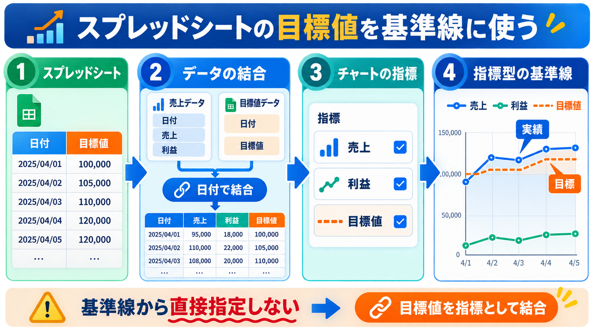

# Looker Studioでスプレッドシートの目標値を基準線に使う

## まず結論

日付ごとに変わる目標値を基準線として表示したい場合は、スプレッドシートを基準線設定から直接指定するのではなく、目標値をグラフのデータソースへ結合します。

そのうえで、目標値をグラフの指標に追加し、基準線のタイプを「指標」にして目標値を選びます。売上や利益を棒・折れ線で表示していても、目標値を基準線として重ねられます。

## これは何か

Looker Studioの基準線には、固定値だけでなく、グラフに含まれる指標を参照する方法があります。日付ごとに異なる目標を表示する場合は、目標値を日付と紐づいた指標として用意するのがポイントです。

## どこで使うか

- 日別の実績と日別目標を比較するとき
- 週別・月別の実績と期間別目標を比較するとき
- 売上、利益、件数などの実績に達成ラインを重ねるとき

## 全体像

1. 目標値のスプレッドシートに、実績と結合できる日付または期間キーを用意する。
2. Looker Studioで実績データと目標データを、日付などのキーで統合する。
3. 売上・利益に加えて、目標値をグラフの指標へ追加する。
4. 基準線のタイプを「指標」にし、参照する指標として目標値を指定する。
5. 目標値の線の色、線種、ラベルを設定する。

## 理解用イラスト

この図は、目標値を日付で実績データへ結合し、指標型の基準線として使う流れを示しています。

## よくある疑問

### Q. スプレッドシートを基準線の設定画面から直接選べる？

A. できません。スプレッドシートの目標値を、まずグラフのデータソースに含める必要があります。

### Q. グラフには売上と利益だけを表示して、目標だけ基準線にできる？

A. 目標値はグラフの指標として参照できる状態にする必要があります。グラフ種別や設定によって目標値の系列自体が表示される場合があるため、表示結果を確認し、色や線種を調整します。

### Q. 固定の目標値ならスプレッドシートは必要？

A. 毎日同じ目標値など、固定値でよい場合は、基準線の固定値を使えば十分です。日付ごとに目標が変わる場合に、スプレッドシートとの結合が有効です。

## 実務での見方

### 目標データの例

| 日付 | 目標値 |
|---|---:|
| 2026/08/01 | 100 |
| 2026/08/02 | 105 |
| 2026/08/03 | 100 |

日次・週次・月次を切り替える場合は、実績と目標の粒度をそろえます。日次目標を週次で合計するのか、週次目標を別途管理するのかは、指標の意味に合わせて決めます。

### チェックリスト

- [ ] 実績と目標の結合キーが一致している
- [ ] 日付フィールドが日付型として認識されている
- [ ] 目標データの粒度が実績と一致している
- [ ] 目標値の集計方法が適切である
- [ ] 目標値を基準線の「指標」として選択している
- [ ] 比較期間とデータ更新日時を確認できる

## 次回の確認

- [ ] 日次目標を週次・月次で表示するときの集計定義を確認する
- [ ] 目標未設定の日付をどう表示するか決める
- [ ] 未完了の期間を前期間と比較してよいか確認する

## 関連トピック

- [Looker Studioの統合データで数値が膨らむ理由とREPLACE関数](./Looker Studioの統合データで数値が膨らむ理由とREPLACE関数.md)
- [Looker Studioでスプリント間の指標を比較する](./Looker Studioでスプリント間の指標を比較する.md)

## 参考リンク

- [Looker Studio公式：基準線と基準帯をグラフに追加する](https://cloud.google.com/looker/docs/studio/add-reference-lines-and-reference-bands-to-charts)
  - 基準線の種類、指標の参照、日付軸への設定方法を確認するための公式ドキュメント。

## 更新履歴

- 2026-08-27: スプレッドシートの目標値を指標型の基準線として使う方法を追加。
