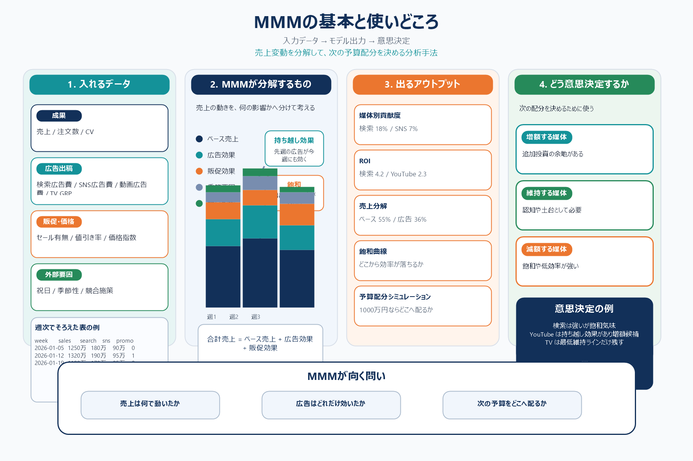

# MMMの基本と使いどころ

## まず結論

MMM は、売上やCVの変動を `広告` `販促` `価格` `季節性` `競合影響` などに分解して、どの施策がどれだけ効いたかを推定する分析手法です。  
強みは、個人単位の追跡ではなく集計時系列データで、`何が効いたか` だけでなく `次にどこへ予算を置くか` まで考えやすいことです。

## これは何か

MMM は `Marketing Mix Modeling` の略です。  
週次や日次の売上・CVと、媒体別広告費、価格、販促、祝日、競合施策などを同じ時間粒度で並べて、成果の変動要因を統計的に推定します。

個人レベルの広告接触を追う方法ではなく、`集計データから全体最適の判断材料を作る方法` と捉えると分かりやすいです。

## どこで使うか

- 媒体別に、どの施策が売上やCVへ効いたかを見たいとき
- 来月や来四半期の予算配分を見直したいとき
- 値引きや季節性の影響と広告効果を分けて考えたいとき
- 計測制限が強く、個人単位のアトリビューションだけでは判断しにくいとき

## 全体像

- MMM が答えたい問いは `売上は何で動いたか` `広告はどれだけ効いたか` `次にどこへ増額すべきか`
- インプットは `成果` `媒体別出稿` `販促・価格` `外部要因` の4群でそろえる
- アウトプットは `売上分解` `媒体別貢献度` `ROI` `持ち越し効果` `飽和傾向` `予算再配分シミュレーション`
- 最終用途は、過去説明よりも `次の1円をどこへ置くと伸びやすいか` の判断

具体的なデータの形は、`1行 = 1週` の表にそろえると考えやすいです。

```text
week,sales,orders,search_spend,sns_spend,youtube_spend,tv_grp,price_index,promotion_flag,holiday_flag,brand_search_volume,competitor_promo_flag
2026-01-05,12500000,820,1800000,900000,1200000,150,1.00,0,1,22000,0
2026-01-12,13200000,870,1900000,950000,1200000,180,0.98,1,0,25000,0
2026-01-19,11900000,790,1700000,850000,1000000,120,1.00,0,0,21000,1
```

## 理解用イラスト

下の図は、`入れるデータ -> モデルが分解するもの -> 出るアウトプット -> 意思決定` の流れを1枚で戻すための図です。MMM を、分析手法としてではなく予算配分の判断装置として思い出しやすくする用途を意図しています。



## よくある疑問

### Q. MMM には何を入れる？

A. 最低限は `成果データ` `媒体別広告出稿` `販促・価格` `外部要因` です。実務では `売上 or CV` に加えて、`検索広告費` `SNS広告費` `動画広告費` `TV GRP` `価格` `セール有無` `祝日フラグ` などを週次でそろえます。

### Q. 広告費だけ入れれば十分？

A. 不十分です。価格変更、セール、季節性、競合施策の影響を入れないと、広告が本来より効いて見えたり逆に弱く見えたりします。MMM は `売上が動いた理由を漏らさず並べる` ことが重要です。

### Q. どんなアウトプットが出る？

A. 典型的には `ベース売上` `媒体別貢献度` `ROI` `広告の持ち越し効果` `飽和曲線` `最適配分シミュレーション` が出ます。会議では、売上分解グラフと予算配分案として使われることが多いです。

### Q. その結果で何を決める？

A. 主に `増額する媒体` `減額する媒体` `維持だけする媒体` を決めます。例えば `検索は今も強いが飽和気味` `YouTube は持ち越し効果があるので増額余地あり` のように、次の予算配分へつなげます。

### Q. MMM とアトリビューションはどう違う？

A. アトリビューションが `この成果をどの接点へ帰属させるか` を見るのに対して、MMM は `売上全体の変動を何が動かしたか` を見る方法です。MMM はユーザー単位の追跡に依存しにくく、経営や予算配分の判断に向きます。

### Q. MMM は万能？

A. 万能ではありません。データ期間が短い、施策変動が少ない、重要な要因が欠けている場合は不安定です。`因果を完全証明する方法` ではなく、実務で強い意思決定材料を作る方法として使います。

## 実務での見方

- まず `成果指標` を決める
  - `sales` `orders` `cv` のどれで判断するかを先に固定する
- 次に `広告以外の要因` を並べる
  - `price` `promotion` `holiday` `competitor` を入れ、広告への過大評価を避ける
- 出力では `過去の勝者探し` ではなく `次の限界投資先` を見る
  - いま強い媒体と、追加の1円が強い媒体は同じとは限らない
- `ROI` だけで終わらず `持ち越し効果` と `飽和` をセットで見る
  - 直近効率が低く見えても、認知施策は後から効くことがある
- モデル結果は、そのまま確定値として扱わず、次のテスト仮説にも使う
  - `SNS 増額テスト` `TV の最低維持ライン確認` のような打ち手に落とす

実務で一番重要なのは、`どれが効いたか` より `次にどこへ増減額するか` まで会話を進めることです。

## 次回の確認

- [ ] MMM を `売上変動の要因分解と予算配分のための手法` と一文で説明できるか
- [ ] 入力データを `成果` `媒体別出稿` `販促・価格` `外部要因` に分けて言えるか
- [ ] 出力を `貢献度` `ROI` `持ち越し効果` `飽和` `配分シミュレーション` として説明できるか
- [ ] `追加の1円をどこへ置くか` が MMM の意思決定だと理解できているか
- [ ] アトリビューションとの違いを `個別接点の帰属` と `全体売上の要因分解` で説明できるか

## 関連トピック

- [分析設計の基本プロセス](./分析設計の基本プロセス.md)
- [退会抑止に向けたKPI設計の考え方](./退会抑止に向けたKPI設計の考え方.md)
- [Adjustの指標におけるアトリビューションの見方](./Adjustの指標におけるアトリビューションの見方.md)

## 参考リンク

- 一般公開された参考リンクは未設定

## 更新履歴

- 2026-06-20: 初版作成。MMM の定義、入力データ、出力、意思決定へのつなぎ方を整理
