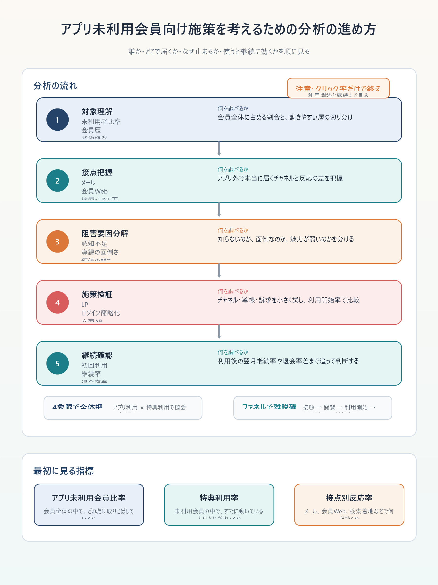

# アプリ未利用会員向け施策を考えるための分析の進め方

## まず結論

この分析の出発点は、`アプリを使っていない人をアプリへ寄せること` ではありません。`会員なのにアプリ未利用の人は、どこなら反応し、何が障害で、特典利用が継続に効くのか` を順に明らかにすることです。

実務では、`誰なのか -> どこで接触できるか -> 何で止まるか -> 使うと継続に効くか` の順で見ると、施策へつながる分析になります。

## これは何か

サブスク会員の中にアプリ未利用者が多いときに、アプリ外導線を含む施策を考えるための分析の進め方を整理したトピックです。調査項目、分析ステップ、施策仮説への落とし方をまとめています。

## どこで使うか

- 特典利用を増やしたいが、アプリ内掲載枠だけでは限界があるとき
- 会員なのにアプリ未利用の層が大きく、取りこぼしが気になるとき
- 退会抑止の文脈で、接点設計と利用促進を見直したいとき
- 企画書や分析設計メモへ、そのまま書ける流れが欲しいとき

## 全体像

1. まず `何を増やしたいか` を決める
2. 次に `アプリ未利用会員` を定義する
3. その人たちの `属性` `接点` `行動` を把握する
4. `認知不足` `導線の複雑さ` `価値の弱さ` のどこが障害かを切り分ける
5. `どのチャネルなら動くか` の仮説を作る
6. 小さく施策検証する
7. 最後に `特典利用が継続に効くか` を確認する

このテーマでは、`アプリを入れていないこと` そのものを原因と決めつけないのが重要です。実際には、`アプリが不要な契約導線だった` `特典を知らない` `ログインが面倒` `使う場面が思い浮かばない` など、別の要因が主因のことがあります。

## 理解用イラスト



図では、`対象理解 -> 接点把握 -> 阻害要因分解 -> 検証 -> 継続確認` の流れと、各段階で何を調べるかを1枚で見返せます。

## よくある疑問

### Q. 最初に見るべき数字は何ですか

A. まず `アプリ未利用会員比率` `その中での特典利用率` `接触できているチャネル比率` を見ます。ここが見えないと、どこに機会があるか分かりません。

### Q. アプリ未利用者を1つの塊として見てよいですか

A. よくありません。`会員歴` `契約経路` `年齢帯` `Web利用有無` `他特典利用有無` で分けると、動きやすい層と難しい層が見えます。

### Q. 調査の中心はアプリDL施策ですか

A. 必ずしもそうではありません。今回の主題は `アプリへ寄せること` より、`その人が普段いる場所から特典利用を始めてもらうこと` です。

### Q. クリック率が高ければ成功ですか

A. 不十分です。見るべきなのは `詳細閲覧` `利用開始` `初回利用完了` `継続率` です。クリックだけでは退会抑止への寄与は分かりません。

### Q. 何を調査すればよいか多すぎて迷います

A. `誰か` `どこで届くか` `なぜ止まるか` `使うと継続に効くか` の4束で整理すると、調査項目が散りにくくなります。

## 実務での見方

### 1. 分析の目的を最初に固定する

- 特典利用者数を増やしたいのか
- アプリ未利用会員の利用率を増やしたいのか
- 利用を通じて退会率を下げたいのか
- まず認知向上だけを狙うのか

実務では `アプリ未利用会員の特典利用率を上げ、その後の継続率を見る` と置くと、施策評価までつながりやすくなります。

### 2. 対象者定義を先に決める

- 会員の定義
- アプリ未利用者の定義
  - 例: 過去90日アプリ起動なし
- 特典利用者の定義
  - 例: 特典詳細閲覧、登録完了、初回利用完了のどこを利用とみなすか
- 観測期間
- 継続者 / 退会者の定義

定義が揃わないまま集計へ入ると、途中で数字の意味がぶれます。

### 3. 4象限で全体を分ける

1. `アプリ利用 × 特典利用`
2. `アプリ利用 × 特典未利用`
3. `アプリ未利用 × 特典利用`
4. `アプリ未利用 × 特典未利用`

この4象限にすると、`すでに価値接触している層` と `未開拓だが人数が多い層` を分けて見られます。特に 4 の大きさが、今回の施策機会の中心になります。

### 4. 調査項目を4束で見る

- `対象者の把握`
  - 会員数に占める未利用者比率
  - 年齢帯、地域、契約経路、会員歴、料金プラン
- `接点の把握`
  - メール到達可否、開封率、クリック率
  - 会員Web訪問、検索流入、LINE、SMS、紙、問い合わせ接点
- `阻害要因の把握`
  - アプリ不要感、認知不足、ログイン負荷、条件理解不足、使う場面の不在
- `価値と継続の把握`
  - 初回利用率、継続利用率、特典利用者の翌月継続率、退会率差

### 5. 離脱ポイントをファネルで分解する

1. 接触できたか
2. 開封 / 閲覧したか
3. 詳細を見たか
4. 利用開始したか
5. 初回利用完了したか
6. 継続利用したか

ここで最も落ちる段階が、施策テーマになります。`知らない` のか `興味はあるが手続きで止まる` のかで、打ち手は変わります。

### 6. 仮説を作る

- アプリ未利用者は高齢層だからではなく、契約導線上アプリ不要だった層ではないか
- 特典認知不足より、利用開始導線の複雑さが主因ではないか
- アプリ外ではメールより会員Webや検索着地LPのほうが反応しやすいのではないか
- 会員歴3か月以内の未利用者のほうが動きやすいのではないか

仮説は、`誰に` `どの接点で` `何を変えると` `何が上がるか` の形で置くと検証しやすくなります。

### 7. 小さく検証する

- 会員限定LPの新設
- ログイン簡略導線
- メール訴求の文面差し替え
- 会員Webトップでの露出
- 初回利用特典の訴求
- チャネル別ABテスト

施策比較では、クリック率だけでなく `利用開始率` `初回利用完了率` `継続率` まで追う前提を置きます。

### 8. 最後に継続効果を見る

- 特典利用者と未利用者の継続率差
- 初回利用後の翌月継続率
- 複数回利用者の退会率
- アプリ未利用だが特典利用した人の継続率

ここでは相関だけで安心せず、会員歴や他サービス利用度の差に引っ張られていないかを疑います。

### 9. 企画書にそのまま載せる出力型

```text
1. 背景:
2. 目的:
3. 対象定義:
4. 現状把握:
5. 調査項目:
6. 分析ステップ:
7. 仮説:
8. 検証施策:
9. 成果指標:
```

この型に沿うと、`分析のための分析` ではなく、施策実行まで見据えた設計だと伝えやすくなります。

## 次回の確認

- [ ] `アプリ未利用会員` の定義が言葉で揃っているか
- [ ] 4象限で機会の大きい層を見つけたか
- [ ] 接点、阻害要因、継続効果を分けて見ているか
- [ ] クリック率だけでなく、利用開始と継続まで追う設計になっているか
- [ ] 仮説が `誰に / どの接点で / 何を変えると / 何が上がるか` になっているか

## 関連トピック

- [分析設計の基本プロセス](./分析設計の基本プロセス.md)
- [分析依頼を受けてからアウトプットを出すまでの進め方](./分析依頼を受けてからアウトプットを出すまでの進め方.md)
- [退会抑止に向けたKPI設計の考え方](./退会抑止に向けたKPI設計の考え方.md)
- [GA4とBigQueryのグラフ分析でユーザー導線を読む](./GA4とBigQueryのグラフ分析でユーザー導線を読む.md)

## 参考リンク

- 一般化した分析設計メモのため、外部リンクは未追加。

## 更新履歴

- 2026-06-20: 初版作成。
