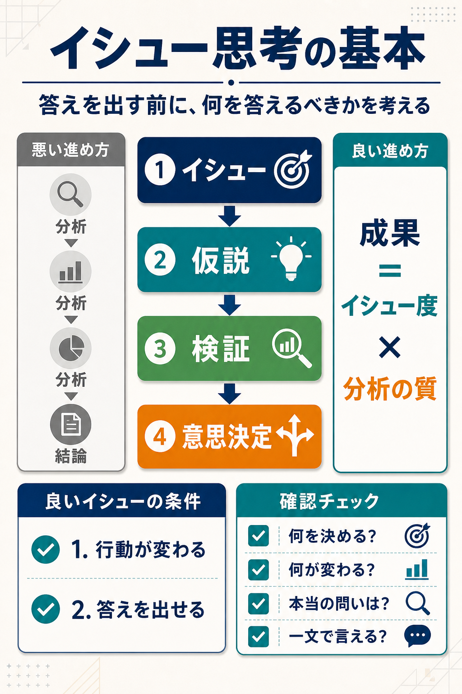
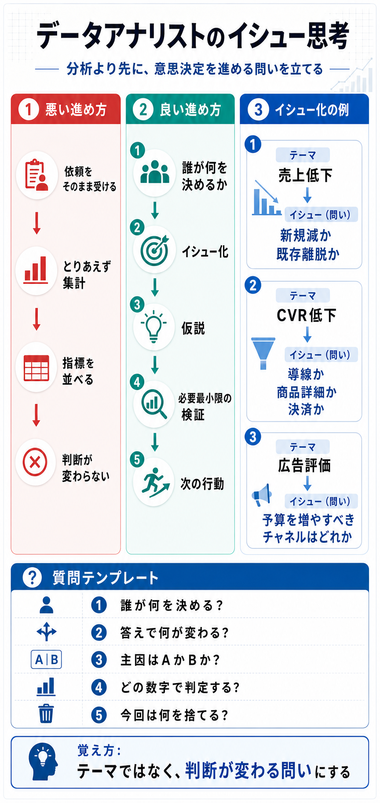

# イシュー思考の基本

## まず結論

分析で最初にやるべきことは、`たくさん調べること` ではなく `何を答えるべきかを決めること` です。価値があるのは、`答えが行動を変える問い` を置き、その問いに対して最小限の分析で意思決定へつなげる進め方です。

## これは何か

『イシューからはじめよ』の要点を、データアナリストが実務で再利用しやすい形に整理したトピックです。本の感想ではなく、`問い -> 仮説 -> 検証 -> 意思決定` の型として使い回すことを目的にします。

## どこで使うか

- 曖昧な分析依頼を受けたとき
- 調査や集計が膨らみすぎているとき
- 会議資料は作っているのに結論が弱いとき
- SQL やダッシュボード作成の前に、分析の芯を定めたいとき

## 全体像

本質的な流れは次の4段階です。

1. `イシューを見つける`
2. `仮説を立てる`
3. `必要最小限の分析で検証する`
4. `意思決定へつなげる`

避けたい流れ:

```text
分析 -> 分析 -> 分析 -> 結論
```

目指す流れ:

```text
問い -> 仮説 -> 検証 -> 結論
```

## 理解用イラスト

この図は、`悪い進め方` と `良い進め方`、そして `良いイシューの条件` を1枚で戻すための復習用インフォグラフィックです。



まず中央の `イシュー -> 仮説 -> 検証 -> 意思決定` を見て、そのあと左右の比較と下部のチェックへ戻ると使いやすいです。

今回追加した図は、データアナリストが依頼を受けた場面で、`テーマをどうイシューへ変えるか` と `何を聞けばよいか` を1枚で戻すための実務用インフォグラフィックです。



## よくある疑問

### Q. イシューとは何か

A. `答えを出す価値がある問い` です。次の2条件を満たすものをイシューとして扱います。

- 答えによって行動や意思決定が変わる
- 現実的に答えを出せる可能性がある

### Q. 数字を聞かれているのに、それはイシューではないことがあるのか

A. あります。`今月のPVは何件か` `CTR は何%か` のような質問は、事実確認としては必要でも、そのままでは意思決定に直結しません。`その数字を見て何を決めるのか` まで変換して初めてイシューになります。

### Q. 良いイシューと悪いイシューの違いは何か

A. 良いイシューは `重要` かつ `答えられる` ものです。重要でも広すぎて答えられない問いや、答えやすくても意思決定を変えない問いは、優先度が下がります。

### Q. イシュー度はどう見るか

A. 次の掛け算で考えると整理しやすいです。

```text
イシュー度 = 重要度 × 答えが出せる可能性
```

- `今月のPVは?`
  - 重要度は低め、答えやすさは高い、イシュー度は低い
- `この施策は効果があるか?`
  - 重要度も答えやすさも高く、イシュー度は高い
- `売上を100%予測できるか?`
  - 重要でも答えやすさが低く、イシュー度は低い

### Q. イシューを見つけた後は何をするか

A. すぐ集計へ行かず、まず仮説を置きます。たとえば `この施策は退会率を改善したのか` がイシューなら、`特典利用頻度の増加が継続率改善につながったのではないか` のように因果の見立てを置いてから、必要な比較や検定を考えます。

## 実務での見方

### 1. まずゴールを確認する

最初に確認するのは `この分析で何を決めたいのか` です。

- 依頼: `LPを分析して`
- まだ曖昧な状態: 依頼内容であってイシューではない
- 決めたいことへ変換: `LP改修を実施するか決めたい`
- イシュー化: `LP改修によってCVRは改善するのか?`

### 2. 常識を疑う

みんなが当然だと思っている前提を一度疑います。

- よくある前提: `流入を増やせばCVも増える`
- 疑う視点: `本当の詰まりはLP内離脱ではないか`

ここで問いの質が変わることがあります。

### 3. 対立軸を作る

良いイシューは、`Aなのか Bなのか` の形に置くと検証しやすくなります。

- `流入が問題なのか / LPが問題なのか`
- `スキーマ情報不足なのか / 業務知識不足なのか`
- `スキャン量が問題なのか / 中間データ量が問題なのか`

### 4. 一文で言える状態にする

複数の論点を並べた説明ではなく、ひとつの問いとして言い切れる状態まで削ります。

- 悪い例: `利用状況を分析し、退会率や利用率を確認し、施策効果を評価する`
- 良い例: `この施策は退会率を改善したのか?`

## データアナリスト業務での具体例

イシュー思考は、`分析すること` ではなく `意思決定を前に進めること` に向けて使います。次のように、テーマをそのまま受けず、判断に直結する問いへ変換します。

### 1. 売上が落ちたとき

- テーマ: `売上が落ちている`
- 悪い問い: `売上データを全部分析する`
- 良いイシュー: `売上減少の主因は、新規顧客減か既存顧客離脱か`
- 答えが出ると変わること: 新規獲得施策を優先するか、継続施策を優先するかが決まる

### 2. 広告の効果を見たいとき

- テーマ: `広告の効果を見たい`
- 悪い問い: `チャネル別レポートを作る`
- 良いイシュー: `来月の予算を増やすべきチャネルはどれか`
- 答えが出ると変わること: 予算配分の変更に直結する

### 3. EC サイトの CVR が低いとき

- テーマ: `CVRが低い`
- 悪い問い: `離脱率を細かく見る`
- 良いイシュー: `最大のボトルネックは集客後の導線か、商品詳細ページか、決済画面か`
- 答えが出ると変わること: 改修の優先箇所が決まる

### 4. 解約率が上がったとき

- テーマ: `解約率が上がった`
- 悪い問い: `解約ユーザーの特徴をたくさん出す`
- 良いイシュー: `解約増加は価格要因か、利用体験要因か`
- 答えが出ると変わること: 値付け見直しか、プロダクト改善かの方向が決まる

### 5. ダッシュボード依頼を受けたとき

- テーマ: `ダッシュボードを作ってほしい`
- 悪い問い: `要望された指標を全部載せる`
- 良いイシュー: `このダッシュボードで、運用担当者は毎週どの判断をするのか`
- 答えが出ると変わること: 必要な KPI と不要な指標を分けられる

## 質問テンプレート

データアナリストがイシューを立てるときは、`分析対象` より先に `意思決定` を確認します。次の質問を順に使うと、依頼文をイシューへ変えやすくなります。

### ヒアリングで最初に聞く質問

- `今回、最終的に誰が何を決めたいですか`
- `その判断が変わると、具体的にどんな行動が変わりますか`
- `いま見えている問題は何ですか。それは事実ですか、感覚ですか`
- `その問題を一言でいうと、何が落ちている、何が増えている状態ですか`

### イシューへ変換する質問

- `原因候補は大きく分けると何と何ですか`
- `今回まず切り分けるべき一番大きい分岐は何ですか`
- `この分析で最初に答えるべき問いを A か B か、何が主因か の形で言うと何ですか`
- `その問いに対して、現時点の仮説は何ですか`

### 分析設計へつなげる質問

- `その仮説が正しいかどうか、どの数字を見れば判定できますか`
- `その問いに答えが出たら、次に何をやりますか`
- `今回は答えなくてよい問いは何ですか`
- `いつまでに、どの精度で答えが出れば十分ですか`

### そのまま使える型

- `主因は A か B か`
- `優先して改善すべきボトルネックはどこか`
- `伸ばすべき顧客層はどこか`
- `予算を増やすべき施策はどれか`
- `悪化の原因は外部要因か内部要因か`
- `成果差を最も説明する要因は何か`

### 会話での変換例

- テーマ: `売上を改善したい`
- 聞き返し: `誰が何を決めるための分析ですか`
- 聞き返し: `客数と客単価のどちらを優先して見ると判断が変わりますか`
- イシュー化: `売上改善の最優先論点は、客数減か客単価低下か`

## 再利用チェックリスト

- [ ] この分析で何を決めるのか
- [ ] 答えによって何が変わるのか
- [ ] 本当に知りたいことは何か
- [ ] 一文で言うとどんな問いか
- [ ] その問いは重要か
- [ ] その問いは現実的に答えられるか
- [ ] 仮説を置いてから分析設計に入っているか
- [ ] 依頼文を意思決定の質問へ言い換えられているか
- [ ] 今回は答えなくてよい問いを切れているか

## 実務での使い方

分析依頼を受けたら、次の順で短く整理します。

```text
1. 何を決める分析か
2. 答えによって何が変わるか
3. 本当のイシューは何か
4. 仮説は何か
5. その仮説を確かめる最小限の分析は何か
```

重要なのは、分析量を増やすことではなく、意思決定を変える問いを先に特定することです。

## 次回の確認

- `事実確認の質問` と `意思決定を変える問い` を区別できるか
- 依頼文をそのまま受け取らず、ゴールへ言い換えられるか
- 問いを一文で言えているか
- 仮説を置いてから分析へ進めているか

## 関連トピック

- [分析設計の基本プロセス](./分析設計の基本プロセス.md)
- [分析依頼を受けてからアウトプットを出すまでの進め方](./分析依頼を受けてからアウトプットを出すまでの進め方.md)
- [退会抑止に向けたKPI設計の考え方](./退会抑止に向けたKPI設計の考え方.md)

## 参考リンク

- 今回のノートは、ユーザー提供の『イシューからはじめよ』要点メモをもとに、分析実務で再利用しやすい形へ再構成したもの

## 更新履歴

- 2026-06-05: 初版作成
- 2026-06-05: 全体像の図解を追加
- 2026-06-11: データアナリスト業務での具体例と質問テンプレートを追加
