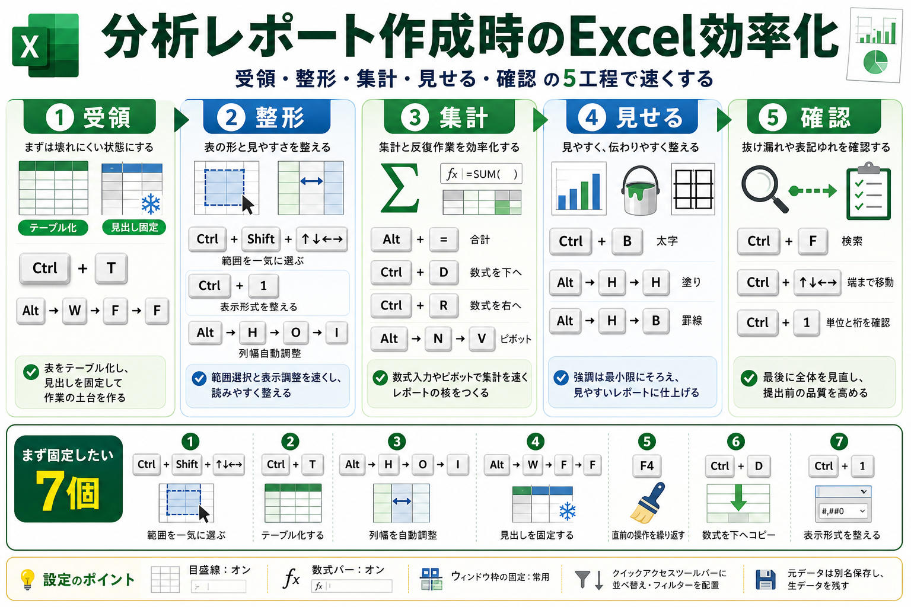

# 分析レポート作成時のExcel効率化

## まず結論

分析レポートを Excel で作るときは、`受領` `整形` `集計` `見せる` `確認` の5工程で操作を固定すると効率が上がります。ショートカットを単発で覚えるより、`表を一気に掴む` `テーブル化する` `列幅を整える` `見出しを固定する` `同じ整形を繰り返す` を型として持つ方が実務で使いやすいです。

## これは何か

分析レポートを Excel で作成するときに、実務で効きやすいショートカットと設定を工程別に整理したトピックです。単なる便利キー一覧ではなく、分析作業の流れに沿って何を先に固定すると手戻りが減るかをまとめます。

## どこで使うか

- 生データを受け取って集計用の形へ整えるとき
- ピボットや関数でレポート用の集計表を作るとき
- 上司提出前に見た目と数字の整合を短時間で確認したいとき
- 毎回似た Excel 作業を繰り返していると感じるとき

## 全体像

- `受領`
  - `Ctrl + T` と `Alt -> W -> F -> F` で、壊れにくく見やすい状態を先に作る
- `整形`
  - `Ctrl + Shift + Arrow` `Ctrl + 1` `Alt -> H -> O -> I` で、範囲選択と表示調整を速くする
- `集計`
  - `Alt + =` `Ctrl + D` `Ctrl + R` `Alt -> N -> V` で、数式とピボットの反復を減らす
- `見せる`
  - `Ctrl + B` `Alt -> H -> H` `Alt -> H -> B` で、強調を最小限に揃える
- `確認`
  - `Ctrl + F` `Ctrl + Arrow` `Ctrl + 1` で、単位・表示形式・抜け漏れを見直す

まず固定したい実務セット:
1. `Ctrl + Shift + Arrow`
2. `Ctrl + T`
3. `Alt -> H -> O -> I`
4. `Alt -> W -> F -> F`
5. `F4`
6. `Ctrl + D`
7. `Ctrl + 1`

## 理解用イラスト

この図では、分析レポート作成を `受領` `整形` `集計` `見せる` `確認` の5工程で戻せます。各工程でどのショートカットと設定を先に使うと作業時間が縮むかを、一枚で思い出すための図です。

## よくある疑問

### Q. まず最初に何をやると効率が上がる？

A. 生データを触り始める前に `Ctrl + T` でテーブル化し、`Alt -> W -> F -> F` で見出しを固定することです。これだけで後の選択ミスと見失いがかなり減ります。

### Q. 一番時間が縮むショートカットはどれ？

A. `Ctrl + Shift + Arrow` です。分析レポート作成では、表を一気に掴めることが整形、集計、確認のすべてに効きます。

### Q. ショートカットより設定で効くものはある？

A. あります。`目盛線オン` `数式バーオン` `ウィンドウ枠の固定` `クイックアクセスツールバーに並べ替えとフィルターを置く` の4つは、毎回の見やすさと確認速度に効きます。

### Q. ピボットはどの位置づけで使う？

A. ピボットは `まずざっくり傾向を見る` 段階で強いです。元データをテーブル化してから `Alt -> N -> V` で作ると、更新や表示形式の調整まで含めて扱いやすくなります。

## 実務での見方

- 受領直後は `別名保存 -> テーブル化 -> 見出し固定` を固定手順にする
- 整形では、見出し1行だけ書式を作って `F4` で横展開する
- 数式は1回だけ作り、`Ctrl + D` と `Ctrl + R` で広げる
- 強調は `太字 + 薄い塗り` くらいに抑え、色数を増やしすぎない
- 提出前は `単位` `小数点桁数` `フィルター残り` `非表示行` `タイトルの意味` を順番に確認する

## 次回の確認

- [ ] `受領` `整形` `集計` `見せる` `確認` の5工程を言えるか
- [ ] `Ctrl + T` `Ctrl + Shift + Arrow` `Alt -> H -> O -> I` `Alt -> W -> F -> F` `F4` の役割を言い分けられるか
- [ ] 提出前に確認する5項目を、見ずに言えるか

## 関連トピック

- [分析依頼を受けてからアウトプットを出すまでの進め方](./分析依頼を受けてからアウトプットを出すまでの進め方.md)
- [分析設計の基本プロセス](./分析設計の基本プロセス.md)

## 参考リンク

- 一般公開された参考リンクは未設定

## 更新履歴

- 2026-06-13: 初版作成
