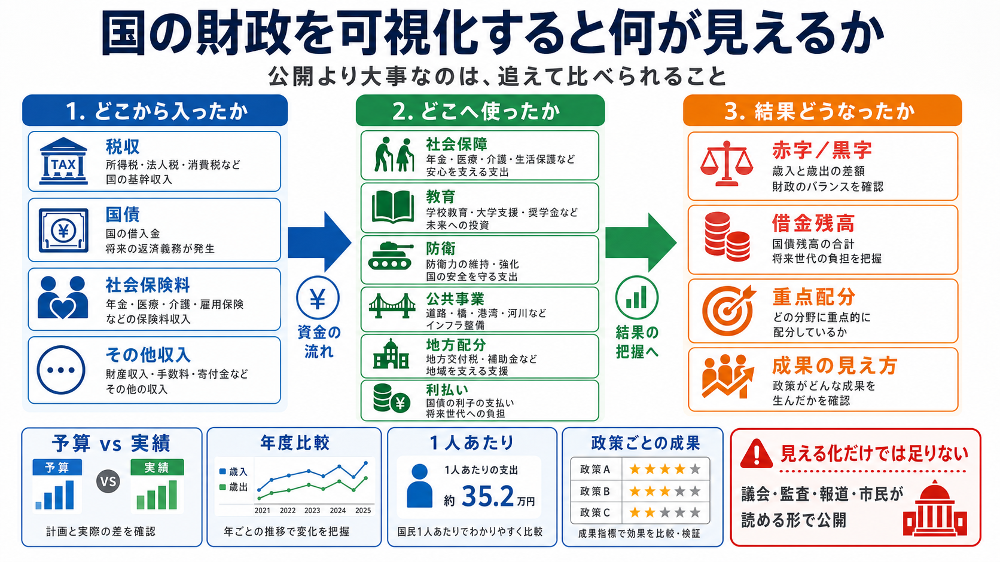

# 国の財政を可視化すると何が見えるか

## まず結論

国の財政は、`どこからお金が入ったか` `どこへ配ったか` `その結果どうなったか` の3段で可視化すると、かなり追いやすくなります。  
大事なのは、単に金額を見せることではなく、`予算と実績を比べられること` `年度で増減を追えること` `政策ごとに効果を見られること` です。  
見える化だけで政治が自動で正しくなるわけではありませんが、説明責任と検証コストを下げることで、無駄や利益誘導への抑止力にはなります。

## これは何か

国の財政を、分析者の視点で `資金の流れ` `比較軸` `意思決定へのつながり` に分けて整理したトピックです。  
制度の細部を覚えるためではなく、`複雑なお金の流れをどう見せれば、判断と監視がしやすくなるか` を戻せるようにする目的でまとめています。

## どこで使うか

- 複雑な予算や支出を、全体像から説明したいとき
- ダッシュボードで `収入 -> 配分 -> 結果` の流れを設計したいとき
- `公開されているのに読めない資料` を、見やすい指標へ変換したいとき
- 事業や行政の支出を、`予算` `実績` `成果` の3点で比較したいとき

## 全体像

- 入口は `どこから入ったか`
  - 税収、国債、社会保険料、手数料、配当など
- 次に `どこへ使ったか`
  - 社会保障、教育、防衛、公共事業、地方向け配分、利払いなど
- 最後に `結果どうなったか`
  - 赤字か黒字か、借金残高は増えたか、重点分野へ本当に厚く配分されたか
- 抑止力になるのは `公開したこと` ではなく `比較できる形で追えること`
- そのため、可視化は `1年の円グラフ` だけでは足りず、`予算 vs 実績` `年度比較` `1人あたり` `政策単位` まで必要

見方の骨格は、次の3層にすると整理しやすいです。

1. `収入の層`
   税収依存か、借金依存か、一時収入依存かを見る
2. `配分の層`
   何に厚く使っているか、固定費がどこまで重いかを見る
3. `結果の層`
   支出増が成果や持続性へつながったかを見る

## 理解用イラスト

下の図は、`財源 -> 配分 -> 結果` の流れと、その横で `比較軸` を重ねて見る形を1枚で戻すための図です。  
財政の可視化を、会計資料の公開ではなく `追跡できる設計` として思い出しやすくする意図があります。

## よくある疑問

### Q. 円グラフで歳入と歳出を見せれば十分？

A. 十分ではありません。円グラフは構成比を見るには便利ですが、`去年より何が増えたか` `計画より多かったか` `借金依存が強まったか` までは見えにくいです。少なくとも `予算 vs 実績` と `年度比較` を並べる必要があります。

### Q. なぜ `予算` と `実績` を分けて見るのか

A. 予算は計画、実績は現実だからです。政治の判断を評価するには、`何を約束したか` と `本当にその通り使ったか` を切り分けて見る必要があります。

### Q. 抑止力になるのは、どの部分？

A. `あとから誰でも追えること` です。支出の流れ、増減理由、担当部門、成果指標がつながっていれば、説明の曖昧さや無駄な支出が見つかりやすくなります。

### Q. 金額だけ見えれば十分？

A. 不十分です。金額だけでは、`高いが必要` と `高いだけ` を区別しにくいです。成果指標や対象人口、期間比較をセットで置くと判断しやすくなります。

### Q. どんな可視化が向いている？

A. 役割で分けると整理しやすいです。`構成比` は積み上げ棒やドーナツ、`流れ` はサンキー図、`予算と実績` は並列棒、`年度比較` は折れ線や棒、`政策ごとの成果比較` は表とヒートマップが向きます。

### Q. 可視化すれば政治は良くなる？

A. それだけでは足りません。可視化は条件の1つです。実際には、議会、監査、報道、市民の読み取りやすさがそろって初めて効果が出ます。`公開されているが読めない` 状態では抑止力が弱いです。

## 実務での見方

- まず `資金の入口` を分ける
  - `税収` `借入` `保険料` `その他` を同列に置き、依存度を見えるようにする
- 次に `配分先` を粒度でそろえる
  - 省庁名だけでなく、`社会保障` `教育` `安全保障` のような政策粒度へ束ねる
- `予算` と `実績` を必ず分ける
  - 計画と結果を混ぜると、説明責任がぼやける
- `前年差` と `構成比` を同時に置く
  - 金額が大きい分野と、急に伸びた分野は一致しないことがある
- `1人あたり` と `総額` を使い分ける
  - 総額だけだと規模感、1人あたりだけだと負担感に寄りやすい
- `成果指標` を横に置く
  - たとえば `教育支出` なら就学や学力、`医療支出` なら受診や待機など、少なくとも結果を見る補助軸を持つ
- 最後に `何を判断できるか` を明示する
  - 可視化は観賞用ではなく、`借金依存が増えている` `固定費が重い` `重点配分の割に成果が弱い` のような判断へつなぐ

## 次回の確認

- [ ] 財政の可視化を `収入 -> 配分 -> 結果` の3段で説明できるか
- [ ] `公開` と `追跡可能` の違いを言えるか
- [ ] `予算 vs 実績` が必要な理由を説明できるか
- [ ] 金額だけでなく `構成比` `前年差` `1人あたり` `成果` を併せて見る理由を説明できるか
- [ ] 抑止力は可視化単独ではなく、比較と検証の仕組みまで含むと理解できているか

## 関連トピック

- [分析設計の基本プロセス](./分析設計の基本プロセス.md)
- [意思決定するためのデータ分析7ステップ](./意思決定するためのデータ分析7ステップ.md)
- [MMMの基本と使いどころ](./MMMの基本と使いどころ.md)

## 参考リンク

- 一般公開された参考リンクは未設定

## 更新履歴

- 2026-07-01: 初版作成。国の財政を `収入 -> 配分 -> 結果` の3段で見る型と、抑止力になる比較軸を整理
