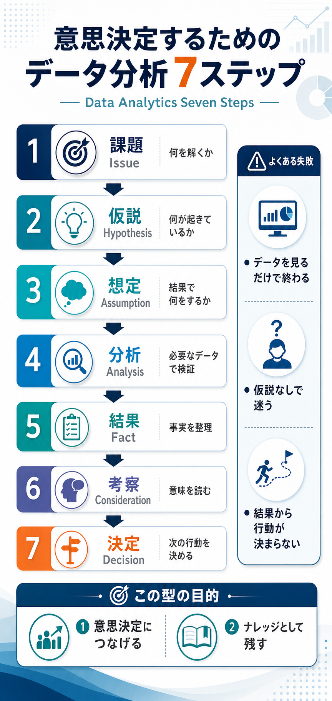

# 意思決定するためのデータ分析7ステップ

## まず結論

意思決定につながる分析は、`課題 -> 仮説 -> 想定 -> 分析 -> 結果 -> 考察 -> 決定` の順で設計すると崩れにくいです。  
大事なのは `分析すること` ではなく、`何を決めるために分析するか` を先に置くことです。  
この型は、分析を使われる形にしつつ、あとで再利用できるナレッジとして残すための基本動線です。

## これは何か

意思決定のためのデータ分析を、7つの手順で整理したトピックです。記事で紹介されていた `Data Analytics Seven Steps` を、実務で見返しやすい形に再構成しています。

## どこで使うか

- 何から分析を始めればよいか迷うとき
- `今あるデータで何かできないか` と言われて困るとき
- 仮説はあるが、結果をどう行動につなげるか曖昧なとき
- 分析結果を個人作業で終わらせず、再利用できる知識として残したいとき

## 全体像

- 出発点は `どんな意思決定をしたいか` ではなく、その前の `どんな課題を解くべきか`
- 課題が決まったら、次に `仮説` を置いて、見るべきデータの方向を決める
- 分析前に `結果がこう出たら何をするか` を想定しておくと、分析が使われやすくなる
- 分析で出すのは数字そのものではなく、`事実` と `意味づけ`
- 最後は `だから次に何を決めるか` まで進んで、はじめて分析が意思決定につながる

### 7ステップの流れ

1. `課題`
   解くべき問題を定める。`どう解くか` より `何を解くか` を優先する。
2. `仮説`
   課題に対して何が起きていそうかを言葉にする。
3. `想定`
   結果が出たら何をするか、どの条件でどう動くかを先に決める。
4. `分析`
   仮説検証に必要なデータだけを使って検証する。
5. `結果`
   出た数字や比較結果を、事実として整理する。
6. `考察`
   結果の意味を読み、なぜそうなったかを解釈する。
7. `決定`
   次の行動、施策、優先順位を決める。

## 理解用イラスト

この図では、分析を `見る作業` ではなく `決める作業へつなぐ流れ` として思い出せます。  
右側の失敗例と下部の目的まで一緒に見ると、なぜ `想定` と `決定` が抜けやすいのかも戻しやすくなります。

## よくある疑問

### Q. いきなりデータを見始めてはいけない？

A. 完全に禁止ではありませんが、意思決定のための分析では危ないです。仮説なしで見始めると `データを見るだけで終わる` 状態になりやすく、結果が行動につながりません。

### Q. `想定` はなぜ分析の前に必要？

A. 分析結果が出たあとに行動条件を考えると、都合のよい解釈になりやすいからです。`どの結果なら何をするか` を先に置くことで、分析が意思決定の部品になります。

### Q. `結果` と `考察` は何が違う？

A. `結果` は事実です。たとえば `Aカテゴリの売上が最下位だった` のような観測です。`考察` は意味づけで、`在庫不足か訴求不足が起きていそう` のように次の判断へつなぐ読みです。

### Q. これは探索型分析には向かない？

A. この記事の型は基本的に `仮説検証型` に向いています。探索型分析は課題や仮説を探るために有効ですが、一般的な業務分析では、先に仮説を置いた方が意思決定へ結びつきやすいです。

### Q. 一番抜けやすいのはどこ？

A. `想定` と `決定` です。分析チームは `分析` までで仕事が終わりやすく、依頼側は `結果` だけを求めがちです。その間に `結果が出たら何をするか` が抜けると、分析が使われません。

## 実務での見方

- 依頼を受けたら最初に `この分析で何を決めたいですか` ではなく、`今どんな課題を解くべきですか` を確認する
- 仮説は1つでなくてよいが、比較できる形で並べる
- 想定では `閾値` `対象条件` `実行可能なアクション` をセットで考える
- 結果を書く段階では、解釈を混ぜずに事実を分けて置く
- 考察では `なぜそう見えるか` と `別解釈の余地` を区別する
- 決定では `次の行動` `保留条件` `追加で必要な分析` のどれかに着地させる
- 分析メモをこの7ステップで残すと、後から他案件へ転用しやすい

## 次回の確認

- [ ] 課題を `何を解くか` の言葉で置けているか
- [ ] 仮説なしでデータを見始めていないか
- [ ] 分析前に想定アクションを置いているか
- [ ] 結果と考察を混ぜずに書けているか
- [ ] 最後に次の意思決定まで進めているか
- [ ] 分析結果を再利用できる形で残しているか

## 関連トピック

- [イシュー思考の基本](./イシュー思考の基本.md)
- [分析設計の基本プロセス](./分析設計の基本プロセス.md)
- [分析依頼を受けてからアウトプットを出すまでの進め方](./分析依頼を受けてからアウトプットを出すまでの進め方.md)
- [3年トレンド分析依頼を優先度付き示唆へ変える返し方](./3年トレンド分析依頼を優先度付き示唆へ変える返し方.md)

## 参考リンク

- [意思決定に繋げるためのデータ分析の型『Data Analytics Seven Steps』](https://note.com/hikarut/n/n8c9d4358faba)
  - 7ステップの元記事。分析を意思決定とナレッジ蓄積へ結びつける意図を確認するために使う

## 更新履歴

- 2026-06-26: 初版作成
