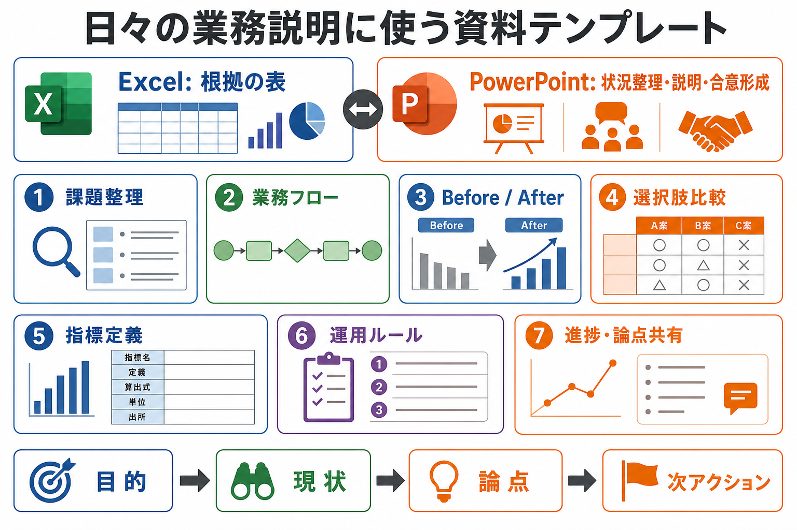

# 日々の業務説明に使う資料テンプレート

## まず結論

分析結果の詳細を Excel で示すなら、PowerPoint は `数字そのもの` ではなく `状況整理・説明・合意形成` に使うと役割がはっきりします。

日々の業務では、毎回きれいな資料を作るより、`目的 -> 現状 -> 論点 -> 次アクション` を短時間で揃えられるテンプレートを持つことが重要です。

## これは何か

データアナリストが、分析結果以外の業務説明で使う PowerPoint 資料の型を整理したメモです。Excel を根拠の表として使い、PowerPoint では関係者の認識を揃えるための構成を決めます。

## どこで使うか

- 定例や上司報告で、進捗と論点を短く共有するとき
- 業務フロー、データフロー、運用ルールを説明するとき
- 改善案や変更点を Before / After で説明するとき
- 複数案から意思決定してもらうとき

## 全体像

Excel と PowerPoint は、同じ資料作成でも役割が違います。

- `Excel`
  - 詳細データ、集計表、検算、分析結果の根拠を置く
- `PowerPoint`
  - なぜ見るのか、何が問題か、何を決めるのか、次に何をするのかを揃える

作っておくと便利なテンプレートは、次の7種類です。

| テンプレート | 使う場面 | 基本構成 |
| --- | --- | --- |
| 課題整理 | 問題の正体を切り分ける | 結論、現象、原因候補、確認計画、次アクション |
| 業務フロー | 業務やデータの流れを説明する | 全体像、業務フロー、データフロー、詰まりどころ、改善ポイント |
| Before / After | 改善案や変更点を説明する | 結論、Before、After、差分、移行手順 |
| 選択肢比較 | 複数案から選んでもらう | 推奨案、選択肢一覧、比較表、注意点、判断依頼 |
| 指標定義 | KPIや集計定義を揃える | 目的、定義、集計ルール、誤解、利用例 |
| 運用ルール | 更新や確認のルールを共有する | 目的、担当と頻度、手順、判断基準、例外対応 |
| 進捗・論点共有 | 日々の報告や定例で使う | サマリー、やったこと、論点、リスク、次にやること |

## 理解用イラスト

この図は、Excel と PowerPoint の役割分担と、日々の説明に使いやすい7つの資料テンプレートを一枚で戻すためのものです。

## よくある疑問

### Q. 分析結果をExcelで出すなら、PowerPointはいらない？

A. いりません、ではなく役割を変えます。Excel は根拠、PowerPoint は `相手が理解して判断するための順番` を作るものです。

### Q. まず作るならどれがよい？

A. 出番が多いのは `進捗・論点共有` と `課題整理` です。定例、相談、上司報告で使いやすく、毎回ゼロから構成を考える時間を減らせます。

### Q. テンプレートは何枚構成にすべき？

A. 日々の業務では、1から5枚で足りる粒度が使いやすいです。表紙や装飾より、`1枚で何を判断してほしいか` が伝わることを優先します。

### Q. 見た目はどこまで作り込む？

A. 最初は派手なデザインより、見出し、枠、表、矢印、色の意味を固定する方が実務効果が高いです。見た目は、構造が安定してから整えます。

## 実務での見方

### 課題整理

- 1枚目: いま何が問題か
- 2枚目: 何が起きているか
- 3枚目: 原因候補
- 4枚目: 何を確認すれば切り分けられるか
- 5枚目: 誰が何をするか

向いている場面は、数値不一致、遅延、定義違い、業務上の詰まりを説明するときです。

### 業務フロー

- 1枚目: どこからどこまでの流れか
- 2枚目: 工程の並び
- 3枚目: データの流れ
- 4枚目: 詰まりどころ
- 5枚目: 改善ポイント

向いている場面は、業務プロセスやデータ連携の理解を揃えるときです。

### Before / After

- 1枚目: 何をどう変えるか
- 2枚目: 現状
- 3枚目: 変更後
- 4枚目: 差分
- 5枚目: 移行手順

向いている場面は、手作業の削減、集計方法の変更、レポート運用の改善を説明するときです。

### 選択肢比較

- 1枚目: 推奨案
- 2枚目: 選択肢一覧
- 3枚目: 比較表
- 4枚目: 各案の注意点
- 5枚目: 判断依頼

向いている場面は、ツール、集計方法、運用ルール、対応方針を選んでもらうときです。

### 指標定義

- 1枚目: この指標は何を見るためのものか
- 2枚目: 定義と計算式
- 3枚目: 集計ルール
- 4枚目: よくある誤解
- 5枚目: 利用例

向いている場面は、KPI、売上、成約率、継続率、稼働率などの定義を揃えるときです。

### 運用ルール

- 1枚目: 何のためのルールか
- 2枚目: 担当と頻度
- 3枚目: 手順
- 4枚目: 判断基準
- 5枚目: 例外対応

向いている場面は、レポート更新、データ入力、確認フロー、修正依頼のルールを共有するときです。

### 進捗・論点共有

- 1枚目: 今の状態
- 2枚目: 今週やったこと
- 3枚目: 論点
- 4枚目: リスク・懸念
- 5枚目: 次にやること

向いている場面は、定例、上司報告、関係者確認です。毎回使うなら、1枚に `進捗 / 論点 / 次アクション` を並べる型も便利です。

## 次回の確認

- [ ] 実際にPowerPoint化するときのスライドマスター、フォント、色、表レイアウトを決める
- [ ] まず `進捗・論点共有` と `課題整理` の2種類からテンプレート化する
- [ ] Excelの分析表からPowerPointへ貼るときのルールを決める

## 関連トピック

- [相手に見せるための分析資料の作り方](./相手に見せるための分析資料の作り方.md)
- [分析レポート作成時のExcel効率化](./分析レポート作成時のExcel効率化.md)
- [分析依頼を受けてからアウトプットを出すまでの進め方](./分析依頼を受けてからアウトプットを出すまでの進め方.md)

## 参考リンク

- 一般公開された参考リンクは未設定

## 更新履歴

- 2026-07-16: 初版作成
