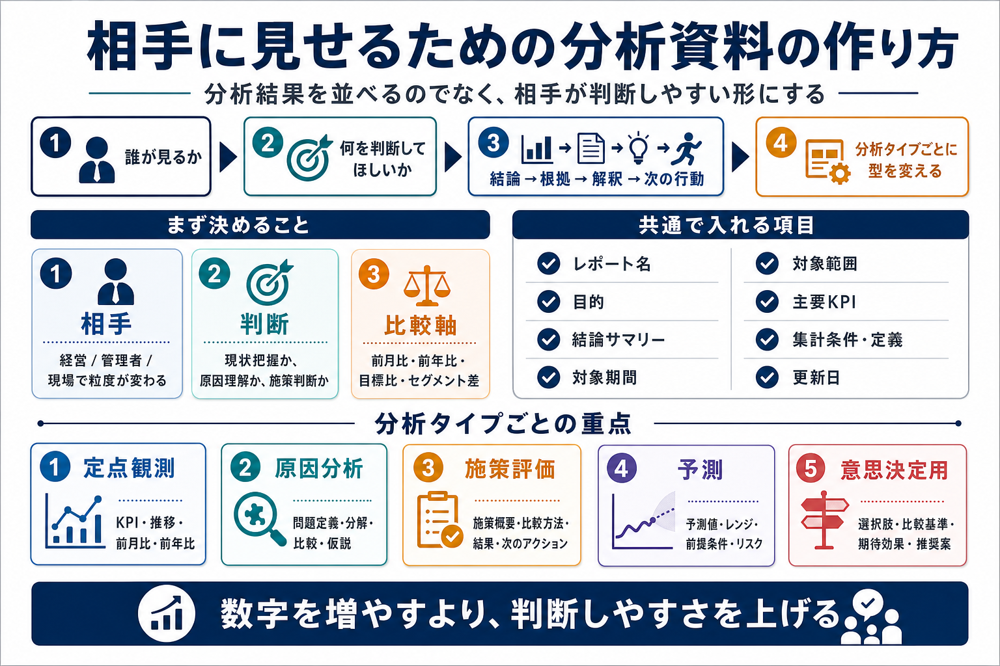

# 相手に見せるための分析資料の作り方

## まず結論

相手に見せる分析資料は、`分析したことを並べる資料` ではなく、`相手が判断しやすくなる資料` として作るのが基本です。  
中心に置くのはデータの量ではなく、`誰が見るか` `何を判断してほしいか` `その結論を支える根拠は何か` の3点です。

## これは何か

分析結果を Excel などで共有するときに、`何をどう並べると伝わるか` を整理したトピックです。  
分析タイプごとの違い、レポート項目の考え方、相手に見せる資料としての組み立て方をまとめます。

## どこで使うか

- 上司や関係者へ分析結果を共有するとき
- 定点観測レポートと原因分析レポートを作り分けたいとき
- Excel の表やグラフを並べても、何が伝わるべきか曖昧になるとき
- 数字の羅列ではなく、判断材料として機能する資料を作りたいとき

## 全体像

- まず `誰が見るか` を決める
  - 経営、管理者、現場で必要な粒度が変わる
- 次に `何を判断してほしいか` を決める
  - 現状把握、原因理解、施策判断、予測、選択肢比較で資料の型が変わる
- その後で `結論 -> 根拠 -> 解釈 -> 次の行動` の順に並べる
  - 数字だけでなく意味が伝わる構成にする

共通で入れる項目:
1. `レポート名`
2. `目的`
3. `結論サマリー`
4. `対象期間`
5. `対象範囲`
6. `主要KPI`
7. `集計条件・定義`
8. `更新日`

分析タイプごとの重点:
1. `定点観測`
   - KPI、前月比、前年同月比、目標比、推移、内訳
2. `原因分析`
   - 問題定義、現象確認、分解、セグメント比較、要因仮説、根拠
3. `施策評価`
   - 施策概要、比較方法、結果KPI、副作用指標、解釈、次のアクション
4. `予測`
   - 予測値、予測レンジ、前提条件、リスク要因、活用上の注意
5. `意思決定用`
   - 論点、選択肢、比較基準、期待効果、実行難易度、推奨案

## 理解用イラスト

この図では、相手に見せる分析資料を `相手` `判断` `構成` `型` の4層で戻せます。  
最初に誰向けかと判断目的を決め、その後に資料の流れと分析タイプ別の重点項目を思い出すための図です。

## よくある疑問

### Q. 分析資料は、まず何から作ればよい？

A. 先に表を作るのではなく、`この資料を見た相手に何を判断してほしいか` を1文で決めます。そこが決まると、必要なKPIや比較軸が絞れます。

### Q. 数字を多く載せた方が丁寧な資料になる？

A. なりません。結論に関係ない表が増えるほど、読み手は重要な論点を見失いやすくなります。`結論を支える数字だけを出す` 方が実務では強いです。

### Q. 絶対値だけの表ではなぜ伝わりにくい？

A. 比較軸がないと、良い悪いの判断がしにくいからです。前月比、前年同月比、目標比、セグメント差のいずれかを置くと意味が出ます。

### Q. Excel テンプレは分析タイプごとに変えるべき？

A. はい。共通ヘッダーは固定しつつ、`定点観測` `原因分析` `施策評価` などで表の項目を変える方が、資料の目的と構成が一致します。

## 実務での見方

- まず `誰向けの資料か` を決め、見る人の粒度に合わせて表を削る
- 1枚目または最上段に `結論サマリー` を置き、その後に根拠の表とグラフを続ける
- 表には必ず比較軸を入れ、絶対値だけで判断させない
- 定義変更、欠損、対象除外などは注記で明示し、数字の信用性を守る
- `定点観測` は推移と比較、`原因分析` は分解と仮説、`施策評価` は次のアクションまでがセットと考える
- Excel では `生データ` `作業用集計` `見せる用レポート` を分け、見せるシート側だけテンプレ化すると崩れにくい

## 次回の確認

- [ ] この資料で相手に何を判断してほしいかを1文で言えるか
- [ ] `結論 -> 根拠 -> 解釈 -> 次の行動` の順で並べられるか
- [ ] `定点観測` `原因分析` `施策評価` `予測` `意思決定用` の違いを言い分けられるか
- [ ] 表に比較軸と注記が入っているかを確認できるか

## 関連トピック

- [分析設計の基本プロセス](./分析設計の基本プロセス.md)
- [分析依頼を受けてからアウトプットを出すまでの進め方](./分析依頼を受けてからアウトプットを出すまでの進め方.md)
- [意思決定するためのデータ分析7ステップ](./意思決定するためのデータ分析7ステップ.md)
- [3年トレンド分析依頼を優先度付き示唆へ変える返し方](./3年トレンド分析依頼を優先度付き示唆へ変える返し方.md)
- [分析レポート作成時のExcel効率化](./分析レポート作成時のExcel効率化.md)

## 参考リンク

- 一般公開された参考リンクは未設定

## 更新履歴

- 2026-07-11: 初版作成
