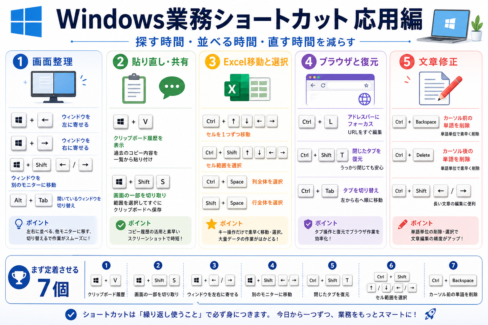

# Windows業務ショートカット応用編

## まず結論

Windows で業務効率を上げるなら、`画面整理` `貼り直し` `移動と選択` `復元` の4系統を先に覚えるのが効率的です。基本操作を増やすより、`探す時間` `並べる時間` `直す時間` を減らすショートカットを優先すると、日々の仕事で差が出ます。

## これは何か

Windows PC で日常業務をするときに、実務で特に効きやすい応用ショートカットを整理したトピックです。Excel、ブラウザ、会議、文章修正を横断して、優先度の高いものから戻せる形にまとめます。

## どこで使うか

- 2つの資料を見比べながら作業するとき
- Excel、ブラウザ、チャットを行き来するとき
- 会議中に画面共有や画面切り替えを素早くしたいとき
- 文書、メール、SQLをキーボード中心で修正したいとき

## 全体像

- `画面整理`
  - `Win + ← / →` `Win + Shift + ← / →` で、並べる時間を減らす
- `貼り直し`
  - `Win + V` `Win + Shift + S` で、コピーと共有を速くする
- `移動と選択`
  - `Ctrl + Arrow` `Ctrl + Shift + Arrow` `Ctrl + Backspace` で、修正時間を減らす
- `復元と切り替え`
  - `Ctrl + Shift + T` `Alt + Tab` `Ctrl + Shift + Esc` で、やり直しと復帰を速くする

実務で最初に定着させる7個:
1. `Win + V`
2. `Win + Shift + S`
3. `Win + ← / →`
4. `Win + Shift + ← / →`
5. `Ctrl + Shift + T`
6. `Ctrl + Shift + Arrow`
7. `Ctrl + Backspace`

## 理解用イラスト

この図では、Windows の応用ショートカットを `画面整理` `Excel` `ブラウザ` `文章修正` `会議` の5場面で思い出せます。どれを先に覚えると日々の作業時間を削りやすいかを、用途ごとに戻すための図です。

## よくある疑問

### Q. まず全部覚えるべき？

A. いいえ。まずは `Win + V` `Win + Shift + S` `Win + ← / →` `Ctrl + Shift + Arrow` `Ctrl + Backspace` のように、毎日の反復で自然に使えるものから固定する方が定着します。

### Q. 基本ショートカットとの違いは何？

A. 応用編は、`コピーする` `保存する` のような単発操作より、`並べる` `戻す` `まとめて選ぶ` `履歴から復元する` のように、作業の流れ全体を短くするものが中心です。

### Q. データアナリスト業務で特に効くのはどれ？

A. `Win + ← / →` で比較画面を作ること、`Ctrl + Shift + Arrow` で Excel の範囲を一気に取ること、`Ctrl + Backspace` で SQL や文面修正を速くすること、この3つが特に効きやすいです。

## 実務での見方

- 画面整理は `見る資料` と `入力する画面` を左右に固定するところから始める
- Excel では `Ctrl + Arrow` と `Ctrl + Shift + Arrow` を、移動と選択の基本セットとして使う
- ブラウザでは `Ctrl + L` `Ctrl + Shift + T` `Ctrl + Tab` を調査作業の基本セットにする
- 文章修正では `Ctrl + Backspace` `Ctrl + Delete` `Ctrl + Shift + ← / →` をまとめて覚える
- 会議前は `Win + P` `Alt + Tab` `Win + Shift + S` を押せる状態にしておく

## 次回の確認

- [ ] `探す時間` を減らすショートカットと `直す時間` を減らすショートカットを言い分けられるか
- [ ] 毎日使う7個を、用途ごとに思い出せるか
- [ ] Excel、ブラウザ、会議の3場面で、どのキーを先に使うか迷わず言えるか

## 関連トピック

- [学習ラボの使い方](../../その他/20_トピック/学習ラボの使い方.md)

## 参考リンク

- 一般公開された参考リンクは未設定

## 更新履歴

- 2026-06-13: 初版作成
